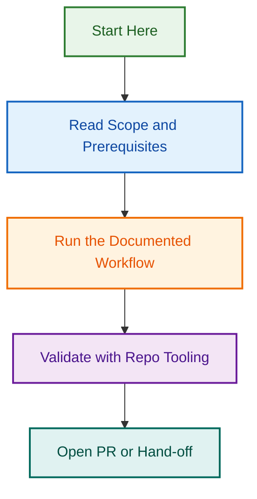

# Prompts

<!-- BADGES-START -->

<!-- BADGES-END -->

Use this folder for reusable maintenance prompts and prompt-pack references for the Tour Operator Website Configuration Agent.

## Available prompts

- `readme-recurring-cleanup-prompt.md` — run recurring README cleanup after file-tree or validation changes.
- `routing-audit-prompt.md` — audit and tighten instruction routing, routing notes, and specialist-skill drift.
- `routing-validation-cleanup-prompt.md` — run a targeted cleanup pass over routing-related validation notes, snapshots, and consistency sources.
- `readme-refresh-prompt.md` — refresh README files so they match the current structure, routing posture, and validation assets.
- `validation-pack-tightening-prompt.md` — tighten the wider validation pack, including snapshots, validation notes, QA docs, and maintenance guidance.
- `skills-routing-and-directory-validation-prompt.md` — validate attached skills, skill-package health, routing references, local skill drafts, and any needed attach follow-through.
- `skills-routing-and-directory-repair-prompt.md` — repair skill-routing drift, stale skill inventories, package-level inconsistencies, and local skill follow-through issues.
- `skill-package-health-check-prompt.md` — run a recurring health check across readable attached or staged skill packages and repair clearly verified package-level issues.
- `attached-skills-inventory-refresh-prompt.md` — refresh attached-skill inventories across maintenance docs so listed skills match the current draft.
- `attached-skill-access-debug-prompt.md` — diagnose when an uploaded skill is attached in the draft but cannot be opened, staged, validated, or updated in the current session.

## Prompt-pack structure note

The top-level files in `prompts/` are maintenance prompts.

The nested `prompts/tour-operator-website/` tree is a reference pack for Tour Operator website workflows, evidence models, outputs, and validation notes. Treat that nested tree as prompt-pack content and reference material, not as proof that a matching specialist skill is attached in the current draft.

## Usage note

Use these prompts as repeatable maintenance tasks. Keep them aligned with the current attached file tree, current instructions, current app posture, current validation assets, and the currently attached skills that are actually present in the draft. When Tour Operator routing is part of the review, make sure the prompts reflect the current draft accurately: use a primary attached specialist route only when one is actually attached, and otherwise keep core Tour Operator website ownership in the main agent workflow. Treat attachment state, package readability, and package validation as separate claims

---

---

*Built by 🧱 LightSpeedWP with ☕, 🚀, and open-source spirit!*
## Visual Workflow

