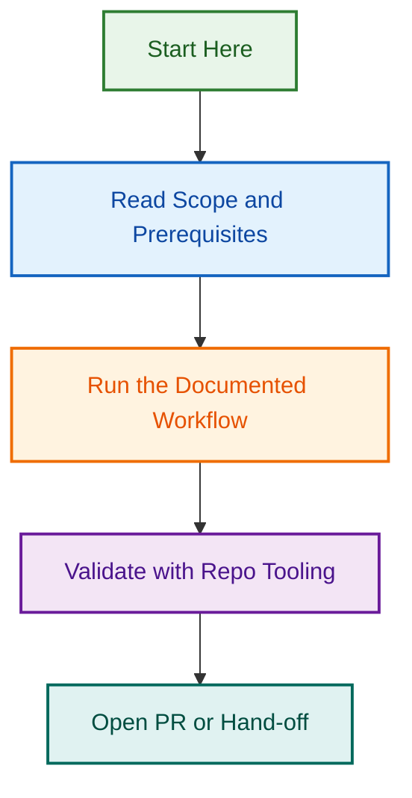

# Tour Operator Website reference index

<!-- BADGES-START -->

<!-- BADGES-END -->

Load only the smallest file set needed for the task.

## Source-backed model

- `content-model/core/post-types.json` — confirmed `tour`, `destination` and `accommodation` post type settings and fields from uploaded JSON models.
- `content-model/core/taxonomies.json` — confirmed taxonomy configuration from uploaded PHP taxonomy config files.
- `content-model/core/relationships.json` — confirmed FacetWP relationship/facet source behaviour from `class-post-connections.php`.
- `content-model/core/field-usage-rules.md` — safe interpretation rules for prices, ratings, best-time fields and other source-backed fields.
- `content-model/core/facetwp-indexing-notes.md` — practical interpretation of destination relationship facets and price/duration normalisation.
- `content-model/core/source-map.md` — map generated model sections back to source files.

## Workflows

- `workflows/audit-workflows.md` — audit sequence and audit variants.
- `workflows/live-site-inspection.md` — live-site, staging, admin, WordPress MCP and connected-tool inspection flow.
- `workflows/implementation-workflows.md` — change planning, verification and rollback.
- `workflows/content-model-maintenance.md` — how to update bundled model files from new source evidence.
- `workflows/repository-evidence-review.md` — how to inspect source code, branches or uploaded files without promoting references into ownership claims.
- `workflows/gravity-forms-tour-operator-workflows.md` — enquiry flow and missed-lead checks.
- `workflows/jsonld-yoast-workflow.md` — schema readiness and Yoast graph planning.
- `workflows/block-theme-tour-operator-patterns.md` — archive, single, query-loop and pattern checks.
- `workflows/acceptance-test-planning.md` — acceptance criteria, QA matrices, retest scripts and go/no-go coverage.
- `workflows/issue-handoff-workflow.md` — convert findings into GitHub, Linear, Asana or internal issue drafts.

## Output, evidence and validation

- `outputs/output-contracts.md` — standard report and handoff formats.
- `outputs/acceptance-criteria-library.md` — reusable observable acceptance criteria for core, form, schema, theme and launch work.
- `outputs/issue-draft-templates.md` — GitHub/Linear-style issue draft templates and split recommendations.
- `outputs/client-safe-language.md` — convert internal evidence into client-safe wording without unsupported promises.
- `outputs/finding-register.schema.json` — machine-readable finding register schema for audit, QA and handoff outputs.
- `evidence/evidence-model.md` — source confidence, conflict and stale-memory handling.
- `evidence/source-links.md` — retained source URLs.
- `validation/anti-drift-tests.md` — regression prompts before repackaging or after major edits.
- `validation/content-model-consistency.md` — model boundary checks before source-backed model updates.
- `validation/prepackage-checklist.md` — final manual checklist before returning `skill.zip`.
- `validation/output-contract-lint.md` — output-template quality checks for code fences, duplicate headings and unsafe promises.
- `../scripts/validate_payload.py` — local payload structure and JSON validator when file access is available.
- `../scripts/validate_content_model.py` — local content-model boundary validator for core, extensions, relationship sources and schema assumptions.
- `../scripts/validate_output_contracts.py` — local markdown/template validator for output contracts and delivery templates.

---

---

*Built by 🧱 LightSpeedWP with ☕, 🚀, and open-source spirit!*
## Visual Workflow

