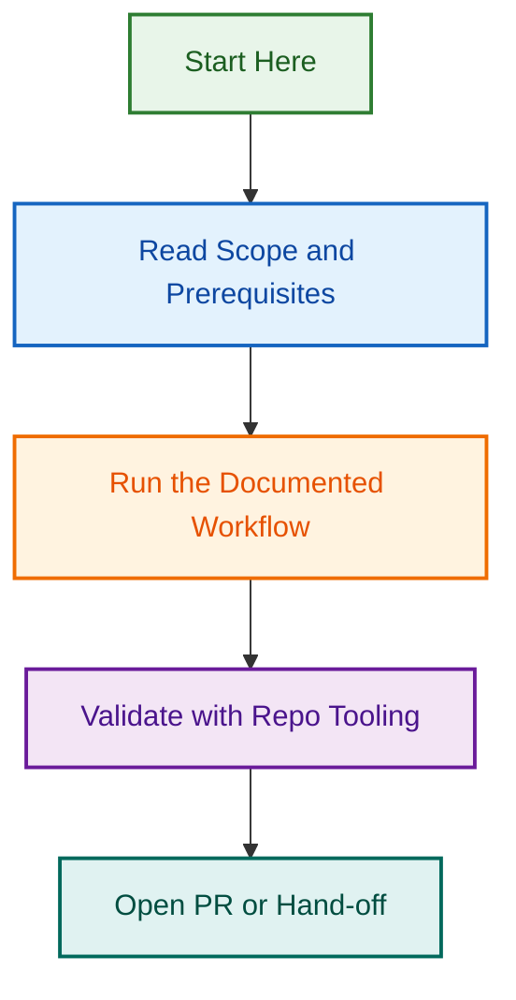

# Memory

Use this folder for durable project state, repeated preferences, QA continuity, and handoff notes for **tour operator website WordPress delivery**.

## Included files

- `todos.md` for active actions, blockers, approvals, and next steps
- `user-preferences.md` for stable client, site, plugin, form, SEO, and QA preferences
- `project-history.md` for durable milestones, major configuration changes, and important audit outcomes
- `session-handoff.md` for concise in-progress handoff notes when multi-step work should resume later

## How to use this folder

- Check Memory before asking repeat questions about the same project.
- Check `user-preferences.md` and `todos.md` at the start of audits, implementation work, and resumed multi-step work.
- Check `session-handoff.md` before continuing interrupted or long-running work.
- Reuse confirmed site facts, plugin-stack decisions, form requirements, SEO priorities, and QA expectations when they are still current.
- Keep preferences, active work, history, and handoff state clearly separated.
- Save concise durable facts, not long narrative transcripts.
- Update Memory after meaningful audits, plugin changes, Gravity Forms planning, Yoast SEO reviews, or important QA decisions.
- Treat Memory as durable working state, not as a place for fixed reference standards or bulky report outputs.
- Record whether plugin-stack facts are user-provided, observed through connected tools, or inferred from partial evidence.
- Do not let Memory override fresher evidence from a connected site inspection.

## What belongs in Memory

- stable client or project preferences
- confirmed site facts that will matter again
- current project status, blockers, approvals, and next actions
- important QA status and unresolved risks
- major tour operator plugin, Gravity Forms, or Yoast SEO decisions worth reusing
- approved use of the LightSpeedWP Tour Operator core plugin and first-party extensions for a project

## What does not belong in Memory

- bulky reference material already stored in `references/`
- temporary scratch work
- copied raw tool output without summarisation
- unconfirmed assumptions
- credentials, secrets, tokens, or sensitive auth details

## Content-model memory rule

Do not save the full Tour Operator content model in Memory. Keep the full model in `references/tour-operator-content-model-standard.md`. Save only concise durable decisions such as the approved use of core CPTs, confirmed extension usage, unusual project-specific content-model deviations, unresolved content-model blockers, or the source/date of a major model decision.

## Validation note

Memory files in this folder should be checked with:

- `schemas/memory-file-validation-schema.json`
- `scripts/file-schema-validator.py`
- `scripts/validate-memory-files.py`

This helps keep durable preferences, active work, history, and handoff state clearly separated.

---

*📐 The blueprint for getting things right, every time*
## Visual Workflow

