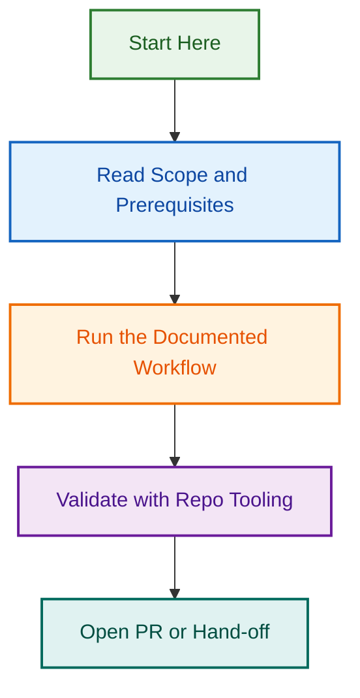

# Memory templates

Use these files for durable project context only. Memory is lower-priority than fresh verified evidence.

Store concise, source-backed facts. Do not store credentials, secrets, raw dumps, bulky reports, speculative assumptions or unnecessary private client data.

---

*🤖 This agent is orchestrated with precision and care — carefully choreographed automation*
## Visual Workflow

