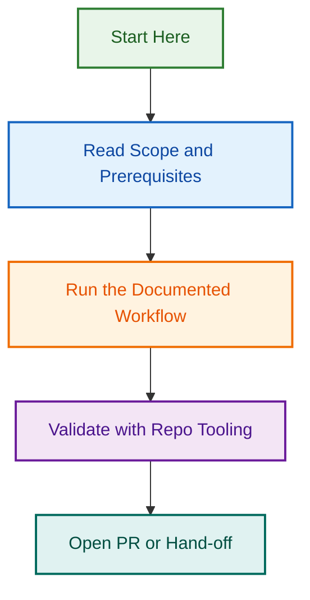

# Tour Operator content model references

Use these files before giving Tour Operator content-model advice.

- `core/post-types.json` contains source-backed core post type definitions from uploaded JSON files.
- `core/taxonomies.json` contains source-backed taxonomy configuration from uploaded PHP config files and registration behaviour from `class-taxonomies.php`.
- `core/relationships.json` contains FacetWP relationship/facet-source behaviour from `class-post-connections.php`.
- `core/source-map.md` explains which uploaded source file supports each generated section.
- `extensions/` stays conservative because extension internals are not confirmed by the uploaded core source files.
- `integrations/wetu-importer.json` treats Wetu as an integration/sync layer unless source evidence proves otherwise.

Boundary rule: confirmed core post types are `tour`, `destination` and `accommodation`. Relationship/facet references to `review`, `special`, `vehicle` or `activity` are not core ownership proof.

## Supporting interpretation files

- `core/field-usage-rules.md` explains how to safely interpret confirmed fields, especially prices, ratings, duration and schema-sensitive data.
- `core/facetwp-indexing-notes.md` explains destination facet sources, hierarchy augmentation, continent filtering and price/duration index normalisation.

## Maintenance

Use `../workflows/content-model-maintenance.md` when new source files are supplied and the bundled model needs to be updated. Run `../validation/anti-drift-tests.md` before repackaging.

## Updating from new source evidence

When new repository files, plugin branches, pull requests or uploaded source files are provided, use `references/workflows/repository-evidence-review.md` before editing these model files. Promote only registration evidence to ownership claims. Treat relationship, display and planning evidence as narrower evidence classes unless registration code confirms ownership.

## Consistency validation

After changing any content-model JSON file, run `scripts/validate_content_model.py` from the skill root. This catches the common drift risks: adding extension-facing entities as core post types, changing string pricing fields into structured data without source evidence, or treating schema planning as implementation.
## Visual Workflow

