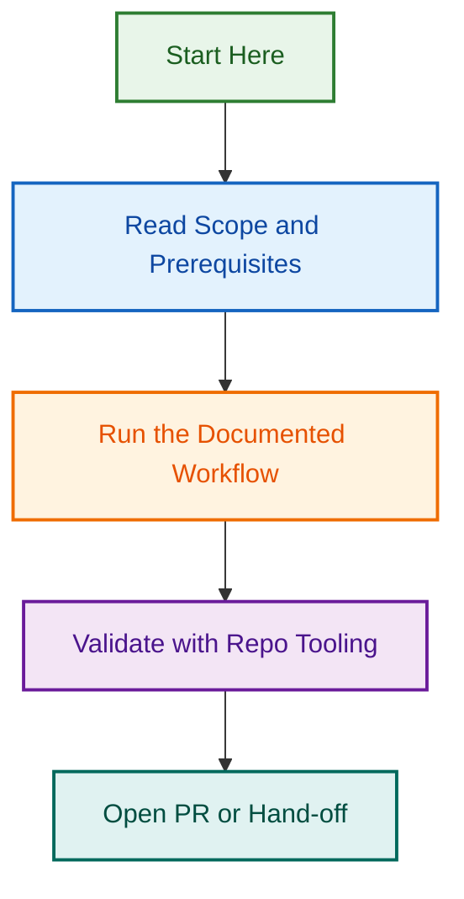

# Prompts folder

<!-- BADGES-START -->

<!-- BADGES-END -->

## Purpose

This folder stores reusable prompt files for recurring maintenance and update tasks in this agent.

## Naming conventions

- Use lowercase kebab-case names.
- End reusable prompt files with `-prompt.md` when they are intended to be run as recurring prompt instructions.
- Keep one canonical prompt file per recurring maintenance purpose unless two prompts are materially different.
- Update an existing prompt file before creating an overlapping version.

## File outline

This outline reflects only the prompt files currently grounded in the visible file tree.

- `audit-folder-purpose-and-boundaries-prompt.md` — audit whether visible folders have clear, non-overlapping purposes and whether file placement still matches those boundaries.
- `audit-instructions-and-files-alignment-prompt.md` — audit whether the current instructions still match the grounded attached files and whether file references have drifted.
- `audit-maintenance-priority-and-sequencing-prompt.md` — audit which grounded maintenance issues should be fixed first and whether the current system encourages the right order of work.
- `audit-reference-and-validator-coverage-prompt.md` — audit whether visible references, scripts, tests, schemas, templates, and examples provide enough maintenance and validation coverage.
- `audit-reference-files-consistency-prompt.md` — audit whether grounded reference files agree with each other and still support a coherent maintenance system.
- `audit-skill-reference-drift-prompt.md` — audit whether skill names, skill roles, and skill references stay consistent across instructions and grounded files.
- `audit-validator-and-test-drift-prompt.md` — audit whether validator scripts, tests, schemas, and validation guidance still align with the current grounded file inventory.
- `debug-preview-run-failure-prompt.md` — audit a failed preview run using grounded run evidence, current instructions, attached skills, files, and tools to identify the most likely failure causes and the smallest next fixes.
- `reconcile-readmes-and-folder-inventory-prompt.md` — reconcile folder README files with the currently visible file tree so inventories and usage notes stay accurate.
- `repair-skills-routing-and-directory-prompt.md` — follow-up repair prompt for fixing grounded skills-routing, attached-skill references, and prompt or reference-file hygiene issues identified by the matching validation review.
- `update-agent-readmes-recurring-prompt.md` — reusable prompt for auditing and updating attached README files so they match the latest grounded file and folder structure.
- `validate-skills-routing-and-directory-prompt.md` — validation prompt for auditing attached-skill coverage, instruction-to-skill alignment, routing quality, directory hygiene, and drift risks.
- `validation-layer-consistency-follow-up-prompt.md` — follow-up prompt for checking consistency across validation-layer assets after maintenance changes.

## Recommended maintenance uses

- Use `audit-instructions-and-files-alignment-prompt.md` when the main question is whether the instructions still match the current grounded file tree.
- Use `audit-reference-files-consistency-prompt.md` when the main question is whether the reference layer still agrees internally.
- Use `audit-reference-and-validator-coverage-prompt.md` when you want to check whether the maintenance and validation layer has enough grounded support without unnecessary duplication.
- Use `audit-skill-reference-drift-prompt.md` when the issue is specifically about how attached skills are named, described, or referenced across the maintenance system.
- Use `audit-folder-purpose-and-boundaries-prompt.md` when folder roles or file placement look muddy or overlapping.
- Use `audit-validator-and-test-drift-prompt.md` when the issue is whether validator scripts, test files, schemas, and validation guidance have drifted apart.
- Use `audit-maintenance-priority-and-sequencing-prompt.md` when the question is what to fix first and in what order.
- Use `debug-preview-run-failure-prompt.md` when a preview run fails with a generic error and you want a grounded diagnosis before changing instructions or files.
- Use `reconcile-readmes-and-folder-inventory-prompt.md` or `update-agent-readmes-recurring-prompt.md` when the primary issue is README and folder-inventory drift.

## When to use the skills-routing prompts

- Use `validate-skills-routing-and-directory-prompt.md` first when you need to audit whether the current instructions, attached skills, and visible prompt or reference files are aligned and low-drift.
- Use it for tasks such as checking whether routing instructions mention missing skills, whether attached skills are missing from routing logic, or whether prompt and reference files still match the current skills setup.
- Use `repair-skills-routing-and-directory-prompt.md` after the validation review has identified grounded issues that need to be fixed conservatively.
- Use the repair prompt when the goal is to make the smallest grounded changes to instructions, prompt files, or reference files without inventing missing assets or redesigning the whole routing system.
- In normal maintenance flow, run the validation prompt before the repair prompt.

## Grounding note

- Only treat prompt files attached in the current draft as canonical.
- If additional prompt files are added, renamed, or removed, update this README to keep the outline aligned with the current file tree.

## Usage rules

- Use prompt files as reusable maintenance inputs, not as hidden system instructions.
- Keep prompt files grounded in the current attached file structure and current agent setup.
- Do not reference missing prompt files as if they are available.
- Prefer a smaller accurate prompt inventory over a larger speculative one.

---

---

*Built by 🧱 LightSpeedWP with ☕, 🚀, and open-source spirit!*

## Visual Workflow

