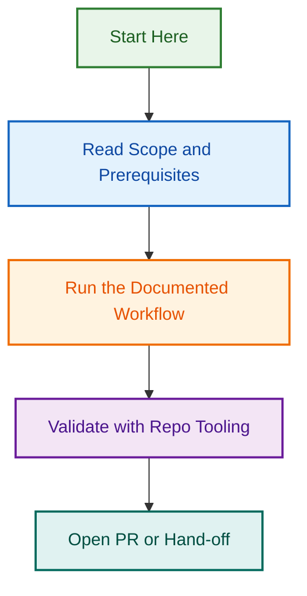

# Scripts

<!-- BADGES-START -->

<!-- BADGES-END -->

## Purpose

Use this folder for reusable maintenance helpers, validation runners, and focused validation scripts that support this WooCommerce agent's file structure, instruction consistency, naming discipline, source-priority guidance, schema alignment, memory hygiene, and presentation quality.

These scripts are operational helpers. They run checks or support maintenance tasks; they do not replace the canonical policy and standards in `references/`, the structured contracts in `schemas/`, or the QA scaffolds in `tests/`.

## Current folder position in the agent structure

Treat the current attached maintenance structure as:

- `references/` — durable standards, conventions, and maintenance workflows
- `schemas/` — structured validation and output contracts
- `scripts/` — runnable validators, validation runners, and helper scripts
- `tests/` — QA sources, scenario coverage, regression checklists, and validator support material

Do not infer unattached folders or missing assets from this README. If local memory guidance is attached elsewhere, that guidance owns memory structure; this folder only documents the grounded `scripts/` contents.

## Naming conventions

Use explicit, maintenance-friendly names:

- `validate-<scope>.py` for focused validators
- `validate-<scope>.sh` for shell-based validation passes
- `run-<scope>.sh` for orchestration runners
- `<workflow>-helper.sh` for reusable audit helpers
- `<subject>-validator.py` for specialised validators

## File inventory

This inventory covers the currently grounded files in the attached `scripts/` folder.

### Validation runners

- `run-master-validation.sh` — top-level validation runner
- `validate-folder-schemas.sh` — primary folder and schema validation pass

### Highest-priority validators

- `validate-memory-files.py` — memory-file hygiene and structure validation
- `validate-source-priority-consistency.py` — source-priority consistency checks across maintained guidance
- `validate-template-schema-alignment.py` — schema and example alignment checks for the documented structure

### Structure and consistency validators

- `validate-markdown-structure.py` — markdown section-order, duplicate-heading, and unfinished-marker checks
- `validate-file-naming.py` — file-naming checks
- `validate-reference-links.py` — reference path and entity-tag validation
- `validate-instruction-file-consistency.py` — instruction/file consistency validation
- `validate-app-usage-consistency.py` — attached-app usage consistency validation
- `validate-starter-prompts.py` — starter-prompt quality and consistency validation
- `validate-short-description-consistency.py` — short-description consistency validation
- `file-schema-validator.py` — secondary schema validator for the maintained folder set

### Audit helpers

- `wp-audit-helper.sh` — WordPress audit helper
- `content-audit-helper.sh` — content audit helper

## Recommended usage order

1. Run `bash scripts/run-master-validation.sh` for the standard full validation pass.
2. Review the highest-priority validator group in this order: memory, source priority, then template/schema alignment.
3. Run `bash scripts/validate-folder-schemas.sh` when you only need folder and schema checks.
4. Run individual `validate-*.py` scripts when you are working on one area such as references, memory, prompts, instructions, or schema drift.
5. Use the audit helper scripts only when the task specifically calls for their workflow.

## Canonical role rules

- `run-master-validation.sh` is the top-level validation entry point.
- `validate-folder-schemas.sh` is the primary folder and schema validator.
- `file-schema-validator.py` remains a secondary validator for the same folder family unless a later cleanup removes or replaces it explicitly.
- Keep this folder aligned with the validation coverage described in `tests/` and the schemas documented in `schemas/`.
- Do not treat these scripts as proof that a folder exists; validate against the current attached file tree.

---

---

*Built by 🧱 LightSpeedWP with ☕, 🚀, and open-source spirit!*

## Visual Workflow

