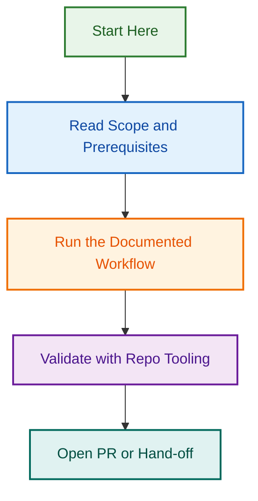

# Prompts

<!-- BADGES-START -->

<!-- BADGES-END -->

Use this folder for reusable maintenance and cleanup prompts that can be run against the current attached agent file tree.

## Folder purpose

This folder is the canonical prompt-library layer for recurring maintenance prompts.

Use it for:

- reusable cleanup prompts
- recurring documentation-maintenance prompts
- targeted consistency-pass prompts for routing, files, and validation language
- skill-routing and attached-skill inventory validation prompts
- focused asset-alignment prompts for prompts, templates, examples, references, reporting, and starter prompts

## How this folder relates to the rest of the structure

- `prompts/` stores reusable prompt text for recurring maintenance tasks.
- `scripts/` contains deterministic validators and runners that may complement these prompts.
- `references/` stores standing guidance, while this folder stores task-ready prompt instructions.
- `README.md` files, reference guides, templates, examples, and other maintenance files are common targets of prompts stored here.

## Prompt library

The current recurring prompt library is organised into these main maintenance paths:

- **Routing audits** — broader routing-language cleanup and specialist-skill consistency work
- **README refreshes** — recurring file-tree and folder-documentation cleanup work
- **Validation-pack tightening** — broader validation-layer tightening across scripts, schemas, fixtures, prompts, examples, templates, and related maintenance notes
- **Skills routing and directory validation** — full specialist-path validation, route-splitting checks, and skill-directory cleanup
- **File and reference alignment** — prompts for root README refreshes, reference-guide consistency, file-reference alignment, and entity-tag cleanup
- **Workflow asset consistency** — prompts for Gravity Forms, Yoast, launch-readiness, accessibility-checker, reporting, and template/example alignment
- **Library hygiene** — prompts for prompt-library inventory refresh, deduplication, validator-coverage review, local-skills inventory refresh, and memory-layer consistency

## Distinction rules

Keep these maintenance paths separate unless a real overlap requires a narrower cleanup:

- **Routing audits** own route wording, specialist-path clarity, and routing-model consistency.
- **Skills routing / inventory work** owns attached-skill inventories, local-skill references, and skill-directory cleanup.
- **Validator coverage reviews** own deterministic validation gaps, validator scope, and follow-up recommendations for new checks.
- **File/reference alignment** owns file references, entity tags, root README mapping, and reference-guide alignment.
- **Workflow-asset consistency** owns workflow-specific assets such as Gravity Forms, Yoast, launch-readiness, accessibility, reporting, templates, and examples.

Do not treat these categories as duplicates just because they may touch some of the same files. Prefer narrowing scope wording, adding cross-references, or choosing the most specific prompt before considering a merge.

Within the skills-focused prompts, keep these roles distinct:

- `skills-routing-and-directory-validation-prompt.md` owns full routing and skill-directory validation.
- `local-skills-inventory-refresh-prompt.md` owns attached-skill inventory coverage across maintenance docs.
- `attached-skills-reference-alignment-prompt.md` owns local skill names and skill-reference alignment, including entity-tag cleanup.

Together, these prompts support repeatable maintenance without reopening settled routing decisions unless a consistency fix clearly requires it.

## Current file inventory

- `README.md` — maintenance guide for the prompt library
- `accessibility-checker-assets-alignment-prompt.md` — aligns accessibility-checker-related assets with the current local skill and file set
- `app-and-connectors-consistency-prompt.md` — reviews app and connector guidance for consistency with the current agent setup
- `attached-skills-reference-alignment-prompt.md` — aligns attached-skill references, local skill names, and skill entity tags across docs and maintenance files
- `business-context-tightening-prompt.md` — tightens business-context wording and consistency with the current agent scope
- `entity-tags-and-file-reference-audit-prompt.md` — audits entity tags and file references for accuracy and drift
- `gravity-forms-assets-consistency-prompt.md` — aligns Gravity Forms assets and maintenance references with the current workflow split
- `instructions-and-file-references-alignment-prompt.md` — aligns system instructions with current file references and maintenance assets
- `launch-readiness-assets-alignment-prompt.md` — aligns launch-readiness assets, templates, and references
- `local-skills-inventory-refresh-prompt.md` — refreshes documented attached-skill inventory coverage across the maintenance layer
- `memory-layer-consistency-prompt.md` — reviews memory files and memory-layer consistency
- `prompt-library-deduplication-prompt.md` — finds overlap and deduplication opportunities in the prompt library
- `prompt-library-inventory-refresh-prompt.md` — refreshes the prompt-library inventory against the current prompt files
- `readme-recurring-cleanup-prompt.md` — recurring prompt for README cleanup against the current file tree
- `reference-guides-consistency-prompt.md` — reviews reference guides for consistency with current routing and maintenance language
- `reporting-rules-and-template-consistency-prompt.md` — aligns reporting rules with current templates and reporting guidance
- `root-readme-refresh-prompt.md` — refreshes the root file-map README against the current attached structure
- `routing-language-cleanup-prompt.md` — recurring prompt for broader routing-language cleanup and validation alignment
- `skills-routing-and-directory-validation-prompt.md` — validates the full specialist-skill routing model, attached-skill inventory, and surrounding maintenance references
- `starter-prompts-alignment-prompt.md` — reviews starter prompts against the current instructions and workflow scope
- `template-and-example-alignment-prompt.md` — aligns templates and worked examples with the current file structure and workflow outputs
- `validation-pack-tightening-prompt.md` — recurring prompt for tightening the validation layer around the current routing language and specialist-skill split
- `validator-coverage-gap-review-prompt.md` — reviews current validator coverage for lightweight gaps and follow-up opportunities
- `yoast-assets-consistency-prompt.md` — aligns Yoast-related assets and maintenance references with the current workflow split

## Naming conventions

Recommended patterns:

- `<topic>-cleanup-prompt.md`
- `<workflow>-maintenance-prompt.md`
- `<scope>-recurring-prompt.md`
- `<asset>-alignment-prompt.md`
- `<library>-refresh-prompt.md`

## Maintenance notes

- Keep prompts grounded in the current attached file tree and current agent state.
- Keep recurring prompts narrow enough to be reusable without reopening settled decisions.
- Update this inventory when prompts are added, renamed, or removed.
- Prefer creating a focused prompt over broadening an existing prompt when a new maintenance path has a distinct job.

---

---

*Built by 🧱 LightSpeedWP with ☕, 🚀, and open-source spirit!*
## Visual Workflow

