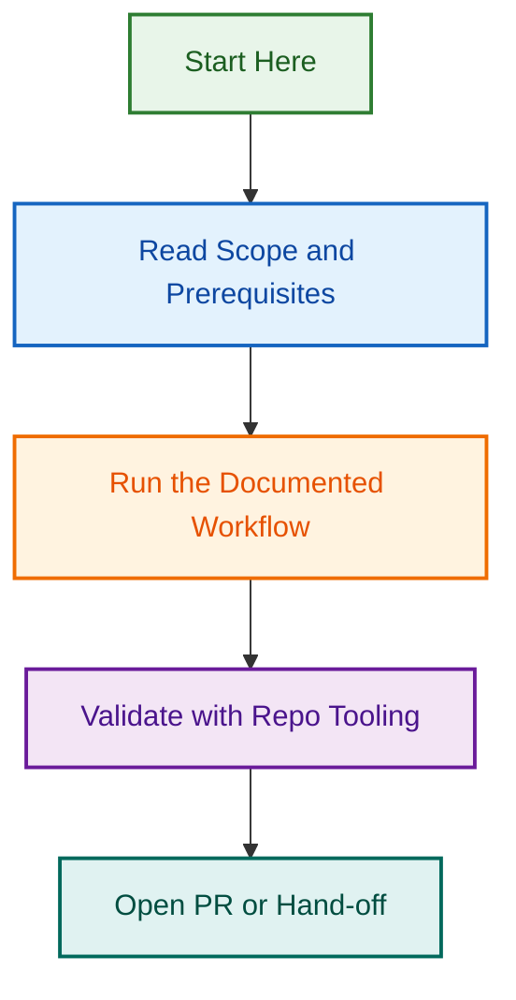

# AI Cookbook & Implementation Guides

This folder contains reusable recipes, playbooks, and step-by-step implementation guides for common AI operations and automation tasks across LightSpeed projects.

## Overview

The cookbook provides practical, battle-tested approaches to:

- **Project Planning** – Structured workflows for intake, PRD development, and implementation planning
- **Specification-Driven Development** – Turning specs into working code with AI assistance
- **WordPress Development** – Plugin development checklists and best practices
- **Automation Workflows** – Reproducible patterns for AI-driven development

## Available Recipes & Playbooks

| Guide | Type | Purpose |
|-------|------|---------|
| [Project Planning and PRD Playbook](./project-planning-and-prd-playbook.md) | Playbook | Transform project intake into scoped PRDs and implementation plans |
| [Spec-Driven Workflow Example](./spec-driven-workflow-example.md) | Example | Step-by-step guide to specification-first development |
| [WordPress Plugin Checklist](./wordpress-plugin-checklist.md) | Checklist | Comprehensive checklist for WordPress plugin development |

## Using the Cookbook

Each recipe includes:

- **Overview** – What the guide covers and when to use it
- **Prerequisites** – What you need to know or have set up
- **Step-by-Step Instructions** – Clear, numbered steps
- **Examples** – Real-world examples and code samples
- **Common Pitfalls** – What to watch out for
- **Further Reading** – Links to related documentation

## Integration with AI Workflows

The cookbook recipes integrate seamlessly with LightSpeed AI agents and Claude Code:

```bash
# Use Claude Code with cookbook guidance
claude code --skill autopilot --reference cookbook/project-planning-and-prd-playbook.md
```

## Contributing New Recipes

To add a new recipe or playbook:

1. Create a new `.md` file with a descriptive name
2. Include frontmatter with metadata (title, author, date, tags)
3. Structure content with clear headings and examples
4. Include at least one real-world example
5. Add to this README's inventory
6. Submit a PR for review

See [CONTRIBUTING.md](../CONTRIBUTING.md) for contribution guidelines and standards.

## Cookbook YAML Configuration

See [cookbook.yml](./cookbook.yml) for metadata about all recipes, including version history and relationships.

---

---

*🧭 Your compass through the documentation landscape*
## Visual Workflow


