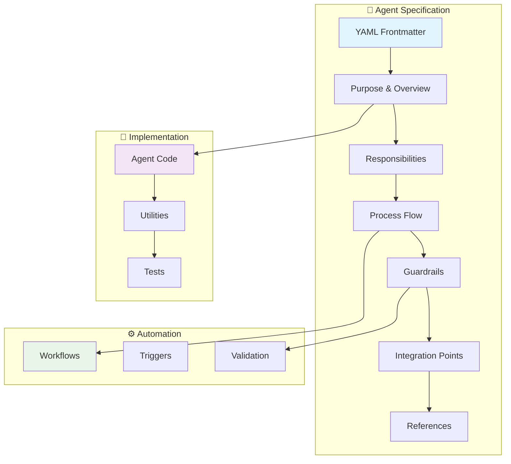

# 📝 Agent Specification Authoring Guide

[](../docs/)
[](../.github/instructions/)
[](../schemas/)

> **Complete guide** for authoring agent specification files that follow LightSpeed organizational standards, including frontmatter requirements, documentation structure, implementation patterns, and validation processes.

---

## 📋 Table of Contents

- [Overview](#overview)
- [Agent Specification Architecture](#agent-specification-architecture)
- [Frontmatter Requirements](#frontmatter-requirements)
- [Documentation Structure](#documentation-structure)
- [Implementation Patterns](#implementation-patterns)
- [Testing Requirements](#testing-requirements)
- [Validation and Quality Gates](#validation-and-quality-gates)
- [Examples and Templates](#examples-and-templates)
- [Common Patterns](#common-patterns)
- [Troubleshooting](#troubleshooting)
- [References](#references)

---

## Overview

### Purpose

Agent specification files (`.agent.md`) serve as the canonical documentation for automated agents in the LightSpeed ecosystem. They define:

- **Purpose and Responsibilities**: What the agent does and why
- **Behavioral Specifications**: How the agent operates
- **Integration Points**: How it connects with workflows and systems
- **Guardrails and Safety**: Constraints and validation rules
- **Testing Requirements**: How to validate functionality

### File Naming Convention

```bash
# Pattern: {agent-name}.agent.md
labeling.agent.md
reviewer.agent.md
planner.agent.md
branding.agent.md
```

### Location

All agent specifications must be stored in:

```
.github/agents/{agent-name}.agent.md
```

---

## Agent Specification Architecture



---

## Frontmatter Requirements

### Required Fields

All agent specification files **MUST** include these frontmatter fields:

```yaml
---
file_type: "agent" # REQUIRED: Must be "agent"
name: "agent-name" # REQUIRED: Unique identifier
description: "brief description" # REQUIRED: Clear purpose statement
version: "v1.0" # REQUIRED: Semantic version
last_updated: "YYYY-MM-DD" # REQUIRED: ISO date format
owners: ["team/maintainers"] # REQUIRED: Responsible parties
---
```

### Recommended Fields

Include these fields for comprehensive documentation:

```yaml
author: "Original Creator" # Creator's name
maintainer: "Current Lead" # Current maintainer
tags: # Keywords for discovery
  - automation
  - labeling
  - github
category: "automation" # Classification
status: "active" # active|deprecated|experimental
visibility: "public" # public|internal
target: "github-copilot" # github-copilot|vscode|cli
tools: # Available capabilities
  - "github/*"
  - "read"
  - "edit"
```

### Agent-Specific Fields

```yaml
handoffs: # Agent collaboration points
  - label: "Start Review"
    agent: "reviewer"
    prompt: "Begin code review process"
    send: false

language: "en" # Primary language

references: # Related documentation
  - path: "../workflows/agent.yml"
    description: "Agent workflow"
  - path: "./includes/utils.js"
    description: "Utility functions"

metadata: # Additional context
  guardrails: "Specific safety rules and constraints"
```

### Complete Frontmatter Example

```yaml
---
name: "labeling"
description: "Unified agent for dynamic, canonical, and automated labeling of issues and PRs. Handles status, type, priority enforcement."
target: "github-copilot"
tools: ["github/*", "edit", "search"]
handoffs:
  - label: "Start Implementation"
    agent: "implementation"
    prompt: "Now implement the labeling changes outlined above."
    send: false
version: "v2.0"
last_updated: "2025-11-20"
author: "LightSpeedWP"
maintainer: "Ash Shaw"
file_type: "agent"
category: "automation"
status: "active"
visibility: "public"
tags:
  - lightspeed
  - labeling
  - automation
  - canonical-labels
  - agents
  - github
references:
  - path: ".github/automation/labels.yml"
    description: "Canonical label definitions"
  - path: ".github/automation/labeler.yml"
    description: "Labeling rules and patterns"
  - path: ".github/agents/labeling.agent.js"
    description: "Implementation script"
  - path: ".github/workflows/labeling.yml"
    description: "GitHub Actions workflow"
owners: ["lightspeedwp/maintainers"]
metadata:
  guardrails: "Only apply existing labels. Never create new types without approval. Log all type assignments."
---
```

---

## Documentation Structure

### Standard Section Order

Every agent specification should follow this structure:

1. **Title and Badge Row** (H1)
2. **Purpose** - High-level goals
3. **Responsibilities** - What it manages
4. **Process** - Step-by-step workflow
5. **Guardrails** - Safety constraints
6. **Integration** - System connections
7. **References** - Related documentation

### Section Templates

#### 1. Title and Purpose

```markdown
# Agent Name Agent

## Purpose

[Clear, concise statement of the agent's primary function and value proposition]

Example:
Automate the application, enforcement, and standardization of labels on issues and PRs,
ensuring one-hot status/priority labeling and reducing manual workload.
```

#### 2. Responsibilities

```markdown
## Responsibilities

- **Primary Function**: [Main capability]
- **Secondary Functions**: [Supporting capabilities]
- **Data Management**: [What data it handles]
- **Integration Points**: [What it connects with]

Example:

- **Label Application**: Apply labels based on file/branch heuristics, content, and front matter
- **Type Assignment**: Ensure exactly one type label per issue/PR
- **Status Enforcement**: Maintain single status label across lifecycle
- **Priority Management**: Apply and update priority labels
```

#### 3. Process Flow

```markdown
## Process

### Trigger Conditions

[When the agent activates]

### Execution Steps

1. **[Step Name]**: [What happens]
2. **[Step Name]**: [What happens]
3. **[Step Name]**: [What happens]

### Output Actions

[What the agent produces or modifies]

Example:

1. **Detect Event**: PR/issue creation or label change
2. **Analyze Context**: Review file changes, branch name, content
3. **Apply Rules**: Match against canonical label set
4. **Enforce Constraints**: Ensure one-hot label families
5. **Log Actions**: Record all changes for audit
```

#### 4. Guardrails

```markdown
## Guardrails

### Safety Constraints

- [Constraint 1]
- [Constraint 2]
- [Constraint 3]

### Validation Rules

- [Rule 1]
- [Rule 2]

### Error Handling

[How errors are managed]

Example:

- Only apply labels from canonical set
- Never overwrite user-applied labels without warning
- Log all label actions
- Validate content before classification
- Abort on missing configuration
```

#### 5. Integration

```markdown
## Integration

### Workflows

- [Workflow name and purpose]

### Dependencies

- [Required systems or files]

### API Interactions

- [External systems accessed]

Example:

- **Triggered by**: `.github/workflows/labeling.yml`
- **Uses config**: `.github/automation/labels.yml`
- **Syncs with**: GitHub Projects via project-meta-sync
```

#### 6. References

```markdown
## References

### Documentation

- [Document name and link]

### Configuration

- [Config file and purpose]

### Related Agents

- [Agent name and relationship]

Example:

- [Canonical Labels](../../.github/automation/labels.yml)
- [Label Strategy](../../docs/LABEL_STRATEGY.md)
- [Automation Governance](../../.github/AUTOMATION_GOVERNANCE.md)
```

---

## Implementation Patterns

### Agent Code Organization

```
.github/agents/
├── agent-name.agent.md          # Specification
├── agent-name.agent.js          # Implementation
├── includes/                     # Shared utilities
│   ├── label-lookup.js
│   ├── status-enforcer.js
│   └── label-reporting.js
└── __tests__/                    # Test suite
    └── agent-name.agent.test.js
```

### Implementation Template

```javascript
/**
 * agent-name.agent.js
 * [Brief description]
 *
 * @module agent-name.agent.js
 * @author LightSpeedWP
 * @see .github/agents/agent-name.agent.md for specification
 */

import core from "@actions/core";
import github from "@actions/github";

/**
 * Main orchestrator for Agent Name Agent.
 * @param {Object} opts - Configuration options
 * @returns {Promise<void>}
 */
async function runAgent(opts = {}) {
  try {
    // 1. Initialize
    const context = opts.context || github.context;
    const octokit =
      opts.github ||
      github.getOctokit(
        core.getInput("github-token") || process.env.GITHUB_TOKEN,
      );

    // 2. Validate inputs
    validateInputs(context);

    // 3. Execute main logic
    await executeMainLogic(context, octokit, opts);

    // 4. Report results
    core.info("[agent-name] Completed successfully.");
  } catch (error) {
    core.setFailed(`[agent-name] Error: ${error.message}`);
  }
}

/**
 * Validate required inputs
 */
function validateInputs(context) {
  // Validation logic
}

/**
 * Execute main agent logic
 */
async function executeMainLogic(context, octokit, opts) {
  // Implementation
}

// Export for testing
export { runAgent };

// Run if called directly
if (import.meta.url === `file://${process.argv[1]}`) {
  runAgent().catch((error) => {
    core.setFailed(error.message);
  });
}
```

---

## Testing Requirements

### Test Structure

Every agent **MUST** have corresponding tests:

```javascript
/**
 * Tests for agent-name.agent.js
 * @see .github/agents/agent-name.agent.md for specification
 */

const { runAgent } = require("../agent-name.agent.js");
const {
  mockOctokit,
  mockContext,
  setTestEnv,
  resetTestEnv,
} = require("../../tests/test-helpers");

describe("Agent Name Agent", () => {
  beforeAll(() => setTestEnv({ GITHUB_TOKEN: "test" }));
  afterAll(() => resetTestEnv(["GITHUB_TOKEN"]));

  it("should initialize without error", () => {
    expect(runAgent).toBeDefined();
  });

  it("should execute main functionality", async () => {
    const octokit = mockOctokit();
    const context = mockContext();

    await runAgent({ context, github: octokit, dryRun: false });

    // Assertions
    expect(octokit.rest.issues.addLabels).toHaveBeenCalled();
  });

  it("should handle errors gracefully", async () => {
    // Error handling tests
  });
});
```

### Required Test Coverage

- ✅ Initialization and configuration
- ✅ Main execution path
- ✅ Error handling
- ✅ Dry-run mode
- ✅ Edge cases
- ✅ Integration with utilities

---

## Validation and Quality Gates

### Automated Validation

All agent specifications are validated automatically:

```bash
# Frontmatter validation
npm run validate:agents

# Linting
npm run lint:md

# Testing
npm test
```

### Manual Checklist

Before submitting an agent specification:

- [ ] Frontmatter includes all required fields
- [ ] Version follows semantic versioning
- [ ] Description is clear and concise
- [ ] All sections are complete
- [ ] References are valid and accessible
- [ ] Implementation file exists
- [ ] Tests are comprehensive
- [ ] Documentation is up-to-date
- [ ] Follows naming conventions
- [ ] Includes guardrails and safety rules

### Validation Script

```javascript
// scripts/validation/validate-agent-frontmatter.js
import fs from "fs";
import yaml from "js-yaml";
import Ajv from "ajv";

const schema = JSON.parse(
  fs.readFileSync("schemas/agent-frontmatter.schema.json", "utf8"),
);

function validateAgentSpec(filePath) {
  const content = fs.readFileSync(filePath, "utf8");
  const frontmatterMatch = content.match(/^---\n([\s\S]*?)\n---/);

  if (!frontmatterMatch) {
    throw new Error(`No frontmatter found in ${filePath}`);
  }

  const frontmatter = yaml.load(frontmatterMatch[1]);
  const ajv = new Ajv();
  const validate = ajv.compile(schema);

  if (!validate(frontmatter)) {
    throw new Error(`Invalid frontmatter: ${JSON.stringify(validate.errors)}`);
  }

  return true;
}
```

---

## Examples and Templates

### Example 1: Simple Automation Agent

```markdown
---
name: "badge-updater"
description: "Automates workflow badge updates in README files"
file_type: "agent"
version: "v1.0"
last_updated: "2025-01-15"
owners: ["lightspeedwp/maintainers"]
tags: ["badges", "automation", "readme"]
category: "documentation"
status: "active"
---

# Badge Updater Agent

## Purpose

Automatically discover, generate, and update workflow badges in README.md files.

## Responsibilities

- Scan `.github/workflows/` for active workflows
- Generate badge markdown for each workflow
- Insert/update badge block in README files
- Maintain badge formatting consistency

## Process

1. Detect README file changes or workflow updates
2. Scan workflow directory
3. Generate badge markdown
4. Update README between markers
5. Commit changes (if authorized)

## Guardrails

- Only update content between `<!-- BADGES-START -->` and `<!-- BADGES-END -->`
- Never modify content outside badge block
- Create backup before modifications
- Log all changes

## Integration

- Triggered by `.github/workflows/badges.yml`
- Uses `scripts/includes/badges.js` utilities

## References

- [Badge Documentation](../../docs/BADGES.md)
- [Implementation](./badge-updater.agent.js)
```

### Example 2: Complex Multi-Function Agent

See [labeling.agent.md](../.github/agents/labeling.agent.md) for a comprehensive example of a complex agent with:

- Multiple responsibilities
- Extensive guardrails
- Complex integration points
- Comprehensive references

---

## Common Patterns

### Pattern 1: Event-Driven Agent

Agents that respond to GitHub events (issues, PRs, pushes):

```yaml
triggers:
  - issue creation
  - PR opened
  - label change

process: 1. Detect event
  2. Analyze context
  3. Apply rules
  4. Update resources
  5. Log actions
```

### Pattern 2: Scheduled Agent

Agents that run on a schedule:

```yaml
triggers:
  - cron: "0 6 * * 1" # Weekly
  - workflow_dispatch

process: 1. Collect data
  2. Analyze metrics
  3. Generate report
  4. Deliver output
```

### Pattern 3: Validation Agent

Agents that validate content or configurations:

```yaml
triggers:
  - PR submission
  - configuration change

process: 1. Load schema
  2. Validate content
  3. Report errors
  4. Block if critical
```

---

## Troubleshooting

### Common Issues

#### Issue: Frontmatter validation fails

**Solution**: Ensure all required fields are present and correctly formatted:

```bash
npm run validate:agents -- .github/agents/your-agent.agent.md
```

#### Issue: References not resolving

**Solution**: Use relative paths from the agent file location:

```yaml
references:
  - path: "../workflows/agent.yml" # Correct
  - path: ".github/workflows/agent.yml" # Incorrect
```

#### Issue: Agent not appearing in index

**Solution**: Ensure the agent is registered in `agent.md`:

```markdown
| [your-agent.agent.md](./your-agent.agent.md) | Description |
```

---

## References

### Core Documentation

- [Agents Directory README](../.github/agents/README.md)
- [Main Agent Index](../.github/agents/agent.md)
- [Agent Template](../.github/agents/template.agent.md)
- [Agent Instructions](../.github/instructions/agents.instructions.md)

### Schema and Validation

- [Frontmatter Schema](../schemas/frontmatter.schema.json)
- [Agent Frontmatter Schema](../schemas/agent-frontmatter.schema.json)
- [Validation Scripts](../scripts/validation/)

### Related Standards

- [Coding Standards](../.github/instructions/coding-standards.instructions.md)
- [Testing Standards](../.github/instructions/tests.instructions.md)
- [Documentation Standards](../.github/instructions/docs.instructions.md)

### Examples

- [Labeling Agent](../.github/agents/labeling.agent.md) - Complex automation
- [Reviewer Agent](../.github/agents/reviewer.agent.md) - PR review automation
- [Branding Agent](../.github/agents/branding.agent.md) - Content management

---

## Quick Start Checklist

Ready to create a new agent? Follow this checklist:

1. [ ] Copy template from `.github/agents/template.agent.md`
2. [ ] Update frontmatter with all required fields
3. [ ] Fill in all documentation sections
4. [ ] Create implementation file (`.agent.js`)
5. [ ] Write comprehensive tests
6. [ ] Add references to related files
7. [ ] Update main agent index
8. [ ] Run validation: `npm run validate:agents`
9. [ ] Run tests: `npm test`
10. [ ] Submit PR with complete documentation

---

**📧 Questions?** Contact the LightSpeed team or [open an issue](https://github.com/lightspeedwp/.github/issues/new)

---

<!-- RANDOM FOOTER: 📝 Clear specs, reliable agents! -->
