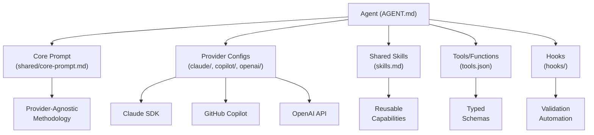
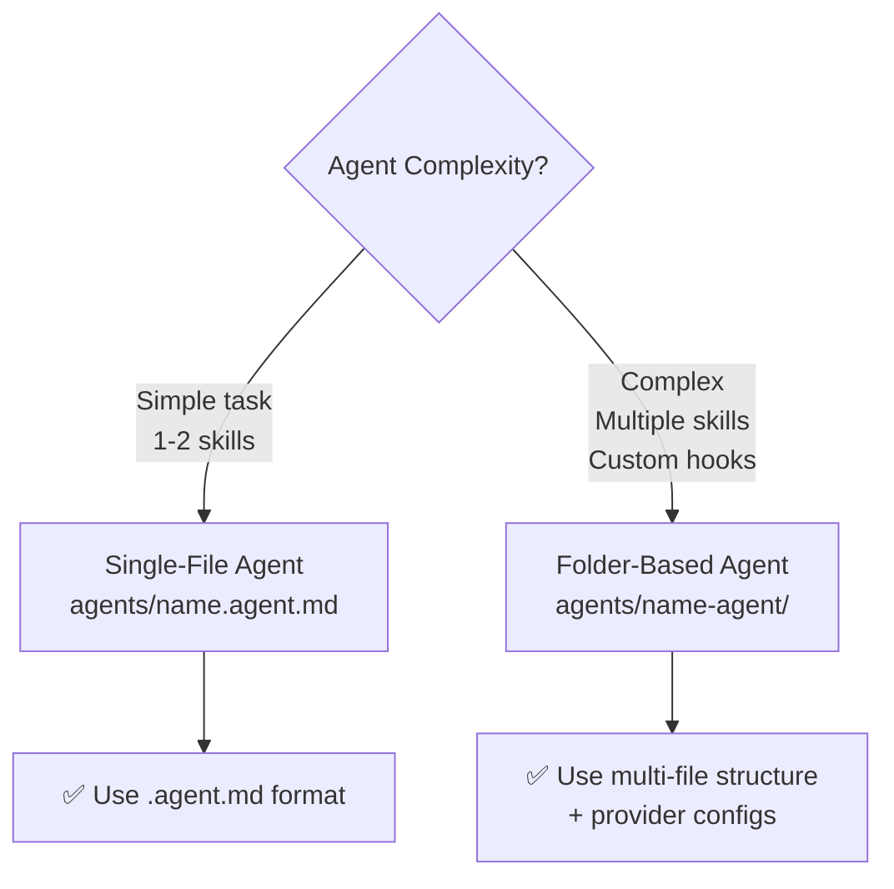

# Agent Standards

Comprehensive guidelines for creating agents in the LightSpeedWP `.github` repository, covering both single-file and folder-based architectures.

## Overview

Agents are autonomous AI entities designed to accomplish specific tasks by leveraging skills, workflows, and external tools. This document provides standards for both:

- **Single-file agents** (`.agent.md` spec) — Simple agents with basic requirements
- **Folder-based agents** — Complex agents with multiple files, shared skills, and custom hooks

### Agent Architecture



## Quick Links

- [Single-File Agent Spec](#single-file-agent-spec)
- [Folder-Based Agent Structure](#folder-based-agent-structure)
- [Agent Metadata](#agent-metadata)
- [Best Practices](#best-practices)
- [Examples](#examples)

---

## Single-File Agent Spec

Single-file agents are defined in `.agent.md` format and stored in the `agents/` folder.

### Filename Convention

```
agents/{agent-name}.agent.md
```

Example:

```
agents/code-reviewer.agent.md
agents/playwright-agent.agent.md
```

### File Format

Use YAML frontmatter followed by Markdown content.

```yaml
---
name: agent-name
description: Brief description of what the agent does
version: 1.0.0
providers: ["claude-opus-4-8"]  # Array of supported LLM providers
skills:
  - skill-reference-1
  - skill-reference-2
hooks:
  - hook-reference
workflows:
  - workflow-reference
---

# Agent Name

## Purpose
Detailed explanation of what this agent accomplishes and why it exists.

## Capabilities
- Capability 1
- Capability 2

## Input Format
Expected inputs and format examples.

## Output Format
Expected output structure.

## Usage Examples
```

### Minimum Requirements

Single-file agents require BOTH specification and implementation files:

**Specification file** (`.agent.md`):

- `name` — Unique agent identifier (kebab-case)
- `description` — One-line summary
- `version` — Semantic version (e.g., 1.0.0)
- `providers` — Array of supported LLM providers
- **Purpose section** — Explains what the agent does

**Implementation file** (`.js`, `.ts`, `.py`, or equivalent):

- Actual agent logic and execution code
- Located alongside the `.agent.md` file

Optional but recommended in specification:

- **skills** — Array of referenced skills
- **hooks** — Event-driven hooks
- **workflows** — Referenced workflows

Example single-file agent structure:

```
agents/
├── code-reviewer.agent.md
└── code-reviewer.js
```

---

## Folder-Based Agent Structure

Folder-based agents are used when:

- Agent logic spans multiple files
- Custom validation or preprocessing is needed
- Agent uses multiple dedicated skills
- Agent requires custom hooks or integrations

### Directory Layout

```
agents/
├── {agent-name}/
│   ├── agent.md                    # Main agent specification
│   ├── README.md                   # Detailed documentation
│   ├── examples/
│   │   ├── example-1.md
│   │   └── example-2.md
│   ├── skills/                     # Agent-specific skills (optional)
│   │   ├── skill-1.js
│   │   └── skill-2.js
│   ├── hooks/                      # Agent-specific hooks (optional)
│   │   ├── validation.js
│   │   └── preprocessing.js
│   ├── schemas/                    # Input/output schemas (optional)
│   │   ├── input.schema.json
│   │   └── output.schema.json
│   ├── tests/                      # Agent tests (optional)
│   │   └── agent.test.js
│   └── config.yml                  # Agent configuration (optional)
```

### agent.md Structure

The `agent.md` file serves as the agent's entrypoint and should contain:

```yaml
---
name: agent-name
description: Brief description
version: 1.0.0
providers: ["claude-opus-4-8", "claude-sonnet-5"]
type: "agentic"  # 'agentic', 'tool', 'utility'
tags: ["tag1", "tag2"]
maintainer: "@username"
skills:
  - shared-skill-name
  - path/to/local-skill
hooks:
  - validation
  - preprocessing
workflows:
  - workflow-name
dependencies:
  - "dependency-1@^1.0.0"
---

# Agent Name

## Purpose
Detailed explanation.

## Architecture

Describe the agent's design, multi-provider patterns, and skill composition.

## Shared Skills

List and explain which shared skills from `skills/` folder the agent uses.

## Custom Hooks

Document any custom validation or preprocessing hooks.

## Examples

Include real-world usage examples.
```

### README.md Structure

Folder-based agents should include a `README.md` with:

- Overview and purpose
- Quick start guide
- Configuration options
- Integration examples
- Troubleshooting
- Contributing guidelines

---

## Agent Metadata

### Frontmatter Fields

| Field | Type | Required | Description |
|-------|------|----------|-------------|
| `name` | string | ✅ | Unique agent identifier (kebab-case) |
| `description` | string | ✅ | One-line summary of agent purpose |
| `version` | string | ✅ | Semantic version (e.g., 1.0.0) |
| `providers` | array | ✅ | Supported LLM providers (e.g., `["claude-opus-4-8"]`) |
| `type` | string | ⏳ | Agent type: `agentic`, `tool`, `utility` |
| `tags` | array | ⏳ | Searchable tags (e.g., `["code", "review"]`) |
| `maintainer` | string | ⏳ | Maintainer GitHub username |
| `skills` | array | ⏳ | Referenced shared skills |
| `hooks` | array | ⏳ | Referenced hooks |
| `workflows` | array | ⏳ | Referenced workflows |
| `dependencies` | array | ⏳ | External dependencies with versions |

### Multi-Provider Pattern

Agents should declare support for multiple providers when possible:

```yaml
providers:
  - claude-opus-4-8        # Primary: best performance
  - claude-sonnet-5        # Secondary: fast & cost-effective
  - claude-haiku-4-5       # Tertiary: lightweight option
```

---

## Shared Skills Integration

### What Are Shared Skills?

Shared skills are reusable capabilities stored in the `skills/` folder that multiple agents can leverage. This reduces duplication and maintenance burden.

### Using Shared Skills

Reference shared skills in the agent's frontmatter:

```yaml
skills:
  - code-analysis
  - documentation-generation
  - testing-framework
```

### Folder-Based Agent Skills

For complex agents, you can include agent-specific skills in the `skills/` subfolder:

```
agents/{agent-name}/
├── agent.md
└── skills/
    ├── SKILL.md                 # Skill entrypoint
    ├── implementation.js
    └── examples.md
```

Each skill must have a `SKILL.md` file with frontmatter and documentation.

---

## Validation & Submission

### Pre-Submission Checklist

- [ ] Agent name is unique and kebab-case
- [ ] Version number follows semantic versioning
- [ ] At least one provider is specified
- [ ] All referenced skills exist (shared or local)
- [ ] All referenced hooks exist
- [ ] Implementation file exists and is executable
- [ ] README.md is present (for folder-based agents)
- [ ] Examples are provided
- [ ] Markdown linting passes: `npm run lint:md`
- [ ] Frontmatter is valid YAML

### Automated Validation

**Single-file agents** (`.agent.md` in `agents/` folder):

```bash
npm run validate:agents
```

This validates:

- Frontmatter syntax for `.agent.md` files
- Required fields are present
- Naming conventions are followed

**Folder-based agents** (`agents/{name}/agent.md`):

Manual validation required. Ensure:

- `agent.md` is present and valid YAML
- All referenced skills and hooks exist
- Implementation files are functional
- README.md documents the agent

---

## Decision Tree: Single-File vs. Folder-Based



## Real-World Examples

### Single-File Agent

**File:** `agents/code-reviewer.agent.md`

A focused agent that performs code quality reviews using shared skills.

### Folder-Based Agent Reference

**Location:** `.github/agents/playwright-testing-agent/`

Complete reference implementation with:

- Multi-provider configs (Claude, Copilot, OpenAI)
- Shared provider-agnostic core prompt
- Full tool definitions and skill inventory
- README with installation and usage

**See:** [agents/playwright-testing-agent/AGENT.md](../../agents/playwright-testing-agent/AGENT.md)

---

## Best Practices

### Naming Conventions

- **Agent names** — kebab-case, descriptive: `code-reviewer`, `prd-factory-planner`
- **Folder names** — match agent name exactly
- **File names** — descriptive, lowercase with hyphens: `agent.md`, `validation-hook.js`

### Documentation

- Write clear, concise descriptions
- Include real-world examples
- Document all parameters and outputs
- Explain any multi-provider differences
- Link to related skills and workflows

### Modularity

- Keep agents focused on a specific domain
- Delegate reusable functionality to shared skills
- Use hooks for validation and preprocessing
- Compose workflows for complex multi-step tasks

### Provider Strategy

- Always include `claude-opus-4-8` as the primary provider
- Add secondary providers for cost/performance tradeoffs
- Document any provider-specific behaviour differences
- Test agents across declared providers

### Versioning

Follow [semantic versioning](./VERSIONING.md):

- **MAJOR** — Breaking changes to input/output format
- **MINOR** — New capabilities, backwards-compatible
- **PATCH** — Bug fixes, internal improvements

---

## Examples

### Example 1: Simple Single-File Agent

```yaml
---
name: code-reviewer
description: Reviews code for quality issues, security vulnerabilities, and performance improvements
version: 1.0.0
providers: ["claude-opus-4-8", "claude-sonnet-5"]
skills:
  - code-analysis
  - security-audit
---

# Code Reviewer Agent

## Purpose
Autonomously reviews code submissions and provides detailed feedback on quality, security, and performance.

## Capabilities
- Syntax and style validation
- Security vulnerability detection
- Performance analysis
- Documentation assessment

## Input Format
```

### Example 2: Folder-Based Agent Structure

See `agents/playwright-agent/` for a real-world example of a complex, folder-based agent with:

- Multi-provider support (Claude Opus, Sonnet, Haiku)
- Shared skills integration (`code-analysis`, `testing-framework`)
- Custom hooks for validation
- Comprehensive documentation

---

## Related Documentation

- [Skills Standards](./SKILLS_STANDARDS.md) — Creating and using shared skills
- [Workflows Standards](./WORKFLOWS_STANDARDS.md) — Multi-agent orchestration
- [Hooks Standards](./HOOKS_STANDARDS.md) — Event-driven handlers
- [Agent Creation Guide](./AGENT_CREATION.md) — Legacy single-file spec
- [Versioning](./VERSIONING.md) — Version numbering strategy
- [Branching Strategy](./BRANCHING_STRATEGY.md) — Branch naming and workflow

---

*Built by 🧱 LightSpeedWP with ☕, 🚀, and open-source spirit!*
