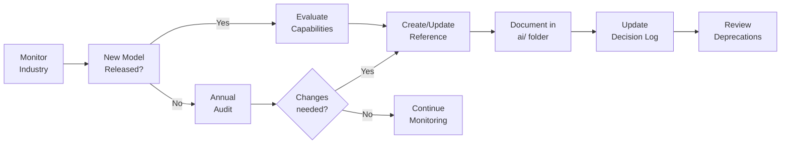
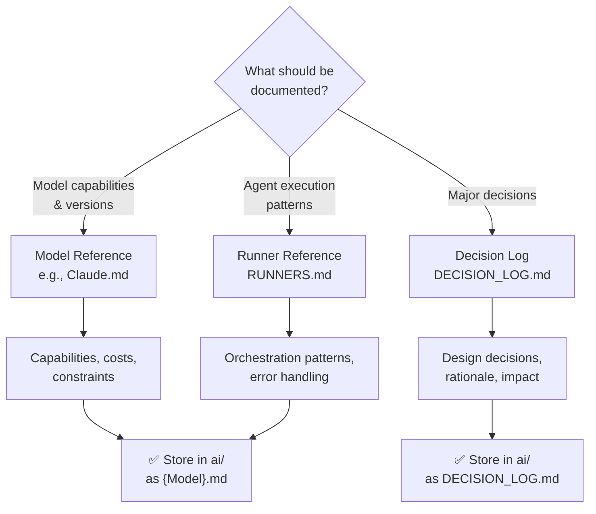

# AI References Standards

Guidelines for maintaining authoritative documentation on AI models, their capabilities, and agent orchestration patterns.

## Overview

The `ai/` folder contains canonical reference documents for:

- AI model capabilities and constraints
- Runner configurations and patterns
- Provider-specific behaviour
- Governance and deprecation policies

These references inform agent and workflow design across the organisation.

### AI Reference Maintenance Lifecycle



## Quick Links

- [Folder Purpose](#folder-purpose)
- [Document Types](#document-types)
- [File Format](#file-format)
- [Model References](#model-references)
- [Runner References](#runner-references)
- [Governance](#governance)

---

## Folder Purpose

The `ai/` folder is the **canonical source** for AI-related technical decisions:

```
ai/
├── Claude.md              # Claude model capabilities
├── Gemini.md              # Gemini model capabilities
├── RUNNERS.md             # Agent runners and orchestration
├── OpenAI.md              # OpenAI models (future)
└── DECISION_LOG.md        # Decisions and rationale
```

### What Lives Here

- Model capabilities, versions, and constraints
- Provider-specific behaviours and differences
- Agent runner patterns and configurations
- Vendor governance and SLAs
- Decision rationale for tech choices

### What Does NOT Live Here

- Project-specific configurations → `CLAUDE.md` or `.github/custom-instructions.md`
- Implementation guides → `docs/` or `cookbook/`
- Agent specifications → `agents/`
- General coding standards → `docs/`

---

## Document Types

### AI Reference Type Selection



### Model References

Model reference documents (e.g., `Claude.md`) document:

- **Latest Versions** — Current available models and versions
- **Capabilities** — What each model excels at (reasoning, speed, cost)
- **Constraints** — Token limits, rate limits, capabilities gaps
- **Use Cases** — When to use each model
- **Pricing** — Cost per 1M tokens (input/output)
- **Performance** — Typical latency and throughput
- **Providers** — Where to access (Claude platform, AWS Bedrock, etc.)

### Runner References

Runner references (e.g., `RUNNERS.md`) document:

- **Orchestration Patterns** — Sequential, parallel, pipeline, loop-until-dry
- **Agent Spawning** — How agents invoke other agents
- **State Management** — Preserving context across runs
- **Error Handling** — Failure modes and recovery
- **Budget Awareness** — Token budget management
- **Multi-Agent Patterns** — Adversarial verification, fan-out/fan-in

---

## File Format

### Model Reference Format

```yaml
---
name: model-name
provider: provider-name  # Claude, Gemini, OpenAI, etc.
version: 1.0.0
released: 2026-01-15
eol_date: 2027-01-15  # End of life (if applicable)
status: current  # current, deprecated, archived
last_updated: 2026-07-24
---

# Model Name

## Overview
One-paragraph summary of model focus and strengths.

## Capabilities

### Reasoning
How strong is the model's reasoning ability?

### Speed
Typical latency and throughput.

### Cost
Input/output token pricing.

### Context Window
Maximum context length supported.

## Constraints

- Limitation 1
- Limitation 2
- Limitation 3

## Use Cases

When to use this model:
- Use case 1: description
- Use case 2: description

## Comparison Table

| Aspect | This Model | Alternative |
|--------|-----------|-------------|
| Speed | Fast | Slower |
| Cost | $$ | $ |

## Recommended Settings

```javascript
const config = {
  model: 'claude-opus-4-8',
  temperature: 0.3,  // For consistency
  maxTokens: 4096,
  topP: 0.9
}
```

## Known Issues

- Issue 1: description and workaround
- Issue 2: description and workaround

## Related

- [RUNNERS.md](./RUNNERS.md) — How to use models in runners
- [Agent Standards](../docs/AGENT_STANDARDS.md) — Agent configuration

```

### Runner Reference Format

```yaml
---
name: multi-agent-orchestration
type: runner
version: 1.0.0
last_updated: 2026-07-24
---

# Multi-Agent Orchestration

## Overview
Patterns for spawning and coordinating multiple agents.

## Patterns

### Sequential Execution
Agents run one after another.

```javascript
const result1 = await agent('Task 1')
const result2 = await agent('Task 2', { input: result1 })
```

### Parallel Execution

Agents run concurrently.

```javascript
const results = await parallel([
  () => agent('Task A'),
  () => agent('Task B'),
  () => agent('Task C')
])
```

### Pipeline (Fan-Out)

Items flow through multiple stages.

```javascript
const processed = await pipeline(
  items,
  item => agent('Stage 1', { item }),
  item => agent('Stage 2', { item })
)
```

## Budget Management

```javascript
while (budget.total && budget.remaining() > 50_000) {
  const result = await agent('Task')
  log(`Remaining budget: ${budget.remaining()}`)
}
```

## Error Handling

```javascript
const results = await parallel(tasks)
const valid = results.filter(Boolean)  // Remove nulls
```

## Best Practices

- Keep phases between 2-5
- Use descriptive phase names
- Log progress for debugging
- Check budget before loops

```

---

## Maintenance

### Version Updates

When a new model version is released:

1. Create new document or section
2. Update `version` field
3. Mark old version as `deprecated`
4. Set `eol_date` for old versions
5. Update `last_updated`

Example:

```yaml
---
name: claude
version: 2.0.0
status: current
released: 2026-08-01
---

# Claude (v2)

[New version content]

## Previous Versions

See [Claude v1](./Claude.v1.md) for legacy information.
```

### Deprecation Policy

When deprecating a model or runner pattern:

1. **Announcement Phase** (30 days) — Mark as `deprecated`, document migration
2. **Maintenance Phase** (30 days) — Fix critical bugs only
3. **Archive Phase** (ongoing) — Move to `archive/` folder
4. **Removal Phase** (6 months+) — Remove from active docs

```yaml
---
status: deprecated
eol_date: 2026-12-31
migration: See [New Pattern](./new-pattern.md)
---

## Status: Deprecated

This model is deprecated as of 2026-07-24. Use [Claude Opus 4.8](./Claude.md) instead.
```

---

## Governance

### Decision Log

Document major decisions in `DECISION_LOG.md`:

```markdown
# AI Decision Log

## Decision: Default Model Selection

**Date:** 2026-07-24  
**Decision:** Use Claude Opus 4.8 as default for complex reasoning tasks  
**Rationale:** Best reasoning capability, acceptable latency and cost  
**Alternatives:** Claude Sonnet (faster but less capable), Claude Haiku (cheaper but limited)  
**Impact:** All new agents default to Claude Opus 4.8  
**Review Date:** 2027-01-24
```

### Review Schedule

- **Monthly:** Performance and cost metrics
- **Quarterly:** New model releases and competitive analysis
- **Annually:** Full capability audit and deprecation review

---

## Model-Specific Guidance

### Claude

Claude Opus 4.8 is the primary model. See [Claude.md](../ai/Claude.md) for:

- Model capabilities and versions
- Recommended temperature and settings
- Use cases (reasoning, code, analysis)
- Known limitations

### Gemini

Gemini offers alternative provider diversity. See [Gemini.md](../ai/Gemini.md) for:

- Model versions and capabilities
- Integration with GCP
- Comparison with Claude
- When to use Gemini

### Future Providers

Placeholders for future models:

- `OpenAI.md` — GPT models (if adopted)
- `LlamaIndex.md` — Open-source models (if supported)

---

## Examples

### Example 1: Model Reference (Claude)

```yaml
---
name: claude
provider: Anthropic
current_version: "claude-opus-4-8"
status: current
last_updated: 2026-07-24
---

# Claude Models

## Latest: Claude Opus 4.8

The most capable Claude model, optimised for complex reasoning and analysis.

### Capabilities

| Capability | Rating | Notes |
|------------|--------|-------|
| Reasoning | ⭐⭐⭐⭐⭐ | Best-in-class reasoning |
| Code Generation | ⭐⭐⭐⭐⭐ | Excellent code output |
| Speed | ⭐⭐⭐ | ~6s latency typical |
| Cost | ~$15/1M tokens | Highest cost, best results |

### Use Cases

- **Recommended:** Complex analysis, code review, strategic planning
- **Not ideal:** Quick summarization (use Sonnet), cost-sensitive tasks

### Recommended Settings

```javascript
{
  model: 'claude-opus-4-8',
  temperature: 0.3,  // For consistency
  maxTokens: 8000    // Allow full reasoning
}
```

## Claude Sonnet 5

Fast, cost-effective model for standard tasks.

- **Speed:** ~2s latency
- **Cost:** ~$3/1M tokens
- **Use:** Standard tasks, real-time applications

## Claude Haiku 4.5

Lightweight model for simple tasks.

- **Speed:** <1s latency
- **Cost:** <$1/1M tokens
- **Use:** Fast responses, simple operations

```

---

## Real-World Repository Examples

### AI Reference Documents

The LightSpeedWP `.github` repository maintains canonical AI reference documents:

**File:** `ai/Claude.md`

Authoritative reference for Claude model capabilities, versions, and use cases.

Contains: Latest Claude versions, capabilities matrix, recommended settings, pricing, and use case guidance.

**File:** `ai/Gemini.md`

Reference for Google Gemini models and alternative provider patterns.

Contains: Gemini capabilities, GCP integration, comparison with Claude, when to use.

**File:** `ai/RUNNERS.md`

Orchestration patterns and runner configurations for agentic workflows.

Contains: Sequential/parallel/pipeline execution patterns, budget management, error handling, multi-agent patterns.

**File:** `ai/DECISION_LOG.md`

Log of major AI-related decisions and their rationale.

Contains: Decision records, impact analysis, alternatives considered, review dates.

See all references: [`ai/`](../../ai/)

---

## See Also

- [Agent Standards](./AGENT_STANDARDS.md) — Using models in agents
- [Workflows Standards](./WORKFLOWS_STANDARDS.md) — Multi-agent patterns
- [Skills Standards](./SKILLS_STANDARDS.md) — Model selection in skills
- [Prompts Standards](./PROMPTS_STANDARDS.md) — Prompt tuning for models

---

## Related Documentation

- [CLAUDE.md](../CLAUDE.md) — Project instructions
- [Agent Standards](./AGENT_STANDARDS.md) — Using models in agents
- [Workflows Standards](./WORKFLOWS_STANDARDS.md) — Multi-agent patterns

## External Resources

- [Claude API Documentation](https://platform.claude.com/docs/)
- [Google Gemini Documentation](https://geminicli.com/docs/)
- [OpenAI API Documentation](https://platform.openai.com/docs/)

---

**Last Updated:** 2026-07-24  
**Version:** 1.0.0
