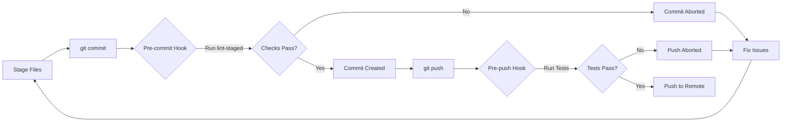

# Automation Governance & Agent-Driven Release Strategy

**LightSpeed Organisation — Community Health Defaults**
*Last updated: 2025-12-05*

---

## 0. Agent-Driven Automation & Instructions Architecture

All automation in this repository is implemented and governed according to the following standards:

- **Instruction-First:** Each automation workflow is paired with a canonical instruction file in [../instructions/workflows.instructions.md](./instructions/workflows.instructions.md).
- **Agent-Driven:** Each workflow is powered by a corresponding agent, documented in [../instructions/automation.instructions.md](./instructions/automation.instructions.md).
- **Dynamic Indexing:** Agents and workflows are discoverable and versioned via dynamic index files. These files are the single source of truth for automation and should be referenced for all changes or onboarding.
- **Reciprocal Specification:** Every workflow must reference its agent; every agent must have a reciprocal specification file and reference its workflow(s).
- **Evolving Standards:** All automation governance, standards, and best practices are maintained in the `.github/instructions/` folder and updated as the organization evolves.

---

## 1. Principles

- **Automate everything:** Releases, changelogs, labelling, project sync, and more—no manual steps or local scripts unless explicitly allowed.
- **Use standard, agent-driven workflows:** Prefer reusable GitHub Actions and org-wide config from this repo, with all logic encapsulated in agents.
- **Keep a Changelog:** All changes must be traceable, user-facing, and formatted for automated extraction.
- **Semantic versioning:** Release versioning is driven by PR labels and workflow triggers, enforced by the release agent.

---

## 2. Governance Scope

This document defines governance policies and standards for:

- GitHub Actions workflows
- Labeling agents and automation
- Configuration files (labels.yml, labeler.yml, issue-types.yml)
- Custom scripts and utilities in `scripts/`
- Reusable workflows and actions
- Agent development and deployment

---

## 3. Label & Issue Type Policy

### 3.1 Canonical Label Set

**Ownership:** Platform Team
**Location:** `.github/labels.yml`

#### Adding New Labels

**Requirements:**

1. **Justification:** Document why the label is needed
2. **Category:** Assign to appropriate category (status, priority, type, area, etc.)
3. **Naming Convention:** Follow `category:name` format (e.g., `status:in-progress`)
4. **Color Coding:** Use category-appropriate colors:
   - **Status:** Blue tones (`BFD4F2`, `C5DEF5`, `1D76DB`)
   - **Priority:** Red/Orange gradient (`B60205` critical → `C2E0C6` minor)
   - **Type:** Green for features (`3FB950`), Red for bugs (`9F3734`), Purple for docs (`D4C5F9`)
   - **Area/Component:** Light blue (`C5DEF5`)
   - **Meta:** Grey (`E1E4E8`)
5. **Description:** Provide clear, concise description

**Approval Process:**

1. Create PR with label addition to `labels.yml`
2. Document use case in PR description
3. Require approval from 2 Platform Team members
4. Label takes effect on next label-sync workflow run

#### Deprecating Labels

**Process:**

1. Add label to deprecation list with replacement (if any)
2. Add alias mapping old → new label in `labels.yml`
3. Run migration script to update existing issues/PRs
4. After 30-day grace period, remove deprecated label

**Example:**

```yaml
- name: status:in-progress
  aliases: ["in progress", "wip", "status:wip"] # Deprecated aliases
```

#### Repository-Specific Labels

Repositories may have specific labels not in the canonical set.

**Allowed:**

- Component-specific areas (e.g., `comp:custom-block`)
- Project-specific contexts (e.g., `project:migration-2024`)
- Temporary labels for initiatives (prefix with `temp:`)

**Not Allowed:**

- Alternative status/priority/type labels
- Labels that conflict with canonical naming

**Documentation:** Repository-specific labels must be documented in the repository's README.

### 3.2 Label & Labeling Policy

- **Labels as Routing Signals:** For status, priority, area/component, environment, compatibility.
- **Single-select Enforcement:** Exactly one `status:*`, one `priority:*`, and one `area:*` or `comp:*` per item; enforced by the labeling agent.
- **Issue Types:** Classification is set via the Issue Type field and mirrored by `type:*` labels (for example, `type:bug`, `type:feature`). These labels are applied and normalised by the labeling agent using the canonical mapping in `.github/issue-types.yml` and the [Issue Types Guide](./ISSUE_TYPES.md).
- **Org Standards:** All labels must match org-wide colours and naming defined in `.github/labels.yml` and documented in the [Issue Labels Guide](./ISSUE_LABELS.md) and [Issue Types Guide](./ISSUE_TYPES.md).
- **Automated Assignment:** Label assignment and enforcement is handled by the unified labeling agent and described in its specification.

---

## 4. Workflow & Agent Governance

### 4.1 Workflow Approval & Standards

**Standard Workflows (require Platform Team approval):**

- Labeling workflows
- Label sync workflows
- Security scanning
- Dependency management
- Release automation

**Repository-Specific Workflows (require Maintainer approval):**

- Build/test workflows
- Deployment workflows
- Custom automation

**Workflow Standards - All workflows must:**

1. **Include skip condition:** Support `[skip workflow-name]` in commit messages
2. **Have concurrency control:** Prevent overlapping runs where appropriate
3. **Use semantic names:** Clear, descriptive names (e.g., `Labeling • Issues & PRs`)
4. **Set appropriate permissions:** Minimal required permissions only
5. **Include failure handling:** Appropriate `continue-on-error` or `if: failure()`
6. **Generate summaries:** Use `$GITHUB_STEP_SUMMARY` for output
7. **Follow UK English:** All text, comments, and documentation

### 4.2 Agent Development Standards

**Agent Specs:** `.github/agents/`
**Agent Scripts:** `scripts/agents/`
**Agent Tests:** `scripts/agents/__tests__/`
**Agent Includes:** `scripts/agents/includes/`
**Agent Includes Tests:** `scripts/agents/includes/__tests__/`

**Requirements:**

1. **Modular Design:** Agents orchestrate; utilities implement logic
2. **Configuration-Driven:** No hardcoded values; use YAML configs
3. **Test Coverage:** Minimum 80% coverage for new utilities
4. **Error Handling:** Comprehensive error handling with retry logic
5. **Logging:** Use `@actions/core` for consistent logging
6. **Documentation:** JSDoc for all functions, README for agents

### 4.3 Agent Deployment Process

1. Develop in feature branch
2. Add/update tests
3. Update documentation
4. Create PR with `type:automation` label
5. Require 2 Platform Team approvals
6. Test in sandbox repository (if available)
7. Deploy to production via merge

**Rollback Procedure:**

1. Revert PR if critical issues detected
2. Create hotfix for critical bugs
3. Document incident in post-mortem

### 4.4 Meta Data Application

Documentation metadata is applied by the **Meta Agent** (`../agents/meta.agent.md`) via `.github/workflows/meta.yml`. Each Markdown document is processed in a single pass to ensure the following layers stay in sync:

- **Front matter:** Validated and enriched against `frontmatter.schema.json`; honour `no_meta: true` (legacy: `no_branding: true`) opt-outs.
- **Badges:** Inserted/updated under the H1 between `<!-- BADGES-START -->` and `<!-- BADGES-END -->`.
- **Human references:** When `references` exist in front matter, a “References” block is injected immediately above the footer.
- **Category-specific quirky footers:** Deterministically selected per `category`/`file_type` so docs share consistent, on-brand endings without repetition.

Opt-outs: use `<!-- meta: off -->` (legacy `<!-- branding: off -->`) for body-level exclusions. The workflow must fail on validation errors to prevent partial metadata application.

---

## 5. Configuration Management

### 5.1 Canonical Configuration Files

| File              | Purpose                       | Owner         | Approval Required |
| ----------------- | ----------------------------- | ------------- | ----------------- |
| `labels.yml`      | Label definitions             | Platform Team | 2 approvals       |
| `labeler.yml`     | File/branch-based label rules | Platform Team | 2 approvals       |
| `issue-types.yml` | Issue type definitions        | Platform Team | 2 approvals       |

### 5.2 Configuration Validation

**Pre-commit:**

- YAML syntax validation
- Schema validation (via `yaml-validator.js`)
- Referential integrity (labels in templates exist in `labels.yml`)

**CI Validation:**

- All PRs touching config files trigger validation workflow
- Failed validation blocks merge

**Post-deployment:**

- `label-sync` workflow validates and syncs across repositories
- Orphan label detection creates issues for review

---

## 6. Required Workflows, Agents & Files

### 6.1 Changelog Enforcement & Compilation

- **Every PR must add an entry** under **Unreleased** in `CHANGELOG.md`, following [Keep a Changelog](https://keepachangelog.com/en/1.0.0/) format.
- PR template must include a `## Changelog` section ([PR Template](https://github.com/lightspeedwp/.github/blob/main/.github/PULL_REQUEST_TEMPLATE.md)).
- **Automated Enforcement:** The release agent and related workflows enforce the presence and validity of changelog entries. PRs without valid changelogs will fail CI.

**Changelog Format:**

```markdown
## [Unreleased]

### Added

- User-facing note. (#123, @author)

### Fixed

- Short, clear fix description.

### Changed

- Update details.

### Removed

- Deprecated or removed features.

<!-- If no changelog entry is needed (internal-only), apply the skip-changelog label. -->
```

**Guidelines:**

- Changelog entries are for end-users, not just developers.
- The release agent extracts changelog notes from PR bodies and labels automatically.

**Release Triggers:**

- PR labels (`release:patch`, `release:minor`, `release:major`) or config determine version bump.
- `BREAKING CHANGE:` in PR body or commit forces a major bump.
- Release agent tags and publishes a new GitHub Release with compiled notes.

### 6.2 Release Automation

When `develop` merges to `main` (or on a release PR to main):

1. **Validation:** Run tests, build, and validate changelog format (release agent).
2. **Versioning:** Determine next version from labels or config (semantic versioning).
3. **Changelog:** Move `Unreleased` to `vX.Y.Z (YYYY-MM-DD)` section, start new Unreleased section.
4. **Release:** Tag & create GitHub Release with compiled changelog (release agent).
5. **Artifacts:** Attach built artifacts (ZIP, etc) if required.
6. **Docs Update:** Update stable tag, README badges, and other documentation as needed.
7. **Notifications:** Notify maintainers/channels of release outcome.

**Reciprocal Spec:** All release steps are defined in [workflows.instructions.md](./instructions/workflows.instructions.md) and [agent-release.instructions.md](./instructions/agent-release.instructions.md).

### 6.3 Labelling, Project Sync, and Issue/PR Management

**Labelling:**

- Issue forms/templates auto-apply type labels (e.g., `type: bug`, `type: enhancement`), enforced by the labeling agent.
- PRs are auto-labelled via file globs, branch prefixes, or PR front matter.
- Each PR links its labels to corresponding Project fields (status, area, priority, etc.).

**Project Board Sync:**

- On PR open/label change, add item to relevant Projects board and set status.
- On merge, auto-move item to Done and close linked issues.
- Project meta sync logic is agent-driven and customizable.

**Reciprocal Spec:** See [workflows.instructions.md](./instructions/workflows.instructions.md), [agent-labeling.instructions.md](./instructions/agents/agent-labeling.instructions.md), and [agent-project-meta-sync.instructions.md](./instructions/agent-project-meta-sync.instructions.md).

### 6.4 Branching Discipline

- **Branch Naming:** Use `{type}/{scope}-{short-title}` pattern (see [Branching Strategy](./BRANCHING_STRATEGY.md)).
- **Enforcement:** Branch name patterns are enforced by CI and corresponding agent logic.
- **Squash Merge Only:** All branches are squash-merged and deleted post-merge.

---

## 7. Pre-commit Hooks (Husky)

To ensure code quality before it even reaches CI, we use **Husky** to run local pre-commit and pre-push hooks. This serves as a "first line" quality gate.

- **Pre-commit**: `lint-staged` runs on staged files, applying linters and formatters (ESLint, Prettier, etc.). This prevents commits with style or syntax errors.
- **Pre-push**: The full test suite (`npm test`) is run to ensure that all tests pass before code is shared with the team.

This multi-layered approach provides fast local feedback and reduces CI failures. For more details on configuration and bypassing hooks, see the LINTING.md guide.



---

## 7. Secrets & Permissions

- Use repo/org **Environments** for release tokens and automation secrets.
- Limit `GITHUB_TOKEN` permissions; use fine-grained PATs only when required.
- Ensure build artifacts are reproducible; no local-only or unspec'd release tooling.
- **Secrets Management** (must be enforced):
  - Prohibit hardcoded credentials in workflows
  - Prohibit secrets in public repositories
  - Prohibit sharing secrets across unrelated workflows
  - Require use of GitHub Secrets or environment secrets
  - Document required secrets in workflow README
  - Rotate secrets quarterly
  - Use least-privilege principle

---

## 8. Project Field Alignment

- **Project Board Fields:** Ensure single-select fields in Projects match the values mapped from labels and branch prefixes:
  - **Status:** Triage, Ready, In progress, In review, In QA, Blocked, Done
  - **Priority:** Critical, Important, Normal, Minor
  - **Type:** Feature, Bug, Documentation, Task

---

## 9. Recommended Actions & Example Configs

**Actions & Agents:**

- Changelog enforcement/compilation: `changelog-enforcer`, `release.agent.js`
- Release creation: `release.agent.js`
- Label automation: `labeling.agent.js`, `actions/labeler@v5`
- Project sync: `project-meta-sync.agent.js`, `actions/add-to-project@v1`

**Example configs:**

- [labels-issues-prs.yml](./workflows/labels-issues-prs.yml)
- [project-meta-sync.yml](./workflows/project-meta-sync.yml)
- [labeler.yml](./labeler.yml)

---

## 11. Rollout Plan

1. Add labels, Issue/PR templates, and labeler config to `.github` repo.
2. Enable changelog enforcer and educate contributors.
3. Ship release and labeling agents behind `workflow_dispatch` for dry-run testing.
4. Switch main triggers to `develop → main`, monitor and iterate.

---

## 12. Maintaining and Auditing Automation

- **Yearly Audit:** Annually, inventory all workflows and ensure every referenced agent has a reciprocal specification file in `.github/instructions/`.
- **Change Process:** Any automation or agent update must update both its workflow and agent instruction/specification files.
- **CI Enforcement:** (Recommended) Use a CI job or script to validate instruction/agent reciprocity and spec compliance.

---

## 13. How to Use This Document

- Reference this file in repo-level README, CONTRIBUTING, and PR templates.
- Link to it in project onboarding docs and contributor guides.
- Treat as the single source of truth for automation, changelog, release, and labelling policies.
- Update as automation or org-wide standards evolve; changes should be reviewed by maintainers.

---

## Reference

- [Workflows Instructions Index](./instructions/workflows.instructions.md)
- [Automation Instructions](./instructions/automation.instructions.md)
- [BRANCHING_STRATEGY.md](./BRANCHING_STRATEGY.md)
- [CHANGELOG.md](../CHANGELOG.md)
- [CONTRIBUTING.md](../CONTRIBUTING.md)
- [Org-wide Issue Labels](./ISSUE_LABELS.md)
- [Pull Request Labels](./PR_LABELS.md)
- [Issue Types YAML](../.github/issue-types.yml)
- [Canonical Label Definitions](../.github/labels.yml)
- [Automated Label Assignment Rules](../.github/labeler.yml)

---

*This file is maintained by the LightSpeed Tools & Automation team. For updates or questions, open an issue in the `.github` repo or contact #automation-support.*

- Label description updates
- Color adjustments
- Documentation improvements
- Bug fixes in non-critical paths

**Major Changes (Platform Team Approval):**

- New label categories
- Workflow logic changes
- Breaking changes to automation
- Schema changes

**Emergency Changes (Post-approval):**

- Security fixes
- Critical bug fixes affecting production
- Require post-merge review within 24 hours

### 6.2 Communication

**Required Notifications:**

- **Slack:** #platform channel for all automation changes
- **GitHub Discussions:** Major changes with community impact
- **Release Notes:** Document in CHANGELOG.md

---

## 7. Quality & Compliance

### 7.1 Quality Gates

**Pre-merge:**

- ✅ All tests pass
- ✅ Lint checks pass
- ✅ YAML validation passes
- ✅ Required approvals obtained
- ✅ Documentation updated

**Post-merge:**

- ✅ Automation runs successfully in production
- ✅ No increase in error rates
- ✅ Performance metrics within acceptable range

### 7.2 Monitoring

**Tracked Metrics:**

- Workflow success/failure rates
- Agent execution time
- Label drift (repositories with orphan labels)
- Configuration validation failures

**Review Cadence:**

- Weekly: Review failed workflow runs
- Monthly: Review agent performance
- Quarterly: Audit label usage and cleanup

---

## 8. Training & Onboarding

### 8.1 Required Knowledge

**For Contributors:**

- GitHub Actions basics
- YAML syntax
- Label taxonomy and categories
- How to use labeling agent

**For Maintainers:**

- Agent architecture
- Configuration management
- Workflow debugging
- Incident response

### 8.2 Resources

- **Documentation:** [docs/LABELING.md](./LABELING.md)
- **Agent Spec:** [../agents/labeling.agent.md](../agents/labeling.agent.md)
- **Label Strategy:** [docs/LABEL_STRATEGY.md](./LABEL_STRATEGY.md)
- **Coding Standards:** [../instructions/coding-standards.instructions.md](../instructions/coding-standards.instructions.md)

---

## 9. Incident Management

### 9.1 Incident Classification

**Severity Levels:**

- **P0 (Critical):** Automation blocking all PRs/issues
- **P1 (High):** Incorrect labels applied at scale
- **P2 (Medium):** Workflow failures, degraded functionality
- **P3 (Low):** Minor bugs, cosmetic issues

### 9.2 Response Procedures

**P0/P1 Incidents:**

1. Immediately disable affected workflow if needed
2. Notify Platform Team in #platform-alerts
3. Create incident issue with `priority:critical`
4. Investigate and implement hotfix
5. Document in post-mortem

**P2/P3 Incidents:**

1. Create issue with appropriate priority
2. Assign to next sprint or backlog
3. Fix via standard PR process

---

## 10. Deprecation & Retirement

### 10.1 Deprecation Process

**For Workflows:**

1. Add deprecation notice to workflow documentation
2. Set 90-day deprecation period
3. Create migration guide
4. Notify users via GitHub Discussions
5. Disable workflow after grace period
6. Archive workflow file

**For Labels:**

1. Add to deprecation list with replacement
2. Add alias mapping
3. Run migration across repositories
4. 30-day grace period
5. Remove label from canonical set

---

## 11. Contacts & Escalation

**Platform Team:**

- Primary contact for automation issues
- Approvers for major changes
- Incident response team

**Escalation Path:**

1. Create issue in `.github` repository
2. Mention `@ashleyshaw` for urgent issues
3. Email <support@lightspeedwp.agency> for critical issues

---

## 12. Review & Updates

**This document is reviewed:**

- Quarterly by Platform Team
- After major incidents
- When significant automation changes are proposed

**Version History:**

- v1.0.0 (2025-11-17): Initial version

---

## Appendix A: Label Categories Reference

| Category    | Prefix        | Example                    | Purpose               |
| ----------- | ------------- | -------------------------- | --------------------- |
| Status      | `status:`     | `status:in-progress`       | Workflow state        |
| Priority    | `priority:`   | `priority:high`            | Urgency level         |
| Type        | `type:`       | `type:bug`                 | Nature of work        |
| Area        | `area:`       | `area:core`                | Codebase area         |
| Component   | `comp:`       | `comp:block-editor`        | Specific component    |
| Language    | `lang:`       | `lang:php`                 | Programming language  |
| Meta        | `meta:`       | `meta:needs-changelog`     | Process/admin         |
| Contributor | `contrib:`    | `contrib:good-first-issue` | Community labels      |
| Discussion  | `discussion:` | `discussion:feedback`      | Discussion categories |
| Release     | `release:`    | `release:patch`            | Release type          |

---

*For questions about this governance document, create an issue in the [`.github` repository](https://github.com/lightspeedwp/.github/issues) or contact the Platform Team.*
