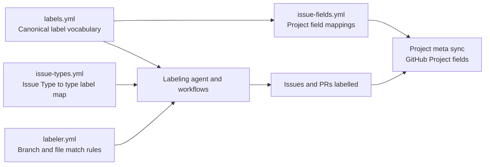
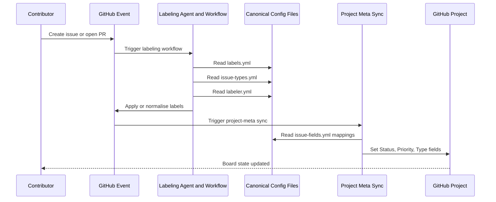

# Canonical Config File Interdependencies Guide

## Overview

This guide documents the canonical relationship between:

- `.github/labels.yml`
- `.github/issue-types.yml`
- `.github/labeler.yml`
- `.github/issue-fields.yml`

It also maps end-to-end data flow from issue/PR creation to automation completion.

Project metadata sync is label-driven, but it also treats issue type selection
and safe content/branch fallbacks as first-class signals so project fields can
catch up when labels are added after creation.

## Canonical Roles

| File | Canonical Role | Primary Consumers |
| --- | --- | --- |
| `.github/labels.yml` | Source of truth for label names, colours, descriptions, aliases | labeling agent, sync scripts, docs |
| `.github/issue-types.yml` | Source of truth for GitHub Issue Type display names and companion `type:*` label mapping | labeling agent, issue type docs |
| `.github/labeler.yml` | Rule map for branch/file-pattern-based auto-labelling | GitHub labeler workflow and agent helpers |
| `.github/issue-fields.yml` | Source of truth for project field mappings and field policy limits | project-meta sync, validation scripts, issue field docs |

## Interdependency Diagram

## Data Flow: Issue Creation to Automation Completion

## Data Contract Rules

1. `type:*` labels used in `.github/issue-fields.yml` Type mappings must exist in both `.github/labels.yml` and `.github/issue-types.yml`.
2. `status:*` and `priority:*` mappings in `.github/issue-fields.yml` must resolve to labels defined in `.github/labels.yml`.
3. `.github/labeler.yml` may only emit canonical labels defined in `.github/labels.yml`.
4. `.github/issue-types.yml` display types should map to canonical `type:*` labels that can be projected into project field Type values.
5. `project-meta-sync.yml` should reprocess label changes so late `type:*` labels or corrected issue types update the project field projection.

## Current Risks Observed

- Cross-file Type parity is validator-enforced, but downstream documentation can still drift if canonical types are added without matching doc updates.
- Legacy references to deprecated files can still create operator confusion if docs are updated unevenly.

## Recommended Validation Hooks

- `scripts/validation/validate-issue-fields.cjs` enforces strict cross-file parity for `Status`, `Priority`, and `Type` mappings.
- `scripts/validation/validate-labeling-configs.cjs` fails when `.github/labeler.yml` emits labels not defined in `.github/labels.yml`.
- `scripts/validation/validate-branch-name.js` enforces branch naming discipline for pull requests targeting `develop`.
- Run parity checks in CI on every PR touching any canonical config file.

## Related Documentation

- [docs/ISSUE_FIELDS.md](./ISSUE_FIELDS.md)
- [docs/ISSUE_TYPES.md](./ISSUE_TYPES.md)
- [docs/LABEL_STRATEGY.md](./LABEL_STRATEGY.md)
- [docs/LABELING.md](./LABELING.md)
- [docs/BRANCHING_STRATEGY.md](./BRANCHING_STRATEGY.md)
- `.github/reports/audits/2026-06-03-issue-fields-config-vs-github-api-audit-660.md`

---

*Built by 🧱 LightSpeedWP with ☕, 🚀, and open-source spirit!*
