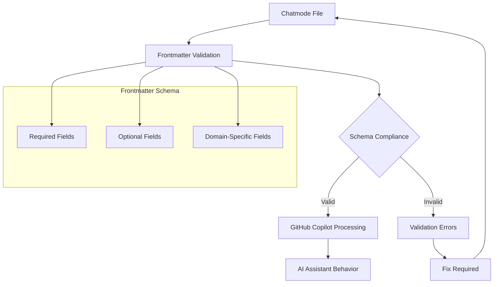

## Overview

Chatmode files (`.chatmode.md`) are specialized GitHub Copilot configuration files that define custom AI assistant behaviors. This document outlines the frontmatter standards for chatmode files within the LightSpeedWP ecosystem.



## Chatmode Frontmatter Schema

### Required Fields

All chatmode files MUST include these frontmatter fields:

- **`file_type`**: Must be `"chatmode"`
- **`description`**: Clear explanation of the chatmode's purpose and functionality
- **`title`**: Human-readable name for the chatmode

### Recommended Fields

- **`version`**: Semantic version (e.g., "2.0")
- **`author`**: Creator identification
- **`maintainer`**: Current maintainer information
- **`mode`**: Operational mode (`"instruction"`, `"conversation"`, `"template"`)
- **`stability`**: Lifecycle stage (`"stable"`, `"beta"`, `"experimental"`)
- **`domain`**: Area of focus (`"awesome-copilot"`, `"lightspeed"`, `"general"`)
- **`deprecated`**: Boolean indicating deprecation status
- **`tags`**: Array of relevant keywords
- **`created_date`**: Creation date (ISO format)
- **`last_updated`**: Last modification date (ISO format)

### Chatmode-Specific Fields

- **`tools`**: Array of tools/capabilities the chatmode utilizes
- **`model`**: Preferred AI model for the chatmode
- **`context_window`**: Token limit considerations
- **`temperature`**: AI response randomness setting
- **`max_tokens`**: Response length limitations

## Standard Frontmatter Templates

### Basic Chatmode Template

```yaml
---
file_type: chatmode
version: "2.0"
author: "LightSpeedWP Team"
maintainer: "LightSpeedWP Team"
mode: "instruction"
stability: "stable"
domain: "awesome-copilot"
deprecated: false
references:
  - path: "schemas/frontmatter.schema.json"
    description: "Unified frontmatter schema definition"
  - path: ".github/chatmodes/chatmodes.md"
    description: "Chatmodes master index"
tags:
  - chatmode
  - copilot
  - assistant
title: "Example Chatmode"
description: "Brief description of what this chatmode does"
created_date: "2025-01-07"
last_updated: "2025-01-07"
---
```

### Advanced Chatmode Template

```yaml
---
file_type: chatmode
version: "2.0"
author: "LightSpeedWP Team"
maintainer: "LightSpeedWP Team"
mode: "instruction"
stability: "stable"
domain: "awesome-copilot"
deprecated: false
references:
  - path: "schemas/frontmatter.schema.json"
    description: "Unified frontmatter schema definition"
  - path: ".github/chatmodes/chatmodes.md"
    description: "Chatmodes master index"
  - path: "docs/specific-guide.md"
    description: "Related documentation"
tags:
  - chatmode
  - advanced
  - copilot
  - specialized
title: "Advanced Specialized Chatmode"
description: "Detailed description of specialized chatmode functionality"
tools:
  - "code-analysis"
  - "documentation-generator"
  - "test-runner"
model: "gpt-4"
context_window: 8192
temperature: 0.3
max_tokens: 2048
created_date: "2025-01-07"
last_updated: "2025-01-07"
---
```

## Domain-Specific Guidelines

### Awesome Copilot Chatmodes

For chatmodes in the `awesome-copilot` domain:

- **Domain**: Set to `"awesome-copilot"`
- **Tags**: Include `"awesome-copilot"` tag
- **References**: Include path to awesome-copilot index
- **Stability**: Usually `"experimental"` for new modes, `"stable"` for proven ones

### LightSpeed Core Chatmodes

For core LightSpeed functionality:

- **Domain**: Set to `"lightspeed"`
- **Tags**: Include `"lightspeed"`, `"core"`
- **Stability**: Typically `"stable"`
- **Maintainer**: Core team members

### Template Chatmodes

For chatmode templates:

- **Mode**: Set to `"template"`
- **Tags**: Include `"template"`
- **Description**: Clearly indicate it's a template
- **Deprecated**: May be `true` for outdated templates

## Validation and Quality Assurance

### Frontmatter Validation

All chatmode files are validated against the unified schema:

1. **Schema Compliance**: Fields match expected types and formats
2. **Required Field Check**: All mandatory fields are present
3. **Reference Validation**: Referenced paths exist and are accessible
4. **Tag Consistency**: Tags follow established conventions

### Quality Checklist

- [ ] All required frontmatter fields are present
- [ ] Description clearly explains the chatmode's purpose
- [ ] Tags are relevant and follow conventions
- [ ] References point to valid, existing files
- [ ] Version follows semantic versioning
- [ ] Dates are in ISO format (YYYY-MM-DD)
- [ ] Domain matches the chatmode's actual scope
- [ ] Stability level is appropriate for the chatmode's maturity

## Migration from Legacy Formats

### Converting Old Frontmatter

Legacy chatmode frontmatter may use different field names:

- `type` → `file_type`
- `id` → Use in `title` if appropriate
- `links` → `references` (with structured format)

### Bulk Update Process

1. Audit existing chatmode files
2. Map legacy fields to unified schema
3. Update references to new paths
4. Validate against schema
5. Test chatmode functionality

## Best Practices

### Naming Conventions

- Use descriptive, kebab-case filenames
- Include `.chatmode.md` extension
- Avoid special characters in titles

### Content Organization

- Keep frontmatter concise but complete
- Use references for related documentation
- Maintain consistent tagging across related chatmodes

### Maintenance

- Review and update frontmatter regularly
- Update `last_updated` field when making changes
- Deprecate outdated chatmodes properly
- Document breaking changes in version updates

## References and Further Reading

- [Unified Frontmatter Schema](../schemas/frontmatter.schema.json)
- [Tagging and Frontmatter Conventions](../.github/instructions/tagging-and-frontmatter-conventions.instructions.md)
- [Chatmodes Master Index](../.github/chatmodes/chatmodes.md)
- [GitHub Copilot Documentation](https://docs.github.com/copilot)

---

For questions about chatmode frontmatter or to suggest improvements to this documentation, please refer to the LightSpeedWP team's contribution guidelines.
