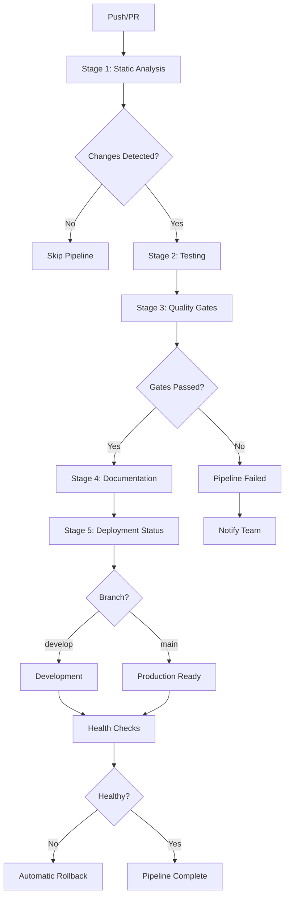

# CI/CD Pipeline Guide for Modular Shell Scripts

## 📋 Table of Contents

- [Overview](#overview)
- [Pipeline Architecture](#pipeline-architecture)
- [Pipeline Stages](#pipeline-stages)
- [Quality Gates](#quality-gates)
- [Security Scanning](#security-scanning)
- [Deployment Process](#deployment-process)
- [Monitoring & Health Checks](#monitoring--health-checks)
- [Rollback Procedures](#rollback-procedures)
- [Troubleshooting](#troubleshooting)
- [Best Practices](#best-practices)

## Overview

The LightSpeed CI/CD pipeline provides comprehensive automation for modular shell script development, testing, deployment, and monitoring. The pipeline ensures code quality, security, and reliability through multi-stage validation and automated deployment processes.

### Key Features

- **Multi-stage validation** with progressive quality checks
- **Automated testing** with unit, integration, and smoke tests
- **Security scanning** for vulnerabilities and dangerous patterns
- **Quality gates** with configurable thresholds
- **Automated deployment** to staging and production
- **Health monitoring** and performance checks
- **Automatic rollback** on deployment failures
- **Comprehensive reporting** and metrics

### Pipeline Workflow



## Pipeline Architecture

### Workflow File

**Location**: `.github/workflows/modular-scripts-pipeline.yml`

### Trigger Events

The pipeline triggers on:

- **Push events** to `main`, `develop`, `feature/*`, `hotfix/*`, `claude/*` branches
- **Pull requests** to `main` and `develop` branches
- **File changes** to `scripts/**`, `tests/**`, `.github/workflows/**`
- **Release events** when a release is published
- **Schedule** - Daily at 2 AM UTC for security and quality checks
- **Manual dispatch** via workflow UI

### Environment Variables

| Variable | Default | Description |
|----------|---------|-------------|
| `PIPELINE_VERSION` | `v2.0.0` | Pipeline version identifier |
| `QUALITY_THRESHOLD` | `80` | Minimum quality score required (0-100) |
| `SECURITY_THRESHOLD` | `high` | Security severity threshold |
| `NODE_VERSION` | `20` | Node.js version for CI tasks |
| `SHELLCHECK_VERSION` | `stable` | ShellCheck version for linting |
| `BATS_VERSION` | `v1.10.0` | Bats testing framework version |

### Pipeline Inputs

When triggered manually (`workflow_dispatch`), the pipeline accepts:

- **`deploy_environment`**: Target environment (`staging` or `production`)
- **`force_deploy`**: Force deployment despite warnings (boolean)
- **`skip_tests`**: Skip test execution (boolean, not recommended)

## Pipeline Stages

### Stage 1: Static Analysis

**Purpose**: Validate code quality, style, and basic security

**Duration**: ~5-10 minutes

**Jobs**:

1. **Change Detection** - Identify modified files
2. **ShellCheck Analysis** - Validate shell script syntax and best practices
3. **Markdown Linting** - Check documentation formatting
4. **YAML Linting** - Validate workflow and config files
5. **Quality Metrics** - Calculate documentation completeness
6. **Basic Security Check** - Detect dangerous patterns

**Outputs**:

- `changes-detected`: Boolean indicating if relevant files changed
- `quality-score`: Documentation quality score (0-100)
- `security-issues`: Count of potential security issues
- `shellcheck-critical`: Count of critical ShellCheck issues
- `shellcheck-warnings`: Count of ShellCheck warnings

**Success Criteria**:

- ✅ No critical ShellCheck errors
- ⚠️ Warnings logged but don't block pipeline
- ✅ Quality score calculated successfully

### Stage 2: Testing

**Purpose**: Execute automated tests to verify functionality

**Duration**: ~10-20 minutes

**Test Suites**:

#### Unit Tests

- **Location**: `tests/includes/**/*.bats`
- **Purpose**: Test individual functions and includes
- **Framework**: Bats (Bash Automated Testing System)
- **Coverage**: Core includes, utilities, validation functions

#### Integration Tests

- **Location**: `tests/integration/**/*.bats`
- **Purpose**: Test component interactions
- **Framework**: Bats
- **Coverage**: Script workflows, include sourcing, end-to-end scenarios

**Test Matrix**:

The testing stage runs in parallel across multiple test suites:

```yaml
strategy:
    fail-fast: false
    matrix:
        test-suite: [unit, integration]
```

**Outputs**:

- JUnit XML test reports
- TAP (Test Anything Protocol) output
- Test coverage summaries

**Success Criteria**:

- ✅ All tests pass
- ⚠️ Test failures reported but may allow deployment with approval

### Stage 3: Quality Gates

**Purpose**: Enforce quality thresholds before deployment

**Duration**: ~2-5 minutes

**Quality Checks**:

1. **Documentation Quality Gate**
   - Threshold: ≥80% scripts documented
   - Checks for: Script Name, Description, Usage, Examples

2. **ShellCheck Gate**
   - Threshold: 0 critical issues
   - Warnings logged but don't block

3. **Security Gate**
   - Threshold: 0 critical/high security issues
   - Medium/low issues logged as warnings

4. **Test Results Gate**
   - Threshold: All tests pass or skipped
   - Failures block deployment

**Gate Evaluation**:

```bash
Overall Pass = (
    Documentation Score >= QUALITY_THRESHOLD &&
    ShellCheck Critical == 0 &&
    Security Critical == 0 &&
    Tests == "success" || Tests == "skipped"
)
```

**Force Deploy Override**:

When `force_deploy` input is `true`:
- Quality gates are evaluated but don't block
- Deployment proceeds with warnings
- Extra logging and audit trail created

**Outputs**:

- `quality-passed`: Boolean indicating if all gates passed
- `deploy-ready`: Boolean indicating deployment readiness
- Quality gate summary in GitHub Actions summary

**Success Criteria**:

- ✅ All quality gates pass
- ⚠️ Can override with `force_deploy` flag

### Stage 4: Documentation

**Purpose**: Automatically update documentation after successful validation

**Duration**: ~3-5 minutes

**Conditions**:

- Quality gates passed
- Branch is `develop`
- Changes detected in relevant files

**Actions**:

1. Generate updated include documentation
2. Update README files
3. Update badges and metrics
4. Commit changes with `[skip ci]` tag

**Scripts Used**:

- `scripts/maintenance/update-readme-and-changelog.sh`
- `scripts/maintenance/update-badges.sh`

**Outputs**:

- Updated documentation files
- Automated commit to branch

### Stage 5: Deployment Notification

**Purpose**: Report deployment status and next steps

**Duration**: ~1 minute

**Information Provided**:

- Pipeline version
- Branch and commit information
- Quality gate results
- Deploy readiness status
- Next steps based on branch

**Notification Levels**:

- 🎯 **`main` branch**: Ready for production deployment
- 🧪 **`develop` branch**: Changes deployed to development
- 📦 **Other branches**: Changes ready for review

## Quality Gates

### Quality Score Calculation

The quality score is a composite metric based on multiple factors:

```bash
Overall Score =
    (Code Quality × 0.25) +
    (Test Coverage × 0.30) +
    (Documentation × 0.20) +
    (Security × 0.15) +
    (Performance × 0.10)
```

### Component Scores

#### 1. Code Quality (25%)

**Metrics**:
- ShellCheck compliance
- Script syntax validity
- Adherence to best practices

**Calculation**:
```bash
Code Quality = (Scripts Without Issues / Total Scripts) × 100
```

#### 2. Test Coverage (30%)

**Metrics**:
- Function test coverage
- Include test coverage
- Integration test completeness

**Calculation**:
```bash
Test Coverage = (Tested Functions / Total Functions) × 100
```

#### 3. Documentation (20%)

**Metrics**:
- Script headers present
- Usage examples provided
- API documentation complete

**Calculation**:
```bash
Documentation = (Documented Scripts / Total Scripts) × 100
```

#### 4. Security (15%)

**Metrics**:
- No critical security issues
- No hardcoded credentials
- Safe file operations

**Calculation**:
```bash
Security = 100 - (Security Issues / Total Scripts) × 10
```

#### 5. Performance (10%)

**Metrics**:
- Script execution time
- Code complexity
- Resource usage

**Calculation**:
```bash
Performance = 100 - (Slow Scripts / Total Scripts) × 20
```

### Quality Gate Thresholds

| Gate | Threshold | Action on Failure |
|------|-----------|------------------|
| Overall Quality | ≥80% | Block deployment |
| Documentation | ≥75% | Block deployment |
| Test Coverage | ≥85% | Warning only |
| Security Critical | 0 issues | Block deployment |
| Security High | ≤2 issues | Warning only |
| ShellCheck Critical | 0 errors | Block deployment |

## Security Scanning

### Security Audit Script

**Location**: `scripts/security/security-audit.sh`

**Usage**:
```bash
./scripts/security/security-audit.sh [--strict] [--output <file>] [--json]
```

### Security Checks

#### 1. Dangerous Shell Patterns

**Critical Issues** 🔴:
- `eval` usage with user input
- Piping remote content to shell
- Root filesystem operations
- Destructive commands without safeguards

**High Severity** 🟠:
- Dynamic sourcing with variables
- Overly permissive file permissions (777, 666)
- Hardcoded credentials and secrets

**Medium Severity** 🟡:
- Passwordless sudo usage
- Missing input validation
- Insecure temporary file handling

**Low Severity** 🟢:
- Missing `set -e` error handling
- Missing shebang
- Lack of security documentation

#### 2. Credential Detection

Patterns scanned:
- `password=`, `passwd=`, `pwd=`
- `secret=`, `token=`
- `api_key=`, `apikey=`
- `private_key=`

#### 3. File Permission Checks

- World-writable files (777, 666)
- Sensitive files readable by all
- Executable files with incorrect permissions

#### 4. Command Safety

Dangerous commands requiring warnings:
- `dd`, `mkfs`, `fdisk`, `parted`
- `rm -rf` without path validation
- `chmod 777` or similar

### Security Report Format

```json
{
  "timestamp": "2025-11-18T12:00:00Z",
  "project": "LightSpeedWP Modular Scripts",
  "findings": [
    {
      "severity": "HIGH",
      "file": "scripts/example.sh",
      "line": 42,
      "message": "Potential hardcoded credential detected",
      "pattern": "password="
    }
  ],
  "summary": {
    "total": 5,
    "critical": 0,
    "high": 2,
    "medium": 1,
    "low": 2
  }
}
```

## Deployment Process

### Deployment Environments

#### Staging Environment

**Purpose**: Pre-production testing and validation

**Script**: `scripts/deployment/deploy-to-staging.sh`

**Configuration**:
```bash
export STAGING_PATH="/opt/lightspeed-wp/staging"
export BACKUP_RETENTION_DAYS=30
```

**Deployment Flow**:
1. Validate deployment readiness
2. Create backup
3. Deploy includes and scripts
4. Run validation tests
5. Execute health checks
6. Register deployment

**Triggers**:
- Manual execution
- Automated on `develop` branch (planned)

#### Production Environment

**Purpose**: Live production deployment

**Script**: `scripts/deployment/deploy-to-production.sh`

**Configuration**:
```bash
export PRODUCTION_PATH="/opt/lightspeed-wp/production"
export BACKUP_RETENTION_DAYS=90
```

**Additional Safety Checks**:
- Business hours validation
- Deployment approval verification
- Recent failure check
- Extended health checks

**Triggers**:
- Manual execution only
- Requires deployment approval

### Deployment Steps

#### 1. Pre-Deployment Validation

**Checks**:
- Quality report exists and passed
- Target environment accessible
- Sufficient disk space (≥1GB for production)
- Write permissions verified
- No recent failed deployments

#### 2. Backup Creation

**Process**:
- Create compressed tar.gz archive
- Calculate SHA256 checksum
- Store in environment-specific backup directory
- Clean old backups based on retention policy

**Backup Locations**:
- Staging: `backups/staging/`
- Production: `backups/production/`

#### 3. Script Deployment

**Includes Deployment**:
- Copy all include files from `scripts/includes/`
- Verify script syntax
- Set correct permissions (750 for scripts)

**Scripts Deployment**:
- Copy utility scripts
- Exclude deployment scripts and test files
- Set permissions
- Verify structure

#### 4. Validation Testing

**Tests Run**:
- Smoke tests for basic functionality
- Environment-specific integration tests
- Syntax validation of all deployed scripts

#### 5. Health Checks

**Checks Performed**:
- Script syntax validation
- File permissions verification
- Required includes present
- Disk space availability
- Deployment metadata validation

#### 6. Registry Update

**Deployment Registry** (`deployment-registry.json`):
```json
{
  "deployments": [
    {
      "environment": "production",
      "deployment_id": "20251118-120000",
      "status": "success",
      "reason": "",
      "timestamp": "2025-11-18T12:00:00Z"
    }
  ]
}
```

## Monitoring & Health Checks

### Health Check Script

**Location**: `scripts/monitoring/health-check.sh`

**Usage**:
```bash
./health-check.sh [--environment <env>] [--verbose] [--json]
```

### Health Check Components

#### 1. Script Syntax Check

**Method**: `bash -n script.sh`

**Status Levels**:
- ✅ Pass: All scripts valid
- ❌ Fail: Syntax errors found
- ⚠️ Warn: No scripts found

#### 2. File Permissions Check

**Checks**:
- Scripts are executable
- Sensitive files have restricted permissions
- No world-writable files

#### 3. Required Includes Check

**Required Files**:
- `core/logging.sh`
- `core/validation.sh`
- `core/common-functions.sh`

#### 4. Disk Space Check

**Thresholds**:
- ✅ < 80%: Healthy
- ⚠️ 80-90%: Warning
- ❌ > 90%: Critical

#### 5. Deployment Metadata Check

**Validates**:
- Deployment registry exists
- Registry is valid JSON
- Recent deployment recorded

### Performance Monitoring

**Location**: `scripts/monitoring/performance-check.sh`

**Usage**:
```bash
./performance-check.sh [--environment <env>] [--benchmark] [--json]
```

**Metrics Collected**:

- **System Resources**:
  - CPU load average
  - Memory usage percentage
  - Disk I/O statistics

- **Script Metrics**:
  - Script loading times
  - File sizes and LOC
  - Function counts
  - Code complexity

**Benchmark Mode**:
- Individual script timing
- Function call performance
- Detailed complexity analysis

### Monitoring Schedule

**Automated Checks**:

- **Post-Deployment**: Immediately after each deployment
- **Daily**: 2 AM UTC via scheduled workflow
- **On-Demand**: Manual workflow dispatch

**Continuous Monitoring**:

- **Hourly**: Performance checks during business hours
- **Daily**: Complete benchmark suite
- **Weekly**: Trend analysis and reporting

## Rollback Procedures

### Automatic Rollback

**Trigger Conditions**:
- Deployment validation tests fail
- Post-deployment health check fails
- Critical errors during deployment

**Script**: `scripts/deployment/automated-rollback.sh`

**Usage**:
```bash
./automated-rollback.sh <environment> [reason]
```

### Rollback Process

#### 1. Identify Last Successful Deployment

**Method**:
- Query deployment registry
- Filter by environment and "success" status
- Select most recent entry

#### 2. Restore from Backup

**Process**:
- Verify backup file exists
- Check backup integrity (SHA256)
- Extract backup to target location
- Verify restoration

#### 3. Validation

**Checks**:
- Run health checks
- Verify script syntax
- Test basic functionality
- Check critical paths

#### 4. Registry Update

**Actions**:
- Mark current deployment as "rollback"
- Log rollback reason
- Update deployment status

### Manual Rollback

**When to Use**:
- Issues discovered after deployment
- Performance degradation
- Unexpected behaviour in production

**Steps**:

1. **Assess Impact**:
   ```bash
   # Check deployment history
   cat deployment-registry.json | jq '.deployments[] | select(.environment == "production") | .deployment_id'
   ```

2. **Identify Target Deployment**:
   ```bash
   # View recent successful deployments
   cat deployment-registry.json | jq '.deployments[] | select(.environment == "production" and .status == "success")'
   ```

3. **Execute Rollback**:
   ```bash
   ./scripts/deployment/automated-rollback.sh production "Manual rollback due to issue #123"
   ```

4. **Verify Rollback**:
   ```bash
   ./scripts/monitoring/health-check.sh --environment production --verbose
   ```

5. **Notify Team**:
   - Update incident ticket
   - Notify stakeholders
   - Document rollback reason

## Troubleshooting

### Pipeline Failures

#### Stage 1: Static Analysis Fails

**Symptoms**:
- Critical ShellCheck errors
- Quality score below threshold
- Security issues detected

**Debug Steps**:

1. **Review ShellCheck Output**:
   ```bash
   # Download artifacts from failed run
   # Check shellcheck-results.json
   cat shellcheck-results.json | jq '.[] | select(.level == "error")'
   ```

2. **Check Quality Score**:
   ```bash
   ./scripts/maintenance/calculate-quality-score.sh
   ```

3. **Run Security Audit Locally**:
   ```bash
   ./scripts/security/security-audit.sh --strict
   ```

**Common Fixes**:
- Fix ShellCheck errors in reported files
- Add missing documentation headers
- Remove hardcoded credentials
- Fix file permissions

#### Stage 2: Testing Fails

**Symptoms**:
- Test failures in unit or integration tests
- Test framework errors
- Timeout issues

**Debug Steps**:

1. **Run Tests Locally**:
   ```bash
   # Install Bats if needed
   npm install -g bats

   # Run specific test suite
   bats tests/includes/**/*.bats --verbose
   ```

2. **Check Test Logs**:
   ```bash
   # Review TAP output
   cat test-results/unit/results.tap
   ```

3. **Isolate Failing Test**:
   ```bash
   # Run individual test file
   bats tests/includes/core/test-logging.bats --trace
   ```

**Common Fixes**:
- Update test expectations
- Fix broken function implementations
- Resolve test environment issues
- Add missing test dependencies

#### Stage 3: Quality Gates Fail

**Symptoms**:
- Quality score below threshold
- Security gates not passed
- Force deploy required

**Debug Steps**:

1. **Review Quality Report**:
   ```bash
   cat pipeline-quality-report.json | jq '.'
   ```

2. **Check Individual Gates**:
   ```bash
   # Documentation score
   cat pipeline-quality-report.json | jq '.scores.documentation'

   # Security issues
   cat pipeline-quality-report.json | jq '.scores.security'
   ```

**Common Fixes**:
- Improve documentation coverage
- Address security findings
- Increase test coverage
- Fix code quality issues

### Deployment Failures

#### Deployment Validation Fails

**Symptoms**:
- Quality report not found
- Target environment inaccessible
- Insufficient disk space

**Debug Steps**:

1. **Check Quality Report**:
   ```bash
   ls -la pipeline-quality-report.json
   cat pipeline-quality-report.json | jq '.quality_gates'
   ```

2. **Verify Environment Access**:
   ```bash
   # Test connection
   ssh staging-server "test -d /opt/lightspeed-wp/staging && echo 'OK' || echo 'FAIL'"

   # Check permissions
   ssh staging-server "test -w /opt/lightspeed-wp/staging && echo 'OK' || echo 'FAIL'"
   ```

3. **Check Disk Space**:
   ```bash
   ssh staging-server "df -h /opt/lightspeed-wp/staging"
   ```

**Common Fixes**:
- Generate quality report via CI
- Verify SSH access and credentials
- Free up disk space
- Check directory permissions

#### Deployment Script Fails

**Symptoms**:
- Script syntax errors
- Backup creation fails
- Rsync errors

**Debug Steps**:

1. **Test Deployment Script Locally**:
   ```bash
   # Dry run
   ./scripts/deployment/deploy-to-staging.sh --dry-run
   ```

2. **Check Script Syntax**:
   ```bash
   bash -n scripts/deployment/deploy-to-staging.sh
   shellcheck scripts/deployment/deploy-to-staging.sh
   ```

3. **Review Deployment Logs**:
   ```bash
   # Check workflow logs in GitHub Actions
   # Look for specific error messages
   ```

**Common Fixes**:
- Fix script syntax errors
- Verify source file paths exist
- Check rsync permissions
- Ensure target directories exist

#### Health Check Fails Post-Deployment

**Symptoms**:
- Deployed scripts have syntax errors
- Required includes missing
- Permission issues

**Debug Steps**:

1. **Run Health Check Manually**:
   ```bash
   ./scripts/monitoring/health-check.sh --environment staging --verbose
   ```

2. **Check Deployed Files**:
   ```bash
   ssh staging-server "find /opt/lightspeed-wp/staging/includes -name '*.sh' | xargs bash -n"
   ```

3. **Verify Permissions**:
   ```bash
   ssh staging-server "find /opt/lightspeed-wp/staging -name '*.sh' -not -perm -u+x"
   ```

**Common Fixes**:
- Verify source scripts before deployment
- Fix deployment script to set permissions
- Ensure all includes are copied
- Validate deployment process

### Rollback Issues

#### Rollback Script Fails

**Symptoms**:
- Backup file not found
- Backup integrity check fails
- Restoration errors

**Debug Steps**:

1. **Check Backup Existence**:
   ```bash
   ls -la backups/staging/
   ```

2. **Verify Backup Integrity**:
   ```bash
   # Check checksum
   sha256sum -c backups/staging/staging-YYYYMMDD-HHMMSS.tar.gz.sha256
   ```

3. **Test Backup Extraction**:
   ```bash
   # Extract to temp location
   mkdir -p /tmp/backup-test
   tar -xzf backups/staging/staging-YYYYMMDD-HHMMSS.tar.gz -C /tmp/backup-test
   ```

**Common Fixes**:
- Verify backup was created successfully
- Check backup file permissions
- Ensure sufficient disk space for extraction
- Validate backup file integrity

## Best Practices

### Development Workflow

1. **Work in Feature Branches**
   - Create branch from `develop`
   - Use descriptive branch names: `feature/add-validation-script`
   - Keep changes focused and atomic

2. **Write Tests First**
   - Create Bats tests before implementing features
   - Aim for >85% code coverage
   - Include integration tests for workflows

3. **Document as You Code**
   - Add script headers with Name, Description, Usage
   - Include usage examples
   - Document non-obvious behaviour

4. **Run Quality Checks Locally**
   ```bash
   # Before committing
   shellcheck your-script.sh
   ./scripts/maintenance/calculate-quality-score.sh
   ./scripts/security/security-audit.sh
   bats tests/includes/**/*.bats
   ```

5. **Create Pull Requests**
   - Target `develop` branch
   - Include clear description
   - Reference related issues
   - Wait for CI checks to pass

### Deployment Workflow

1. **Always Deploy to Staging First**
   ```bash
   # Test in staging
   ./scripts/deployment/deploy-to-staging.sh --dry-run
   ./scripts/deployment/deploy-to-staging.sh
   ```

2. **Monitor Post-Deployment**
   ```bash
   # Run health checks
   ./scripts/monitoring/health-check.sh --environment staging
   ./scripts/monitoring/performance-check.sh --environment staging
   ```

3. **Never Skip Backups in Production**
   - Backups enable quick rollback
   - Always verify backup integrity
   - Test restoration process periodically

4. **Use Deployment Windows**
   - Deploy during business hours when possible
   - Avoid Friday deployments
   - Schedule maintenance windows for major changes

5. **Document Deployments**
   - Update changelog
   - Note any breaking changes
   - Document rollback procedure if needed

### Security Practices

1. **Never Commit Secrets**
   - Use environment variables
   - Store secrets in secure locations
   - Run security scan before commits

2. **Validate All Inputs**
   ```bash
   # Example input validation
   if [[ ! "$input" =~ ^[a-zA-Z0-9_-]+$ ]]; then
       echo "Invalid input" >&2
       exit 1
   fi
   ```

3. **Use Safe File Operations**
   ```bash
   # Use mktemp for temporary files
   temp_file=$(mktemp) || exit 1
   trap 'rm -f "$temp_file"' EXIT
   ```

4. **Apply Least Privilege**
   ```bash
   # Restrictive permissions
   chmod 750 script.sh  # Owner: rwx, Group: r-x, Others: none
   chmod 600 config.conf  # Owner: rw, Group: none, Others: none
   ```

5. **Handle Errors Properly**
   ```bash
   #!/usr/bin/env bash
   set -euo pipefail  # Exit on error, undefined vars, pipe failures
   trap 'echo "Error on line $LINENO" >&2' ERR
   ```

### Quality Assurance

1. **Maintain High Quality Scores**
   - Aim for >90% quality score
   - Document all functions and scripts
   - Keep code complexity low

2. **Write Comprehensive Tests**
   - Unit tests for all functions
   - Integration tests for workflows
   - Performance tests for critical paths

3. **Review Code Regularly**
   - Request peer reviews for PRs
   - Use automated reviewer workflow
   - Address feedback promptly

4. **Keep Dependencies Updated**
   - Regular updates of test frameworks
   - Security updates for tools
   - Document dependency changes

5. **Monitor Metrics**
   - Track quality trends
   - Monitor deployment success rates
   - Review performance metrics

## Appendix

### Related Documentation

- [Workflows README](../.github/workflows/README.md)
- [Deployment Scripts](../scripts/deployment/README.md)
- [Monitoring Scripts](../scripts/monitoring/README.md)
- [Security Scripts](../scripts/security/README.md)
- [Testing Guide](./TESTING.md)

### Configuration Files

- `.github/workflows/modular-scripts-pipeline.yml` - Pipeline workflow
- `deployment-registry.json` - Deployment tracking
- `pipeline-quality-report.json` - Quality metrics

### Support Scripts

- `scripts/maintenance/calculate-quality-score.sh` - Quality calculation
- `scripts/deployment/deploy-to-staging.sh` - Staging deployment
- `scripts/deployment/deploy-to-production.sh` - Production deployment
- `scripts/deployment/automated-rollback.sh` - Rollback automation
- `scripts/monitoring/health-check.sh` - Health monitoring
- `scripts/monitoring/performance-check.sh` - Performance monitoring
- `scripts/security/security-audit.sh` - Security scanning

### External Resources

- [Bats Testing Framework](https://github.com/bats-core/bats-core)
- [ShellCheck](https://www.shellcheck.net/)
- [GitHub Actions Documentation](https://docs.github.com/en/actions)
- [OWASP Top 10](https://owasp.org/www-project-top-ten/)

---

**Version**: 1.0.0
**Last Updated**: 2025-11-18
**Maintained By**: LightSpeed WP Team

*For questions or issues with the CI/CD pipeline, reference this guide or open an issue with the `area:ci` label.*
