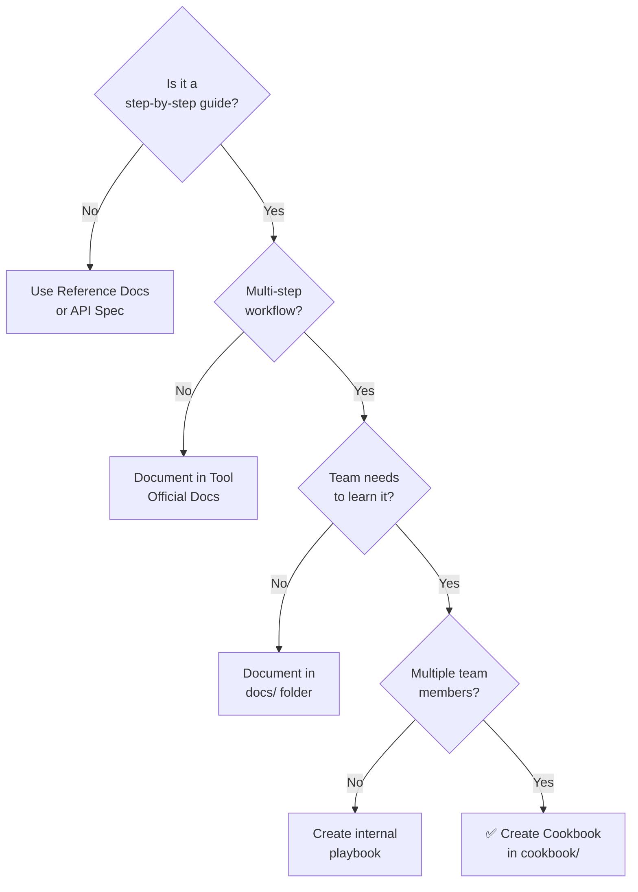
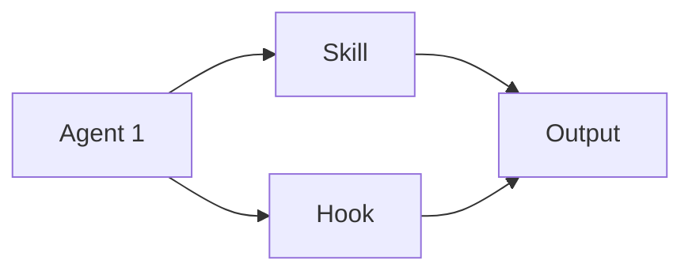
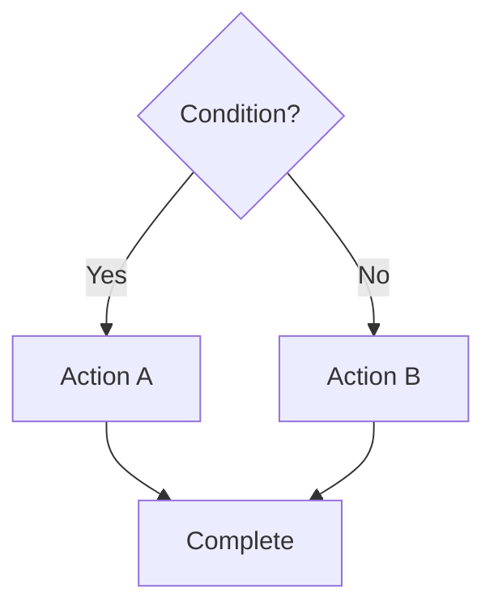
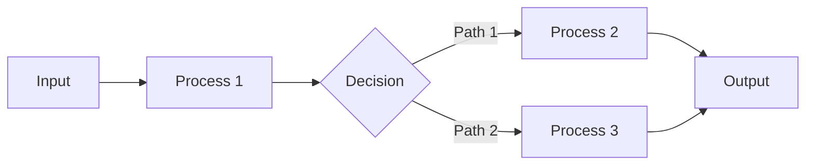

# Cookbooks Standards

Guidelines for creating practical implementation guides, recipes, and playbooks that teach team members how to accomplish common tasks.

## Overview

Cookbooks are step-by-step guides that teach a specific workflow or technique. Unlike reference documentation, cookbooks are narrative—they walk through real scenarios with actual code examples, explaining decisions along the way.

### Cookbook Lifecycle

```mermaid
graph LR
%%{init: { 'accessibility': { 'diagWithoutTitle':true } }}%%
    accTitle: Cookbook development lifecycle
    accDescr: Step-by-step progression from identifying a common pattern through recipe creation, code examples, testing, and monitoring usage.
    A["Identify<br/>Common Pattern"] --> B["Create Recipe<br/>Structure"]
    B --> C["Write README &<br/>STEPS.md"]
    C --> D["Add CODE<br/>Examples"]
    D --> E["Create<br/>TROUBLESHOOTING"]
    E --> F["Test All<br/>Examples"]
    F --> G["Publish to<br/>cookbook/"]
    G --> H["Update<br/>README.md"]
    H --> I["Monitor<br/>Usage"]
```



---

## Cookbook Concept

### What Is a Cookbook?

A cookbook is a practical guide that:

- Teaches how to accomplish a specific task
- Walks through a real-world scenario step-by-step
- Includes complete, working code examples
- Explains decisions and tradeoffs
- Addresses common pitfalls and how to avoid them
- Is written in narrative, accessible language

### Cookbooks vs. Reference Docs

| Aspect | Cookbook | Reference |
|--------|----------|-----------|
| **Purpose** | Teach a workflow | Define a standard |
| **Style** | Narrative, conversational | Concise, structured |
| **Audience** | Learners | Practitioners |
| **Examples** | Multiple, realistic | Single, minimal |
| **Scope** | One workflow | Entire system |

---

## When to Create a Cookbook

### Decision Tree: Cookbook vs. Other Documentation



### When to Create

Create cookbooks when you have:

- **Complex workflows** that span multiple tools/agents
- **Common patterns** that multiple team members need to learn
- **Multi-step processes** with decision points
- **Troubleshooting guides** for error scenarios
- **Integration examples** showing agents working together
- **Educational content** teaching new team members

### When NOT to Create

- Simple, single-step tasks (use reference docs)
- Tool documentation (use tool's official docs)
- API references (use reference standards)
- Small utilities (use examples in tool docs)

---

## Folder Structure

```
cookbook/
├── {recipe-name}/
│   ├── README.md                    # Overview and navigation
│   ├── STEPS.md                     # Step-by-step walkthrough
│   ├── CODE.md                      # Complete code examples
│   ├── TROUBLESHOOTING.md           # Common issues and solutions
│   ├── examples/
│   │   ├── example-1/
│   │   │   ├── input.json
│   │   │   └── output.json
│   │   └── example-2/
│   └── assets/
│       ├── diagram.mermaid
│       └── screenshot.png
```

---

## Cookbook Format

### README.md

Entry point for the cookbook. Include:

```markdown
# Recipe: [Title]

## Overview
One-paragraph summary of what you'll learn and accomplish.

## Prerequisites
What readers need before starting:
- Knowledge (e.g., "Understanding of agent architecture")
- Tools (e.g., "Node.js 18+, npm")
- Files (e.g., "A code repository to work with")

## Time Estimate
Expected completion time (e.g., "15 minutes")

## What You'll Learn
- Concept 1
- Concept 2
- Concept 3

## Quick Walkthrough
[Brief outline of major steps]

## Files in This Cookbook
- **STEPS.md** — Detailed step-by-step guide
- **CODE.md** — Complete code examples
- **TROUBLESHOOTING.md** — Common issues and fixes
- **examples/** — Runnable examples
```

### STEPS.md

Detailed step-by-step walkthrough:

```markdown
# Walkthrough: [Recipe Title]

## Step 1: [Action Name]

[Explanation of what you're doing and why]

### What to do
[Specific instructions]

### Code Example
```javascript
// Code snippet
```

### Expected Output

[What should happen]

### If something goes wrong

See the TROUBLESHOOTING.md file in this cookbook for common issues and fixes.

## Step 2: [Next Action]

[Continue with next step]

```

### CODE.md

Complete, working code examples:

```markdown
# Complete Code Examples

## Full Example 1: [Scenario]

### Input
```json
{
  "input": "data"
}
```

### Implementation

```javascript
// Full, runnable code
```

### Output

```json
{
  "result": "output"
}
```

## Full Example 2: [Different Scenario]

[Continue with more examples]

```

### TROUBLESHOOTING.md

Common issues and solutions:

```markdown
# Troubleshooting

## Problem: [Common Issue]

### Symptom
How the problem manifests (error messages, unexpected behaviour)

### Root Cause
Why it happens

### Solution
Step-by-step fix

### Prevention
How to avoid this in future

## Problem: [Another Common Issue]

[Continue with more issues]
```

---

## Mermaid Diagrams

Cookbooks benefit from visual explanations. Use Mermaid for:

```markdown
## Architecture Overview



## Decision Tree



## Process Flow



```

---

## Best Practices

### Writing Style

- **Conversational** — Write as if teaching a colleague
- **Clear** — Explain the WHY, not just the WHAT
- **Concrete** — Use real examples with actual data
- **Progressive** — Start simple, build complexity
- **Actionable** — Give specific, step-by-step instructions

### Structure

- Start with a **motivating example** (what can you build?)
- Provide **prerequisites** (what you need to know)
- Break into **manageable steps** (not too many, not too few)
- Include **complete code examples** (copy-paste ready)
- Offer **variations** (how to adapt for different scenarios)

### Code

- Show **complete, working code** (not fragments)
- Explain **tradeoffs** (why this approach, not that one)
- Include **error handling** (what goes wrong and why)
- Add **comments** for non-obvious sections
- Test examples before publishing

### Examples

- Use **realistic data** (not contrived examples)
- Show **multiple scenarios** (happy path + edge cases)
- Include **input and output** (so readers know what to expect)
- Make examples **copy-paste ready** (with full imports/setup)

### Accessibility

- Use **clear headings** for navigation
- Provide **multiple modalities** (text, code, diagrams)
- Link to **reference docs** for deep dives
- Explain **jargon** on first use
- Keep **line lengths reasonable** (under 100 chars in code)

---

## Integration with Other Standards

From within a cookbook recipe, reference related documentation from the repository root:

```markdown
## See Also

- [Agent Standards](../../docs/AGENT_STANDARDS.md) — Understanding agents
- [Skills Standards](../../docs/SKILLS_STANDARDS.md) — Creating skills
- [Workflows Standards](../../docs/WORKFLOWS_STANDARDS.md) — Multi-agent workflows
```

Note: Cookbook files are stored in `cookbook/{recipe-name}/`, so relative paths must traverse up two levels (`../../`) to reach the `docs/` folder.

---

## Examples

### Example 1: Creating an Agent with Shared Skills

```markdown
# Recipe: Create an Agent That Uses Shared Skills

## Overview
Learn how to create a new agent that leverages existing shared skills
from the `skills/` folder, reducing code duplication.

## Prerequisites
- Understanding of [Agent Standards](../AGENT_STANDARDS.md)
- Understanding of [Skills Standards](../SKILLS_STANDARDS.md)
- A code editor
- Access to the `.github` repository

## What You'll Learn
- How to create a folder-based agent
- How to reference shared skills
- How to compose multiple skills into one agent
- How to test agent integration

## Quick Walkthrough
1. Create agent folder structure
2. Write agent.md with skill references
3. Create agent README.md
4. Add examples
5. Test and validate
```

### Example 2: Composing a Multi-Agent Workflow

```markdown
# Recipe: Compose a Multi-Agent Code Audit Workflow

## Overview
Learn how to create a workflow that spawns multiple agents in parallel,
aggregates their findings, and produces a comprehensive audit report.

## Prerequisites
- Understanding of [Agent Standards](../AGENT_STANDARDS.md)
- Understanding of [Workflows Standards](../WORKFLOWS_STANDARDS.md)
- Node.js 18+ and npm

## What You'll Learn
- How to structure a workflow script
- How to spawn agents in parallel
- How to aggregate results
- How to handle errors gracefully
- How to measure and log progress

## Quick Walkthrough
1. Define workflow metadata
2. Spawn discovery agents (parallel)
3. Aggregate findings
4. Spawn verification agents
5. Filter and synthesize results
6. Return structured report
```

---

## Real-World Repository Examples

The LightSpeedWP `.github` repository includes working cookbook examples:

### Published Cookbooks

**File:** `cookbook/playwright-agent-creation-guide.md`

A comprehensive guide for creating Playwright-based agents with integration patterns.

**File:** `cookbook/project-planning-and-prd-playbook.md`

Walkthrough for planning projects and creating product requirement documents using agents.

**File:** `cookbook/spec-driven-workflow-example.md`

Demonstrates the spec-driven development workflow for agent creation.

**File:** `cookbook/wordpress-plugin-checklist.md`

Complete checklist and walkthrough for WordPress plugin development standards.

See all cookbooks: [`cookbook/README.md`](../../cookbook/README.md)

---

## See Also

- [Agent Standards](./AGENT_STANDARDS.md) — Creating agents referenced in cookbooks
- [Skills Standards](./SKILLS_STANDARDS.md) — Shared skills used in recipes
- [Workflows Standards](./WORKFLOWS_STANDARDS.md) — Multi-agent workflows in cookbooks
- [Instructions Standards](./INSTRUCTIONS_STANDARDS.md) — Instruction files for agents
- [Plugins Standards](./PLUGINS_STANDARDS.md) — Plugin integration in recipes

---

## Related Documentation

- [Agent Standards](./AGENT_STANDARDS.md)
- [Skills Standards](./SKILLS_STANDARDS.md)
- [Workflows Standards](./WORKFLOWS_STANDARDS.md)
- [awesome-copilot/docs](https://github.com/github/awesome-copilot/tree/main/docs) — Inspiration and examples

---

**Last Updated:** 2026-07-24  
**Version:** 1.0.0

---

*This page brought to you by the 🦄 Magic Automation Unicorns of LightSpeedWP.*
