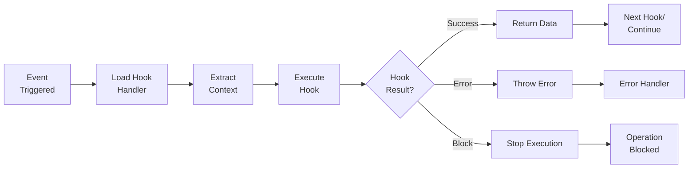
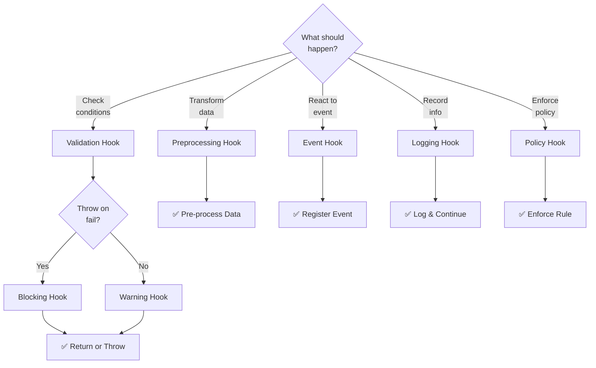

# Hooks Standards

Guidelines for creating event-driven hooks that automate tasks and enforce governance in agents and workflows.

## Overview

Hooks are JavaScript/TypeScript functions that execute in response to specific events. They enable automation, validation, and cross-cutting concerns without modifying core logic.

### Hook Execution Lifecycle



## Quick Links

- [Hook Concept](#hook-concept)
- [Hook Types](#hook-types)
- [Implementation](#implementation)
- [Best Practices](#best-practices)
- [Examples](#examples)

---

## Hook Concept

### What Is a Hook?

A hook is a function that:

- Responds to specific events (startup, file saved, command executed)
- Performs validation or preprocessing
- Executes side effects (logging, notifications)
- Can modify or block operations
- Is reusable across multiple agents

### Hook vs. Middleware

Hooks differ from middleware:

| Aspect | Hook | Middleware |
|--------|------|----------|
| **Trigger** | Event-based | Request/response pipeline |
| **Scope** | Specific events | All requests |
| **Blocking** | Can block | Always in chain |
| **State** | Preserved between calls | Request-scoped |

---

## Hook Types

### Hook Type Selection



### Event Hooks

Triggered by specific events:

| Event | Trigger | Use Case |
|-------|---------|----------|
| `startup` | Agent/plugin activation | Initialization |
| `shutdown` | Agent/plugin deactivation | Cleanup |
| `before-run` | Before agent execution | Validation, setup |
| `after-run` | After agent execution | Cleanup, logging |
| `on-error` | When error occurs | Error handling |
| `on-success` | When task succeeds | Success logging |

### Validation Hooks

Validate inputs or state:

```javascript
export async function validateInput(input) {
  if (!input || !input.code) {
    throw new Error('Code parameter required')
  }
  return true
}
```

### Preprocessing Hooks

Transform data before processing:

```javascript
export async function normalizeInput(input) {
  return {
    ...input,
    code: input.code.trim(),
    language: input.language.toLowerCase()
  }
}
```

---

## Implementation

### File Structure

Hooks are stored in the `hooks/` folder:

```
hooks/
├── branch-validation.js        # Validates branch names
├── template-enforcement.js     # Ensures templates are used
├── ci-guard.js                 # CI validation
└── metrics-reporter.js         # Metrics collection
```

For complex hooks, use folders:

```
hooks/{hook-name}/
├── index.js                    # Main hook logic
├── validators.js               # Validation functions
├── lib/
│   └── helpers.js             # Utility functions
└── tests/
    └── hook.test.js           # Hook tests
```

### Hook Function Signature

```javascript
export async function hookName(context) {
  // Destructure context
  const { event, data, config } = context

  // Perform operations
  const result = await processData(data)

  // Return result or throw error
  if (!isValid(result)) {
    throw new Error('Validation failed')
  }

  return result
}
```

### Context Object

Hooks receive context with:

```javascript
{
  event: 'startup',           // Event name
  data: {...},                // Event-specific data
  config: {...},              // Hook configuration
  logger: {...},              // Logging interface
  previousResult: {...},      // Result from previous hook
  agent: {...},               // Agent information
  timestamp: 1234567890       // Unix timestamp
}
```

### Error Handling

Hooks can:

1. **Throw** — Stop execution, return error to caller
2. **Warn** — Log warning, continue execution
3. **Transform** — Modify data and pass to next hook
4. **Ignore** — Continue without error

```javascript
export async function validateOrWarn(context) {
  const { data, logger } = context

  if (!isValid(data)) {
    logger.warn('Validation failed, continuing anyway')
    return data  // Continue
  }

  return data
}
```

---

## Hook Registration

Hooks are registered in agent or plugin configuration:

### In Agents

```yaml
# In agent.md
hooks:
  - validation
  - preprocessing
  - metrics-reporter
```

### In Plugins

```json
{
  "hooks": [
    {
      "event": "startup",
      "script": "dist/hooks.js",
      "function": "onStartup"
    }
  ]
}
```

---

## Best Practices

### Naming

- Hook files: `kebab-case.js` (e.g., `branch-validation.js`)
- Functions: `on<EventName>` or `<action>Hook` (e.g., `onStartup`, `validationHook`)
- Exports: All functions should be explicitly exported

### Idempotency

Hooks should be safe to run multiple times:

```javascript
// ✅ Good: Safe to run multiple times
export async function ensureConfigExists(context) {
  const exists = await checkConfigFile()
  if (!exists) {
    await createConfigFile()
  }
}

// ❌ Bad: Side effect on each run
export async function appendToLog(context) {
  await appendLogEntry('Hook executed')  // Duplicate entries
}
```

### Error Resilience

Handle errors gracefully:

```javascript
export async function robustHook(context) {
  try {
    return await riskyOperation()
  } catch (error) {
    context.logger.error(`Hook failed: ${error.message}`)
    // Return default/safe value instead of throwing
    return defaultValue
  }
}
```

### Performance

- Keep hooks fast (< 1 second)
- Use lazy loading for heavy dependencies
- Cache expensive computations
- Avoid blocking I/O when possible
- Log performance metrics

### Logging

Log relevant information for debugging:

```javascript
export async function loggedHook(context) {
  const { logger, data } = context

  logger.debug('Hook starting', { dataSize: data.length })

  const result = await process(data)

  logger.info('Hook completed', {
    success: true,
    itemsProcessed: result.count
  })

  return result
}
```

### Testing

Write comprehensive tests:

```javascript
describe('branchValidationHook', () => {
  it('should reject invalid branch names', async () => {
    const context = { data: { branch: 'main_fix' } }
    expect(() => branchValidation(context)).toThrow()
  })

  it('should accept valid branch names', async () => {
    const context = { data: { branch: 'fix/my-feature' } }
    const result = await branchValidation(context)
    expect(result).toBeDefined()
  })
})
```

---

## Hook Composition

Multiple hooks can be chained:

```javascript
// Hook 1: Validation
export async function validate(context) {
  if (!isValid(context.data)) throw new Error('Invalid')
  return context.data
}

// Hook 2: Transform
export async function transform(context) {
  return {
    ...context.data,
    processed: true
  }
}

// Hook 3: Log
export async function log(context) {
  context.logger.info('Processing complete', context.data)
  return context.data
}
```

Execution order: validate → transform → log

---

## Examples

### Example 1: Branch Name Validation Hook

```javascript
// hooks/branch-validation.js
export async function validateBranchName(context) {
  const { data, logger } = context
  const { branch } = data

  // Valid pattern: type/scope-short-title
  const pattern = /^[a-z]+\/[a-z0-9\-]+$/
  if (!pattern.test(branch)) {
    throw new Error(
      `Invalid branch name: ${branch}. ` +
      `Use format: type/scope-short-title`
    )
  }

  logger.info(`Branch ${branch} is valid`)
  return { ...data, validated: true }
}
```

### Example 2: Metrics Reporter Hook

```javascript
// hooks/metrics-reporter.js
export async function reportMetrics(context) {
  const { event, data, timestamp } = context

  const metrics = {
    event,
    timestamp,
    dataSize: JSON.stringify(data).length,
    duration: Date.now() - timestamp
  }

  await sendMetrics(metrics)
  return data
}
```

### Example 3: CI Guard Hook

```javascript
// hooks/ci-guard.js
export async function enforceCIChecks(context) {
  const { data, logger } = context
  const { branch, ciStatus } = data

  // Block merge if CI failing
  if (ciStatus === 'failing') {
    logger.error(`CI failing on ${branch}, blocking operation`)
    throw new Error('CI checks must pass before proceeding')
  }

  logger.info('CI checks passed')
  return data
}
```

---

## Real-World Repository Examples

### Production Hooks

The LightSpeedWP `.github` repository implements governance and validation hooks:

**Hook:** `agent-spec-validator`

Validates agent specifications against standards before acceptance.

**Location:** `hooks/agent-spec-validator/`

Type: Validation Hook | Event: `before-commit`

**Hook:** `plugin-integrity-checker`

Checks plugin manifests and configurations for consistency and compliance.

**Location:** `hooks/plugin-integrity-checker/`

Type: Policy Hook | Event: `before-publish`

**Hook:** `multi-provider-consistency-checker`

Ensures agent configurations work across multiple LLM providers.

**Location:** `hooks/multi-provider-consistency-checker/`

Type: Validation Hook | Event: `before-agent-publish`

**Hook:** `agent-security-auditor`

Performs security analysis on agent code and configurations.

**Location:** `hooks/agent-security-auditor/`

Type: Security Policy Hook | Event: `before-production-deploy`

See all hooks: [`hooks/`](../../hooks/)

---

## See Also

- [Agent Standards](./AGENT_STANDARDS.md) — Agents using hooks
- [Plugins Standards](./PLUGINS_STANDARDS.md) — Plugin hooks
- [Workflows Standards](./WORKFLOWS_STANDARDS.md) — Workflow hooks
- [Skills Standards](./SKILLS_STANDARDS.md) — Skill validation hooks

---

## Related Documentation

- [Hooks Standards](./HOOKS_STANDARDS.md) — Event-driven handlers

---

**Last Updated:** 2026-07-24  
**Version:** 1.0.0

---

*This page brought to you by the 🦄 Magic Automation Unicorns of LightSpeedWP.*
