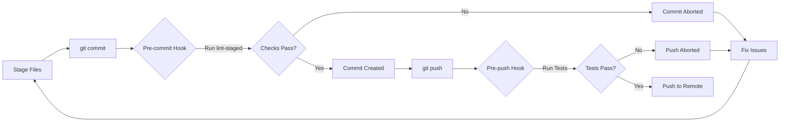

# Husky Pre-commit Hooks

We use **Husky** to run linting and formatting checks locally before code is committed, serving as a "first line" quality gate. This ensures that by the time code reaches CI, it has already passed basic standards.

## Status and Rationale

**Status:** *Fully implemented and active.* Husky automatically installs when you run `npm install` and provides pre-commit and pre-push hooks to maintain code quality.

**Why Husky:** Running checks locally speeds up feedback. It prevents "easy" issues (like code style or obvious test failures) from ever reaching the repo, which reduces CI failures and iteration time. This aligns with our goal that *"files are linted properly and tests pass"* before pushing.

## Installation

Husky is managed as a dev dependency and configured to install automatically:

1. After running `npm install`, Husky hooks are automatically installed via the `prepare` script in `package.json`:

   ```bash
   npm install
   ```

   The `prepare` script runs automatically after installation and sets up the Git hooks in `.husky/`.

2. Verify that `.husky/pre-commit` and `.husky/pre-push` files exist.

If Husky isn't working, ensure:

- Git isn't bypassing hooks (no `--no-verify` flag used)
- You have the correct Node version (see `.nvmrc`)
- The `.husky/` directory and hook files have execute permissions

## Pre-commit Hook with lint-staged

Our pre-commit hook is defined in **`.husky/pre-commit`**. It runs **lint-staged**, which applies linting and formatting checks **only to staged files**. This keeps the process fast and focused.

### What lint-staged Does

Instead of running checks on the entire codebase, `lint-staged` runs specific checks only on files you've staged for commit. This is much faster and more efficient.

Configuration is defined in `package.json` under the `lint-staged` key:

```json
{
  "lint-staged": {
    "*.{js,jsx,ts,tsx}": ["eslint --fix", "prettier --write"],
    "*.{md,mdx}": ["markdownlint-cli2 --fix", "prettier --write"],
    "*.json": ["prettier --write"],
    "*.{yml,yaml}": ["prettier --write"]
  }
}
```

### File-specific Checks

- **JavaScript/TypeScript files** (`*.{js,jsx,ts,tsx}`):
  - ESLint with auto-fix
  - Prettier formatting

- **Markdown files** (`*.{md,mdx}`):
  - Markdownlint with auto-fix
  - Prettier formatting

- **JSON files** (`*.json`):
  - Prettier formatting

- **YAML files** (`*.{yml,yaml}`):
  - Prettier formatting

If any checks fail, the commit is aborted. You must fix the issues and try again. This prevents committing code that would fail CI.

### Pre-commit Hook Content

```bash
#!/bin/sh
. "$(dirname "$0")/_/husky.sh"

npx lint-staged
```

This runs lint-staged, which processes only your staged files according to the configuration shown above.

## Pre-push Hook

Our pre-push hook is defined in **`.husky/pre-push`** and runs the full test suite before allowing a push to the remote repository:

```bash
#!/bin/sh
. "$(dirname "$0")/_/husky.sh"

# Run tests before push
npm test
```

This ensures that all tests pass before code is shared with the team. The hook runs:

- JavaScript/TypeScript unit tests (Jest)
- Any other configured test suites

If tests fail, the push is aborted and you must fix the issues before trying again.

## Workflow Overview



## Bypassing Hooks (Not Recommended)

In rare cases where you need to bypass hooks (e.g., work-in-progress commits), you can use:

```bash
git commit --no-verify -m "WIP: description"
git push --no-verify
```

**Important:** Bypassing hooks should be avoided in most cases, as it may introduce code quality issues or failing tests into the repository. CI will still catch these issues, but it's better to fix them locally first.

### When Bypassing Might Be Acceptable

- Emergency hotfixes that need immediate deployment
- Documentation-only changes that don't affect code
- Work-in-progress commits on feature branches (use sparingly)

Even in these cases, ensure CI passes before merging to main branches.

## CI Integration

The pre-commit and pre-push hooks run subsets of what CI does:

- **Pre-commit**: Runs linting and formatting on staged files
- **Pre-push**: Runs the full test suite
- **CI**: Runs everything (linting, tests, builds, integration tests)

This multi-layered approach provides:

1. **Fast local feedback** via Husky hooks
2. **Comprehensive validation** via CI
3. **Safety net** for contributors who bypass hooks

By catching issues early (locally), we reduce CI failures and save time. CI then focuses on integration testing and builds.

## Troubleshooting

### Hooks Not Running

If hooks aren't being triggered:

1. Verify Husky is installed:

   ```bash
   npm list husky
   ```

2. Check that `.husky/` directory exists:

   ```bash
   ls -la .husky/
   ```

3. Verify hooks are executable:

   ```bash
   ls -la .husky/pre-commit .husky/pre-push
   ```

4. Re-initialize Husky:

   ```bash
   npm run prepare
   ```

### Lint-staged Errors

If lint-staged fails:

1. Check which files are causing issues:

   ```bash
   npx lint-staged --debug
   ```

2. Run the specific linter manually:

   ```bash
   # For JS files
   npx eslint path/to/file.js --fix

   # For Markdown
   npx markdownlint-cli2 --fix path/to/file.md
   ```

3. Stage the fixes and commit again:

   ```bash
   git add .
   git commit -m "Your message"
   ```

### Test Failures on Push

If the pre-push hook fails:

1. Run tests locally to see detailed output:

   ```bash
   npm test
   ```

2. Fix failing tests

3. Commit fixes and push again

## Setup Reference (for Maintainers)

For maintainers, these are the commands that were used to set up Husky:

```bash
# Install Husky and lint-staged
npm install --save-dev husky lint-staged

# Initialize Husky (creates .husky/ directory)
npm run prepare

# Create pre-commit hook
cat > .husky/pre-commit << 'EOF'
#!/bin/sh
. "$(dirname "$0")/_/husky.sh"

npx lint-staged
EOF

# Create pre-push hook
cat > .husky/pre-push << 'EOF'
#!/bin/sh
. "$(dirname "$0")/_/husky.sh"

# Run tests before push
npm test
EOF

# Make hooks executable
chmod +x .husky/pre-commit .husky/pre-push
```

The `package.json` includes:

- `prepare` script that runs `husky install`
- `lint-staged` configuration for file-specific checks

## Benefits of This Approach

1. **Speed**: lint-staged only checks files you've changed
2. **Focused**: Different checks for different file types
3. **Auto-fix**: Many issues are fixed automatically
4. **Early detection**: Catch issues before CI
5. **Consistency**: Everyone uses the same checks
6. **Easy setup**: Automatic installation with `npm install`

## Related Files & Further Reading

- [DEVELOPMENT.md](../DEVELOPMENT.md) — Development setup and workflow
- [docs/LINTING.md](./LINTING.md) — Linting tools and configuration
- [package.json](../package.json) — NPM scripts and lint-staged configuration
- [.husky/](../.husky/) — Actual hook scripts
- [.husky/pre-commit](../.husky/pre-commit) — Pre-commit hook
- [.husky/pre-push](../.husky/pre-push) — Pre-push hook

---

### Last Updated

2025-11-18
