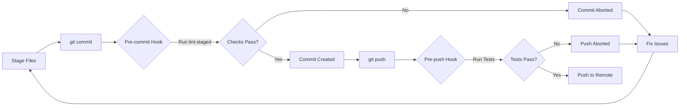

# Husky Pre-commit Hooks

We use **Husky** to run linting and formatting checks locally before code is committed, serving as a "first line" quality gate. This ensures that by the time code reaches CI, it has already passed basic standards.

## Status and Rationale

**Status:** *Fully implemented and active.* Husky automatically installs when you run `npm install` and provides pre-commit and pre-push hooks to maintain code quality.

**Why Husky:** Running checks locally speeds up feedback. It prevents "easy" issues (like code style or obvious test failures) from ever reaching the repo, which reduces CI failures and iteration time. This aligns with our goal that *"files are linted properly and tests pass"* before pushing.

## Installation

Husky is managed as a dev dependency and configured to install automatically:

1. After running `npm install`, Husky hooks are automatically installed via the `prepare` script in `package.json`:

   ```bash
   npm install
   ```

   The `prepare` script runs automatically after installation and sets up the Git hooks in `.husky/`.

2. Verify that `.husky/pre-commit` and `.husky/pre-push` files exist.

If Husky isn't working, ensure:

- Git isn't bypassing hooks (no `--no-verify` flag used)
- You have the correct Node version (see `.nvmrc`)
- The `.husky/` directory and hook files have execute permissions

## Pre-commit Hook with lint-staged

Our pre-commit hook is defined in **`.husky/pre-commit`**. It runs **lint-staged**, which applies linting and formatting checks **only to staged files**. This keeps the process fast and focused.

### What lint-staged Does

Instead of running checks on the entire codebase, `lint-staged` runs specific checks only on files you've staged for commit. This is much faster and more efficient.

Configuration is defined in `package.json` under the `lint-staged` key:

```json
{
  "lint-staged": {
    "*.{js,jsx,ts,tsx}": ["eslint --fix", "prettier --write"],
    "*.{md,mdx}": ["markdownlint-cli2 --fix", "prettier --write"],
    "*.json": ["prettier --write"],
    "*.{yml,yaml}": ["prettier --write"]
  }
}
```

### File-specific Checks

- **JavaScript/TypeScript files** (`*.{js,jsx,ts,tsx}`):
  - ESLint with auto-fix
  - Prettier formatting

- **Markdown files** (`*.{md,mdx}`):
  - Markdownlint with auto-fix
  - Prettier formatting

- **JSON files** (`*.json`):
  - Prettier formatting

- **YAML files** (`*.{yml,yaml}`):
  - Prettier formatting

If any checks fail, the commit is aborted. You must fix the issues and try again. This prevents committing code that would fail CI.

### Pre-commit Hook Content

```bash
#!/bin/sh
. "$(dirname "$0")/_/husky.sh"

npx lint-staged
```

This runs lint-staged, which processes only your staged files according to the configuration shown above.

## Pre-push Hook

Our pre-push hook is defined in **`.husky/pre-push`** and runs the full test suite before allowing a push to the remote repository:

```bash
#!/bin/sh
. "$(dirname "$0")/_/husky.sh"

# Run tests before push
npm test
```

This ensures that all tests pass before code is shared with the team. The hook runs:

- JavaScript/TypeScript unit tests (Jest)
- Any other configured test suites

If tests fail, the push is aborted and you must fix the issues before trying again.

## Workflow Overview



## Bypassing Hooks (Not Recommended)

In rare cases where you need to bypass hooks (e.g., work-in-progress commits), you can use:

```bash
git commit --no-verify -m "WIP: description"
git push --no-verify
```

**Important:** Bypassing hooks should be avoided in most cases, as it may introduce code quality issues or failing tests into the repository. CI will still catch these issues, but it's better to fix them locally first.

### When Bypassing Might Be Acceptable

- Emergency hotfixes that need immediate deployment
- Documentation-only changes that don't affect code
- Work-in-progress commits on feature branches (use sparingly)

Even in these cases, ensure CI passes before merging to main branches.

## CI Integration

The pre-commit and pre-push hooks run subsets of what CI does:

- **Pre-commit**: Runs linting and formatting on staged files
- **Pre-push**: Runs the full test suite
- **CI**: Runs everything (linting, tests, builds, integration tests)

This multi-layered approach provides:

1. **Fast local feedback** via Husky hooks
2. **Comprehensive validation** via CI
3. **Safety net** for contributors who bypass hooks

By catching issues early (locally), we reduce CI failures and save time. CI then focuses on integration testing and builds.

## Troubleshooting

### Hooks Not Running

If hooks aren't being triggered:

1. Verify Husky is installed:

   ```bash
   npm list husky
   ```

2. Check that `.husky/` directory exists:

   ```bash
   ls -la .husky/
   ```

3. Verify hooks are executable:

   ```bash
   ls -la .husky/pre-commit .husky/pre-push
   ```

4. Re-initialize Husky:

   ```bash
   npm run prepare
   ```

### Lint-staged Errors

If lint-staged fails:

1. Check which files are causing issues:

   ```bash
   npx lint-staged --debug
   ```

2. Run the specific linter manually:

   ```bash
   # For JS files
   npx eslint path/to/file.js --fix

   # For Markdown
   npx markdownlint-cli2 --fix path/to/file.md
   ```

3. Stage the fixes and commit again:

   ```bash
   git add .
   git commit -m "Your message"
   ```

### Test Failures on Push

If the pre-push hook fails:

1. Run tests locally to see detailed output:

   ```bash
   npm test
   ```

2. Fix failing tests

3. Commit fixes and push again

## Setup Reference (for Maintainers)

For maintainers, these are the commands that were used to set up Husky:

```bash
# Install Husky and lint-staged
npm install --save-dev husky lint-staged

# Initialize Husky (creates .husky/ directory)
npm run prepare

# Create pre-commit hook
cat > .husky/pre-commit << 'EOF'
#!/bin/sh
. "$(dirname "$0")/_/husky.sh"

npx lint-staged
EOF

# Create pre-push hook
cat > .husky/pre-push << 'EOF'
#!/bin/sh
. "$(dirname "$0")/_/husky.sh"

# Run tests before push
npm test
EOF

# Make hooks executable
chmod +x .husky/pre-commit .husky/pre-push
```

The `package.json` includes:

- `prepare` script that runs `husky install`
- `lint-staged` configuration for file-specific checks

## Benefits of This Approach

1. **Speed**: lint-staged only checks files you've changed
2. **Focused**: Different checks for different file types
3. **Auto-fix**: Many issues are fixed automatically
4. **Early detection**: Catch issues before CI
5. **Consistency**: Everyone uses the same checks
6. **Easy setup**: Automatic installation with `npm install`

## Related Files & Further Reading

- [DEVELOPMENT.md](../DEVELOPMENT.md) — Development setup and workflow
- [docs/LINTING.md](./LINTING.md) — Linting tools and configuration
- [package.json](../package.json) — NPM scripts and lint-staged configuration
- [.husky/](../.husky/) — Actual hook scripts
- [.husky/pre-commit](../.husky/pre-commit) — Pre-commit hook
- [.husky/pre-push](../.husky/pre-push) — Pre-push hook

---

---

file_type: "documentation"
title: "Husky Testing Guide"
description: "Test and verify Husky pre-commit and pre-push hooks"
last_updated: "2025-11-25"
version: "1.0"
maintainer: "LightSpeed DevOps"
tags: ["husky", "testing"]

---

## Husky Pre-Commit Testing

## Quick Test Commands

### 1. Verify Husky Installation

```bash
# Check Husky is installed
npm list husky

# Expected output:
# └── husky@9.x.x

# Verify hook files exist
ls -la .husky/

# Should show:
# -rw-r--r--  pre-commit
# -rw-r--r--  pre-push
```

### 2. Test Pre-commit Hook Manually

```bash
# Run the pre-commit hook manually
.husky/pre-commit

# Or using sh explicitly
sh .husky/pre-commit

# This will run lint-staged on all staged files
```

### 3. Test Lint-staged Directly

```bash
# See what lint-staged will do (dry run)
npx lint-staged --debug

# This shows:
# - Which files will be linted
# - What linters will run
# - Any issues found

# Force lint-staged to run
npx lint-staged --allow-empty
```

### 4. Full Linting Check

```bash
# Run all linters across the entire codebase
npm run lint:all

# Or run specific linters:
npm run lint:js      # ESLint + Prettier for JS/TS
npm run lint:css     # Stylelint + Prettier for CSS
npm run lint:md      # Markdownlint + Prettier for Markdown
npm run lint:yaml    # Prettier for YAML
npm run lint:json    # Prettier for JSON
npm run lint:pkg-json # npmpackagejsonlint
```

### 5. Test Pre-push Hook

```bash
# Run the pre-push hook manually
.husky/pre-push

# This will run: npm test
# All tests must pass
```

---

## Full Integration Test Workflow

### Scenario 1: Test Pre-commit Hook (Recommended)

**Step 1: Create a test file with intentional lint errors**

```bash
# Create a test JavaScript file with issues
cat > test-file.js << 'EOF'
// Missing semicolon, extra spaces, etc.
const x=1
const y = 2  ;
function test( ){
  return x+y
}
EOF

# Create a test Markdown file with issues
cat > test-file.md << 'EOF'
# Missing Space After Hash
This line is way too long and should be wrapped because it exceeds the maximum line length allowed by the linter configuration.
EOF
```

**Step 2: Stage the files**

```bash
git add test-file.js test-file.md
```

**Step 3: Attempt to commit (will trigger pre-commit hook)**

```bash
git commit -m "test: testing husky hooks"
```

**Expected behavior:**

- ✅ Husky runs the pre-commit hook
- ✅ lint-staged identifies the files
- ✅ ESLint and markdownlint run
- ✅ Prettier applies auto-fixes
- ✅ Commit either succeeds (if auto-fixed) or fails (if manual fixes needed)

**Step 4: Check the auto-fixes**

```bash
git diff test-file.js
git diff test-file.md

# View the auto-fixed files
cat test-file.js
cat test-file.md
```

**Step 5: Clean up**

```bash
# Reset the test
git reset HEAD test-file.js test-file.md
rm test-file.js test-file.md
```

### Scenario 2: Test with Intentional Failures

**Create a file that cannot be auto-fixed:**

```bash
# Create a file with syntax error (can't auto-fix)
cat > bad-syntax.js << 'EOF'
function broken(
  // Missing closing parenthesis
EOF

git add bad-syntax.js
git commit -m "test: breaking syntax"
```

**Expected behavior:**

- ✅ Husky runs the pre-commit hook
- ❌ ESLint fails with syntax error
- ❌ Commit is blocked
- ✅ You see the error message

**Fix and retry:**

```bash
# Fix the file
cat > bad-syntax.js << 'EOF'
function working() {
  return true;
}
EOF

git add bad-syntax.js
git commit -m "test: fixed syntax"

# Clean up
git reset HEAD bad-syntax.js
rm bad-syntax.js
```

### Scenario 3: Test Pre-push Hook

```bash
# Break a test intentionally
cat > test-break.test.js << 'EOF'
test('intentional failure', () => {
  expect(true).toBe(false);
});
EOF

git add test-break.test.js
git commit -m "test: intentional test failure"

# Attempt to push (will trigger pre-push hook)
git push origin develop

# Expected: Pre-push hook runs npm test
# Expected: Test fails, push is blocked
# Result: You see test output

# Clean up
git reset HEAD~1 test-break.test.js
rm test-break.test.js
```

---

## Debugging Husky Issues

### If hooks aren't running

**Check 1: Verify Git hooks are executable**

```bash
# Make hooks executable
chmod +x .husky/pre-commit .husky/pre-push

# Verify permissions
ls -la .husky/pre-commit .husky/pre-push

# Should show: -rwxr-xr-x (755 permissions)
```

**Check 2: Verify Husky is initialized**

```bash
# Re-initialize Husky
npm run prepare

# This runs: husky install
```

**Check 3: Check if Git hooks are disabled**

```bash
# Some tools/environments disable Git hooks
# Verify Git hooks are enabled:
git config core.hooksPath

# Should output: .husky (or be empty for default)

# Re-enable if needed:
git config core.hooksPath .husky
```

**Check 4: Run with verbose output**

```bash
# Force Husky to show debug output
HUS_DEBUG=* git commit -m "test"

# Or enable debug in your shell
sh -x .husky/pre-commit
```

### If lint-staged isn't working

```bash
# Test lint-staged in isolation
npx lint-staged --debug

# Shows:
# - Which files were matched
# - Which linters ran
# - Output from each linter

# If still having issues:
npx lint-staged --debug --verbose
```

### If linters themselves are failing

```bash
# Test each linter individually
npx eslint .
npx stylelint "**/*.{css,scss}"
npx markdownlint-cli2 "**/*.md"
npx prettier --check .

# Run with fix flag to auto-fix
npx eslint . --fix
npx stylelint "**/*.{css,scss}" --fix
npx markdownlint-cli2 --fix "**/*.md"
npx prettier --write .
```

---

## Bypass Husky (Emergency Only)

### Skip pre-commit hook

```bash
git commit --no-verify

# Or use git alias:
git commit -n "your message"
```

### Skip pre-push hook

```bash
git push --no-verify

# Or use git alias:
git push -n
```

**⚠️ Warning**: Only use `--no-verify` for emergency situations. It bypasses all quality gates!

---

## Monitoring & Verification

### View hook execution logs

```bash
# Most recent git operations
git reflog

# Check commit history
git log --oneline -10

# See what lint-staged did
npx lint-staged --debug
```

### Performance testing

```bash
# Time how long lint-staged takes
time npx lint-staged --allow-empty

# Time the full test suite
time npm test

# Time all linters
time npm run lint:all
```

---

## Common Test Scenarios

| Scenario             | Command                            | Expected Result                 |
| -------------------- | ---------------------------------- | ------------------------------- |
| **Quick check**      | `npm run lint:all`                 | All linters pass                |
| **Pre-commit test**  | `npx lint-staged --debug`          | Shows files that will be linted |
| **Pre-push test**    | `npm test`                         | All tests pass                  |
| **Manual hook test** | `.husky/pre-commit`                | Runs without errors             |
| **Debug hook**       | `HUS_DEBUG=* git commit -m "test"` | Shows Husky debug output        |
| **Verify install**   | `npm list husky`                   | Shows <husky@9.x.x>             |
| **Check hooks**      | `ls -la .husky/`                   | Shows pre-commit and pre-push   |

---

## Full Test Checklist

- [ ] Husky is installed: `npm list husky`
- [ ] Hook files exist: `ls -la .husky/`
- [ ] Hooks are executable: `ls -la .husky/pre-commit`
- [ ] lint-staged works: `npx lint-staged --debug`
- [ ] ESLint works: `npm run lint:js`
- [ ] Prettier works: `npx prettier --check .`
- [ ] Tests pass: `npm test`
- [ ] Pre-commit hook works: `.husky/pre-commit`
- [ ] Pre-push hook works: `.husky/pre-push`
- [ ] Git commit triggers hook: `git commit --allow-empty -m "test"`

---

## Next Steps

After testing:

1. ✅ Verify all hooks work correctly
2. ✅ Run `npm run lint:all` to fix any remaining issues
3. ✅ Make a real commit to test full workflow
4. ✅ Attempt a push to test pre-push hook
5. ✅ Review [HUSKY_PRECOMMITS.md](https://github.com/lightspeedwp/.github/blob/HEAD/docs/HUSKY_PRECOMMITS.md) for detailed documentation

---

---

---

*Built by 🧱 LightSpeedWP with ☕, 🚀, and open-source spirit!*
