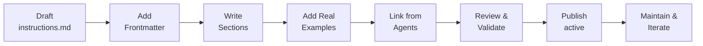
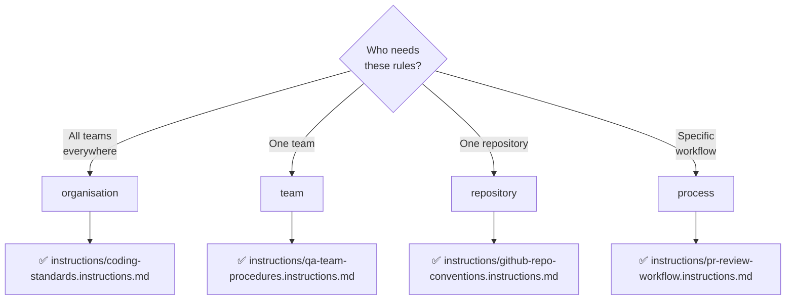

# Instructions Standards

Guidelines for creating high-quality, reusable instruction files that guide agent behaviour and system interactions.

## Overview

Instructions are structured documents that define rules, guidelines, and procedures for AI agents and tools. Well-written instructions improve consistency, reduce errors, and make systems easier to maintain and extend.

## Quick Links

- [Instruction File Purpose](#instruction-file-purpose)
- [File Format & Structure](#file-format--structure)
- [Mandatory Sections](#mandatory-sections)
- [Frontmatter Reference](#frontmatter-reference)
- [Best Practices](#best-practices)
- [Examples](#examples)

---

## Instruction File Purpose

### What Are Instructions?

Instructions are configuration documents that:

- Define behaviour and constraints for agents
- Encode business rules and policies
- Guide decision-making in complex scenarios
- Establish communication standards
- Document governance and approval workflows

### Scope

Instructions can address:

- **Agents** — How specific agents should behave
- **Teams** — Standards for a team's work
- **Repositories** — Repository-specific rules and conventions
- **Processes** — Step-by-step procedures
- **Governance** — Approval workflows and escalation paths

### Instruction Lifecycle



---

## File Format & Structure

### Filename Convention

```
instructions/{scope}.instructions.md
```

Where `{scope}` describes the instruction's domain (kebab-case).

**Examples:**

- `instructions/coding-standards.instructions.md`
- `instructions/pr-review-guidelines.instructions.md`
- `instructions/accessibility-wcag22.instructions.md`

### Scope Selection



### File Format

Instructions use Markdown with YAML frontmatter.

```yaml
---
name: instruction-name
description: One-line description of instruction scope
file_type: instructions
language: markdown
scope: organisation  # or team, repository, process
version: 1.0.0
last_updated: 2026-07-24
audience: developers  # or agents, teams, reviewers
status: active  # or deprecated, archived
---

# Instruction Title

## Role Declaration
[Who follows these instructions]

## Overview
[Summary of scope and purpose]

## General Rules
[Broad principles and constraints]

## Detailed Guidance
[Specific procedures and examples]

## Examples
[Real-world scenarios and solutions]

## Validation
[How to verify compliance]

## References
[Related documents and external sources]
```

---

## Mandatory Sections

Every instruction file must include these sections:

### 1. Role Declaration (H2)

Explicitly state who the instructions are for:

```markdown
## Role Declaration

These instructions are for:
- Developers contributing to this repository
- Agents reviewing pull requests
- Automated systems validating code submissions
```

### 2. Overview (H2)

Summarise the scope and purpose:

```markdown
## Overview

This document establishes coding standards for JavaScript/TypeScript
across all LightSpeedWP repositories. It covers:
- Code style and formatting
- Naming conventions
- Error handling patterns
- Documentation requirements
```

### 3. General Rules (H2)

State broad principles and constraints:

```markdown
## General Rules

1. All code must pass linting and type checking
2. No hardcoded secrets or credentials
3. Comments explain WHY, not WHAT
4. UK English throughout (organisation, optimise, colour)
```

### 4. Detailed Guidance (H2+)

Provide specific, actionable procedures with subsections:

```markdown
## Detailed Guidance

### Code Style
- Use Prettier for formatting
- Line length: 100 characters
- Semicolons: required

### Naming Conventions
- Functions: camelCase (e.g., analyzeCode)
- Classes: PascalCase (e.g., CodeAnalyser)
- Constants: UPPER_SNAKE_CASE (e.g., MAX_RETRIES)

### Error Handling
- Catch specific error types
- Provide context in error messages
- Log errors appropriately
```

### 5. Examples (H2)

Include real-world scenarios demonstrating compliance:

```markdown
## Examples

### Good: Clear error message with context
```

### 6. Validation (H2)

Explain how to verify compliance:

```markdown
## Validation

Compliance is checked by:
- Linting: `npm run lint:js`
- Type checking: `npm run typecheck`
- Code review checklist
```

### 7. References (H2)

Link to related documents (use inline links, not frontmatter `references` field):

```markdown
## References

- [Coding Standards](./coding-standards.instructions.md)
- [PR Review Guidelines](./pr-review-guidelines.instructions.md)
- [CLAUDE.md](../CLAUDE.md) — Project instructions
```

---

## Frontmatter Reference

| Field | Type | Required | Description |
|-------|------|----------|-------------|
| `name` | string | ✅ | Unique identifier (kebab-case) |
| `description` | string | ✅ | One-line summary |
| `type` | string | ✅ | Always `instructions` |
| `language` | string | ✅ | Always `markdown` |
| `scope` | string | ✅ | `organisation`, `team`, `repository`, `process` |
| `version` | string | ✅ | Semantic version (e.g., 1.0.0) |
| `last_updated` | string | ✅ | ISO date (e.g., 2026-07-24) |
| `audience` | string | ⏳ | Target audience (e.g., developers, agents) |
| `status` | string | ⏳ | `active`, `deprecated`, `archived` |

**IMPORTANT:** Do NOT include a `references` frontmatter field. Use inline links in the References section instead.

---

## Best Practices

### Clarity and Conciseness

- Use clear, direct language
- Avoid jargon; explain domain-specific terms
- Keep sentences short and focused
- Use active voice

### Actionability

- Provide specific, step-by-step guidance
- Include examples for each rule
- Explain the WHY behind rules
- Document edge cases

### Consistency

- Use consistent formatting and terminology
- Follow the same section structure
- Keep formatting concise but scannable
- Use tables, lists, and code blocks effectively

### Maintainability

- Update last_updated date when modified
- Track breaking changes in version number
- Include deprecation notices for obsolete rules
- Link to related instructions for context

### Scope Clarity

- Make audience explicit in Role Declaration
- Keep instructions focused on their scope
- Avoid mixing multiple domains in one file
- Cross-reference related instructions

---

## Deprecation & Migration

### Marking as Deprecated

When an instruction is no longer current:

```markdown
## Status: Deprecated

This instruction is deprecated as of 2026-08-01. Use [New Instruction](./new-instruction.instructions.md) instead.
```

Update frontmatter:

```yaml
status: deprecated
```

### Migration Process

1. **Announcement phase** — Add deprecation notice
2. **Maintenance phase** — Fix critical issues only
3. **Archive phase** — Move to `instructions/archive/` folder
4. **Removal phase** — Remove from repository after 6 months

---

## Integration with Agents

Instructions can be referenced by agents to guide their behaviour:

```yaml
# In agent.md
instructions:
  - coding-standards
  - pr-review-guidelines
  - accessibility-wcag22
```

Agents use instructions to understand:

- Policies and constraints
- Expected output format
- Decision-making frameworks
- Error handling procedures

---

## Examples

### Real-World Repository Examples

**Existing instruction files in this repository:**

- [coding-standards.instructions.md](../instructions/coding-standards.instructions.md) — Organisation-wide coding standards (kebab-case, scope: organisation)
- [a11y.instructions.md](../instructions/a11y.instructions.md) — WCAG 2.2 AA accessibility guidelines
- [documentation-formats.instructions.md](../instructions/documentation-formats.instructions.md) — Markdown and YAML standards
- [issues.instructions.md](../instructions/issues.instructions.md) — Issue creation and triage workflow
- [pull-requests.instructions.md](../instructions/pull-requests.instructions.md) — PR creation and review standards

### Example 1: Code Review Guidelines

```yaml
---
name: pr-review-guidelines
description: Standards for reviewing pull requests
type: instructions
language: markdown
scope: organisation
version: 1.2.0
last_updated: 2026-07-24
audience: developers, agents
status: active
---

# Pull Request Review Guidelines

## Role Declaration
These guidelines apply to:
- Human reviewers of GitHub pull requests
- Automated code review agents
- CI/CD validation systems

## Overview
This document establishes standards for reviewing pull requests,
ensuring code quality, consistency, and security.

## General Rules
1. All PRs require at least one approval
2. CI checks must pass before merge
3. No hardcoded secrets or credentials
4. Code must follow established standards
```

### Example 2: Accessibility Standards

```yaml
---
name: accessibility-wcag22
description: WCAG 2.2 AA accessibility standards for all projects
type: instructions
language: markdown
scope: organisation
version: 2.0.0
last_updated: 2026-07-24
audience: developers, designers
status: active
---

# Accessibility Standards (WCAG 2.2 AA)

## Role Declaration
All developers and designers contributing to LightSpeedWP projects
must follow these accessibility standards.

## Overview
LightSpeedWP commits to WCAG 2.2 Level AA accessibility
for all user-facing content.

## General Rules
1. Semantic HTML: Use correct elements for their meaning
2. Color contrast: 4.5:1 minimum for normal text
3. Keyboard navigation: Full functionality without mouse
4. Alt text: All images must have descriptive alt text
```

---

## See Also

- [Agent Standards](./AGENT_STANDARDS.md) — How agents reference and use instructions
- [Skills Standards](./SKILLS_STANDARDS.md) — Skills as reusable capabilities
- [Hooks Standards](./HOOKS_STANDARDS.md) — Event-driven handlers that follow instruction patterns
- [Documentation Formats](./documentation-formats.instructions.md) — Markdown and YAML standards for instruction files

---

## Related Documentation

- [CLAUDE.md](../CLAUDE.md) — Project-specific instructions
- [Coding Standards](./coding-standards.instructions.md)
- [AGENTS.md](../AGENTS.md) — Organisation-wide AI governance rules

---

**Last Updated:** 2026-07-24  
**Version:** 1.0.0
