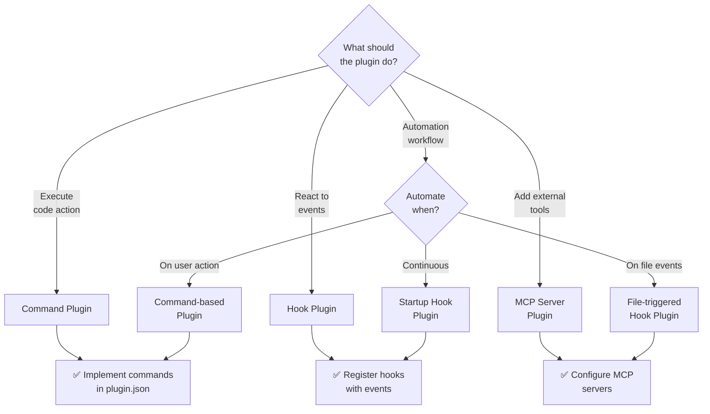

# Plugins Standards

Guidelines for creating installable plugins that extend Claude Code and agent capabilities.

## Overview

Plugins are standalone extensions for Claude Code (VS Code, JetBrains, CLI) that add new commands, hooks, and integrations. This document covers standards for plugin creation, configuration, and distribution.

### Plugin Development Lifecycle

```mermaid
graph LR
    accTitle: Plugin development lifecycle
    accDescr: Step-by-step workflow showing the progression from planning a plugin through implementation, testing, and publishing to the registry.
    A["Plan Plugin<br/>Capabilities"] --> B["Create Directory<br/>Structure"]
    B --> C["Write plugin.json<br/>Manifest"]
    C --> D["Implement Commands<br/>& Hooks"]
    D --> E["Add MCP<br/>Servers"]
    E --> F["Write Tests &<br/>Examples"]
    F --> G["Create<br/>README"]
    G --> H["Validate<br/>plugin.json"]
    H --> I["Publish to<br/>Registry"]
```



## Quick Links

- [Plugin Concept](#plugin-concept)
- [File Structure](#file-structure)
- [plugin.json Manifest](#pluginjson-manifest)
- [Commands & Hooks](#commands--hooks)
- [Best Practices](#best-practices)
- [Examples](#examples)

---

## Plugin Concept

### What Is a Plugin?

A plugin is a self-contained extension that:

- Adds new commands to Claude Code
- Registers event hooks for automation
- Exposes custom settings and configuration
- Integrates with MCP (Model Context Protocol) servers
- Bundles related functionality in one package

### Plugin Scopes

Plugins can target:

| Scope | Applies To |
|-------|-----------|
| **Workspace** | Current project only |
| **User** | Current user account |
| **Global** | All installations |

### Plugin Type Decision Tree



---

## File Structure

```
plugins/{plugin-name}/
├── plugin.json                 # Manifest (required)
├── README.md                   # Documentation (required)
├── package.json                # Dependencies (if needed)
├── dist/
│   ├── index.js                # Main plugin entry
│   ├── commands.js             # Command implementations
│   └── hooks.js                # Hook handlers
├── src/
│   ├── index.ts
│   ├── commands.ts
│   └── hooks.ts
├── tests/
│   └── plugin.test.js
├── examples/
│   └── example-usage.md
└── assets/
    └── icon.png                # Plugin icon (optional)
```

---

## plugin.json Manifest

Every plugin requires a `plugin.json` file.

### Full Example

```json
{
  "name": "plugin-identifier",
  "displayName": "Plugin Display Name",
  "version": "1.0.0",
  "description": "One-line description",
  "author": "Author Name",
  "license": "MIT",
  "repository": {
    "type": "git",
    "url": "https://github.com/..."
  },
  "commands": [
    {
      "id": "plugin.commandName",
      "title": "Human-readable command title",
      "description": "What this command does",
      "keybinding": "cmd+shift+p",
      "category": "Plugin Name"
    }
  ],
  "hooks": [
    {
      "event": "startup",
      "script": "dist/hooks.js",
      "function": "onStartup"
    }
  ],
  "settings": [
    {
      "name": "settingName",
      "type": "string",
      "default": "value",
      "description": "Description of this setting"
    }
  ],
  "mcp": {
    "servers": [
      {
        "name": "server-name",
        "type": "stdio",
        "command": "node",
        "args": ["dist/mcp-server.js"]
      }
    ]
  },
  "activationEvents": [
    "startup",
    "onCommand:plugin.commandName"
  ]
}
```

### Manifest Fields Reference

| Field | Type | Required | Description |
|-------|------|----------|-------------|
| `name` | string | ✅ | Unique identifier (kebab-case) |
| `displayName` | string | ✅ | Human-readable name |
| `version` | string | ✅ | Semantic version |
| `description` | string | ✅ | One-line summary |
| `author` | string | ✅ | Plugin author |
| `license` | string | ✅ | License type (MIT, Apache 2.0, etc.) |
| `repository` | object | ⏳ | Git repository information |
| `commands` | array | ⏳ | Command definitions |
| `hooks` | array | ⏳ | Hook handlers |
| `settings` | array | ⏳ | User-configurable settings |
| `mcp` | object | ⏳ | MCP server configuration |
| `activationEvents` | array | ⏳ | When plugin should activate |

---

## Commands & Hooks

### Commands

Commands are user-triggered actions. Define in `plugin.json`:

```json
{
  "commands": [
    {
      "id": "plugin.analyzeCode",
      "title": "Analyze Code with AI",
      "description": "Run AI analysis on selected code",
      "keybinding": "cmd+shift+a",
      "category": "AI Tools"
    }
  ]
}
```

Implement in `dist/commands.js`:

```javascript
export async function analyzeCode(selectedText) {
  return await invokeAgent('code-analyzer', { code: selectedText })
}
```

### Hooks

Hooks are event-driven handlers. Define in `plugin.json`:

```json
{
  "hooks": [
    {
      "event": "startup",
      "script": "dist/hooks.js",
      "function": "onStartup"
    },
    {
      "event": "file-saved",
      "script": "dist/hooks.js",
      "function": "onFileSaved"
    }
  ]
}
```

Implement in `dist/hooks.js`:

```javascript
export async function onStartup() {
  console.log('Plugin activated')
  // Initialization code
}

export async function onFileSaved(filePath) {
  // React to file changes
}
```

### Supported Events

- `startup` — Plugin activates
- `shutdown` — Plugin deactivates
- `file-saved` — File is saved
- `file-opened` — File is opened
- `before-command` — Before command execution
- `after-command` — After command execution

---

## Settings & Configuration

Plugins can expose user-configurable settings:

```json
{
  "settings": [
    {
      "name": "apiKey",
      "type": "string",
      "default": "",
      "description": "API key for external service",
      "required": true
    },
    {
      "name": "enableAutoAnalysis",
      "type": "boolean",
      "default": true,
      "description": "Run analysis on file save"
    },
    {
      "name": "analysisLevel",
      "type": "enum",
      "enum": ["basic", "standard", "comprehensive"],
      "default": "standard",
      "description": "Depth of analysis"
    }
  ]
}
```

Access settings in code:

```javascript
const apiKey = await getPluginSetting('apiKey')
const autoAnalysis = await getPluginSetting('enableAutoAnalysis')
```

---

## MCP Integration

Plugins can register MCP servers for external tool integration:

```json
{
  "mcp": {
    "servers": [
      {
        "name": "github-mcp",
        "type": "stdio",
        "command": "node",
        "args": ["dist/mcp/github-server.js"]
      },
      {
        "name": "web-search",
        "type": "http",
        "url": "http://localhost:3000"
      }
    ]
  }
}
```

---

## Best Practices

### Naming

- Plugin name (kebab-case): `code-analyzer`, `git-integration`
- Command IDs: `plugin.commandName` (domain-qualified)
- Event handlers: `on<EventName>` (camelCase)
- Settings: `camelCase`, descriptive names

### Documentation

- Include comprehensive README.md
- Document all commands and their parameters
- Explain configuration options
- Provide usage examples
- List keyboard shortcuts
- Note dependencies

### Error Handling

- Handle errors gracefully
- Provide user-friendly error messages
- Log errors appropriately
- Fail safely without crashing host

### Performance

- Minimize startup time
- Use lazy loading for heavy features
- Cache expensive computations
- Respect rate limits for external APIs
- Monitor memory usage

### Security

- Never commit secrets or API keys
- Use plugin settings for sensitive data
- Validate all inputs
- Sanitize output before displaying
- Request only necessary permissions

---

## Testing Plugins

### Unit Testing

```javascript
import { analyzeCode } from './commands.js'

describe('analyzeCode', () => {
  it('should analyse code and return results', async () => {
    const code = 'const x = 1'
    const result = await analyzeCode(code)
    expect(result).toHaveProperty('analysis')
  })
})
```

### Integration Testing

Test with actual Claude Code:

```bash
npm run test:integration
```

### Manual Testing

1. Load plugin in development mode
2. Test all commands
3. Verify hooks fire correctly
4. Check settings are applied
5. Test error scenarios

---

## Publishing

### Pre-Publication Checklist

- [ ] Version number incremented
- [ ] CHANGELOG updated
- [ ] README is complete and accurate
- [ ] All tests passing
- [ ] No hardcoded secrets
- [ ] Icon/assets optimized
- [ ] License file included
- [ ] Code linting passes

### Distribution

Plugins can be distributed via:

1. **Plugin Registry** — Official registry
2. **GitHub Releases** — Direct distribution
3. **npm** — Package-based distribution
4. **Git Clone** — Development mode

---

## Examples

### Example 1: Simple Code Analyser Plugin

```json
{
  "name": "code-analyser",
  "displayName": "Code Analyser",
  "version": "1.0.0",
  "description": "Analyse code for quality issues",
  "author": "Your Name",
  "license": "MIT",
  "commands": [
    {
      "id": "plugin.analyseSelection",
      "title": "Analyse Selected Code",
      "keybinding": "cmd+shift+a",
      "category": "Analysis"
    }
  ],
  "settings": [
    {
      "name": "analysisLevel",
      "type": "enum",
      "enum": ["basic", "comprehensive"],
      "default": "basic"
    }
  ]
}
```

---

## Real-World Repository Examples

### Production Plugins

The LightSpeedWP organisation maintains several working plugin implementations:

**Plugin:** `lightspeed-quality-assurance`

A multi-provider plugin for quality assurance automation, supporting Claude, Gemini, and Codex environments.

**Location:** `plugins/lightspeed-quality-assurance/`

Features

- Multi-provider configurations (`.claude-plugin/`, `.gemini-plugin/`, `.codex-plugin/`)
- Command-based automation
- Quality gate enforcement

**Plugin:** `lightspeed-wordpress-governance`

WordPress-specific governance plugin with compliance checking and policy enforcement.

**Location:** `plugins/lightspeed-wordpress-governance/`

See all plugins: [`plugins/`](../../plugins/)

---

## See Also

- [Agent Standards](./AGENT_STANDARDS.md) — Agents in plugins
- [Hooks Standards](./HOOKS_STANDARDS.md) — Plugin hooks
- [Skills Standards](./SKILLS_STANDARDS.md) — Reusable skills for plugins
- [Workflows Standards](./WORKFLOWS_STANDARDS.md) — Plugin-triggered workflows

---

## Related Documentation

- [Code Claude Documentation](https://code.claude.com/docs/en/plugins)
- [GitHub Copilot Plugins](https://docs.github.com/en/copilot/how-tos/copilot-cli/customize-copilot/plugins-creating)

---

*Built by 🧱 LightSpeedWP with ☕, 🚀, and open-source spirit!*
