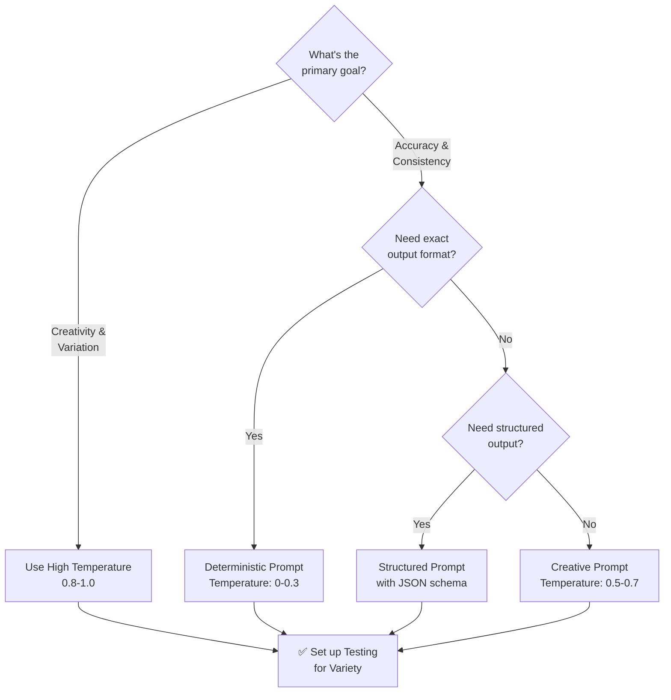

# Prompts Standards

Guidelines for creating reusable, well-tested prompt templates that agents and tools can leverage.

## Overview

Prompts are structured templates that guide AI models towards consistent, high-quality outputs. Reusable prompts reduce duplication, improve consistency, and enable easier testing and refinement.

### Prompt Development Lifecycle

```mermaid
graph LR
%%{init: { 'accessibility': { 'diagWithoutTitle':true } }}%%
    accTitle: Prompt development lifecycle
    accDescr: Step-by-step progression from defining a use case through drafting, testing, tuning, validation, and publishing reusable prompts.
    A["Define<br/>Use Case"] --> B["Draft<br/>Prompt"]
    B --> C["Test with<br/>Model"]
    C --> D["Tune<br/>Parameters"]
    D --> E["Create Test<br/>Cases"]
    E --> F["Document<br/>Variables"]
    F --> G["Validate<br/>Output"]
    G --> H["Publish to<br/>prompts/"]
    H --> I["Monitor<br/>Performance"]
    I --> J["Update &<br/>Maintain"]
```



---

## Prompt Concept

### What Is a Reusable Prompt?

A reusable prompt is a template that:

- Solves a specific, well-defined task
- Uses placeholder variables for dynamic content
- Has clear input/output specifications
- Is tested and documented
- Can be versioned independently
- Is shared across multiple agents or tools

### Prompts vs. One-Off Instructions

| Aspect | Reusable Prompt | One-Off Instruction |
|--------|-----------------|-------------------|
| **Scope** | Specific task | Single use |
| **Variables** | Placeholders (`{{variable}}`) | Hard-coded values |
| **Testing** | Comprehensive test suite | Manual validation |
| **Versioning** | Semantic versioning | Not versioned |
| **Sharing** | Multiple agents | Single context |

### Prompt Type Selection



---

## File Format

Reusable prompts are stored in the `prompts/` folder as Markdown files with YAML frontmatter.

### Filename Convention

```
prompts/{prompt-name}.md
```

**Examples:**

```
prompts/code-review-checklist.md
prompts/security-audit-template.md
prompts/documentation-generator.md
```

### File Structure

```yaml
---
name: prompt-name
description: One-line description of what this prompt does
version: 1.0.0
use_case: code-review  # Brief categorisation
model: claude-opus-4-8  # Recommended model
temperature: 0.3  # Temperature for determinism
context_tokens: 8000  # Estimated tokens needed
success_criteria:  # How to evaluate outputs
  - criterion_1
  - criterion_2
testing: true  # Whether this prompt has tests
last_updated: 2026-07-24
---

# Prompt Name

## Purpose
What this prompt is designed to accomplish and why it exists.

## Input Format
### Expected Structure
- Input 1: description
- Input 2: description

### Example
```

Input data example

```

## Output Format
### Expected Structure
- Output field 1: description
- Output field 2: description

### Example
```

Output example

```

## Prompt Template
```

[Prompt text with placeholders]

```

## Variables
- `{{variable_1}}` — Description of what goes here
- `{{variable_2}}` — Another variable explanation

## Usage Example
### Input
```

Specific input

```

### Output
```

Expected output

```

## Testing
How to validate this prompt works correctly.

## Tuning Parameters
Optional model parameters:
- **Temperature**: {{temperature}} (for consistency/creativity balance)
- **Max tokens**: {{max_tokens}} (output length limit)
- **Top P**: {{top_p}} (diversity control)

## Performance Notes
Expected performance, token usage, cost implications.

## Related Prompts
Links to similar or dependent prompts.
```

---

## Template Structure

### Prompt Template Section

The actual prompt text goes in a fenced code block:

```markdown
## Prompt Template

You are a code reviewer specializing in {{expertise_area}}.

Review the following code for:
1. {{review_criterion_1}}
2. {{review_criterion_2}}

Code:
{{code}}

Provide feedback in {{format}}.
```

### Variables Section

Document every placeholder:

```markdown
## Variables

- `{{expertise_area}}` — Domain expertise (e.g., "security", "performance", "accessibility")
- `{{review_criterion_1}}` — First criterion to check (e.g., "potential bugs")
- `{{review_criterion_2}}` — Second criterion to check (e.g., "code style violations")
- `{{code}}` — The code to review (full content)
- `{{format}}` — Output format (e.g., "structured JSON" or "markdown list")
```

### Usage Example

Provide a realistic example:

```markdown
## Usage Example

### Input

```json
{
  "expertise_area": "security",
  "review_criterion_1": "potential vulnerabilities",
  "review_criterion_2": "secure coding practices",
  "code": "const password = getUserInput();",
  "format": "structured JSON"
}
```

### Output

```json
{
  "vulnerabilities": [
    {
      "severity": "high",
      "description": "Plaintext password capture"
    }
  ],
  "recommendations": [...]
}
```

```

---

## Best Practices

### Prompt Engineering

- **Clear role**: Define agent role explicitly ("You are a...")
- **Specific task**: Be precise about what you want
- **Output format**: Explicitly state expected format
- **Examples**: Include input/output examples
- **Constraints**: Set limits (length, style, depth)

### Naming & Documentation

- Use descriptive names: `code-review-checklist`, not `review`
- Document purpose clearly
- Explain all variables
- Provide realistic examples
- Note performance characteristics

### Variables

- Use double-brace syntax: `{{variable_name}}`
- Use snake_case for variable names
- Document each variable's purpose and expected values
- Provide example values
- Validate that all placeholders are documented

### Testing

- Create test cases with various inputs
- Document expected outputs
- Test edge cases
- Validate output format
- Measure token usage

### Versioning

Follow [semantic versioning](./VERSIONING.md):
- **MAJOR** — Output format changes, fundamental task change
- **MINOR** — New optional variables, improved instructions
- **PATCH** — Clarity improvements, typo fixes

---

## Testing Prompts

### Creating Test Cases

A test case includes:

```javascript
{
  name: "test-name",
  input: {
    variable_1: "value",
    variable_2: "value"
  },
  expectedOutput: {
    field_1: "pattern",
    field_2: "pattern"
  },
  successCriteria: [
    "Output contains field_1",
    "Output is valid JSON"
  ]
}
```

### Validation Checklist

- [ ] Prompt produces valid output format
- [ ] All variables are properly substituted
- [ ] Output matches success criteria
- [ ] Token usage is within expectations
- [ ] Edge cases handled appropriately
- [ ] Output is consistent across multiple runs

---

## Performance Tuning

### Model Selection

Different models suit different prompts:

| Model | Use Case |
|-------|----------|
| Claude Opus 4.8 | Complex reasoning, high accuracy |
| Claude Sonnet 5 | Balanced speed/quality |
| Claude Haiku 4.5 | Fast, simple tasks |

### Temperature

- **0.0–0.3**: Deterministic, factual (code review, analysis)
- **0.5–0.7**: Balanced (generation with guidelines)
- **0.8–1.0**: Creative, varied (brainstorming, ideation)

### Max Tokens

Set appropriate limits:

- Code review: 2000–4000
- Summary: 500–1000
- Analysis: 4000–8000

---

## Integration with Agents

Agents reference prompts:

```yaml
# In agent.md
prompts:
  - code-review-checklist
  - security-audit-template
  - documentation-generator
```

At runtime, agents substitute variables and invoke:

```javascript
const review = await invokePrompt('code-review-checklist', {
  expertise_area: 'security',
  code: sourceCode,
  format: 'structured JSON'
})
```

---

## Examples

### Example 1: Code Review Prompt

```yaml
---
name: code-review-security-focus
description: Review code for security vulnerabilities and best practices
version: 1.0.0
use_case: code-review
model: claude-opus-4-8
temperature: 0.3
context_tokens: 12000
testing: true
---

# Code Review — Security Focus

## Purpose
Conduct thorough security review of code, identifying vulnerabilities
and recommending hardening measures.

## Prompt Template

You are an expert security code reviewer.

Review the following {{language}} code for:
1. Security vulnerabilities (CWE/OWASP)
2. Secure coding violations
3. Authentication/authorization issues
4. Input validation gaps
5. Cryptographic weaknesses

Code:
{{code}}

Severity levels: Critical, High, Medium, Low

Provide findings as {{output_format}}.

## Variables

- `{{language}}` — Programming language (JavaScript, Python, Go, etc.)
- `{{code}}` — Complete source code to review
- `{{output_format}}` — Format: "structured JSON" or "markdown"

## Testing

Test with real security vulnerabilities:
- SQLi vulnerability
- XSS vulnerability
- Insecure cryptography
- Missing input validation
```

### Example 2: Documentation Generator Prompt

```yaml
---
name: documentation-generator-api
description: Generate API documentation from code
version: 1.1.0
use_case: documentation
model: claude-sonnet-5
temperature: 0.2
testing: true
---

# API Documentation Generator

## Prompt Template

Generate {{format}} API documentation for this {{language}} code.

Include:
1. Function/class description
2. Parameters with types and descriptions
3. Return value documentation
4. Usage examples
5. Error handling notes

Code:
{{code}}

API style: {{style}}

## Variables

- `{{format}}` — Output format: "markdown" or "JSDoc"
- `{{language}}` — Language: JavaScript, Python, Go, Rust
- `{{code}}` — Source code to document
- `{{style}}` — Documentation style (e.g., "OpenAPI", "JSDoc")
```

---

## Real-World Repository Examples

Repository reference prompts are stored in `prompts/` and can be referenced by agents:

**Directory:** `prompts/`

Explore available prompt templates and reusable prompt patterns in the repository.

### Prompt Usage in Agents

Agents reference prompts through their configuration:

```yaml
# In agent.md
prompts:
  - code-review-template
  - documentation-generator
```

At runtime, agents substitute variables and invoke prompts with specific values.

See: [`prompts/README.md`](../../prompts/README.md)

---

## See Also

- [Agent Standards](./AGENT_STANDARDS.md) — Agents using prompts
- [Skills Standards](./SKILLS_STANDARDS.md) — Prompts in skills
- [Workflows Standards](./WORKFLOWS_STANDARDS.md) — Workflow prompts
- [AI References Standards](./AI_REFERENCES_STANDARDS.md) — Model selection for prompts

---

## Related Documentation

- [Prompt Engineering Guide](https://www.anthropic.com/engineering/building-effective-agents)
- [Claude Documentation](https://platform.claude.com/docs/)

---

**Last Updated:** 2026-07-24  
**Version:** 1.0.0
