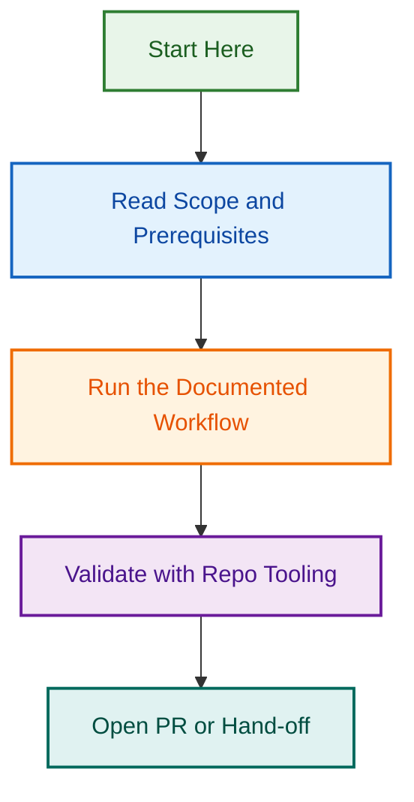

# LightSpeed .github Documentation

This folder is the canonical documentation index for governance, workflows, release operations, and repository standards.

## Start Here

- `ARCHITECTURE.md` — repository architecture.
- `BRANCHING_STRATEGY.md` — branch naming and protection rules.
- `PR_CREATION_PROCESS.md` — PR process and validation flow.
- `RELEASE_PROCESS.md` — current two-phase agentic release process.
- `AUTOMATION.md` — automation governance and workflow responsibilities.

## Standards and Governance

- `AGENT_STANDARDS.md`
- `INSTRUCTIONS_STANDARDS.md`
- `SKILLS_STANDARDS.md`
- `WORKFLOWS_STANDARDS.md`
- `AI_REFERENCES_STANDARDS.md`

## Operations and Maintenance

- `ISSUE_MAINTENANCE_SCRIPTS.md`
- `LABELING.md`
- `LABEL_MANAGEMENT_CLI.md`
- `ARCHIVE_WORKFLOW_GUIDE.md`
- `WORKFLOW_COORDINATION.md`

## Release and Quality

- `RELEASE_PROCESS.md`
- `RELEASE_WORDPRESS.md`
- `TESTING.md`
- `LINTING.md`
- `VERSIONING.md`

## Notes

- Use uppercase file names exactly as present in this folder.
- Prefer this index over legacy links in archived documents.
## Visual Workflow

