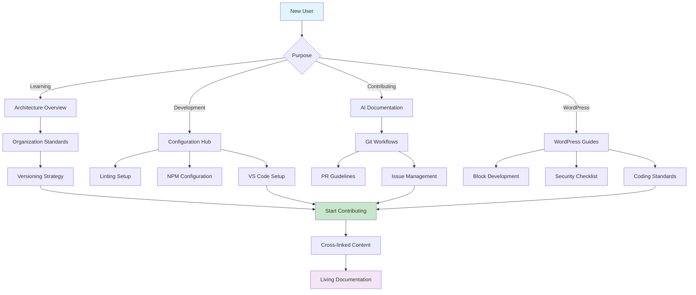

LightSpeedWP Documentation Hub
================================


Welcome to the comprehensive documentation repository for LightSpeedWP! This collection contains all the standards, guides, workflows, and configurations that power our development ecosystem.

Documentation Architecture
--------------------------



```mermaid
graph TB
    A[Documentation Hub] --> B[Architecture & Organization]
    A --> C[AI & Automation]
    A --> D[Configuration & Setup]
    A --> E[Git Workflows]
    A --> F[Labeling & Issues]
    A --> G[Bug Tracking]
    A --> H[WordPress Development]
    A --> I[Content & Documentation]
    A --> J[Collaboration]
    A --> K[Project Resources]
    
    B --> B1[Documentation Architecture]
    B --> B2[Organization Standards]
    B --> B3[System Architecture]
    
    C --> C1[AI Integration Guides]
    C --> C2[Copilot Usage]
    C --> C3[Automation Workflows]
    
    D --> D1[Linting Setup]
    D --> D2[NPM Configuration]
    D --> D3[VS Code Setup]
    
    E --> E1[Branching Strategy]
    E --> E2[PR Guidelines]
    E --> E3[Workflow Playbook]
    
    F --> F1[Label Automation]
    F --> F2[Issue Management]
    F --> F3[Release Automation]
    
    G --> G1[BugHerd Integration]
    G --> G2[Testing Standards]
    G --> G3[Quality Assurance]
    
    H --> H1[Block Development]
    H --> H2[Security Checklist]
    H --> H3[Coding Standards]
    
    I --> I1[Frontmatter Schema]
    I --> I2[YAML Documentation]
    I --> I3[Header/Footer Standards]
    
    J --> J1[All Contributors]
    J --> J2[Discussion Guidelines]
    J --> J3[Decision Records]
    
    K --> K1[Assets]
    K --> K2[LS Projects]
    K --> K3[Templates]
    
    style A fill:#e1f5fe
    style C fill:#f3e5f5
    style E fill:#e8f5e8
    style H fill:#fff3e0
```

Quick Navigation
----------------

Architecture & Organization
---------------------------

- [**Documentation Architecture**](README_DOCS_ARCHITECTURE.md) - How our docs are structured and cross-linked
- [**Organization Standards**](ORGANIZATION.md) - Project organization principles
- [**Architecture Overview**](ARCHITECTURE.md) - System architecture documentation
- [**Versioning Strategy**](VERSIONING.md) - How we version our projects
- [**Roadmap**](ROADMAP.md) - Project direction and future plans

AI & Automation
--------------

- [**AI Documentation Hub**](ai/) - Comprehensive AI integration guides
  - [Coding Standards](ai/coding-style.md)
  - [Copilot Usage Guidelines](ai/copilot-usage.md)
  - [Contributing Templates](ai/contributing-templates.md)
  - [Release Process](ai/release-process.md)
  - [Security & Licensing](ai/security-and-licensing.md)
- [**Labeling Agent Usage**](LABELING_AGENT_USAGE.md) - Automated labeling system
- [**Frontmatter Documentation**](frontmatter/) - AI agent configurations and schemas

Configuration & Setup
---------------------

- [**Configuration Hub**](config/) - All project configuration documentation
  - [Linting Setup](config/lint-eslint.md) (ESLint, Prettier, Stylelint, Markdown)
  - [NPM Configuration](config/npm-package-json.md) (Dependencies, Scripts)
  - [Project Tools](config/project-jest.md) (Jest, Babel, PostCSS)
  - [VS Code Setup](config/vscode-settings.md) (Settings, MCP)
  - [Workflow Tools](config/workflow-husky.md) (Husky, Lint-staged, Spectral)

Git Workflows & Processes
-------------------------

- [**Git Workflow Hub**](git-workflow/) - Complete Git workflow documentation
  - [Branching Strategy](git-workflow/git-org-wide-branching-strategy.md)
  - [Workflow Playbook](git-workflow/git-workflow-playbook-v1-2.md)
  - [Issue Types](git-workflow/org-wide-issue-types-v1-11.md)
  - [Labels System](git-workflow/org-wide-labels-v1-14.md)
  - [PR Guidelines](git-workflow/pr-workflow-guide-v1-1.md)
- [**PR Creation Process**](PR_CREATION_PROCESS.md) - How to create effective pull requests
- [**Workflows Documentation**](WORKFLOWS.md) - GitHub Actions and automation workflows

Labeling & Issue Management
---------------------------

- [**Label Automation Hub**](label-automation/) - Automated labeling system
  - [Issue & PR Labeling Guide](label-automation/issue-and-pr-labelling-guide-explainer-v1.md)
  - [Labeling Examples](label-automation/issue-and-pr-labelling-examples-v1.md)
  - [Automation Workflows](label-automation/issue-pr-labelling-project-sync-automation-workflows-v1-1.md)
  - [Release Automation](label-automation/changelog-release-automation-product-development-v1.md)
- [**Label Strategy**](LABEL_STRATEGY.md) - Overall labeling approach
- [**Issue Creation Guide**](ISSUE_CREATION_GUIDE.md) - How to create effective issues

Bug Tracking & Quality
-----------------------

- [**BugHerd Integration**](bugherd/) - Bug tracking system documentation
  - [Tagging Guide](bugherd/bugherd-tagging-guide-explainer-v1-1.md)
  - [Tagging Examples](bugherd/bugherd-tagging-examples-v1-2.md)
  - [Default Tags](bugherd/bugherd-default-tags-v1-6.md)
- [**Testing Documentation**](TESTING.md) - Testing standards and practices
- [**Jest Test Audit**](JEST-TEST-AUDIT.md) - Testing audit documentation

WordPress Development
---------------------

- [**WordPress Guides**](wp-guides/) - WordPress-specific development guides
  - [Block Development Checklist](wp-guides/block-dev-checklist.md)
  - [Coding Standards](wp-guides/wp-coding-standards.md)
  - [Security Checklist](wp-guides/wp-security-checklist.md)

Content & Documentation
-----------------------

- [**Frontmatter Schema**](frontmatter-schema.md) - Documentation metadata standards
- [**YAML Documentation**](YAML.md) - YAML configuration guide
- [**YAML Frontmatter**](YAML-Frontmatter.md) - Frontmatter usage guide
- [**Badges Documentation**](BADGES.md) - Repository badges and status indicators
- [**Header/Footer Standards**](HEADER-FOOTER.md) - Consistent document formatting
- [**README Management**](MANAGE-READMES.md) - README file standards

Collaboration & Community
--------------------------

- [**All Contributors Documentation**](all-contributorsrc-docs.md) - Contributor recognition system
- [**Discussions Guide**](DISCUSSIONS.md) - Community discussion guidelines
- [**Cross-linking Checklist**](CHECKLIST_CROSSLINKING.md) - Documentation quality checklist
- [**Decision Records**](DECISIONS.md) - Architectural decision records

Project Resources
----------------

- [**Assets**](assets/) - Shared documentation assets and diagrams
- [**LS Projects**](ls-projects/) - LightSpeed-specific project documentation
- [**Mustache Templates**](mustache-repo-templates/) - Repository template system
- [**Drafts**](drafts/) - Work-in-progress documentation

Usage & Quickstart
------------------

1. **New to the project?** Start with [Architecture Overview](ARCHITECTURE.md)
2. **Setting up development?** Check the [Configuration Hub](config/)
3. **Contributing code?** Review [AI Documentation](ai/) and [Git Workflows](git-workflow/)
4. **Working on WordPress?** See [WordPress Guides](wp-guides/)
5. **Need templates?** Browse [Mustache Templates](mustache-repo-templates/)

Cross-Linking Philosophy
------------------------

Our documentation follows a comprehensive cross-linking strategy:

- **Bidirectional linking** between parent/child documents
- **Lateral linking** between related standards
- **No dead ends** - every page links to related content
- **Living documentation** that evolves with our processes

For details, see our [Documentation Architecture Guide](README_DOCS_ARCHITECTURE.md).

Contributing
------------

When contributing to this documentation:

1. Follow the [Cross-linking Checklist](CHECKLIST_CROSSLINKING.md)
2. Use proper frontmatter (see [Frontmatter Schema](frontmatter-schema.md))
3. Update relevant index files when adding new documents
4. Ensure bidirectional links are maintained
5. Test all internal links before submitting

Support
-------

- **Questions?** Start a [GitHub Discussion](https://github.com/orgs/lightspeedwp/discussions)
- **Issues?** Use our [Issue Creation Guide](ISSUE_CREATION_GUIDE.md)
- **Documentation bugs?** Follow the [PR Creation Process](PR_CREATION_PROCESS.md)

---

Documentation Navigation Flow
-----------------------------



---

Validation & Testing
--------------------

Current validation focus:

- Frontmatter schema conformance (README and documentation metadata)
- Cross-link integrity (no dead internal links)
- Markdown lint (heading style, spacing, lists, fenced blocks)

Example (placeholder) validation commands:

```bash
# Lint markdown
markdownlint docs/**/*.md

# Validate frontmatter (hypothetical script)
node scripts/validation/validate-frontmatter.js docs/
```

Change Log / History
--------------------

Refer to `../CHANGELOG.md` and `VERSIONING.md` for version evolution and release rationale. Major structural documentation changes are recorded in `DECISIONS.md`.

FAQ / Troubleshooting
---------------------

**Broken internal link?** Run cross-link validation or check path typos.
**Need a new section?** Update `README_DOCS_ARCHITECTURE.md` and add bidirectional links.
**Frontmatter inconsistency?** Compare against `frontmatter-schema.md`.
**Badge missing?** Add or update `BADGES.md` and insert at top-level README.

Limitations & Notes
-------------------

- Some legacy docs may not yet include normalized frontmatter.
- Draft documents in `drafts/` are excluded from formal validation.
- Automated link checking may not cover external 3rd-party links.

Environment & Dependencies
--------------------------

Primary tooling expectations for consuming docs:

- Node + npm (for validation scripts)
- Markdownlint CLI
- VS Code with recommended extensions (see configuration docs)

References
----------

Documentation Links
-------------------

- [Documentation Architecture Guide](README_DOCS_ARCHITECTURE.md)
- [Cross-linking Checklist](CHECKLIST_CROSSLINKING.md)
- [Frontmatter Schema](frontmatter-schema.md)
- [LightSpeedWP Main Repository](https://github.com/lightspeedwp/.github)

Development Resources
---------------------

- [Configuration Hub](config/)
- [Git Workflow Documentation](git-workflow/)
- [AI Integration Guides](ai/)
- [WordPress Development Guides](wp-guides/)

AI & Automation References
-------------------------

- [Custom Instructions](../.github/custom-instructions.md)
- [Agents Documentation](../.github/agents/agent.md)
- [Prompts Library](../.github/prompts/prompts.md)
- [Labeling Automation](label-automation/)

Community Resources
-------------------

- [GitHub Discussions](https://github.com/orgs/lightspeedwp/discussions)
- [Issue Creation Guide](ISSUE_CREATION_GUIDE.md)
- [PR Creation Process](PR_CREATION_PROCESS.md)
- [Contributing Guidelines](../CONTRIBUTING.md)

---

_📚 Comprehensive documentation maintained with ❤️ by the LightSpeedWP team. Empowering development through knowledge._

<!-- RANDOM FOOTER: 📚 Built by LightSpeedWP with ☕, 🚀, and open-source spirit! -->
