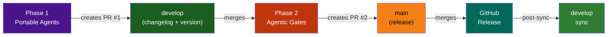
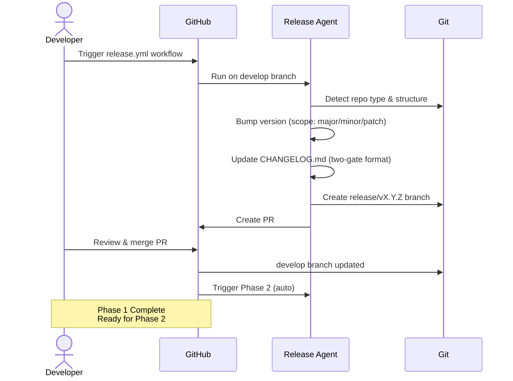
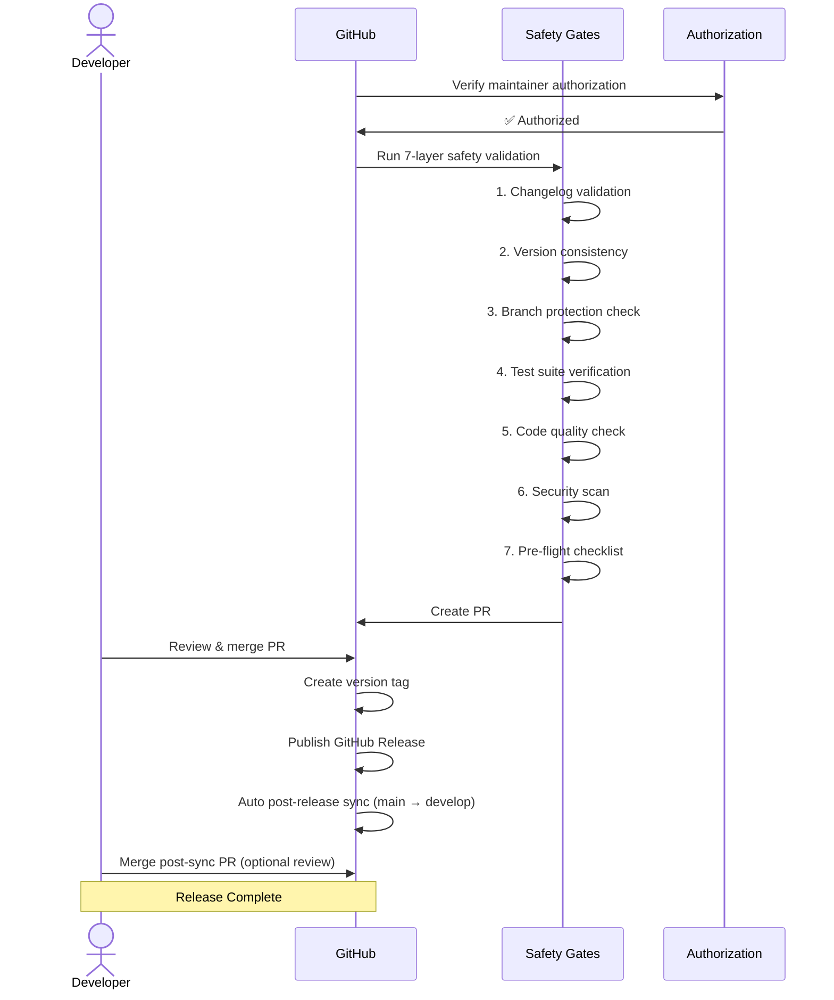

# Release Process v4.0: Two-Phase Agentic Release

> Ship multi-repo releases reliably with portable agents (Phase 1), automated safety gates (Phase 2), and full WordPress support for plugins, themes, and control-plane repositories.

## Overview

The Release Process uses a **two-phase approach** to automate and verify releases:

- **Phase 1: Portable Agent** — Detects repo type, bumps versions, updates changelog
- **Phase 2: Agentic Gates** — Validates changes with 7 safety gates, manages approvals, publishes release

This document covers both phases, common workflows, troubleshooting, and WordPress-specific guidance.

### Key Features

✅ **Multi-repo support:** Control-plane, plugins, themes  
✅ **Automated versioning:** SemVer bumping (major/minor/patch)  
✅ **WordPress support:** Plugin headers, theme CSS, readme.txt  
✅ **Safety gates:** 7-layer validation before release  
✅ **Sequential merge queue:** Mergify prevents conflicts  
✅ **Post-release sync:** Automatic develop ← main sync  
✅ **Rollback ready:** Can revert if issues arise  

---

## Release Workflow Diagram

### Two-Phase Process



### Phase 1: Portable Agent Workflow



### Phase 2: Agentic Gates Workflow



---

## Phase 1: Portable Release Agent

### Overview

**Phase 1** uses portable agents to handle version management and changelog generation. The process:

1. Detects repository type (control-plane, plugin, theme)
2. Reads current version from VERSION file or package.json
3. Bumps version according to scope (major/minor/patch)
4. Updates CHANGELOG.md with two-gate validation
5. Creates release branch and PR for review

### Prerequisites

- Current branch: `develop`
- No uncommitted changes
- Authorization: User must be in `maintainers` team
- Scope defined: `patch` (default), `minor`, or `major`

### Step-by-Step: Trigger Phase 1

#### Step 1: Prepare develop branch

```bash
git checkout develop
git pull origin develop
git status  # Verify clean working tree
```

#### Step 2: Trigger release workflow

```bash
# Default (patch bump)
gh workflow run release.yml -f dry_run=false

# Or specify scope
gh workflow run release.yml -f scope=minor -f dry_run=false

# Preview first (recommended for major releases)
gh workflow run release.yml -f scope=major -f dry_run=true
```

**Parameters:**
- `scope` — `patch` (default), `minor`, or `major`
- `dry_run` — `true` to preview, `false` to execute

#### Step 3: Monitor Phase 1 execution

```bash
# Watch workflow progress
gh workflow view release.yml --ref develop

# Check workflow run status
gh run list --workflow=release.yml --limit=1
```

**Expected output:**
```
Status: ✅ success
Artifacts: release-agent-output.json (version bump details)
PR: #XXXX created (release/vX.Y.Z → develop)
```

#### Step 4: Review & Merge PR #1

```bash
# View PR created by Phase 1
gh pr view --json title,body,number

# Review the changelog updates
cat CHANGELOG.md | head -30

# Merge PR #1 to develop
gh pr merge --squash --delete-branch
```

**What to verify:**
- ✅ Version bumped correctly in VERSION file
- ✅ CHANGELOG.md updated with new entries
- ✅ Branch protection rules pass
- ✅ CI checks pass

---

## Phase 2: Agentic Safety Gates

### Overview

**Phase 2** activates automatically when Phase 1 PR merges to develop. The process:

1. Validates authorization (maintainers team only)
2. Runs 7 safety gates on release readiness
3. Generates agentic confidence score
4. Creates PR #2 from release branch to main
5. After merge: publishes release and syncs develop

### The 7 Safety Gates

1. **Changelog Validation** — Verifies CHANGELOG.md format and entries
2. **Version Consistency** — Ensures all version files match
3. **Branch Protection** — Confirms branch protection rules will be enforced
4. **Test Suite** — Runs all automated tests
5. **Code Quality** — Linting and format checks
6. **Security Scan** — Dependency vulnerabilities and secrets
7. **Pre-flight Checklist** — Final readiness verification

### Approval Tiers

| Scope | Approval | Who Decides | Timeline |
|-------|----------|-----------|----------|
| **Patch** | Auto-approve | Agentic (score ≥ 0.8) | < 5 min |
| **Minor** | Manual review | 1 maintainer | 10–30 min |
| **Major** | Dual approval | 2 maintainers + ADR | 1–4 hours |

**How to approve:**
- Patch: Automatically approved if agentic confidence ≥ 0.8
- Minor: Comment "approved" or "LGTM" on PR
- Major: 2 maintainers approve + Architecture Decision Record (ADR) linked

### Step-by-Step: Phase 2 (Automatic)

Phase 2 runs automatically when PR #1 merges. Monitor with:

```bash
# View Phase 2 PR (PR #2: release → main)
gh pr list --search "release/v" --state open

# Check gate validation results
gh pr view <pr-number> --json statusCheckRollup

# View agentic score and gate details
gh pr view <pr-number> --json body | jq '.body'
```

**Expected flow:**
1. PR #2 created automatically (release/vX.Y.Z → main)
2. All 7 gates run in parallel
3. Agentic confidence score calculated
4. Auto-approve (patch) OR request approval (minor/major)
5. Developer merges PR #2
6. GitHub Release published
7. Post-release sync PR created (main → develop)

### Handling Gate Failures

If any gate fails:

1. **View the failure:** `gh pr checks <pr-number>`
2. **Identify root cause:** Check the gate's error message
3. **Fix the issue:** Update code/tests/docs as needed
4. **Retry:** Gates re-run on each commit

**Common failures:**
- Changelog format mismatch → fix CHANGELOG.md format
- Test failures → fix failing tests
- Linting errors → run prettier/eslint --fix
- Version mismatch → ensure all version files match

---

## Repository-Specific Guidance

### Control-Plane Repository (.github)

**Version file:** `VERSION`  
**Detection:** `VERSION` file exists + `package.json`  

```bash
# Check current version
cat VERSION

# Release process (same as general)
gh workflow run release.yml -f scope=minor -f dry_run=false
```

### WordPress Plugin

**Version files:**
- Main plugin file: `Version: X.Y.Z` header
- readme.txt: `Stable tag: X.Y.Z`
- (optional) `VERSION` file

**Detection:** Plugin header in main PHP file  

```bash
# Check plugin version
grep "Version:" my-plugin.php | head -1
grep "Stable tag:" readme.txt | head -1

# Phase 1 detects and updates all files automatically
gh workflow run release.yml -f scope=patch -f dry_run=false
```

**What Phase 1 updates:**
- ✅ Plugin header (Version: line)
- ✅ readme.txt (Stable tag: line)
- ✅ VERSION file (if exists)
- ✅ CHANGELOG.md

### WordPress Theme

**Version file:** `style.css` (Version: header)  
**Detection:** `style.css` with Theme Name header  

```bash
# Check theme version
head -20 style.css | grep "Version:"

# Phase 1 detects and updates automatically
gh workflow run release.yml -f scope=minor -f dry_run=false
```

**What Phase 1 updates:**
- ✅ style.css (Version: line in CSS header)
- ✅ VERSION file (if exists)
- ✅ CHANGELOG.md

---

## Mergify Sequential Queue

### What It Does

Mergify manages the merge queue sequentially to prevent conflicts:

1. First PR enters queue → CI runs (all checks in place)
2. While first PR is testing → other PRs wait in queue
3. First PR finishes CI → if all pass, auto-rebase + merge
4. Base branch updated → second PR auto-rebases
5. Second PR CI runs → cycle repeats

### Why Sequential?

GitHub's branch protection requires branches to be "up to date" before merge. Sequential processing ensures:

✅ Branches stay up-to-date (auto-rebase)  
✅ No conflicts when merging  
✅ Explicit CI re-validation after rebase  
✅ Safety: merge only if all checks still pass  

### Configuration

Located in `.github/mergify.yml`:

```yaml
merge_queue:
  max_parallel_checks: 1  # One PR in CI at a time
  merge_method: squash    # Use squash commits
  batch_size: 1           # Process one at a time
```

### Monitoring Mergify Queue

```bash
# Check Mergify queue status
gh api /repos/lightspeedwp/.github/pulls?state=open | jq '.[] | select(.draft == false) | {title, status_check_rollup}'

# Check PR comments for Mergify diagnostics
gh pr comments <pr-number> | grep -i mergify
```

---

## Post-Release Sync

### What Happens Automatically

After PR #2 merges to main:

1. GitHub Release published with version tag
2. Release notes generated from CHANGELOG.md
3. `post-release-sync` workflow auto-triggers
4. PR created: `main` → `develop` (chore: sync)
5. Branches synced (no commits repeated)

### Manual Sync (if needed)

```bash
# Create manual post-release sync
git checkout develop
git pull origin develop
git merge --no-ff origin/main -m "chore: Post-release sync main → develop"
git push origin develop
```

---

## Rollback Procedures

### If Release Has Critical Issues

**Option 1: Tag & Release Revert (Recommended)**

```bash
# Revert the release tag
git tag -d v1.2.3
git push origin :refs/tags/v1.2.3

# Delete GitHub Release (manual: github.com/lightspeedwp/.github/releases)

# Create revert PR: main ← previous version
git checkout main
git revert HEAD --no-edit
git push origin main

# Open PR to merge revert
```

**Option 2: Full Rollback**

```bash
# Revert develop to previous stable commit
git checkout develop
git log --oneline | head -10  # Find stable commit
git revert <commit-hash> --no-edit
git push origin develop

# Release hotfix with patch bump
gh workflow run release.yml -f scope=patch -f dry_run=false
```

---

## Troubleshooting

### Phase 1 Issues

#### ❌ "Invalid trigger event" Authorization error

**Problem:** User not in maintainers team or invalid trigger event

**Solution:**
```bash
# Verify team membership
gh api /user/memberships/orgs/lightspeedwp

# If not in maintainers, contact org admin
```

#### ❌ "No VERSION file found"

**Problem:** Repository missing VERSION or package.json

**Solution:**
Create a VERSION file in repo root:
```bash
echo "1.0.0" > VERSION
git add VERSION
git commit -m "chore: Add VERSION file"
git push origin develop
```

#### ❌ "CHANGELOG.md not in two-gate format"

**Problem:** Changelog doesn't follow validation rules

**Solution:**
Check CHANGELOG.md header format:
```markdown
# Changelog

All notable changes to this project are documented in this file.

## [X.Y.Z] - YYYY-MM-DD

### Added
- New features

### Changed
- Updated features

### Fixed
- Bug fixes

### Removed
- Deprecated features
```

### Phase 2 Issues

#### ❌ "Code quality check failed"

**Problem:** Linting or formatting issues detected

**Solution:**
```bash
npm run format  # Auto-fix formatting
npm run lint:fix  # Auto-fix linting issues
git add .
git commit -m "fix: Code quality issues"
git push  # Gates re-run automatically
```

#### ❌ "Test suite failures"

**Problem:** Automated tests failing

**Solution:**
```bash
# Run tests locally
npm test

# Fix failures
# Push fixes
git add .
git commit -m "fix: Test failures"
git push  # Gates re-run
```

#### ❌ "Mergify conflict"

**Problem:** Branch has conflicts that auto-rebase cannot fix

**Solution:**
```bash
# Manually rebase
git fetch origin
git rebase origin/develop
# Resolve conflicts
git add .
git rebase --continue
git push -f  # Force push after rebase
```

---

## FAQ

### Q: How do I release a patch fix?

```bash
# Phase 1: Bump patch, update changelog
gh workflow run release.yml -f scope=patch -f dry_run=false

# Phase 2: Automatic gates, then merge when ready
# Done!
```

**Timeline:** ~10-15 min for patch (auto-approve)

### Q: What if I need to release a major version?

```bash
# Phase 1: Bump major, update changelog
gh workflow run release.yml -f scope=major -f dry_run=true  # Preview first

# Review the changes carefully, then execute
gh workflow run release.yml -f scope=major -f dry_run=false

# Phase 2: Manual dual approval required
# 1. First maintainer approves (comment "LGTM")
# 2. Second maintainer approves
# 3. Create ADR (Architecture Decision Record) linking to PR
# Then merge PR #2
```

**Timeline:** 1-4 hours (dual approval required)

### Q: Can I skip the agentic gates for an urgent hotfix?

**Answer:** No. Gates are mandatory for safety. However, you can:

1. Prioritize hotfix workflow (skip feature freeze)
2. Run gates with priority flag
3. Get expedited dual approval (contact team lead)

### Q: What version format is supported?

**Answer:** SemVer only (X.Y.Z format):
- ✅ `1.0.0`
- ✅ `1.2.3`
- ✅ `2.0.0-beta` (pre-release)
- ❌ `v1.0.0` (no 'v' prefix)
- ❌ `1.0` (missing patch)

### Q: How do I manually version if the agent fails?

```bash
# Option 1: Update VERSION file
echo "2.0.0" > VERSION

# Option 2: Update package.json
jq '.version = "2.0.0"' package.json > package.json.tmp && mv package.json.tmp package.json

# Option 3: Update WordPress files
# Plugin: sed -i '' 's/Version: .*/Version: 2.0.0/' my-plugin.php
# Theme: sed -i '' 's/Version: .*/Version: 2.0.0/' style.css
# Readme: sed -i '' 's/Stable tag: .*/Stable tag: 2.0.0/' readme.txt

# Then commit and re-trigger Phase 1
git add .
git commit -m "chore: Manual version bump to 2.0.0"
git push
```

### Q: How often can I release?

**Answer:** As often as needed. Recommendations:
- **Patch fixes:** As needed (critical bugs)
- **Minor releases:** Weekly or bi-weekly
- **Major releases:** Quarterly or as planned

### Q: What's the difference between develop and main?

- **develop:** Integration branch (where features merge)
- **main:** Production-ready (releases only)

Release process: `develop` (v bump) → `main` (release) → `develop` (sync)

### Q: Can multiple people release simultaneously?

**Answer:** No. Mergify sequential queue ensures one release at a time:
- PR #1 merges → develop updated
- PR #2 merges → main updated
- Post-sync merges → branches in sync
- Next release can begin

**Timeline:** Typical release takes 5-30 min depending on scope

---

## Integration with Release Agents

### Release Agent (Phase 1)

Located: `agents/release/`

**Provides:**
- Repository type detection
- Version file management
- CHANGELOG.md validation
- Branch creation
- PR generation

See [Release Agent README](../agents/release/README.md) for details.

### WordPress Utilities (Phase 1 for WordPress repos)

Located: `agents/wordpress/`

**Provides:**
- Plugin header versioning
- Theme CSS versioning
- readme.txt management
- WordPress-specific metadata extraction

See [WordPress Agent README](../agents/wordpress/README.md) for details.

### Changelog Agent (Phase 1 validation)

Located: `agents/changelog/`

**Provides:**
- CHANGELOG.md validation
- Entry formatting
- Two-gate validation logic

See [Changelog Agent README](../agents/changelog/README.md) for details.

### Agentic Workflows (Phase 2)

Located: `.github/workflows/release.yml`

**Provides:**
- 7-layer safety gates
- Authorization validation
- Approval workflow
- Release publication

See [Agentic Workflows Guide](./AGENTIC_RELEASE_ADMIN_GUIDE.md) for details.

---

## Related Documentation

- [BRANCHING_STRATEGY.md](./BRANCHING_STRATEGY.md) — Branch naming and protection
- [RELEASE_WORDPRESS.md](./RELEASE_WORDPRESS.md) — WordPress plugin/theme release guide
- [AGENTIC_RELEASE_USER_GUIDE.md](./AGENTIC_RELEASE_USER_GUIDE.md) — End-user guide
- [AGENTIC_RELEASE_ADMIN_GUIDE.md](./AGENTIC_RELEASE_ADMIN_GUIDE.md) — Administrator guide

---

**Status:** ✅ Production Ready  
**Last Updated:** 2026-08-19  
**Version:** 4.0 (rewritten for two-phase process)

Questions? See [FAQ](#faq) or contact the maintainers team.
