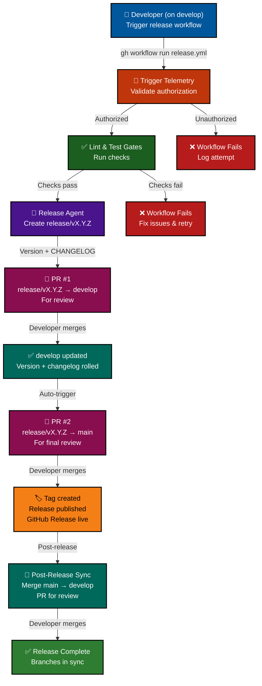
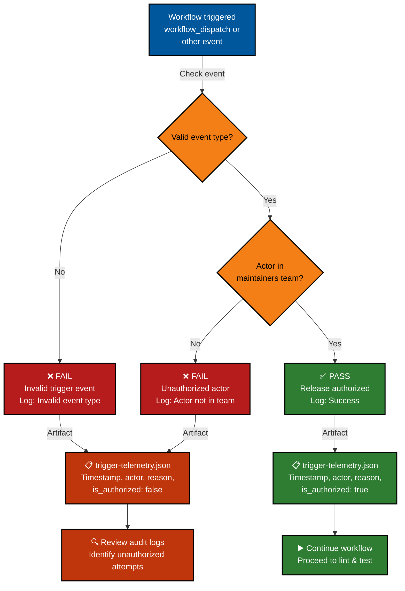
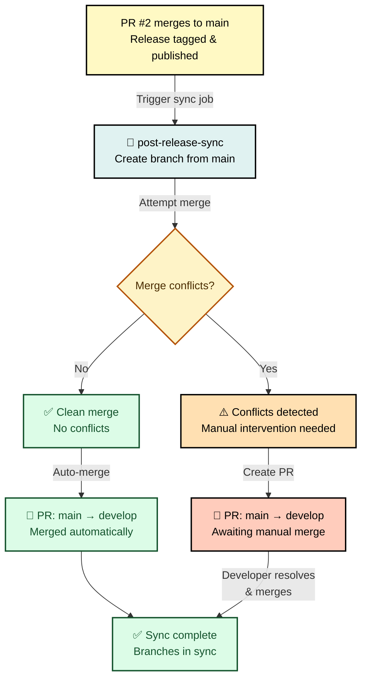
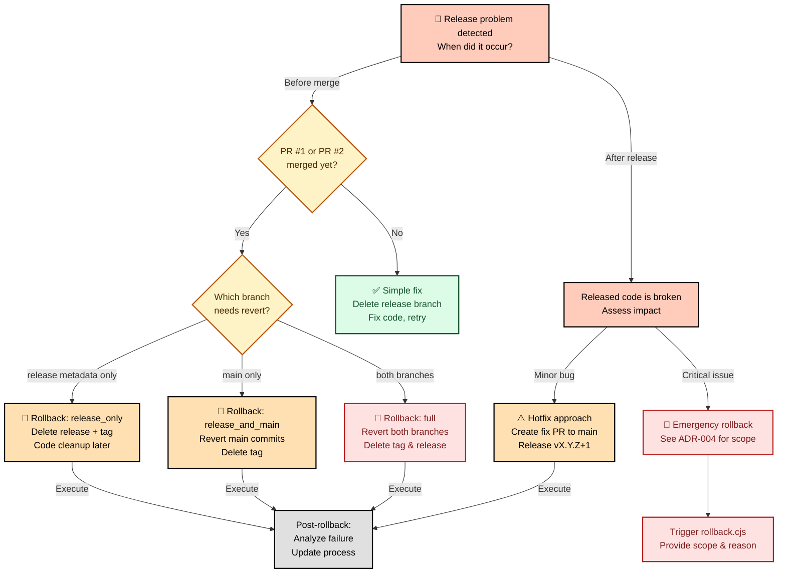

# Release Process (Develop-First Stacked PR Flow)

**Goal:** ship reliable releases using a develop-first stacked PR model: feature work integrates to `develop` first, then a release PR merges to `main`, with automatic post-release sync back to `develop`.

## Branch flow (develop-first)

```
feature branch
    ↓
develop (PR, integrate feature work)
    ↓
release/vX.Y.Z branch (created by agent)
    ↓
[STACKED] PR #1: release/vX.Y.Z → develop (changelog + version bump)
    ↓
[STACKED] PR #2: release/vX.Y.Z → main (after develop PR merges)
    ↓
main (release published)
    ↓
post-release-sync (chore: main → develop)
```

**Flow sequence:**

1. Feature work integrates to `develop` via normal PR workflow.
2. When ready for release, trigger `release.yml` workflow on `develop`.
3. Agent creates `release/vX.Y.Z` branch, bumps `VERSION`, updates `CHANGELOG.md`.
4. Agent creates **PR #1**: `release/vX.Y.Z` → `develop` (changelog + version changes).
5. Developer merges PR #1 to `develop`.
6. Agent creates **PR #2**: `release/vX.Y.Z` → `main` (stacked on PR #1).
7. Developer merges PR #2 to `main`.
8. GitHub Release published with compiled notes (sections, highlights, contributors).
9. `post-release-sync` workflow automatically creates PR: `main` → `develop` to keep branches in sync.

### Visual flow diagram (Mermaid)



## Authorization gating

**New in v3.0:** Authorization validation gates all release workflow triggers.

- **Trigger validation:** Only `workflow_dispatch` and `workflow_call` events allowed (blocks accidental or unauthorized triggers).
- **Actor validation:** Trigger actor must be an active member of the `maintainers` team in the lightspeedwp organisation.
- **Audit logging:** All authorization attempts logged in `trigger-telemetry.json` with timestamp, actor, event, and failure reason.
- **Blocking:** Unauthorized attempts cause the workflow to **fail immediately** (no workaround; `continue-on-error: false`).

**Example audit log (unauthorized):**

```json
{
  "event": "push",
  "actor": "unknown-user",
  "is_authorized": false,
  "unauthorized_attempts": 1,
  "failure_reason": "Invalid trigger event: push",
  "timestamp": "2026-08-05T19:00:00Z"
}
```

### Authorization validation flow (Mermaid)



See [ADR-002: Authorization Gating Strategy](./ADRs/ADR-002-authorization-gating.md) for detailed rationale.

## Phase 5A: Safety Gates Layer (NEW)

**Added in v3.1 (2026-08-18):** Phase 5A introduces a **7-layer safety gates system** that augments Phase 4 release automation with intelligent decision-making and structured approval flows.

### Overview

Before Phase 4 scripts are invoked, all 7 safety gates must pass. Gates run sequentially; if any gate fails, the release process stops immediately with no mutations.

```mermaid
accTitle: Flowchart
%%{init: { 'accessibility': { 'diagWithoutTitle':true } }}%%
flowchart TD
    A["🚀 Release triggered<br/>User runs release.yml"] -->|scope: patch/minor/major| B["🔐 Phase 5A Safety Gates"]
    B -->|GATE 1| C["Pre-flight Checks<br/>Branch, VERSION, CHANGELOG"]
    C -->|GATE 2| D["Agentic Score<br/>AI confidence ≥0.80"]
    D -->|GATE 3| E["Version Consistency<br/>Semver validation"]
    E -->|GATE 4| F["Tag Uniqueness<br/>No duplicate tags"]
    F -->|GATE 5| G["Authorization<br/>Maintainers team"]
    G -->|GATE 6| H["Integrity Filter<br/>Gitleaks detection"]
    H -->|GATE 7| I["Approval Enforcement<br/>Tiered by scope"]
    I -->|All gates PASS| J["✅ Phase 4 Scripts<br/>Mutations approved"]
    C -->|FAIL| Z1["❌ Release aborted<br/>No changes made"]
    D -->|FAIL| Z2["❌ Release aborted<br/>Low confidence"]
    E -->|FAIL| Z3["❌ Release aborted<br/>Invalid version"]
    F -->|FAIL| Z4["❌ Release aborted<br/>Tag exists"]
    G -->|FAIL| Z5["❌ Release aborted<br/>Unauthorized"]
    H -->|FAIL| Z6["❌ Release aborted<br/>Secrets detected"]
    I -->|FAIL| Z7["❌ Release aborted<br/>Approval pending"]
    J -->|mutations| K["🏷️ GitHub Release<br/>Tags & release notes"]
    
    style A fill:#01579b,color:#fff
    style B fill:#bf360c,color:#fff
    style C fill:#1b5e20,color:#fff
    style D fill:#4a148c,color:#fff
    style E fill:#1b5e20,color:#fff
    style F fill:#4a148c,color:#fff
    style G fill:#bf360c,color:#fff
    style H fill:#1b5e20,color:#fff
    style I fill:#4a148c,color:#fff
    style J fill:#2e7d32,color:#fff
    style K fill:#f57f17,color:#000
    style Z1 fill:#b71c1c,color:#fff
    style Z2 fill:#b71c1c,color:#fff
    style Z3 fill:#b71c1c,color:#fff
    style Z4 fill:#b71c1c,color:#fff
    style Z5 fill:#b71c1c,color:#fff
    style Z6 fill:#b71c1c,color:#fff
    style Z7 fill:#b71c1c,color:#fff
accDescr: Detailed diagram showing structure and relationships
```

### The 7-Layer Gates

| Gate | Purpose | Fails When |
|------|---------|-----------|
| **1: Pre-flight** | Validate environment | Not on develop, uncommitted changes, missing VERSION/CHANGELOG |
| **2: Agentic Score** | AI confidence check | Score < 0.80 (low confidence release) |
| **3: Version** | Semver validation | Invalid format, downgrade, or logic error |
| **4: Tag** | Prevent duplicates | Tag vX.Y.Z already exists |
| **5: Authorization** | Team membership | Actor not in maintainers team |
| **6: Integrity** | Secret detection | Gitleaks finds secrets in staged changes |
| **7: Approval** | Scope-based sign-off | Patch: auto-approve; Minor: need 1x review; Major: need 2x review |

### Integration with Phase 4

The gates wrapper (`scripts/workflows/release/run-release-with-gates.cjs`) orchestrates all gates, then calls Phase 4 scripts only if all gates pass:

```
User Input → Phase 5A Gates (NEW) → Phase 4 Scripts (UNCHANGED)
                    ↓
            Audit Logging (.agentic-logs/)
```

**Key principle:** Phase 4 is never invoked if any gate fails. Fallback is available if gates layer crashes.

### Audit Logging & Dry-Run

- **Audit Logging:** All release attempts logged to `.agentic-logs/` with JSON structure (timestamp, user, scope, gate results)
- **Dry-Run Mode:** `--dry-run` flag tests all gates without mutations
- **Secret Redaction:** Sensitive patterns masked in logs

### References

- **Implementation:** PR #2016 (merged to develop)
- **Project:** [release-agentic-workflows-2026-08-11](./.github/projects/active/release-agentic-workflows-2026-08-11/)
- **Specification:** [AGENTIC_WORKFLOW_SPEC.md](./.github/projects/active/release-agentic-workflows-2026-08-11/AGENTIC_WORKFLOW_SPEC.md)

## Automation & gates

- **Changelog validation (`.github/workflows/changelog.yml`)**
  - Runs on **every PR** (all branches) and on `develop` pushes to ensure:
    - `CHANGELOG.md` conforms to `changelog.schema.json`.
    - Unreleased section exists and is populated.
- **Release workflow (`.github/workflows/release.yml`)**
  - Manual `workflow_dispatch` and reusable `workflow_call`.
  - Typed inputs: `version`, `notes_from`, `scope`, `provider`, `dry_run`.
  - **Authorization gating:** trigger-telemetry job validates actor + event (blocks unauthorized).
  - Hard gate on lint (`checks.yml` unified linting workflow).
  - Runs schema + unreleased validation before invoking `release.agent.js`.
  - Uses `release.agent.js` (ESM) to:
    - Create `release/vX.Y.Z` branch from `develop`
    - Bump `VERSION` and update `CHANGELOG.md`
    - Create PR #1: `release/vX.Y.Z` → `develop`
    - After PR #1 merges, create PR #2: `release/vX.Y.Z` → `main`
    - Tag and publish GitHub Release with compiled notes
  - Provider mode:
    - `shell` (default): gh/git-backed publication.
    - `mcp`: GitHub API-backed publication for tag ref, PR, and release.
  - Dry-run mode publishes review artefacts (`release-agent.log`, `release-notes-preview.md`) without creating commits/tags/releases.
  - Trigger telemetry records authorisation attempts (expected `0` unauthorized).
- **Post-release sync (`.github/workflows/release.yml` — new job)**
  - Runs after release if not dry-run.
  - Creates `chore/post-release-sync-main-to-develop` branch.
  - Merges `main` into `develop` to keep branches in sync.
  - Creates PR `main` → `develop` for developer review/merge.
- **Required checks before merging release PRs**
  - Lint/test green.
  - Changelog validation green.
  - Version bump and dated changelog entry present.

## Semantic versioning & scope

- Single source of truth: `VERSION` file.
- Scope values: `patch` (default), `minor`, `major`.
- Workflow dispatch examples:

**Via GitHub UI:**

1. Go to **Actions** → **release** workflow
2. Click **Run workflow**
3. Select inputs:
   - **version:** (leave blank to use scope)
   - **scope:** `patch` (default), `minor`, or `major`
   - **provider:** `shell` (default) or `mcp`
   - **dry_run:** `true` (default, safe mode) or `false` (live release)
4. Click **Run workflow**

**Via CLI:**

```bash
gh workflow run release.yml \
  --ref develop \
  -f scope=patch \
  -f provider=shell \
  -f dry_run=false
```

## MCP provider runtime settings

- `GITHUB_REPOSITORY` or `RELEASE_REPO_OWNER` + `RELEASE_REPO_NAME` must identify the target repository.
- `GITHUB_TOKEN` is required for MCP provider mutation operations.
- Retry/backoff tuning for MCP API calls:
  - `RELEASE_MCP_RETRIES` (default `3`)
  - `RELEASE_MCP_BACKOFF_MS` (default `250`)
  - `RELEASE_MCP_BACKOFF_FACTOR` (default `2`)

## Pre-release checklist (run on develop)

Before triggering the release workflow, verify:

- [ ] You are a member of the `maintainers` team (authorization requirement).
- [ ] `CHANGELOG.md` has unreleased entries and passes schema validation (`npm run validate:changelog`).
- [ ] `VERSION` file is correct for the intended bump scope.
- [ ] All feature branches are merged to `develop`.
- [ ] Lint/tests green (`npm run lint && npm test`).
- [ ] Agent/workflow alignment: `release.agent.js`, `release.agent.md`, `release.yml`, `changelog.yml`.
- [ ] Documentation current (links valid, branch flow accurate).
- [ ] No uncommitted changes in working tree (`git status` is clean).

## Release execution (develop-first stacked flow)

**Phase 1: Trigger release workflow**

1. Navigate to **Actions** → **release** workflow.
2. Click **Run workflow** (or use CLI `gh workflow run`).
3. Configure inputs: scope (patch/minor/major), provider (shell/mcp), dry_run (true/false).
4. Click **Run workflow**.

**Phase 2: Authorization & validation (automatic)**

1. **Trigger telemetry job:**
   - Validates actor is in `maintainers` team.
   - Blocks unauthorized attempts (workflow fails).
   - Logs authorization attempt with reason.

2. **Lint & test jobs:**
   - Runs unified linting (`npm run lint`).
   - Runs test suite (`npm test`).
   - Both depend on successful authorization.

3. **Changelog validation:**
   - Validates `CHANGELOG.md` schema.
   - Confirms unreleased section populated.

**Phase 3: Release agent execution (develop-first)**

1. Agent runs on `develop` branch.
2. Validates readiness: VERSION + changelog schema + unreleased content.
3. Creates `release/vX.Y.Z` branch from `develop`.
4. Bumps `VERSION` file.
5. Rolls `[Unreleased]` section to `[X.Y.Z] - YYYY-MM-DD` in `CHANGELOG.md`.
6. Commits: `"chore: Release vX.Y.Z"`.
7. Creates **PR #1**: `release/vX.Y.Z` → `develop` (changelog + version).
   - Title: `"chore: Release vX.Y.Z (changelog + version bump)"`
   - Body: Link to this release process doc, version bump details.
8. Returns `release_version` and `release_branch` as workflow outputs.

**Phase 4: Developer reviews PR #1 (develop)**

1. Open PR #1 in GitHub.
2. Verify changelog entries and version bump.
3. Approve and merge to `develop`.

**Phase 5: Agent creates PR #2 (stacked)**

After PR #1 merges, agent automatically:

1. Creates **PR #2**: `release/vX.Y.Z` → `main` (stacked on PR #1).
   - Title: `"release: vX.Y.Z"`
   - Body: Compiled release notes (sections, highlights, breaking changes, contributors).
2. Creates annotated tag: `vX.Y.Z` (signed if keys available).
3. Pushes tag to remote.

**Phase 6: Developer reviews PR #2 (main)**

1. Open PR #2 in GitHub.
2. Verify compiled release notes and tag.
3. Approve and merge to `main`.
4. GitHub automatically publishes Release from the tag.

**Phase 7: Post-release sync (automatic)**

After PR #2 merges:

1. `post-release-sync` workflow runs.
2. Creates `chore/post-release-sync-main-to-develop` branch from `main`.
3. Merges `main` into `develop` to keep branches in sync.
4. Creates PR: `main` → `develop` for developer review.
5. Developer merges to keep branches synchronized.

### Post-release sync flow (Mermaid)



See [ADR-003: Post-Release Sync Automation](./ADRs/ADR-003-post-release-sync.md) for detailed rationale.

## Changelog governance

- Format: Keep a Changelog.
- Schema: `../.schemas/changelog.schema.json` enforced by:
  - `scripts/validation/validate-changelog.cjs`
  - `scripts/agents/includes/changelogUtils.cjs --validate/--unreleased`
- Requirements:
  - `[Unreleased]` section must exist and contain entries before release.
  - Sections allowed: Added, Changed, Deprecated, Removed, Fixed, Security, Documentation, Performance.

## Release notes generation

`release.agent.js` compiles notes using:

- Changelog sections (ordered).
- Highlights (prioritising Added/Changed/Security).
- Breaking changes callout.
- Contributors from merged PRs between previous tag and new tag.
- Full changelog compare link.

## Troubleshooting

- **Changelog validation fails:** run `node scripts/validation/validate-changelog.cjs CHANGELOG.md` and fix schema violations/empty sections.
- **No unreleased changes:** add entries under `[Unreleased]` before running release agent.
- **PR not created:** ensure `gh` CLI and `GITHUB_TOKEN` available; otherwise create PR from `release/vX.Y.Z` → `main` manually.
- **Tag conflicts:** delete or move existing tag before rerunning; ensure working tree clean.

## Rollback notes

If a release is started but must be rolled back:

1. Delete the release branch (`release/vX.Y.Z`) if it should not proceed.
2. Delete the tag locally and remotely:
   - `git tag -d vX.Y.Z`
   - `git push origin :refs/tags/vX.Y.Z`
3. If a GitHub Release was created, remove it:
   - `gh release delete vX.Y.Z --yes`
4. Restore `VERSION` and `CHANGELOG.md` to the last known good commit on `develop`.
5. Re-run the workflow in `dry_run` mode first to validate fixes before re-attempting a live release.

Rollback utility supports provider-aware cleanup:

```bash
node .github/scripts/workflows/release/rollback.cjs --version=X.Y.Z --provider=shell
node .github/scripts/workflows/release/rollback.cjs --version=X.Y.Z --provider=mcp --dry-run
```

### Rollback decision tree (Mermaid)



See [ADR-004: Rollback & Error Handling Strategy](./ADRs/ADR-004-rollback-strategy.md) for detailed rationale and rollback scopes.

---

*Built by 🧱 LightSpeedWP with ☕, 🚀, and open-source spirit!*
