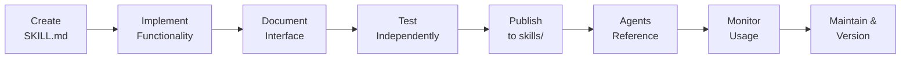
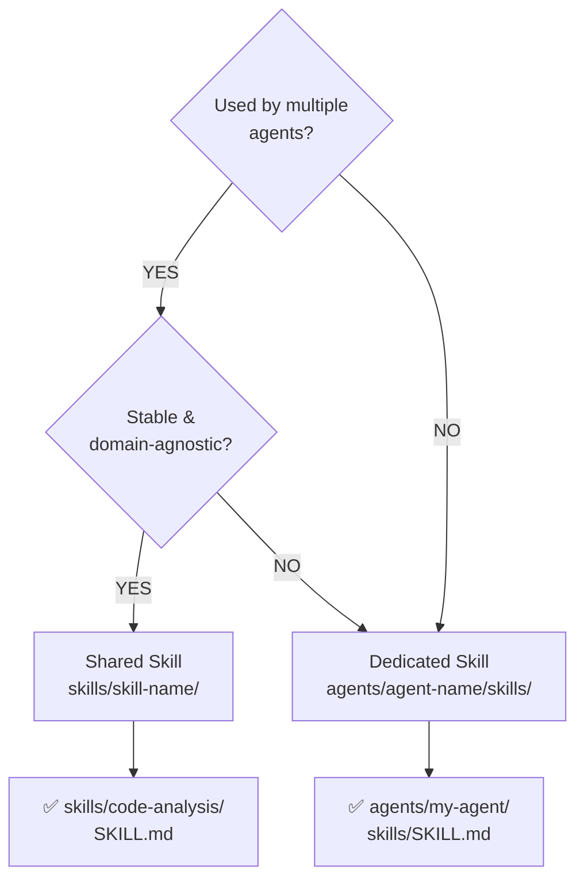

# Skills Standards

Guidelines for creating reusable skills that agents can leverage to reduce duplication and improve maintainability.

## Overview

Skills are discrete, reusable capabilities designed to be shared across multiple agents. A skill encapsulates specific functionality (code analysis, documentation generation, testing, etc.) and exposes a clear interface for agent consumption.

### Skill Lifecycle



## Quick Links

- [Skill Concept](#skill-concept)
- [Shared vs. Dedicated Skills](#shared-vs-dedicated-skills-decision-tree)
- [Folder Structure](#folder-structure)
- [SKILL.md Specification](#skillmd-specification)
- [Best Practices](#best-practices)
- [Examples](#examples)

---

## Skill Concept

### What Is a Skill?

A skill is a focused, reusable capability that:

- Solves a specific, well-defined problem
- Exposes a clean interface (inputs/outputs)
- Is independent from any particular agent
- Can be versioned and maintained independently
- Is documented with examples and usage guidance

### Why Skills Matter

- **Reduce Duplication** — Multiple agents can use the same skill instead of reimplementing logic
- **Simplify Maintenance** — Fix a bug once, benefit everywhere
- **Enable Composition** — Build complex agents from simple, proven skills
- **Improve Testing** — Test skills independently from agents

---

## Shared vs. Dedicated Skills Decision Tree



## Shared vs. Dedicated Skills Detail

### Shared Skills

Shared skills live in the top-level `skills/` folder and are intended for use by multiple agents.

**Create a shared skill when:**

- The functionality is useful to more than one agent
- The skill is stable and well-documented
- The skill has no agent-specific dependencies
- You anticipate future agents needing this capability

**Example shared skills:**

- `code-analysis` — Parsing and analysing code
- `testing-framework` — Running tests and generating reports
- `documentation-generator` — Creating technical documentation
- `security-audit` — Vulnerability scanning

### Dedicated Skills

Dedicated skills live within an agent's folder (`agents/{agent-name}/skills/`) and are only used by that agent.

**Create a dedicated skill when:**

- The skill is highly specific to the agent
- The skill contains agent-specific configuration or secrets
- The skill will not be reused by other agents
- The skill is experimental or in development

**Example dedicated skills:**

- Custom preprocessing for a specific agent type
- Agent-specific prompt templates
- Domain-specific data models

---

## Folder Structure

### Shared Skill Layout

```
skills/
├── {skill-name}/
│   ├── SKILL.md                    # Skill specification & documentation
│   ├── README.md                   # Detailed guide (optional)
│   ├── implementation.js           # Main implementation
│   ├── schemas/
│   │   ├── input.schema.json
│   │   └── output.schema.json
│   ├── examples/
│   │   ├── example-1.md
│   │   └── example-2.js
│   ├── tests/
│   │   └── skill.test.js
│   └── package.json                # If NPM dependency (optional)
```

### Dedicated Skill Layout (Within Agent)

```
agents/{agent-name}/
├── skills/
│   ├── {skill-name}/
│   │   ├── SKILL.md
│   │   ├── implementation.js
│   │   └── examples.md
```

---

## SKILL.md Specification

Every skill must include a `SKILL.md` file as the entrypoint.

### Format

```yaml
---
name: skill-name
description: One-line description of what the skill does
version: 1.0.0
category: code-analysis  # or testing, documentation, security, etc.
tags: [tag1, tag2]
dependencies:
  - dependency-name@^1.0.0
interfaces:
  - input
  - output
maintainer: "@username"
last_updated: 2026-07-24
---

# Skill Name

## Purpose
Detailed explanation of what this skill does and why it exists.

## Capabilities
- Capability 1
- Capability 2

## Input Interface
### Schema
```json
{
  "type": "object",
  "properties": {
    "parameter1": { "type": "string" }
  }
}
```

### Example

```json
{
  "parameter1": "value"
}
```

## Output Interface

### Schema

```json
{
  "type": "object",
  "properties": {
    "result": { "type": "string" }
  }
}
```

### Example

```json
{
  "result": "output value"
}
```

## Usage in Agents

Reference this skill in an agent's `agent.md`:

```yaml
skills:
  - skill-name
```

## Error Handling

Document expected errors and how to handle them.

## Performance Considerations

Note any performance implications or limitations.

## Examples

Include real-world usage examples.

## Testing

How to test this skill independently.

```

---

## Minimum Requirements

All skills must include:

1. **SKILL.md** with:
   - `name` (kebab-case, unique)
   - `description` (one-line summary)
   - `version` (semantic)
   - `category` (domain/purpose)
   - Purpose section
   - Input and output documentation

2. **Implementation file** (`.js`, `.py`, etc.):
   - Clean, documented code
   - Error handling
   - Type hints or JSDoc comments

3. **Examples**:
   - Real-world usage
   - Input/output samples
   - Common patterns

### Optional but Recommended

- `README.md` — Detailed guide
- `tests/` — Unit and integration tests
- `schemas/` — JSON Schema definitions
- `examples/` — Multiple usage patterns

---

## Skill Composition

### How Agents Use Skills

Agents reference shared skills in their frontmatter:

```yaml
skills:
  - code-analysis
  - security-audit
  - documentation-generator
```

At runtime, the agent can invoke skill operations:

```javascript
const analysis = await skills.codeAnalysis.analyse(code);
const security = await skills.securityAudit.scan(analysis);
const docs = await skills.documentationGenerator.generate(security);
```

### Skill Dependencies

Skills can depend on other skills:

```yaml
dependencies:
  - code-analysis@^1.0.0
  - testing-framework@^2.1.0
```

The dependency resolution system ensures:

- Transitive dependencies are resolved
- Version conflicts are detected
- Circular dependencies are prevented

---

## Versioning & Maintenance

### Semantic Versioning

Skills follow [semantic versioning](./VERSIONING.md):

| Change | Version | Example |
|--------|---------|---------|
| Breaking change (input/output format change) | MAJOR | 1.0.0 → 2.0.0 |
| New capability (backwards-compatible) | MINOR | 1.0.0 → 1.1.0 |
| Bug fix or internal improvement | PATCH | 1.0.0 → 1.0.1 |

### Backward Compatibility

When updating a skill:

- **MINOR/PATCH versions** must not break existing agent integrations
- **MAJOR versions** can break compatibility; agents must explicitly opt-in
- Document all breaking changes in a CHANGELOG

### Deprecation

When deprecating a skill:

1. **Warning phase** — Add deprecation notice, suggest replacement
2. **Maintenance phase** — No new features, only critical fixes
3. **End-of-life** — Remove from repository, archive to historical folder

---

## Best Practices

### Naming

- Use kebab-case, descriptive names: `code-analysis`, `security-audit`
- Avoid generic names: prefer `markdown-linter` over `linter`
- Use domain prefixes for related skills: `testing-framework`, `testing-report-generator`

### Scope

- Keep skills focused and single-purpose
- If a skill grows too large, split it
- Favour composition over monolithic skills

### Documentation

- Write clear, concise descriptions
- Include input/output examples
- Document error cases
- Provide usage examples with real data
- Explain performance characteristics

### Error Handling

- Return structured error objects with type and message
- Provide actionable error messages
- Log errors appropriately
- Handle edge cases explicitly

### Testing

- Write unit tests for core functionality
- Include integration tests with typical agents
- Test error scenarios
- Document test execution: `npm test` or equivalent

### Accessibility

- Use clear, jargon-free language where possible
- Document any domain-specific terminology
- Provide examples for different use cases
- Include troubleshooting guides

---

## Reference Resources

- [Agent Standards](./AGENT_STANDARDS.md) — Using skills in agents
- [Workflows Standards](./WORKFLOWS_STANDARDS.md) — Composing skills in workflows
- [agentskills.io Best Practices](https://agentskills.io/skill-creation/best-practices)
- [agentskills.io Specification](https://agentskills.io/specification)
- [Claude Agent Skills Overview](https://platform.claude.com/docs/en/agents-and-tools/agent-skills/overview)

---

## Examples

### Example: Code Analysis Skill

```yaml
---
name: code-analysis
description: Analyses code for quality metrics, complexity, and patterns
version: 1.0.0
category: code-analysis
tags: [analysis, quality, metrics]
---

# Code Analysis Skill

## Purpose
Provides comprehensive code analysis including complexity metrics, code smells, and quality assessment.

## Capabilities
- AST parsing and traversal
- Cyclomatic complexity calculation
- Code smell detection
- Dependency graph generation

## Input Schema
```json
{
  "code": "string",
  "language": "javascript|python|go|rust"
}
```

## Output Schema

```json
{
  "complexity": {
    "cyclomatic": "number",
    "cognitive": "number"
  },
  "smells": ["string"],
  "metrics": { "lines": "number", "functions": "number" }
}
```

```

---

*Built by 🧱 LightSpeedWP with ☕, 🚀, and open-source spirit!*
