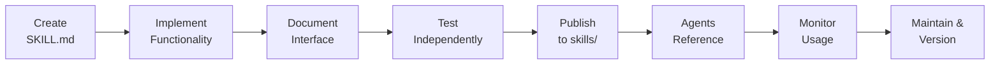
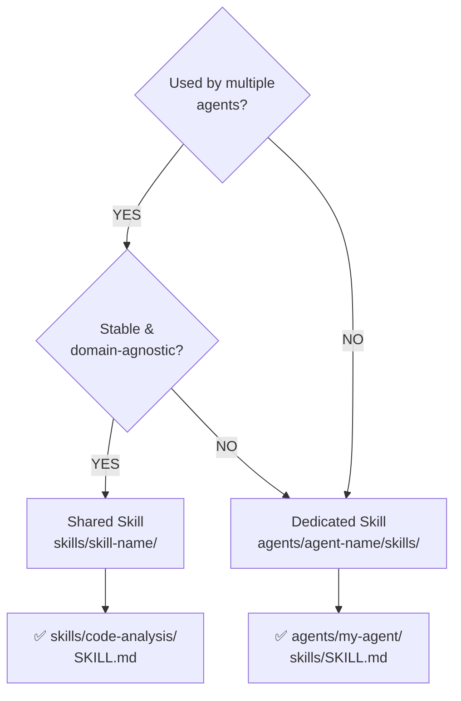

# Skills Standards

Guidelines for creating reusable skills that agents can leverage to reduce duplication and improve maintainability.

## Overview

Skills are discrete, reusable capabilities designed to be shared across multiple agents. A skill encapsulates specific functionality (code analysis, documentation generation, testing, etc.) and exposes a clear interface for agent consumption.

### Skill Lifecycle


```mermaid
graph LR
%%{init: { 'accessibility': { 'diagWithoutTitle':true } }}%%
    accTitle: Skill development lifecycle
    accDescr: Process flow from creating a skill specification through implementation, testing, publishing, and maintenance with agent usage.
    A["Create<br/>SKILL.md"] --> B["Implement<br/>Functionality"]
    B --> C["Document<br/>Interface"]
    C --> D["Test<br/>Independently"]
    D --> E["Publish<br/>to skills/"]
    E --> F["Agents<br/>Reference"]
    F --> G["Monitor<br/>Usage"]
    G --> H["Maintain &<br/>Version"]
```

## Quick Links

- [Skill Concept](#skill-concept)
- [Shared vs. Dedicated Skills](#shared-vs-dedicated-skills-decision-tree)
- [Folder Structure](#folder-structure)
- [SKILL.md Specification](#skillmd-specification)
- [Best Practices](#best-practices)
- [Examples](#examples)

---

## Skill Concept

### What Is a Skill?

A skill is a focused, reusable capability that:

- Solves a specific, well-defined problem
- Exposes a clean interface (inputs/outputs)
- Is independent from any particular agent
- Can be versioned and maintained independently
- Is documented with examples and usage guidance

### Why Skills Matter

- **Reduce Duplication** — Multiple agents can use the same skill instead of reimplementing logic
- **Simplify Maintenance** — Fix a bug once, benefit everywhere
- **Enable Composition** — Build complex agents from simple, proven skills
- **Improve Testing** — Test skills independently from agents

---

## Shared vs. Dedicated Skills Decision Tree


```mermaid
graph TD
%%{init: { 'accessibility': { 'diagWithoutTitle':true } }}%%
    accTitle: Shared vs dedicated skill decision
    accDescr: Decision tree for determining whether to create a shared skill or dedicated skill based on reusability and domain specificity.
    A{"Used by multiple<br/>agents?"} -->|YES| B{"Stable &<br/>domain-agnostic?"}
    A -->|NO| C["Dedicated Skill<br/>agents/agent-name/skills/"]
    B -->|YES| D["Shared Skill<br/>skills/skill-name/"]
    B -->|NO| C
    D --> E["✅ skills/code-analysis/<br/>SKILL.md"]
    C --> F["✅ agents/my-agent/<br/>skills/SKILL.md"]
```

## Shared vs. Dedicated Skills Detail

### Shared Skills

Shared skills live in the top-level `skills/` folder and are intended for use by multiple agents.

**Create a shared skill when:**

- The functionality is useful to more than one agent
- The skill is stable and well-documented
- The skill has no agent-specific dependencies
- You anticipate future agents needing this capability

**Example shared skills:**

- `code-analysis` — Parsing and analysing code
- `testing-framework` — Running tests and generating reports
- `documentation-generator` — Creating technical documentation
- `security-audit` — Vulnerability scanning

### Dedicated Skills

Dedicated skills live within an agent's folder (`agents/{agent-name}/skills/`) and are only used by that agent.

**Create a dedicated skill when:**

- The skill is highly specific to the agent
- The skill contains agent-specific configuration or secrets
- The skill will not be reused by other agents
- The skill is experimental or in development

**Example dedicated skills:**

- Custom preprocessing for a specific agent type
- Agent-specific prompt templates
- Domain-specific data models

---

## Folder Structure

### Shared Skill Layout

```
skills/
├── {skill-name}/
│   ├── SKILL.md                    # Skill specification & documentation
│   ├── README.md                   # Detailed guide (optional)
│   ├── implementation.js           # Main implementation
│   ├── schemas/
│   │   ├── input.schema.json
│   │   └── output.schema.json
│   ├── examples/
│   │   ├── example-1.md
│   │   └── example-2.js
│   ├── tests/
│   │   └── skill.test.js
│   └── package.json                # If NPM dependency (optional)
```

### Dedicated Skill Layout (Within Agent)

```
agents/{agent-name}/
├── skills/
│   ├── {skill-name}/
│   │   ├── SKILL.md
│   │   ├── implementation.js
│   │   └── examples.md
```

---

## SKILL.md Specification

Every skill must include a `SKILL.md` file as the entrypoint.

### Authoring a new skill

Follow the official documentation rather than this summary, which can only go
out of date:

| What                                                                 | Where                                      |
| -------------------------------------------------------------------- | ------------------------------------------ |
| The open Agent Skills format, and the `skills-ref` validator         | https://agentskills.io/specification       |
| Claude Code skills, and the fields it adds on top of the open format | https://code.claude.com/docs/en/skills     |
| Claude Code subagent definitions                                     | https://code.claude.com/docs/en/sub-agents |
| The AGENTS.md convention                                             | https://agents.md                          |

A skill is a directory holding at least `SKILL.md`:

```text
skill-name/
├── SKILL.md          # required: frontmatter plus the instructions
├── scripts/          # optional: code the agent can run
├── references/       # optional: documentation loaded on demand
└── assets/           # optional: templates and data files
```

### Plugin packaging layer (not part of the skill model)

Skills shipped inside a `plugins/*` pack may carry two extra files alongside
`SKILL.md`: a `metadata.yml` declaring per-platform adapters, and
`agents/*.yaml` files with the per-platform display and policy metadata.
These are repo-specific packaging consumed by repo tooling (skill discovery
prefers `SKILL.md` first, then `metadata.yml`). Claude Code, Copilot and Codex
do not read `metadata.yml` or `agents/*.yaml` directly. Their plugin models
read other files too, such as `SKILL.md`, agent `.md` files, hooks, MCP servers
and plugin manifests like `plugin.json`, so this list is not each host's
complete plugin model. Keep all skill behaviour in
`SKILL.md`; keep only platform routing in `metadata.yml` and `agents/*.yaml`.

Three rules catch most mistakes:

1. `name` must equal the directory name, lower case, digits and single hyphens.
2. The body must contain instructions. Frontmatter alone is not a skill, and
   neither is a heading and the generated footer — the footer is stripped before
   the body is judged, whichever footer phrase the repository is configured to
   use.
3. Anything that is not a specification field or a documented platform field
   belongs under `metadata`.

### Checking your work

```bash
npm run validate:skills          # gate: fails on a finding not in the baseline
node scripts/validation/validate-skills.js --report   # per-class counts
node scripts/validation/validate-skills.js --write-baseline
```

### File classes and the rules each is held to

`npm run validate:skills` classifies every file it checks and applies that
class's rules, so a platform extension is only permitted where the platform
actually applies.

| Class                 | Files                                                                                                    | Allowed fields                                                                                                                | Source                                     |
| --------------------- | -------------------------------------------------------------------------------------------------------- | ----------------------------------------------------------------------------------------------------------------------------- | ------------------------------------------ |
| `open-spec-skill`     | `skills/**`, `agents/**`, `plugins/**` bundled skills                                                    | the six specification fields                                                                                                  | https://agentskills.io/specification       |
| `claude-code-skill`     | `.claude/skills/**` and the directories listed in `CLAUDE_CODE_SKILL_ROOTS` (`scripts/validation/lib/skills-spec.js`) | those six plus the documented Claude Code platform fields                                                                       | https://code.claude.com/docs/en/skills       |
| `subagent-definition` | `*.agent.md`                                                                                             | the subagent frontmatter table plus this repository's own `schemas/agent-config.schema.json` required and optional field sets | https://code.claude.com/docs/en/sub-agents |
| `agents-md`           | `AGENTS.md`                                                                                              | the document frontmatter this repository uses                                                                                 | https://agents.md                          |

The specification permits exactly six top-level fields on a skill:

| Field           | Required | Constraint                                                                                                                     |
| --------------- | -------- | ------------------------------------------------------------------------------------------------------------------------------ |
| `name`          | Yes      | 1-64 characters; `a-z`, `0-9` and single hyphens only; no leading or trailing hyphen; **must match the parent directory name** |
| `description`   | Yes      | 1-1024 characters; say what the skill does and when to use it                                                                  |
| `license`       | No       | Licence name, or a reference to a bundled licence file                                                                         |
| `compatibility` | No       | Up to 500 characters; environment requirements only                                                                            |
| `metadata`      | No       | A flat map of string keys to **string** values                                                                                 |
| `allowed-tools` | No       | Space-separated pre-approved tools (experimental)                                                                              |

There is no top-level `version`, `category`, `tags`, `dependencies`,
`interfaces`, `maintainer` or `last_updated`. Record that information under
`metadata` instead. Claude Code's platform fields are permitted only on the
`claude-code-skill` class, because a claude.ai upload or a `package_skill.py`
build rejects them.

### Known findings

`scripts/validation/skills-baseline.json` lists every finding the validator
reports today, one `"<path>#<rule>"` entry each. A finding in that file is a
warning; a finding outside it fails the run, so the baseline cannot hide a
regression. It shrinks as the per-class fixes land, and the last of those
deletes the file.

### Format

````markdown
---
name: skill-name
description: One-line description of what the skill does and when to use it
license: GPL-3.0-or-later
metadata:
  version: '1.0.0'
  category: code-analysis
  tags: 'analysis, quality'
  dependencies: 'dependency-name@^1.0.0'
  interfaces: 'input, output'
  maintainer: 'LightSpeed Team'
  last_updated: '2026-07-24'
  last_reviewed: '2026-10-01'
---

# Skill Name

## Purpose

Detailed explanation of what this skill does and why it exists.

## Capabilities

- Capability 1
- Capability 2

## Input Interface

### Schema

```json
{
  "type": "object",
  "properties": {
    "parameter1": { "type": "string" }
  }
}
```

### Example

```json
{
  "parameter1": "value"
}
```

## Output Interface

### Schema

```json
{
  "type": "object",
  "properties": {
    "result": { "type": "string" }
  }
}
```

### Example

```json
{
  "result": "output value"
}
```

## Usage in Agents

Reference this skill in an agent's `agent.md`:

```yaml
skills:
  - skill-name
```

## Error Handling

Document expected errors and how to handle them.

## Performance Considerations

Note any performance implications or limitations.

## Examples

Include real-world usage examples.

## Testing

How to test this skill independently.
````

---

## Minimum Requirements

All skills must include:

1. **SKILL.md** with:
   - `name` (kebab-case, unique, and equal to the directory name)
   - `description` (one-line summary)
   - instructions in the body; frontmatter alone is not a skill
   - `metadata.version` (semantic, quoted) and `metadata.category`, where the
     skill records them
   - Purpose section
   - Input and output documentation

2. **Implementation file** (`.js`, `.py`, etc.):
   - Clean, documented code
   - Error handling
   - Type hints or JSDoc comments

3. **Examples**:
   - Real-world usage
   - Input/output samples
   - Common patterns

### Optional but Recommended

- `README.md` — Detailed guide
- `tests/` — Unit and integration tests
- `schemas/` — JSON Schema definitions
- `examples/` — Multiple usage patterns

---

## Skill Composition

### How Agents Use Skills

Agents reference shared skills in their frontmatter:

```yaml
skills:
  - code-analysis
  - security-audit
  - documentation-generator
```

At runtime, the agent can invoke skill operations:

```javascript
const analysis = await skills.codeAnalysis.analyse(code);
const security = await skills.securityAudit.scan(analysis);
const docs = await skills.documentationGenerator.generate(security);
```

### Skill Dependencies

Skills can depend on other skills:

```yaml
dependencies:
  - code-analysis@^1.0.0
  - testing-framework@^2.1.0
```

The dependency resolution system ensures:

- Transitive dependencies are resolved
- Version conflicts are detected
- Circular dependencies are prevented

---

## Versioning & Maintenance

### Semantic Versioning

Skills follow [semantic versioning](./VERSIONING.md):

| Change                                       | Version | Example       |
| -------------------------------------------- | ------- | ------------- |
| Breaking change (input/output format change) | MAJOR   | 1.0.0 → 2.0.0 |
| New capability (backwards-compatible)        | MINOR   | 1.0.0 → 1.1.0 |
| Bug fix or internal improvement              | PATCH   | 1.0.0 → 1.0.1 |

### Backward Compatibility

When updating a skill:

- **MINOR/PATCH versions** must not break existing agent integrations
- **MAJOR versions** can break compatibility; agents must explicitly opt-in
- Document all breaking changes in a CHANGELOG

### Deprecation

When deprecating a skill:

1. **Warning phase** — Add deprecation notice, suggest replacement
2. **Maintenance phase** — No new features, only critical fixes
3. **End-of-life** — Remove from repository, archive to historical folder

---

## Best Practices

### Naming

- Use kebab-case, descriptive names: `code-analysis`, `security-audit`
- Avoid generic names: prefer `markdown-linter` over `linter`
- Use domain prefixes for related skills: `testing-framework`, `testing-report-generator`

### Scope

- Keep skills focused and single-purpose
- If a skill grows too large, split it
- Favour composition over monolithic skills

### Documentation

- Write clear, concise descriptions
- Include input/output examples
- Document error cases
- Provide usage examples with real data
- Explain performance characteristics

### Error Handling

- Return structured error objects with type and message
- Provide actionable error messages
- Log errors appropriately
- Handle edge cases explicitly

### Testing

- Write unit tests for core functionality
- Include integration tests with typical agents
- Test error scenarios
- Document test execution: `npm test` or equivalent

### Accessibility

- Use clear, jargon-free language where possible
- Document any domain-specific terminology
- Provide examples for different use cases
- Include troubleshooting guides

---

## Reference Resources

- [Agent Standards](./AGENT_STANDARDS.md) — Using skills in agents
- [Workflows Standards](./WORKFLOWS_STANDARDS.md) — Composing skills in workflows
- [agentskills.io Best Practices](https://agentskills.io/skill-creation/best-practices)
- [agentskills.io Specification](https://agentskills.io/specification)
- [Claude Agent Skills Overview](https://platform.claude.com/docs/en/agents-and-tools/agent-skills/overview)

---

## Examples

### Example: Code Analysis Skill

````yaml
---
name: code-analysis
description: Analyses code for quality metrics, complexity, and patterns
metadata:
  version: "1.0.0"
  category: code-analysis
  tags: "analysis, quality, metrics"
---

# Code Analysis Skill

## Purpose
Provides comprehensive code analysis including complexity metrics, code smells, and quality assessment.

## Capabilities
- AST parsing and traversal
- Cyclomatic complexity calculation
- Code smell detection
- Dependency graph generation

## Input Schema
```json
{
  "code": "string",
  "language": "javascript|python|go|rust"
}
````

## Output Schema

```json
{
  "complexity": {
    "cyclomatic": "number",
    "cognitive": "number"
  },
  "smells": ["string"],
  "metrics": { "lines": "number", "functions": "number" }
}
```

---

**Last Updated:** 2026-07-24
**Version:** 1.0.0

---

*Docs signed by 🤖 Copilot for LightSpeedWP – always fresh!*
