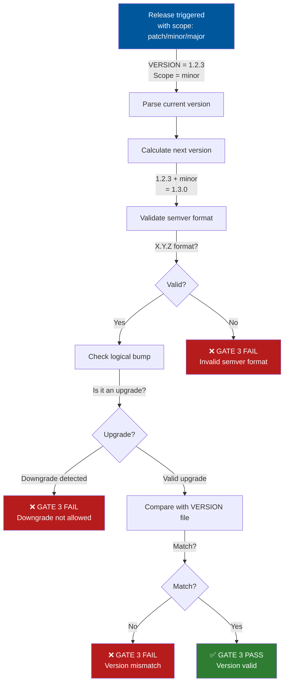

# Versioning Guidelines

LightSpeedWP projects follow [Semantic Versioning](https://semver.org/) (SemVer) principles.

---

## Canonical Version Source

- The **root-level `VERSION` file** is the single source of truth for the current project version.
- The `VERSION` file must contain only the version string in `X.Y.Z` or [semver.org](https://semver.org/) compatible format (e.g., `1.2.3`, `2.0.0-beta.1`).

---

## Version Field in Frontmatter

- All files that include a `version` field in their YAML frontmatter **must set it to exactly match** the contents of the root `VERSION` file.
- This applies to agent specs, prompt files, instructions, documentation, and any config files using the `version` field.
- When the project version changes (the `VERSION` file is updated), update all relevant `version` fields in tracked files to match.

**Example:**

```yaml
---
version: "1.2.3" # Must match contents of root VERSION file
---
```

**Validation:**
Use scripts or CI to ensure all frontmatter `version` fields remain synchronized with the root `VERSION` file.

---

## Version Format

Version numbers follow the format: `MAJOR.MINOR.PATCH`

- **MAJOR**: Incremented for incompatible API changes
- **MINOR**: Incremented for backwards-compatible functionality additions
- **PATCH**: Incremented for backwards-compatible bug fixes

**Pre-release Versions:**
May include identifiers:

- `1.0.0-alpha.1`
- `1.0.0-beta.1`
- `1.0.0-rc.1`

---

## WordPress Compatibility

- Plugins/themes should also specify minimum supported WordPress and PHP versions, and note browser compatibility as needed.

---

## Version Control Practices

### Git Tags

- Create annotated tags for releases: `git tag -a v1.0.0 -m "Release version 1.0.0"`
- Use the `v` prefix for all version tags
- Push tags to remote: `git push origin --tags`

### Branch Strategy

- `main/master`: Production-ready code
- `develop`: Integration branch for features
- `feature/*`: Feature development branches
- `hotfix/*`: Emergency fixes for production
- `release/*`: Preparation for new releases

---

## Release Process

LightSpeedWP uses a **develop-first stacked PR model** for releases:

1. **Feature Development**: Work in `feature/*` branches, merge to `develop`
2. **Release Trigger**: Run `release.yml` workflow manually (`workflow_dispatch`)
3. **Authorization**: Only members of `maintainers` team can trigger releases
4. **Version Bump**: Release agent bumps `VERSION` file and rolls `CHANGELOG.md`
5. **PR #1**: Create stacked PR: `release/vX.Y.Z` → `develop` (changelog + version)
6. **Review & Merge PR #1**: Developer reviews and merges to `develop`
7. **PR #2**: Create stacked PR: `release/vX.Y.Z` → `main` (for release)
8. **Review & Merge PR #2**: Developer reviews and merges to `main`
9. **Release & Tag**: Git tag created, GitHub Release published
10. **Post-Release Sync**: Automatic sync job merges `main` → `develop` if needed
11. **Hotfixes**: Apply via `hotfix/*` branches targeting `main`, then sync back to `develop`

**See [RELEASE_PROCESS.md](./RELEASE_PROCESS.md) for complete details** including authorization gating, dry-run mode, and rollback procedures.

---

## Changelog Management

- Maintain a `CHANGELOG.md` using [Keep a Changelog](https://keepachangelog.com/) format.
- Update changelog for each release, including sections for Added, Changed, Deprecated, Removed, Fixed, Security.

---

## WordPress Plugin/Theme Headers

Update version numbers in:

- Plugin header comment (`Version:`)
- Theme `style.css` header (`Version:`)
- `readme.txt` (`Stable tag:`)
- `package.json` (`version`)
- `composer.json` (`version`)

---

## Automation

Consider tools for version management:

- **npm version**: For Node.js projects
- **Composer**: For PHP projects
- **GitHub Actions**: For automated releases and version checks
- **WP-CLI**: For WordPress-specific versioning

---

## Example: Root VERSION File

```
1.2.3
```

## Example: Release via Workflow (Automated)

**Recommended approach:** Use the automated release workflow:

```bash
# Trigger release workflow (via GitHub UI or CLI)
gh workflow run release.yml --ref develop -f scope=patch -f dry_run=false

# Workflow automatically:
# 1. Validates authorization (you must be in maintainers team)
# 2. Bumps VERSION (patch/minor/major per scope)
# 3. Updates CHANGELOG.md with [Unreleased] → [X.Y.Z]
# 4. Creates PR #1: release/vX.Y.Z → develop
# 5. Waits for PR #1 merge
# 6. Creates PR #2: release/vX.Y.Z → main
# 7. Waits for PR #2 merge
# 8. Creates git tag and publishes GitHub Release
# 9. Auto-syncs main → develop via post-release-sync
```

**Manual release (not recommended):**

```bash
# Update version in files (not needed—workflow handles this)
npm version patch  # Updates package.json
# Update plugin header, readme.txt, and frontmatter versions manually

# Commit and tag
git add .
git commit -m "Bump version to 1.2.3"
git tag -a v1.2.3 -m "Release version 1.2.3"
git push origin main --tags
```

---

## Phase 5A: Version Validation Gate (GATE 3)

**Added in v1.0 (2026-08-18):** Phase 5A introduces automated version validation as part of the 7-layer safety gates.

### Version Validation Flow



### What GATE 3 Validates

| Check | Purpose | Fails When |
|-------|---------|-----------|
| **Semver Format** | Ensures X.Y.Z compliance | Non-numeric components, missing parts |
| **Logical Bump** | Prevents downgrades | New version < current version |
| **File Consistency** | Matches VERSION file | Calculated version ≠ VERSION |
| **Pre-release Handling** | Allows alpha/beta/rc | Invalid pre-release suffixes |

### Example Scenarios

**✓ PASS: Valid patch bump**

- Current: `1.2.3`
- Scope: `patch`
- Calculated: `1.2.4` → GATE 3 passes

**✓ PASS: Valid minor bump**

- Current: `2.0.5`
- Scope: `minor`
- Calculated: `2.1.0` → GATE 3 passes

**✗ FAIL: Downgrade attempt**

- Current: `3.0.0`
- Scope: `major`
- Calculated: `2.0.0` (downgrade) → GATE 3 fails

**✗ FAIL: Invalid version format**

- Calculated: `1.2` (missing PATCH) → GATE 3 fails
- Calculated: `1.2.3.4` (too many parts) → GATE 3 fails

### Related Documentation

- **Release Process:** [RELEASE_PROCESS.md](./RELEASE_PROCESS.md#phase-5a-safety-gates-layer-new)
- **Changelog Management:** [CHANGELOG_AUTOMATION.md](./CHANGELOG_AUTOMATION.md)

---

## Best Practices

1. **Always test** before releasing
2. **Document breaking changes** clearly
3. **Maintain backwards compatibility** where possible
4. **Use pre-release versions** for testing
5. **Follow WordPress and SemVer guidelines**
6. **Automate version updates and verification** whenever possible
7. **Communicate changes** to users via changelog and release notes

---

## Alternative: Per-File Versioning Strategy (Experimental)

> **Note**: This is an alternative versioning approach for documentation and configuration files. The unified versioning strategy above remains the recommended default.

### Overview

For documentation-heavy repositories (like `.github`), individual files may evolve independently. This strategy allows per-file semantic versioning whilst maintaining coordination with the repository version.

### Rules

- **Repository version** (`/VERSION`): Uses `X.Y.0` format for coordinated releases
- **File version** (`version:` in frontmatter): Independent `X.Y.Z` versioning per file
- **Guardrail**: A file's minor version (`X.Y`) **must not exceed** the repository's minor version

### Version Bump Types

#### Patch Bump (`X.Y.Z` → `X.Y.Z+1`)

- Content edits, typo fixes, clarifications
- No schema or structural changes
- Safe for all consumers

#### Minor Bump (`X.Y.Z` → `X.Y+1.0`)

- Schema-related key changes in that file
- New required fields or breaking changes for agents
- Must not exceed repository minor version

### Examples

**Scenario 1: Edit instruction prose**

- Current: `version: 0.1.3`
- Action: Fix typos, clarify instructions
- Result: `version: 0.1.4` (patch bump)

**Scenario 2: Add required frontmatter field**

- Current: `version: 0.2.5`, Repo: `0.2.0`
- Action: Add new required `applyTo` field
- Result: Cannot bump to `0.3.0` (would exceed repo `0.2.0`)
- Must wait for repo bump to `0.3.0` first

**Scenario 3: Coordinated release**

- Repo bumps: `0.2.0` → `0.3.0`
- Files with breaking changes: bump to `0.3.0`
- Files with only content edits: remain at `0.2.x` or bump patch

### Guardrails

A file **must not** have a minor version exceeding the repository minor version:

- ✓ File `0.2.8` with Repo `0.2.0` (valid)
- ✓ File `0.2.0` with Repo `0.3.0` (valid)
- ✗ File `0.3.0` with Repo `0.2.0` (invalid - exceeds repo minor)

### Automation

Use `.github/scripts/versioning/bump-file-version.js` for single or bulk version bumps:

```bash
# Bump patch version of a single file
node .github/scripts/versioning/bump-file-version.js ../instructions/coding-standards.instructions.md patch

# Bump minor version (with guardrail check)
node .github/scripts/versioning/bump-file-version.js .github/prompts/review.prompt.md minor

# Bulk bump patch versions
node .github/scripts/versioning/bump-file-version.js --bulk ".github/instructions/**/*.md" patch
```

The script will:

- Automatically update the `version` field
- Update `last_updated` to current date
- Enforce the guardrail (file minor ≤ repo minor)
- Exit with error if guardrail would be violated

### CI Validation

Add a CI check to ensure file versions don't exceed repository version:

```yaml
- name: Validate file versions
  run: |
    REPO_VERSION=$(cat VERSION)
    node .github/scripts/versioning/validate-versions.js --repo-version $REPO_VERSION
```

### When to Use

**Use per-file versioning when:**

- Documentation/instructions evolve independently
- Fine-grained change tracking is valuable
- Multiple maintainers update different files

**Use unified versioning when:**

- Coordinated releases are preferred
- Simplicity is more important than granularity
- All files change together

---

## Automation Scripts

### Available Scripts

#### `scripts/versioning/bump-file-version.cjs`

Bump individual or bulk file versions with guardrails:

```bash
# Single file
node scripts/versioning/bump-file-version.cjs <file> [patch|minor]

# Bulk update
node scripts/versioning/bump-file-version.cjs --bulk "<pattern>" [patch|minor]

# Help
node scripts/versioning/bump-file-version.cjs --help
```

#### `.github/scripts/maintenance/fix-references.cjs`

Validate and fix broken reference links in frontmatter:

```bash
# Scan and fix all references
node .github/scripts/maintenance/fix-references.cjs

# Show current fix map
node .github/scripts/maintenance/fix-references.cjs --fix-map

# Help
node .github/scripts/maintenance/fix-references.cjs --help
```

### Integration with CI/CD

Consider adding these scripts to GitHub Actions workflows for:

- Pre-commit hooks (validate versions before commit)
- Pull request checks (ensure references are valid)
- Release automation (bulk bump versions on release)

---

---

*Maintained by the 🤖 LightSpeedWP Automation Team*
