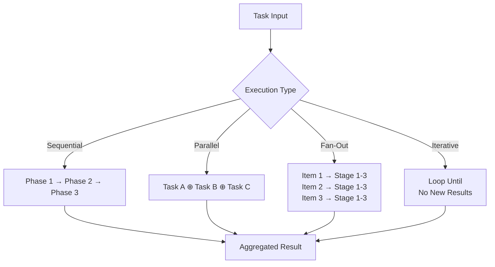
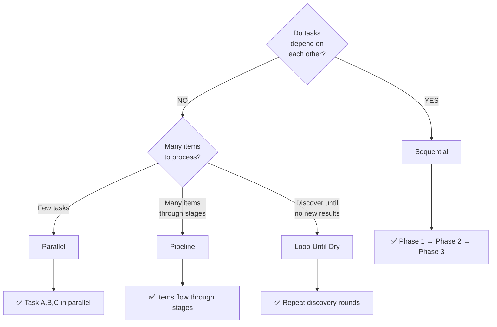

# Workflows Standards

Guidelines for creating reusable, multi-agent workflows that orchestrate complex tasks.

## Overview

Workflows are JavaScript/TypeScript scripts that coordinate multiple agents, manage execution state, and implement patterns like fan-out, aggregation, and iterative refinement. This document covers standards for creating portable, reusable workflows.

**Important:** Workflows are NOT GitHub Actions workflows. They are agentic orchestration scripts.

### Workflow Execution Patterns



## Overview Details

Workflows are documented as Markdown files describing orchestration logic and patterns.

---

## Workflow Concept

### What Is an Agentic Workflow?

A workflow is a reusable orchestration script that:

- Spawns multiple agents to accomplish a goal
- Manages execution flow (sequential, parallel, conditional)
- Aggregates results from multiple sources
- Implements complex patterns (fan-out, verification, loop-until-dry)
- Respects budget constraints and token limits

### Workflows vs. GitHub Actions

| Aspect | Agentic Workflow | GitHub Actions |
|--------|------------------|----------------|
| **Purpose** | Coordinate AI agents | Automate CI/CD pipelines |
| **Language** | JavaScript/TypeScript | YAML |
| **Scope** | Task execution | Repository automation |
| **State Management** | In-memory, structured | Sequential steps |
| **Output** | Structured data | Logs and artifacts |

---

## Folder Structure

Workflows are stored in the `workflows/` folder:

```
workflows/
├── {workflow-name}.js                    # Single-file workflow
└── {workflow-name}/                      # Multi-file workflow
    ├── index.js                          # Main workflow script
    ├── package.json                      # Dependencies (optional)
    ├── phases/
    │   ├── discovery.js
    │   └── verification.js
    ├── agents/
    │   └── custom-agent.js               # Workflow-specific agents
    ├── lib/
    │   └── helpers.js                    # Utility functions
    └── examples/
        └── example-usage.js
```

---

## Workflow Documentation Format

Workflows are documented as Markdown files in the `workflows/` folder, following the repository's established conventions.

### File Format

Workflows are defined as Markdown documents describing workflow logic, patterns, and orchestration:

```markdown
# Workflow Name

## Purpose
What this workflow accomplishes.

## Phases
1. **Discovery** — Find and analyse items
2. **Verification** — Verify findings

## Pattern
[Describe execution pattern: sequential, parallel, pipeline, etc.]

## Process

### Phase 1: Discovery
- Step 1: description
- Step 2: description

### Phase 2: Verification
- Independent verification of each finding
- Parallel execution of verification agents
- Aggregation of results

## Agent Invocation
How this workflow invokes agents (conceptual, not executable).

## Error Handling
How failures are handled and recovered.

## Budget Management
How token budget is managed across phases.
```

### Metadata Object (Required)

The `meta` object must be a pure literal (no computed values):

```javascript
export const meta = {
  name: 'workflow-identifier',           // kebab-case, unique
  description: 'What this workflow does', // One-line summary
  phases: [                              // Phase definitions
    {
      title: 'Phase Name',
      detail: 'What happens in this phase',
      model: 'claude-opus-4-8',          // Optional: override model
    },
  ],
}
```

---

## Execution Patterns

### Choosing an Execution Pattern



### Sequential Execution

Run tasks one after another:

```javascript
const phase1 = await agent('Task 1', { phase: 'Phase 1' })
const phase2 = await agent('Task 2', { phase: 'Phase 1' })
const result = await agent('Combine', {
  prompt: `Process: ${phase1} and ${phase2}`,
  phase: 'Phase 2',
})
```

### Parallel Execution

Run multiple tasks concurrently:

```javascript
const results = await parallel([
  () => agent('Task A', { label: 'task-a' }),
  () => agent('Task B', { label: 'task-b' }),
  () => agent('Task C', { label: 'task-c' }),
])
```

### Pipeline (Fan-Out)

Run items through multiple stages with staggered execution:

```javascript
const processed = await pipeline(
  items,
  item => agent(`Stage 1: ${item}`, { label: 'stage1' }),
  item => agent(`Stage 2: ${item}`, { label: 'stage2' }),
  item => agent(`Stage 3: ${item}`, { label: 'stage3' }),
)
```

### Loop-Until-Dry

Repeat discovery until no new items are found:

```javascript
const all = []
let round = 0
while (round < 5) {
  const found = await agent('Find X', { schema: SCHEMA })
  const fresh = found.filter(f => !all.find(a => a.id === f.id))
  if (!fresh.length) break
  all.push(...fresh)
  round++
  log(`Round ${round}: found ${fresh.length} items`)
}
```

### Adversarial Verification

Have multiple agents independently verify a claim:

```javascript
const votes = await parallel([
  () => agent(`Verify (lens 1): ${claim}`, { schema: VERDICT }),
  () => agent(`Verify (lens 2): ${claim}`, { schema: VERDICT }),
  () => agent(`Verify (lens 3): ${claim}`, { schema: VERDICT }),
])
const confirmed = votes.filter(v => v.verdict).length >= 2
```

---

## Best Practices

### Naming

- Use kebab-case: `code-quality-audit`, `schema-migration-verifier`
- Descriptive: prefer `database-migration-validator` over `worker`
- Match `meta.name` to filename

### Phase Organization

- Name phases clearly: 'Discovery', 'Verification', 'Synthesis'
- Keep 2-5 phases per workflow (more indicates over-complexity)
- Use `phase()` calls to match `meta.phases` titles exactly

### Error Handling

- Return `null` on agent errors (the Workflow engine handles it)
- Filter results: `results.filter(Boolean)` to remove nulls
- Log meaningful progress: `log('Found ${count} items')`

### Budget Awareness

- Check `budget.total` and `budget.remaining()` before loops
- Scale work to available budget:

  ```javascript
  while (budget.total && budget.remaining() > 50_000) {
    // Allocate work proportional to budget
  }
  ```

### Result Structuring

- Return structured data, not strings
- Use schemas to enforce output format
- Document return value shape

### Logging

Use `log()` for user-facing progress messages:

```javascript
log(`Scanning ${files.length} files`)
log(`Found ${issues.length} issues, verifying...`)
log(`${confirmed.length}/${issues.length} confirmed`)
```

---

## Integration with Agents

Agents can invoke workflows:

```javascript
const result = await workflow('workflow-name', {
  // Optional args
})
```

Workflows can spawn agents:

```javascript
const result = await agent('Task description', {
  label: 'descriptive-label',
  phase: 'Current Phase',
  schema: RESULT_SCHEMA,
})
```

---

## Examples

### Example 1: Simple Discovery Workflow

```javascript
export const meta = {
  name: 'find-broken-links',
  description: 'Discover and verify broken links in documentation',
  phases: [
    { title: 'Discovery', detail: 'Find all links' },
    { title: 'Verification', detail: 'Check if links are valid' },
  ],
}

phase('Discovery')
const links = await agent('Find all links in docs/', {
  label: 'find-links',
  schema: LINKS_SCHEMA,
})

phase('Verification')
const verified = await parallel(links.map(link => () =>
  agent(`Verify: ${link.url}`, { label: `verify-${link.id}` })
))

return {
  total: links.length,
  verified: verified.filter(Boolean).length,
  broken: verified.filter(v => !v.valid),
}
```

### Example 2: Multi-Phase Audit Workflow

```javascript
export const meta = {
  name: 'comprehensive-code-audit',
  description: 'Multi-phase code quality audit with verification',
  phases: [
    { title: 'Scan', detail: 'Find issues across codebase' },
    { title: 'Dedup', detail: 'Remove duplicate findings' },
    { title: 'Verify', detail: 'Adversarially verify findings' },
    { title: 'Synthesize', detail: 'Summarize results' },
  ],
}

phase('Scan')
const findings = await parallel([
  () => agent('Find security issues', { label: 'security', schema: FINDINGS }),
  () => agent('Find performance issues', { label: 'perf', schema: FINDINGS }),
  () => agent('Find style violations', { label: 'style', schema: FINDINGS }),
])

const all = findings.filter(Boolean).flatMap(f => f.findings)

phase('Dedup')
const deduped = dedupeByFileAndLine(all)
log(`${all.length} findings → ${deduped.length} unique`)

phase('Verify')
const verified = await parallel(deduped.map(f => () =>
  agent(`Is this real? ${f.description}`, { schema: VERDICT })
))

const confirmed = deduped.filter((f, i) => verified[i]?.real)

phase('Synthesize')
const report = await agent(`Summarize findings`, {
  prompt: JSON.stringify(confirmed),
  schema: REPORT_SCHEMA,
})

return report
```

---

## See Also

- [Agent Standards](./AGENT_STANDARDS.md) — Agents that invoke workflows
- [Skills Standards](./SKILLS_STANDARDS.md) — Reusable capabilities in workflows
- [Cookbooks Standards](./COOKBOOKS_STANDARDS.md) — Executable workflow recipes and playbooks
- [Hooks Standards](./HOOKS_STANDARDS.md) — Event handlers during workflow execution

---

## Related Documentation

- [Agent Standards](./AGENT_STANDARDS.md) — Agents that invoke workflows
- Anthropic Claude Agent SDK documentation — Workflow execution engine

---

**Last Updated:** 2026-07-24  
**Version:** 1.0.0
