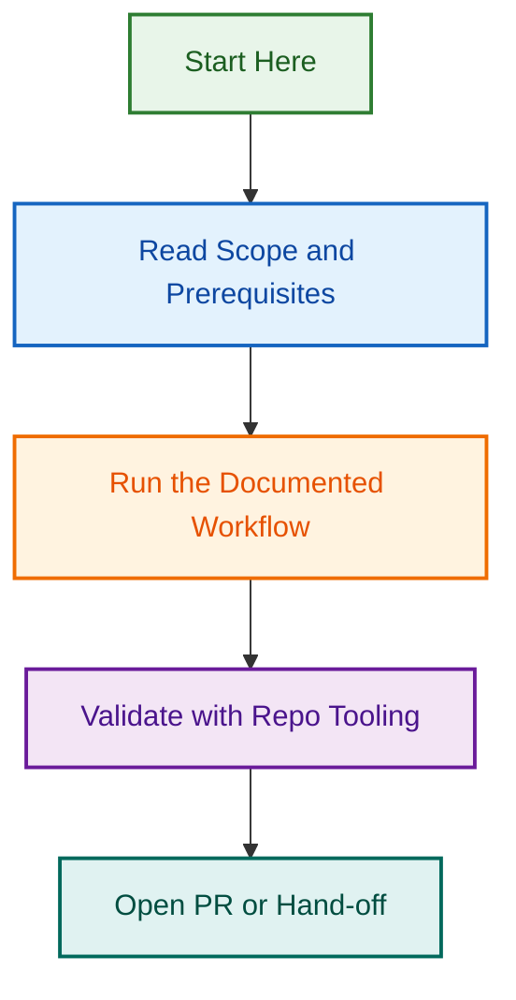

# Portable Hooks & Guardrails

This folder contains reusable hooks, guardrails, and tool adapters designed to enhance security, logging, and safety across Claude Code, GitHub Actions, and other automation platforms.

## Overview

Portable hooks are self-contained modules that can be integrated into any LightSpeed project or automation workflow. They provide:

- **Security Guardrails** – Prevent accidental exposure of secrets and credentials
- **Session Logging** – Track AI agent activities for auditing and debugging
- **Tool Governance** – Control and validate tool usage across automation platforms
- **Safety Adapters** – Bridge between platforms whilst maintaining consistent security policies

## Available Hooks

| Hook | Status | Purpose |
|------|--------|---------|
| [tool-guardian](./tool-guardian/README.md) | active | Control and validate tool usage permissions |
| [secrets-scanner](./secrets-scanner/README.md) | active | Detect and prevent secret exposure |
| [session-logger](./session-logger/README.md) | active | Log and audit AI agent sessions |

## Hook Registry

See [hook-registry.json](./hook-registry.json) for the canonical ownership index of all portable hooks, including their status, paths, and metadata.

## Integration Guide

### Using Hooks in Claude Code

Hooks can be configured in your project's `settings.json`:

```json
{
  "hooks": {
    "before:submit": ["./hooks/secrets-scanner"],
    "after:tool": ["./hooks/tool-guardian"],
    "on:session-start": ["./hooks/session-logger"]
  }
}
```

### Using Hooks in GitHub Actions

Reference portable hooks in your workflow files:

```yaml
- name: Scan for secrets
  uses: lightspeedwp/.github/hooks/secrets-scanner@main

- name: Validate tool usage
  uses: lightspeedwp/.github/hooks/tool-guardian@main
```

## Stability & Versioning

- **stable** – Recommended for production use; breaking changes trigger major version bumps
- **experimental** – May change frequently; suitable for testing and feedback
- **deprecated** – No longer recommended; use alternative instead

For version migration guides, see individual hook documentation.

## Contributing

To add a new hook:

1. Create a new directory with a clear, descriptive name
2. Include a `README.md` with full documentation and examples
3. Update `hook-registry.json` with metadata
4. Add tests in the hook's directory
5. Submit a PR for review

See [CONTRIBUTING.md](../CONTRIBUTING.md) for full contribution guidelines.

---

---

*🎼 Orchestrated automation — where intelligence meets operations*
## Visual Workflow


