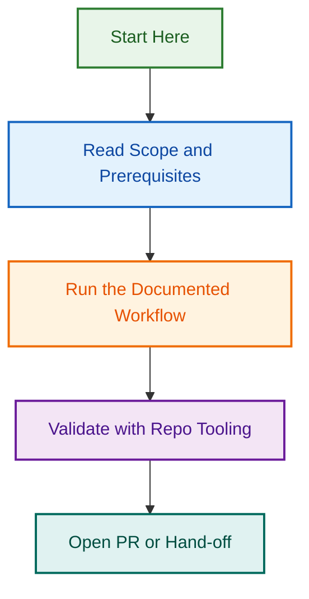

# agent-security-auditor

Scans agent files for hardcoded secrets and unsafe patterns; supports a SKIP directive.

## Triggers

pre-push

## Usage

```bash
node hooks/agent-security-auditor/index.js <path>
```

Programmatic:

```js
const hook = require("./hooks/agent-security-auditor");
const { valid, errors, warnings } = hook.validate("<path>");
```

Returns `{ valid: boolean, errors: string[], warnings: string[] }`. Exit code is
`1` when `valid` is `false`. Tests live in `__tests__/`.

---

🔍 *Audit report generated {audit_date} by the LightSpeedWP team.*

[📋 Reports Index](https://github.com/lightspeedwp/.github/tree/develop/.github/reports) · [📞 Contact](https://lightspeedwp.agency/contact)
## Visual Workflow


