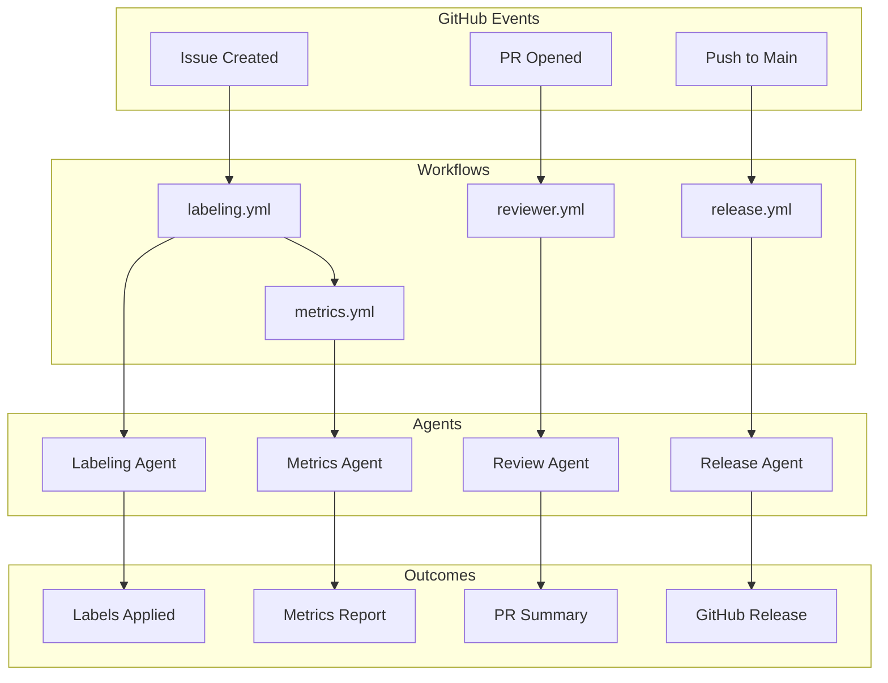
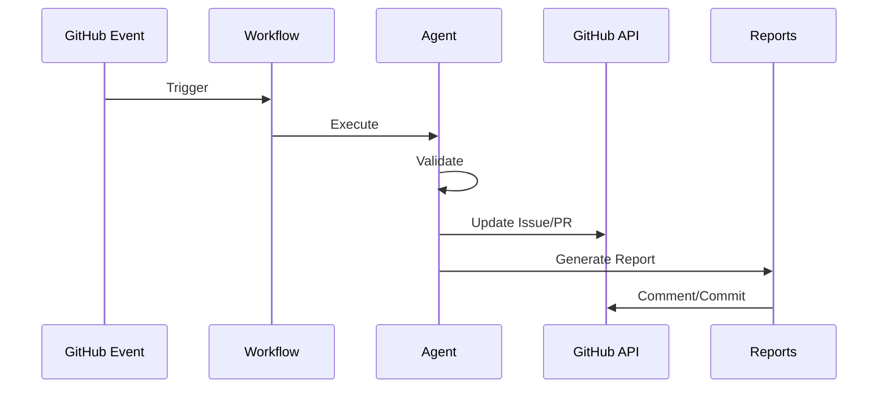

# Automation Standards

You are a GitHub automation architect. Follow our agent and workflow standards to design, audit, and maintain organisation-wide automation. Avoid ad hoc scripts, unpinned actions, or undocumented permission changes unless explicitly justified in this repository.

## Overview

Applies to all GitHub automation in this repository: agents, workflows, labelling, metrics, releases, and project synchronisation. Excludes project-specific pipeline rules unless referenced. Use this as the canonical guide for automation design and maintenance.

## General Rules

- Pin actions and dependencies; document permissions and triggers.
- Prefer reusable workflows/composite actions; avoid ad hoc scripts.
- Keep automation config-driven and observable (metrics, reports).
- Align with organisation coding standards and security requirements.

## Detailed Guidance

This document consolidates standards for all GitHub repository automation including agents, workflows, labeling, metrics, reporting, releases, and project management synchronization.

## Purpose

Ensure consistent, reliable, and maintainable automation across GitHub repositories through standardized agent specifications, workflow patterns, and best practices for repository health management.

---

## Table of Contents

- [Automation Architecture](#automation-architecture)
- [Agent Standards](#agent-standards)
- [Labeling Automation](#labeling-automation)
- [Release Management](#release-management)
- [Metrics & Reporting](#metrics--reporting)
- [Project Synchronization](#project-synchronization)
- [Code Review Automation](#code-review-automation)
- [Planning Automation](#planning-automation)
- [CI/CD Integration](#cicd-integration)
- [Best Practices](#best-practices)
- [References](#references)

## Examples

- Agent specification and implementation snippets in [Agent Standards](#agent-standards) and the embedded templates below.
- Workflow structure sample in [Automation Architecture](#automation-architecture) and Mermaid diagram.

## Validation

- Run `npm test` or repo-specific agent tests.
- Validate workflows with `actionlint` and ensure actions are pinned to SHAs.
- Check labeler/labels/issue-types YAML against schemas where provided.

## Automation Architecture

### System Overview



### Repo Automation Components

| Component        | Purpose                       | Files                                    |
| ---------------- | ----------------------------- | ---------------------------------------- |
| **Agents**       | Executable automation logic   | `.github/agents/*.agent.js`              |
| **Workflows**    | GitHub Actions triggers       | `.github/workflows/*.yml`                |
| **Instructions** | Agent behavior documentation  | `.github/instructions/*.instructions.md` |
| **Prompts**      | Legacy/repo-local automation templates during migration | `.github/prompts/*.prompt.md` |
| **Reports**      | Automation outputs            | `.github/reports/**/*`                   |

Portable agent specs, skills, hooks, instructions, and agentic workflows belong
in the matching top-level source folders described in
`file-organisation.instructions.md`.

---

## Agent Standards

### Agent Specification Format

All agents must have both a specification file (`.agent.md`) and implementation (`.agent.js`).

**Agent Specification Template:**

```markdown
---
file_type: "agent"
name: "agent-name"
description: "Brief description of agent purpose"
version: "v1.0"
last_updated: "YYYY-MM-DD"
owners: ["team-name"]
category: "automation-type"
status: "active"
---

# Agent Name

## Mission

What this agent does and why it exists.

## Triggers

- When this agent runs
- What events activate it

## Process

1. Step-by-step workflow
2. Decision points
3. Output generation

## Inputs

- Configuration files
- Environment variables
- Event payloads

## Outputs

- Files created/modified
- API calls made
- Reports generated

## Guardrails

- Safety constraints
- Validation requirements
- Failure handling

## Template References

- Related workflows
- Documentation
- Dependencies
```

### Agent Implementation Standards

**File Structure:**

```javascript
#!/usr/bin/env node

/**
 * Agent Name
 *
 * @description Brief description
 * @version 1.0.0
 * @see agents/agent-name.agent.md
 */

// Configuration
const config = {
  dryRun: process.argv.includes("--dry-run"),
  verbose: process.argv.includes("--verbose"),
};

// Main execution
async function main() {
  try {
    // Validate inputs
    validateConfiguration();

    // Execute agent logic
    const result = await executeAgent();

    // Generate outputs
    await generateReport(result);

    // Exit successfully
    process.exit(0);
  } catch (error) {
    console.error("Agent failed:", error);
    process.exit(1);
  }
}

// Run if called directly
if (require.main === module) {
  main();
}

module.exports = { main };
```

### Agent Testing

All agents must have corresponding test files:

```javascript
// __tests__/agent-name.test.js
const { main } = require("../agent-name.agent");

describe("Agent Name", () => {
  it("should execute successfully with valid config", async () => {
    const result = await main({ dryRun: true });
    expect(result).toBeDefined();
  });

  it("should handle errors gracefully", async () => {
    await expect(main({ invalid: true })).rejects.toThrow(
      "Invalid configuration",
    );
  });
});
```

---

## Labeling Automation

### Purpose

Automatically apply, validate, and manage labels on issues and pull requests based on file paths, branch names, and content.

### Configuration Files

- **Labels definition**: `.github/labels.yml`
- **Labeling rules**: `.github/labeler.yml`
- **Label strategy**: `docs/LABEL_STRATEGY.md`

### Label Categories

| Category      | Format       | Purpose              | Examples                                    |
| ------------- | ------------ | -------------------- | ------------------------------------------- |
| **Status**    | `status:*`   | Issue/PR lifecycle   | `status:needs-triage`, `status:in-progress` |
| **Type**      | `type:*`     | Work classification  | `type:bug`, `type:feature`                  |
| **Priority**  | `priority:*` | Urgency              | `priority:high`, `priority:low`             |
| **Area**      | `area:*`     | Repository section   | `area:docs`, `area:workflows`               |
| **Component** | `comp:*`     | Specific component   | `comp:ci-cd`, `comp:automation`             |
| **Language**  | `lang:*`     | Programming language | `lang:javascript`, `lang:yaml`              |

### Labeling Workflow

```yaml
name: Labeling
on:
  issues:
    types: [opened, edited, labeled, unlabeled]
  pull_request:
    types: [opened, edited, labeled, unlabeled, synchronize]

jobs:
  label:
    runs-on: ubuntu-latest
    steps:
      - uses: actions/checkout@v4
      - uses: actions/labeler@v5
        with:
          configuration-path: .github/labeler.yml
      - run: node ../scripts/agents/labeling.agent.js
```

### Labeler Rules Example

```yaml
# .github/labeler.yml
"area:docs":
  - changed-files:
      - any-glob-to-any-file: "docs/**/*"
      - any-glob-to-any-file: "**/*.md"

"area:workflows":
  - changed-files:
      - any-glob-to-any-file: ".github/workflows/**/*.yml"

"lang:javascript":
  - changed-files:
      - any-glob-to-any-file: "**/*.{js,jsx,ts,tsx}"

"type:bug":
  - head-branch: ["^fix/", "^hotfix/"]

"type:feature":
  - head-branch: ["^feat/", "^feature/"]
```

### Label Validation

The labeling agent enforces:

- **One status label** per issue/PR
- **One priority label** per issue/PR
- **At least one type label**
- **Label color and description standards**
- **No duplicate or conflicting labels**

---

## Release Management

### Release Automation Phases

#### 1. Pre-Release (Preparation)

**Purpose**: Analyze repository health before release

**Tasks:**

- Scan repository structure
- Validate agent specifications
- Check test coverage
- Audit documentation
- Validate configuration files
- Generate pre-release checklist

**Output**: Release readiness report

#### 2. Release Execution (Automation)

**Purpose**: Execute validated release

**Tasks:**

- Validate prerequisites (tests pass, linting clean)
- Determine semantic version
- Update VERSION file
- Update CHANGELOG.md
- Create git tag
- Publish GitHub Release
- Generate audit trail

**Output**: Published GitHub Release

### Semantic Versioning

Format: `MAJOR.MINOR.PATCH`

- **MAJOR**: Breaking changes (incompatible)
- **MINOR**: New features (backward-compatible)
- **PATCH**: Bug fixes (backward-compatible)

**Version Bumping:**

```bash
# Patch release (default)
node ../scripts/agents/release.agent.js --scope=patch

# Minor release
node ../scripts/agents/release.agent.js --scope=minor

# Major release
node ../scripts/agents/release.agent.js --scope=major
```

### Release Workflow

```yaml
name: Release
on:
  workflow_dispatch:
    inputs:
      scope:
        description: "Release scope"
        required: true
        type: choice
        options:
          - patch
          - minor
          - major

jobs:
  release:
    runs-on: ubuntu-latest
    steps:
      - uses: actions/checkout@v4
      - uses: actions/setup-node@v4
      - run: npm ci
      - run: npm test
      - run: node ../scripts/agents/release.agent.js --scope=${{ inputs.scope }}
      - uses: actions/create-release@v1
        with:
          tag_name: ${{ env.VERSION }}
          release_name: Release ${{ env.VERSION }}
```

### Changelog Format

```markdown
# Changelog

## [Unreleased]

### Added

- New features

### Changed

- Changes to existing functionality

### Fixed

- Bug fixes

### Removed

- Removed features

## [1.0.0] - 2025-12-07

### Added

- Initial release
```

---

## Metrics & Reporting

### Metrics Collection

**Automated Metrics:**

- Issue/PR counts (open, closed, merged)
- Response times (first response, time to close)
- Label distribution
- Contributor activity
- Automation success rates

### Metrics Workflow

```yaml
name: Issue Metrics
on:
  schedule:
    - cron: "0 0 1 * *" # Monthly
  workflow_dispatch:

jobs:
  metrics:
    runs-on: ubuntu-latest
    steps:
      - uses: actions/checkout@v4
      - run: node ../scripts/agents/metrics.agent.js
      - uses: github/issue-metrics@v2
        env:
          GH_TOKEN: ${{ secrets.GITHUB_TOKEN }}
```

### Report Generation

**Report Structure:**

```markdown
---
file_type: "report"
category: "metrics"
created_date: "2025-12-07"
---

# Monthly Metrics Report

## Summary

- Total Issues: 45
- Total PRs: 32
- Avg Response Time: 2.5 hours
- Automation Success: 98%

## Trends

[Chart or table of trends]

## Recommendations

1. Action items based on metrics
2. Process improvements
```

### Report Storage

- **Location**: `.github/reports/{category}/`
- **Naming**: `{subject}-{type}-{date}.{md|json}`
- **Spec files**: Every JSON report needs a `.spec.md` file

---

## Project Synchronization

### Purpose

Sync GitHub Project board fields with issue/PR metadata and labels.

### Field Mapping

| Label                 | Project Field | Value       |
| --------------------- | ------------- | ----------- |
| `status:needs-triage` | Status        | Triage      |
| `status:in-progress`  | Status        | In Progress |
| `status:needs-review` | Status        | Review      |
| `priority:high`       | Priority      | High        |
| `priority:normal`     | Priority      | Normal      |
| `type:bug`            | Type          | Bug         |
| `type:feature`        | Type          | Feature     |

### Sync Workflow

```yaml
name: Project Meta Sync
on:
  issues:
    types: [opened, labeled, unlabeled]
  pull_request:
    types: [opened, labeled, unlabeled]

jobs:
  sync:
    runs-on: ubuntu-latest
    steps:
      - uses: actions/checkout@v4
      - run: node ../scripts/agents/project-meta-sync.agent.js
        env:
          GH_TOKEN: ${{ secrets.PROJECT_TOKEN }}
```

---

## Code Review Automation

### Review Summary Components

1. **CI Status**: Pass/fail indicators
2. **Changelog Check**: Presence validation
3. **File Analysis**: Changed files summary
4. **Recommendations**: Actionable next steps

### Review Workflow

```yaml
name: PR Reviewer
on:
  pull_request:
    types: [opened, synchronize, ready_for_review]
  check_suite:
    types: [completed]

jobs:
  review:
    runs-on: ubuntu-latest
    steps:
      - uses: actions/checkout@v4
      - run: node ../scripts/agents/reviewer.agent.js
```

### Review Comment Format

```markdown
## PR Review Summary

### CI Status

✅ All checks passed

### Required Files

✅ Changelog present
✅ Tests included

### File Changes

- `scripts/agents/labeling.agent.js`: Modified
- `tests/labeling.test.js`: Added

### Recommendations

- Ensure test coverage > 75%
- Update documentation if needed
```

---

## Planning Automation

### PR Checklist Management

**Purpose**: Auto-generate and update merge checklists

**Checklist Components:**

- [ ] Tests pass
- [ ] Documentation updated
- [ ] Changelog entry added
- [ ] CI checks green
- [ ] Code reviewed
- [ ] No merge conflicts

### Planner Workflow

```yaml
name: PR Planner
on:
  pull_request:
    types: [opened, edited, synchronize]

jobs:
  plan:
    runs-on: ubuntu-latest
    steps:
      - uses: actions/checkout@v4
      - run: node ../scripts/agents/planner.agent.js
```

---

## CI/CD Integration

### Automation Pipeline



### Required CI Checks

All automation must pass these gates:

- [ ] Linting (ESLint, YAML lint)
- [ ] Unit tests (Jest)
- [ ] Integration tests
- [ ] Code coverage (> 75%)
- [ ] Security scan
- [ ] Dry-run validation

---

## Best Practices

### Agent Development

**DO:**

- ✅ Support `--dry-run` mode for testing
- ✅ Provide verbose logging with `--verbose`
- ✅ Validate all inputs before execution
- ✅ Handle errors gracefully with clear messages
- ✅ Generate comprehensive audit logs
- ✅ Write tests for all agent logic
- ✅ Document all configuration options

**DON'T:**

- ❌ Make changes without dry-run testing
- ❌ Skip input validation
- ❌ Ignore error conditions
- ❌ Duplicate comments or actions
- ❌ Bypass safety guardrails
- ❌ Output secrets or credentials

### Workflow Design

- **Trigger carefully**: Only on necessary events
- **Use job dependencies**: Control execution order
- **Cache dependencies**: Speed up builds
- **Fail fast**: Stop on critical errors
- **Provide feedback**: Clear status messages
- **Monitor usage**: Track Actions minutes

### Testing Automation

```javascript
describe("Automation Agent", () => {
  it("should run in dry-run mode", async () => {
    const result = await runAgent({ dryRun: true });
    expect(result.filesModified).toBe(0);
  });

  it("should validate configuration", () => {
    expect(() => validateConfig({})).toThrow();
  });

  it("should handle API errors", async () => {
    mockAPI.mockRejectedValue(new Error("API Error"));
    await expect(runAgent()).rejects.toThrow();
  });
});
```

---

## Troubleshooting

### Common Issues

**Agent fails silently:**

```bash
# Run with verbose logging
node ../scripts/agents/agent-name.agent.js --verbose

# Check exit code
echo $?
```

**Workflow not triggering:**

- Check event filters in workflow YAML
- Verify workflow file syntax
- Check repository permissions
- Review workflow run history

**Labels not syncing:**

- Validate `.github/labeler.yml` syntax
- Check label definitions in `.github/labels.yml`
- Verify file path patterns match
- Test with dry-run mode

---

## References

- [instructions.instructions.md](instructions.instructions.md)
- [workflows.instructions.md](workflows.instructions.md)
- [labeling.instructions.md](labeling.instructions.md)
- [pull-requests.instructions.md](pull-requests.instructions.md)
- [issues.instructions.md](issues.instructions.md)
- [quality-assurance.instructions.md](quality-assurance.instructions.md)
- [file-organisation.instructions.md](file-organisation.instructions.md)
- [agent.md](../agents/agent.md)
- [GitHub Actions Documentation](https://docs.github.com/en/actions)
- [GitHub API](https://docs.github.com/en/rest)
- [Semantic Versioning](https://semver.org/)
- [Keep a Changelog](https://keepachangelog.com/)
