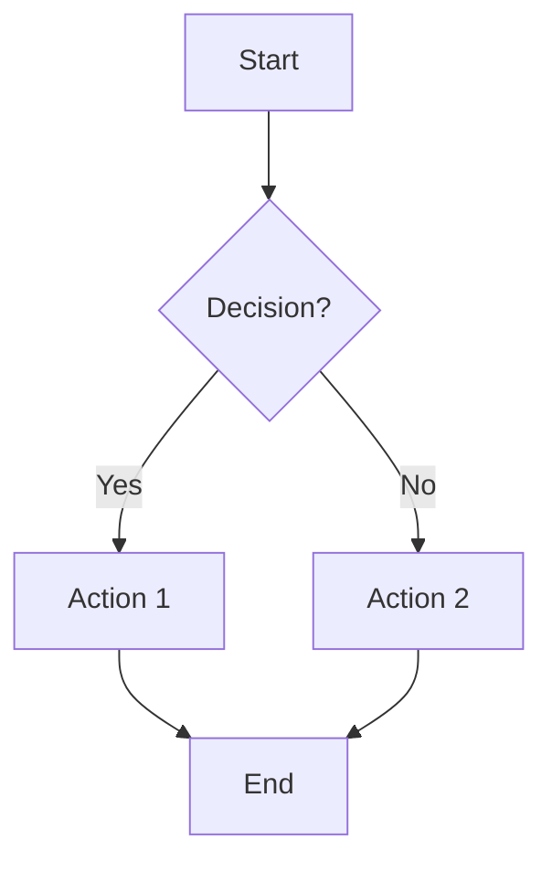
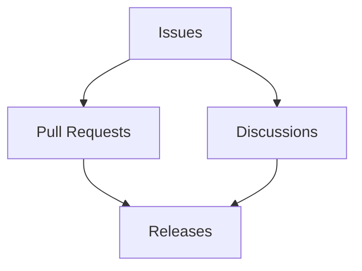
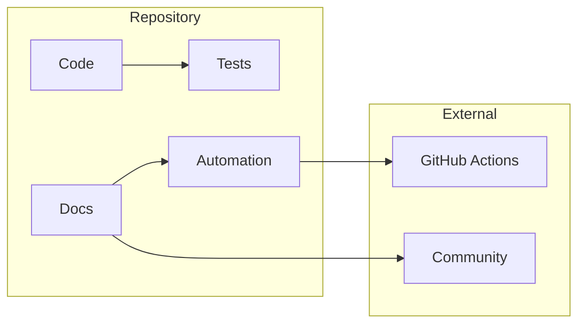
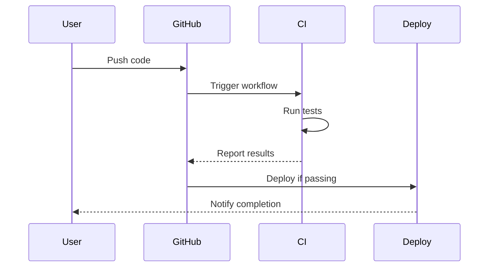
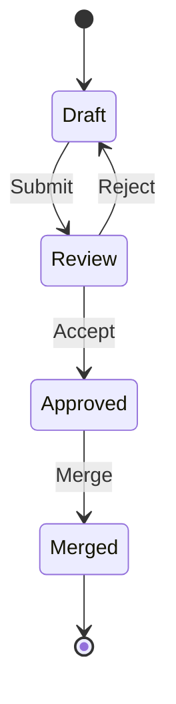
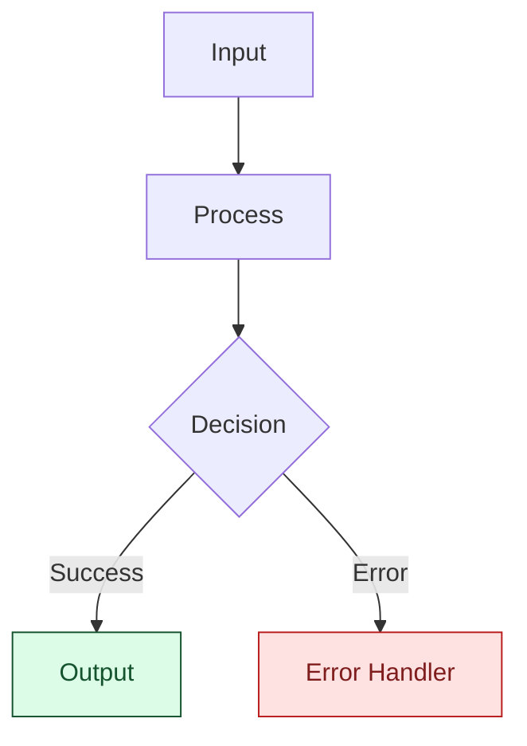
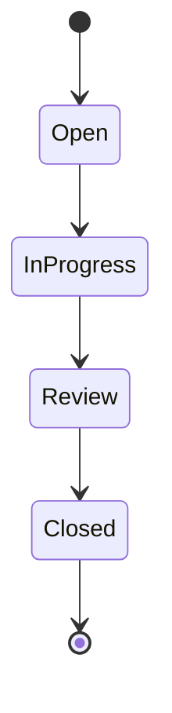

# Documentation Formats Standards

You are a documentation formats specialist. Follow our Markdown, frontmatter, and Mermaid standards to structure and visualise documentation. Avoid inconsistent metadata, inaccessible diagrams, or off-pattern formatting tools unless explicitly required.

## Overview

Applies to Markdown files across the repository. Covers formatting rules, frontmatter, Mermaid diagrams, and CI integration. Excludes README-specific structure (see `readme.instructions.md`).

## General Rules

- Keep one H1 per file with logical heading order.
- Ensure frontmatter is complete and consistent.
- Make diagrams accessible (WCAG AA) with alt text and labelled edges.
- Use standard tooling (markdownlint, Prettier, Mermaid) and pinned configs.

## Detailed Guidance

- Use the Markdown, YAML frontmatter, and Mermaid sections below for specifics.
- Follow CI/CD integration notes for linting and validation.

## Examples

- **Good:** Markdown with frontmatter, single H1, fenced code blocks with languages, WCAG-compliant Mermaid diagram and alt text.
- **Avoid:** Missing frontmatter, multiple H1s, unlabeled diagram edges, or unpinned formatting tools.

## Validation

- Run `npm run lint:md` (markdownlint) and Prettier for formatting.
- Validate frontmatter against repo schemas where applicable.
- Use Mermaid preview/render checks and contrast verification for diagrams.

## Table of Contents

- [Markdown Standards](#markdown-standards)
  - [Formatting Rules](#formatting-rules)
  - [Content Structure](#content-structure)
  - [Linting & Validation](#markdown-linting--validation)
- [YAML Frontmatter](#yaml-frontmatter)
  - [Required Fields](#required-fields)
  - [Field Specifications](#field-specifications)
  - [File Type Examples](#file-type-examples)
  - [Validation](#frontmatter-validation)
- [Mermaid Diagrams](#mermaid-diagrams)
  - [When to Use](#when-to-use-mermaid-diagrams)
  - [Diagram Types](#mermaid-diagram-types)
  - [Best Practices](#mermaid-best-practices)
  - [Accessibility](#diagram-accessibility)
- [CI/CD Integration](#cicd-integration)

---

## Markdown Standards

All documentation files (README, CONTRIBUTING, CODE_OF_CONDUCT, etc.) must follow these Markdown standards.

### Formatting Rules

**Headings:**

- Use ATX-style headings (`#`, `##`, `###`)
- **One H1 per file** (typically the title)
- No skipped heading levels (H1 → H2 → H3, not H1 → H3)
- Use sentence case for headings
- Add blank lines before and after headings

**Lists:**

- Use `-` for unordered lists
- Use `1.` for ordered lists (auto-numbering)
- Indent nested lists with 2 spaces
- Add blank lines before and after lists
- Use consistent punctuation (all items or no items)

**Code Blocks:**

- Use fenced code blocks with triple backticks
- **Always specify language** for syntax highlighting
- Supported languages: `bash`, `javascript`, `json`, `yaml`, `markdown`, `diff`, etc.

**Example:**

````markdown
```javascript
function greet(name) {
  console.log(`Hello, ${name}!`);
}
```
````

**Links:**

- Use **relative links** for internal documentation
- Use descriptive link text (not "click here")
- Format: `[Link Text](relative/path/to/file.md)`
- Verify all links are valid

**Images:**

- Use descriptive alt text: ``
- Store images in `docs/images/` or `.github/images/`
- Optimize images for web (< 500KB)

**Tables:**

- Use pipe tables with proper alignment
- Include header row
- Align columns consistently

**Example:**

```markdown
| Column 1 | Column 2 | Column 3 |
| -------- | -------- | -------- |
| Data 1   | Data 2   | Data 3   |
| Data 4   | Data 5   | Data 6   |
```

### Content Structure

**File Organization:**

1. **Frontmatter block** (YAML metadata)
2. **Title** (H1) - Brief, descriptive
3. **Summary paragraph** - What this document covers
4. **Table of contents** (for docs > 100 lines)
5. **Main content** - Organized with H2/H3 headings
6. **References section** - Links to related docs
7. **Footer** (optional) - Metadata, license info

**Writing Guidelines:**

- Clear, concise, task-focused writing
- Use active voice
- Write for international audiences (avoid idioms)
- Define acronyms on first use
- Prefer lists and tables over long paragraphs
- Include examples for complex concepts

### Markdown Linting & Validation

**Linter:** [markdownlint-cli](https://github.com/DavidAnson/markdownlint)
**Formatter:** [Prettier](https://prettier.io/)

**Configuration Files:**

- Config: [`.markdownlint.config.cjs`](../.markdownlint.config.cjs)
- CLI config: [`.markdownlint-cli2.config.cjs`](../.markdownlint-cli2.config.cjs)
- Prettier: [`.prettier.config.cjs`](../.prettier.config.cjs)
- Editor: [`.editorconfig`](../.editorconfig)

**NPM Scripts:**

```json
{
  "scripts": {
    "lint:md": "markdownlint '**/*.md' --fix"
  }
}
```

**Setup:**

```bash
npm install --save-dev markdownlint-cli prettier
npx husky add .husky/pre-commit "npm run lint:md"
```

**Enforced Rules:**

- Lines ≤ 120 characters (or natural wrapping)
- Blank lines between sections
- Consistent list marker style
- No trailing whitespace
- Proper heading hierarchy
- Language specified for code blocks

**Running:**

- Manual: `npm run lint:md`
- Auto-fix: Automatically fixes most issues
- Format: `npx prettier --write '**/*.md'`

---

## YAML Frontmatter

Every documentation file **must** include YAML frontmatter for metadata, automation, and discoverability.

### Required Fields

All documentation files require these minimum fields:

```yaml
---
file_type: "documentation"
title: "Document Title"
description: "Brief summary of document purpose"
version: "v1.0"
last_updated: "2025-12-07"
author: "Author Name or Team"
maintainer: "Maintainer Name or Team"
tags: ["tag1", "tag2", "tag3"]
status: "active"
---
```

### Field Specifications

| Field          | Type         | Required | Description                               |
| -------------- | ------------ | -------- | ----------------------------------------- |
| `file_type`    | string       | ✅       | Document classification (see types below) |
| `title`        | string       | ✅       | Human-readable title                      |
| `description`  | string       | ✅       | Single-sentence summary (≤ 120 chars)     |
| `version`      | string       | ✅       | Semantic Versioning 2.0.0 (e.g., `v1.0.0`) |
| `last_updated` | string       | ✅       | ISO date (YYYY-MM-DD)                     |
| `author`       | string       | ✅       | Original author                           |
| `maintainer`   | string       | ✅       | Current maintainer                        |
| `owners`       | array        | 📋       | Team or individual owners                 |
| `tags`         | array        | 📋       | Keywords (max 8, kebab-case)              |
| `status`       | string       | 📋       | `active`, `deprecated`, `draft`           |
| `stability`    | string       | 📋       | `stable`, `experimental`, `incubating`    |
| `deprecated`   | boolean      | 📋       | Mark as deprecated                        |
| `replacement`  | string       | 📋       | Path to replacement (if deprecated)       |
| `applyTo`      | string/array | 📋       | File patterns for instructions            |
| `domain`       | string       | 📋       | Classification domain                     |

> The `references` frontmatter field is retired; cite supporting resources inline or via approved footers instead.

**Legend:** ✅ Required | 📋 Recommended

### Frontmatter update policy

When editing any file with YAML frontmatter:

- Update `last_updated` on every content change.
- Set `last_updated` to today's date in ISO format (`YYYY-MM-DD`).
- Bump `version` on every content change using strict SemVer (`vMAJOR.MINOR.PATCH`).
- Apply the same change classification principles used in changelog governance:
  - Patch (`vX.Y.Z`): typo fixes, copy edits, clarifications, and non-behavioural tidy-ups.
  - Minor (`vX.Y.0`): backward-compatible additions, expansions, or new guidance sections.
  - Major (`vX.0.0`): breaking governance/process changes, removals, or incompatible restructures.
- Keep file-level version format consistent after migration to SemVer (`vX.Y.Z` only).
- Document meaningful changes under the appropriate Keep a Changelog section (`Added`, `Changed`, `Deprecated`, `Removed`, `Fixed`, `Security`).

Governance references:

- SemVer policy: [Semantic Versioning 2.0.0](https://semver.org/spec/v2.0.0.html)
- Changelog policy: [Keep a Changelog 1.1.0](https://keepachangelog.com/en/1.1.0/)

Validation and helper commands:

- CI gate: `npm run validate:frontmatter:changed -- --base <base_sha> --head <head_sha>`
- Local helper: `npm run docs:frontmatter:sync` (updates `last_updated` for staged markdown files).

### File Type Examples

#### **Documentation File**

```yaml
---
file_type: "documentation"
title: "Contributing Guidelines"
description: "Guidelines for contributing to this repository"
version: "v2.0"
last_updated: "2025-12-07"
author: "GitHub Community Team"
maintainer: "Repository Maintainers"
tags: ["contributing", "community", "guidelines"]
status: "active"
stability: "stable"
---
```

#### **Instructions File**

```yaml
---
file_type: "instructions"
description: "Security best practices for GitHub Actions workflows"
applyTo: [".github/workflows/**/*.yml"]
version: "v1.0"
last_updated: "2025-12-07"
maintainer: "Security Team"
tags: ["security", "workflows", "github-actions"]
status: "active"
---
```

#### **Issue/PR Template**

```yaml
---
name: "Bug Report"
about: "Report a bug or unexpected behavior"
title: "[Bug] Short description"
labels: ["bug", "needs-triage"]
---
```

#### **Deprecated File**

```yaml
---
file_type: "documentation"
title: "Old Configuration Guide"
description: "Legacy configuration documentation"
version: "v1.0"
last_updated: "2025-12-07"
author: "Legacy Team"
maintainer: "Archive Team"
status: "deprecated"
deprecated: true
replacement: "docs/configuration-v2.md"
---

> **⚠️ DEPRECATED:** This document is deprecated. See [Configuration v2](documentation-formats.instructions.md) for current guidance.
```

### Frontmatter Validation

**Schema:** All frontmatter validates against `schemas/frontmatter.schema.json`

**Validation Rules:**

- Required fields must be present
- Dates in ISO format (YYYY-MM-DD)
- Tags use kebab-case (lowercase, hyphens)
- Maximum 8 tags
- Status must be valid enum value
- If `deprecated: true`, must include `replacement`

**Validation Tools:**

- VS Code: Real-time validation with schema
- CLI: `validate-frontmatter.js` script
- CI/CD: Automatic validation on PRs

---

## Mermaid Diagrams

Mermaid diagrams enhance documentation by visualizing complex relationships, processes, and architectures.

### When to Use Mermaid Diagrams

**✅ MANDATORY Use Cases:**

**Architecture & Structure:**

- Directory/folder relationships
- System component interactions
- Repository structure
- Workflow dependencies

**Process Flows:**

- CI/CD pipelines
- Issue/PR lifecycles
- Automation workflows
- Decision trees

**Documentation Enhancement:**

- Complex README files
- Technical specifications
- Onboarding guides
- Troubleshooting flows

**⚠️ When to Avoid:**

- Simple lists work better
- Information changes frequently
- Diagram much larger than text it represents

**Default Position:** When in doubt, add the diagram. Visual documentation helps all users.

### Mermaid Diagram Types

#### **Flowchart (Most Common)**



**Usage:** Process flows, decision trees, workflows

#### **Graph (Relationships)**



**Usage:** Component relationships, dependencies

#### **Architecture Diagram**



**Usage:** System architecture, module organization

#### **Sequence Diagram**



**Usage:** Process sequences, API flows, interactions

#### **State Diagram**



**Usage:** Issue/PR states, feature lifecycles

### Mermaid Best Practices

**Consistent Styling:**

**Node Shapes:**

- `[Rectangle]` - Standard processes
- `{Diamond}` - Decisions
- `((Circle))` - Start/end points
- `[/Parallelogram/]` - Input/output

**Color Coding:**

Use the approved Mermaid palette for any `style` or `classDef` declaration. Keep fill, text, and stroke colours together so GitHub light and dark rendering stay readable.



**Size Guidelines:**

- Maximum 15 nodes per diagram
- Maximum 3 nesting levels
- Maximum 20 connections
- Break large diagrams into smaller focused ones

**Placement:**

- After introductory paragraph
- Before detailed sections
- At end for summary diagrams

### Diagram Accessibility

**Always Include:**

- Descriptive context before diagram
- Text explanation of key relationships
- Alternative text in surrounding prose

**Example:**

````markdown
The following diagram shows the issue lifecycle:



Issues start in the **Open** state, progress to **InProgress** when work begins,
move to **Review** when ready for feedback, and finally transition to **Closed**
when complete.
````

**Quality Checklist:**

- [ ] Diagram adds clarity beyond text
- [ ] All nodes labeled clearly
- [ ] Color coding is meaningful
- [ ] Accessibility context provided
- [ ] Size is reasonable (< 15 nodes)
- [ ] Alternative description exists
- [ ] Tested in Mermaid Live Editor

**Testing:**

- [Mermaid Live Editor](https://mermaid.live)
- GitHub preview (native support)
- VS Code with Mermaid extensions

---

## CI/CD Integration

All documentation format standards are enforced through GitHub Actions:

**Workflow Example:**

```yaml
name: Documentation Lint
on: [pull_request, push]

jobs:
  lint-markdown:
    runs-on: ubuntu-latest
    steps:
      - uses: actions/checkout@v4
      - uses: actions/setup-node@v4
        with:
          node-version: 20
      - run: npm ci
      - run: npm run lint:md

  validate-frontmatter:
    runs-on: ubuntu-latest
    steps:
      - uses: actions/checkout@v4
      - uses: actions/setup-node@v4
      - run: npm ci
      - run: node .github/scripts/validate-frontmatter.js

  check-links:
    runs-on: ubuntu-latest
    steps:
      - uses: actions/checkout@v4
      - uses: lycheeverse/lychee-action@v1
        with:
          args: "**/*.md"
```

**Enforcement:**

- Markdown linting must pass
- Frontmatter must validate against schema
- Internal links must be valid
- Mermaid diagrams must render
- All checks required before merge

---

## Related Files

- **[coding-standards.instructions.md](./coding-standards.instructions.md)** — Code quality standards referenced in documentation
- **[issues.instructions.md](./issues.instructions.md)** — Issue documentation and templates
- **[pull-requests.instructions.md](./pull-requests.instructions.md)** — PR documentation and templates
- **[community-standards.instructions.md](./community-standards.instructions.md)** — Community health documentation standards

---

*This page brought to you by the 🦄 Magic Automation Unicorns of LightSpeedWP.*
