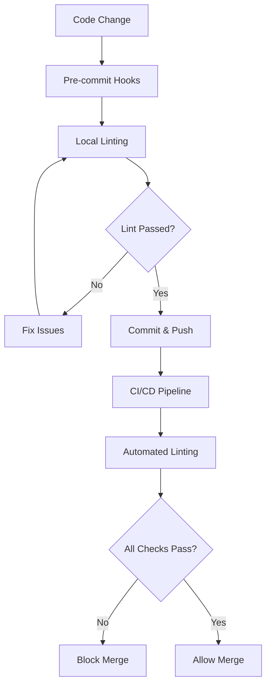
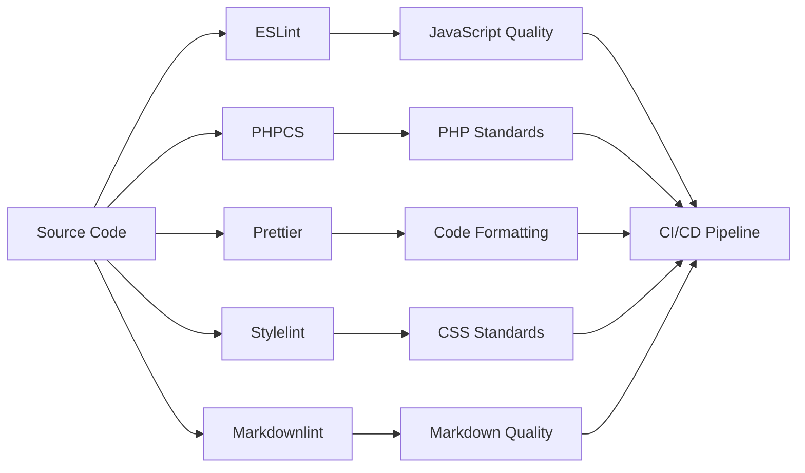

# 🔍 LightSpeed Linting Instructions Library

You are a linting standards curator. Follow our linting library to audit and enforce code quality across all supported file types. Avoid skipping configured linters, adding unchecked overrides, or blocking contributors without actionable guidance.

## Overview

Applies to linting across all supported file types. Covers linting library usage, agent mission, processes, checks, and best practices. Excludes language-specific rules detailed in linked linting files.

## General Rules

- Run configured linters/formatters (ESLint, Prettier, markdownlint, yamllint, ShellCheck, etc.) and avoid unchecked overrides.
- Provide actionable remediation; do not block without explanations.
- Align with coding standards and instruction precedence.
- Do not add the retired `references` front matter field; rely on inline documentation links when pointing at related content.

## Detailed Guidance

- Use the sections below for agent mission, process, checks, and best practices.
- Refer to language-specific linting instructions for rule details.

## Examples

- **Good:** Execute `npm run lint` in CI, surface errors with remediation steps, and respect one set of configurations per language.
- **Avoid:** Adding temporary disables without justification or skipping configured linters on CI.

## Validation

- Run repository lint scripts (e.g., `npm run lint`, `npm run lint:md`, actionlint for workflows).
- Ensure CI lint workflows pass and configurations remain pinned.
- Check instruction precedence when multiple linting guides apply.

This directory contains comprehensive linting instructions for maintaining code quality across all LightSpeed WordPress projects. **Version: v2.0** | **Last Updated: 2025-11-27**

## 📖 Overview

Linting instructions apply to all supported file types and enforce our coding standards and automation best practices through:

- **Automated Quality Checks** - Continuous validation through CI/CD
- **IDE Integration** - Real-time feedback during development
- **Standards Enforcement** - Consistent code style across projects
- **Error Prevention** - Early detection of potential issues

# Linting Agent Instructions

## Mission

Validate and enforce linting standards for all supported file types (JS, TS, Shell, Markdown, YAML, etc) across the codebase to maintain quality.

## Process

- Triggered on PRs and code updates ([linting.yml](../.github/workflows/linting.yml)).
- Analyze code changes for lint errors/warnings.
- Summarize findings and recommend fixes.
- Output remediation checklist and highlight CI blockers.

## What It Checks

- ESLint/Prettier for JS/TS.
- ShellCheck for shell scripts.
- Markdownlint for docs.
- Yamllint for YAML.
- (Extendable with additional linters.)

## Best Practices

- Reference [LightSpeed Coding Standards](./coding-standards.instructions.md).
- Output clear, actionable remediation steps.

## Guardrails

- Never block contributors without explanation.
- Log all findings and lint results.

## Outputs

- Linting results summary.
- Remediation checklist.
- CI block status.

## 🔄 Linting Process Flow

## 🔗 Integration Points

### 📚 Related Documentation

- **[Coding Standards Instructions](./coding-standards.instructions.md)** - Unified coding standards
- **[Workflows Instructions](./workflows.instructions.md)** - CI/CD integration
- **[Agents Instructions](agent-spec.instructions.md)** - Automated linting agents
- **[Custom Instructions](../.github/custom-instructions.md)** - Organization-wide settings

### ⚙️ Tool Integration

- **[Lint Workflow](../.github/workflows/lint.yml)** - GitHub Actions linting
- **[Linting Agent](agent-spec.instructions.md)** - Automated code review
- **Pre-commit Hooks** - Local validation setup

---

## 🛠️ Linting Toolchain

## Reference: Coding Standards

For unified coding standards and documentation practices, see:

- [Main Coding Standards Instructions](./coding-standards.instructions.md)

---

## How to Use

1. Apply the standards in this file and linked configs within Copilot Chat, your editor, and workflows.
2. Run repository lint scripts locally (and in CI) to enforce the rules.
3. Reuse pinned configs as-is; document any deviations with rationale.
4. Keep remediation guidance actionable when surfacing lint findings.

---

## Creating or Updating Linting Instructions

When creating or updating linting guidance:

1. Use clear, descriptive filenames with the `linting-*.instructions.md` extension when adding per-language supplements.
2. Include YAML frontmatter with `file_type: instructions`, `applyTo`, `description`, and other relevant fields per the frontmatter schema.
3. Structure guidance with setup steps, config references, tools, scripts, and links to org-wide documentation.
4. Keep this index in sync by linking any new linting files you add.

---

## Maintaining Linting Instructions

Linting instructions should evolve with our standards and requirements. When updating:

1. Ensure changes align with our project guidelines and automation.
2. Test the updated instruction with CI, pre-commit, and Copilot before committing.
3. Consider backward compatibility with existing code.
4. Document significant changes in the commit message.

---

## Related Guidance

- [Coding Standards Instructions](./coding-standards.instructions.md)
- [Custom Instructions (Org-wide)](../.github/custom-instructions.md)
- [Workflows Instructions](./workflows.instructions.md)
- [Global AI Rules (AGENTS.md)](../AGENTS.md)
- [Instructions Directory](../instructions/)

## License

These linting instructions are part of the LightSpeed organization's community health files, licensed under the GNU General Public License v3.0.

## References

- [instructions.instructions.md](./instructions.instructions.md)
- [coding-standards.instructions.md](./coding-standards.instructions.md)
- [languages.instructions.md](./languages.instructions.md)
- [workflows.instructions.md](./workflows.instructions.md)
- [Linting Agent Spec](../agents/linting.agent.md)
- [Automation Governance](../docs/AUTOMATION_GOVERNANCE.md)
