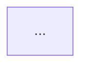
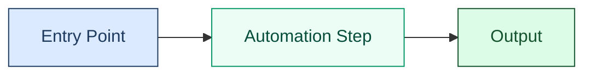

# Mermaid Diagram Instructions

All Mermaid diagrams must be clear, accessible, and WCAG 2.2 AA compliant. Follow every rule in this file. The validation workflow enforces the accessibility and syntax rules automatically, and the colour contrast validator enforces the approved palette.

---

## When to Include a Diagram

Include a Mermaid diagram when the documentation describes:

- A multi-step process or workflow
- Component relationships or architecture
- A state machine or lifecycle
- Data flow between systems
- A timeline or schedule

Do **not** force a diagram into a file where a simple list or paragraph is clearer. One well-chosen diagram adds more value than several weak ones.

---

## Required Structure

Every Mermaid block **must** include an accessibility header block placed immediately after the opening ` ```mermaid ` fence and before the diagram type declaration:

````text

````

For complex diagrams, use the block form:

````text
```mermaid
---
accTitle: Complex workflow title
accDescr {
  Multi-sentence description explaining what the diagram shows, the key
  relationships, and the direction of flow. Write for screen-reader users
  who cannot see the visual diagram.
}
---
flowchart TD
    ...
```
````

**Rules:**

- `accTitle` is mandatory on every diagram.
- `accDescr` is mandatory on every diagram.
- Place the `---` header block first, before `flowchart`, `graph`, `sequenceDiagram`, etc.
- Do not duplicate `accTitle` / `accDescr` as inline attributes after the diagram type line.

---

## Diagram Types

| Type | Use for |
|------|---------|
| `flowchart LR` | Left-to-right pipelines, data flows, and timelines |
| `flowchart TD` | Top-down hierarchies, decision trees, and branching flows |
| `sequenceDiagram` | System interactions over time |
| `stateDiagram-v2` | State machines and lifecycle transitions |
| `erDiagram` | Data relationships and schema |
| `gantt` | Timelines and release schedules |
| `pie` | Proportional composition |
| `mindmap` | Topic hierarchies and associations |

- Prefer `flowchart` over `graph`.
- Always specify direction: `flowchart LR`, `flowchart TD`, etc.

---

## Colour Palette

Every `style` or `classDef` declaration that sets `fill:` **must** also set `color:` and `stroke:` together.

The approved palette is:

| Role | fill | color | stroke |
|------|------|-------|--------|
| Information | `#dbeafe` | `#1e3a5f` | `#1e3a5f` |
| Success | `#dcfce7` | `#14532d` | `#14532d` |
| Warning | `#fef3c7` | `#4a2c00` | `#b45309` |
| Error / Alert | `#fee2e2` | `#7f1d1d` | `#b91c1c` |
| Documentation | `#f3e8ff` | `#3b0764` | `#7e22ce` |
| Neutral | `#f1f5f9` | `#0f172a` | `#334155` |
| Highlight | `#ecfdf5` | `#064e3b` | `#059669` |

Example:



**Rules:**

- Only use colours from the approved palette above, or colours you have manually verified using the Mermaid contrast validator.
- Never use `fill:` without an explicit `color:`.
- Never use theme-specific dark mode values in diagram definitions.
- Do not rely on colour alone to convey meaning.

---

## Theme Initialisation

Use a theme init block only when there is a specific reason. The default theme is correct for nearly all cases:

```text
%%{init: {'theme': 'default'}}%%
```

- Do **not** use `theme: 'dark'`.
- If a diagram needs extra contrast tuning, keep the approved palette and adjust the node styles, not the viewer theme.

---

## Emoji in Node Labels

Use at most one emoji per node label. Place it at the start of the label, followed by a space.

| Node type | Emoji | Example label |
|-----------|-------|---------------|
| Entry / start | none | `([Start])` |
| User / developer | 👤 | `[👤 Developer]` |
| Repository / storage | 📁 | `[📁 Repository]` |
| Workflow / automation | ⚙️ | `[⚙️ Automation]` |
| Documentation / instructions | 📋 | `[📋 Instructions]` |
| AI / Copilot | 🤖 | `[🤖 AI Agent]` |
| Template | 📝 | `[📝 Template]` |
| Label / tag | 🏷️ | `[🏷️ Labels]` |
| Security | 🛡️ | `[🛡️ Security]` |
| Analytics / reporting | 📊 | `[📊 Report]` |
| Deployment / release | 🚀 | `[🚀 Deploy]` |
| Success / check | ✅ | `[✅ Passed]` |
| Error / failure | ❌ | `[❌ Failed]` |
| Warning | ⚠️ | `[⚠️ Review needed]` |
| External service | 🌐 | `[🌐 External API]` |
| Organisation | 🏛️ | `[🏛️ .github Hub]` |
| Tests | 🧪 | `[🧪 Test Suite]` |
| Lock / protected | 🔒 | `[🔒 Protected]` |

Never use emoji as the entire label. Keep subgraph titles plain text.

---

## Layout and Clarity

- Keep one concept per diagram.
- Split diagrams that grow beyond roughly 12 nodes.
- Use left-to-right (`LR`) for linear flows and top-down (`TD`) for hierarchies and decisions.
- Keep node labels short and descriptive.
- Avoid crossing arrows where possible.

---

## Validation

Run before every commit:

```bash
npm run validate:mermaid-syntax
npm run validate:mermaid-accessibility
npm run validate:mermaid-contrast
```

To validate only changed files locally:

```bash
npm run validate:mermaid-contrast -- --changed-files=path/to/file.md
```

---

## Repository-Wide Update Process

When Mermaid diagrams across the repository need a standards refresh:

1. Open a `docs/` or `chore/` branch.
2. Run the fixer script:

   ```bash
   node scripts/fix-mermaid-diagrams.js
   ```

3. Run the full Mermaid suite:

   ```bash
   npm run validate:mermaid-syntax && npm run validate:mermaid-accessibility && npm run validate:mermaid-contrast
   ```

4. Review the diff and keep content accurate to the current repository structure.
5. Open a PR targeting `develop`.

---

## Related Files

- [documentation-formats.instructions.md](./documentation-formats.instructions.md) - Markdown, frontmatter, and Mermaid standards
- [a11y.instructions.md](./a11y.instructions.md) - Accessibility standards
- [scripts/validation/validate-mermaid-accessibility.js](../scripts/validation/validate-mermaid-accessibility.js) - accTitle / accDescr validator
- [scripts/validation/validate-mermaid-colour-contrast.js](../scripts/validation/validate-mermaid-colour-contrast.js) - Colour contrast validator
- [.github/workflows/readme-audit.yml](../.github/workflows/readme-audit.yml) - Audit workflow
- [.github/workflows/readme-update.yml](../.github/workflows/readme-update.yml) - Update workflow
