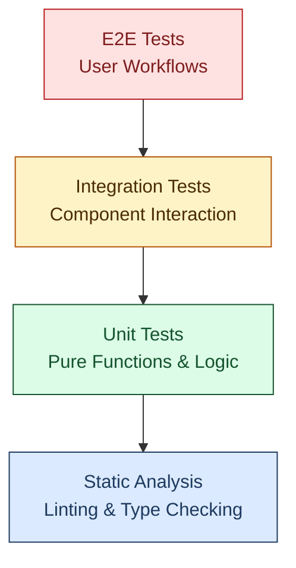
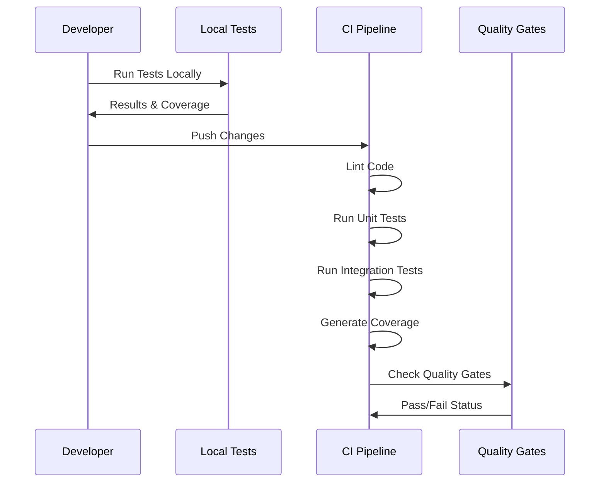

# Quality Assurance Standards

You are a quality assurance strategist. Follow our testing and validation standards to plan and enforce coverage across code and automation. Avoid untested changes, skipped QA gates, or undocumented deviations from the testing pyramid.

## Overview

Applies to testing and QA across code, automation, and workflows. Covers strategy, coverage targets, unit/integration/e2e testing, CI/CD integration, and quality gates. Excludes language-specific linting rules (see `linting.instructions.md`).

## General Rules

- Follow the testing pyramid distribution and coverage targets.
- Keep tests automated and reproducible; integrate with CI.
- Document deviations and avoid merging untested changes.
- Use appropriate frameworks (Jest, Playwright, etc.) per layer.

## Detailed Guidance

- Use the sections below for strategy, layer guidance, CI integration, and quality gates.
- Align test configs with repository scripts and workflows.

## Examples

- **Good:** 70/20/10 unit/integration/e2e split with coverage gates, CI enforcement, and documented acceptance criteria.
- **Avoid:** Skipping tests for changes or reducing coverage without approvals.

## Validation

- Run project test suites (`npm run test`, `npm run test:js`, Playwright, etc.) and check coverage thresholds.
- Verify CI pipelines enforce tests and quality gates.
- Ensure test configs and scripts match documentation.

## Table of Contents

- [Testing Strategy](#testing-strategy)
  - [Testing Pyramid](#testing-pyramid)
  - [Coverage Requirements](#coverage-requirements)
- [Unit Testing (Jest)](#unit-testing-jest)
  - [Configuration](#jest-configuration)
  - [Writing Tests](#writing-unit-tests)
  - [Best Practices](#unit-test-best-practices)
- [Integration Testing](#integration-testing)
- [End-to-End Testing](#end-to-end-testing)
- [CI/CD Integration](#cicd-integration)
- [Quality Gates](#quality-gates)

---

## Testing Strategy

### Testing Pyramid

When you show the pyramid in Mermaid, use the approved Mermaid palette from `instructions/mermaid.instructions.md` and set `fill`, `color`, and `stroke` together in every `classDef`.



**Test Layer Distribution:**

- **Unit Tests**: 70% of test coverage (fast, isolated)
- **Integration Tests**: 20% of test coverage (component interaction)
- **E2E Tests**: 10% of test coverage (critical user paths)

### Coverage Requirements

| Code Type               | Minimum Coverage | Target Coverage |
| ----------------------- | ---------------- | --------------- |
| Critical business logic | 90%              | 95%             |
| Automation scripts      | 85%              | 90%             |
| Utility functions       | 80%              | 85%             |
| UI components           | 75%              | 80%             |
| **Overall project**     | **75%**          | **85%**         |

---

## Unit Testing (Jest)

[Jest](https://jestjs.io/) is the primary unit testing framework for JavaScript and TypeScript code.

### Jest Configuration

**Config Files:**

- Main config: `jest.config.js` or `jest.config.cjs`
- Setup: `jest.setup.js` for global test setup
- Helpers: `tests/test-helpers.js` for shared utilities

**NPM Scripts:**

```json
{
  "scripts": {
    "test": "npm run test:js",
    "test:js": "jest --coverage --forceExit --detectOpenHandles",
    "test:watch": "jest --watch",
    "test:debug": "node --inspect-brk node_modules/.bin/jest --runInBand"
  }
}
```

**Setup:**

```bash
npm install --save-dev jest @types/jest babel-jest
```

**Example Configuration:**

```javascript
// jest.config.js
module.exports = {
  testEnvironment: "node",
  coverageDirectory: "coverage",
  collectCoverageFrom: [
    "scripts/**/*.js",
    "!scripts/**/*.test.js",
    "!**/node_modules/**",
  ],
  coverageThreshold: {
    global: {
      branches: 75,
      functions: 75,
      lines: 75,
      statements: 75,
    },
  },
  testMatch: ["**/__tests__/**/*.test.js", "**/*.test.js", "**/*.spec.js"],
};
```

### Writing Unit Tests

**Test Structure (Arrange-Act-Assert):**

```javascript
describe("Module/Function Name", () => {
  // Setup
  beforeEach(() => {
    // Test setup - runs before each test
  });

  // Teardown
  afterEach(() => {
    // Cleanup - runs after each test
  });

  it("should do something specific", () => {
    // Arrange - setup test data
    const input = "test";

    // Act - execute the function
    const result = functionUnderTest(input);

    // Assert - verify the result
    expect(result).toBe("expected");
  });

  it("should handle edge case", () => {
    // Test edge cases
    expect(functionUnderTest("")).toBe("");
    expect(functionUnderTest(null)).toBe(null);
  });

  it("should throw error for invalid input", () => {
    // Test error handling
    expect(() => {
      functionUnderTest(undefined);
    }).toThrow("Invalid input");
  });
});
```

**Testing GitHub Actions Scripts:**

```javascript
describe("Label Sync Utility", () => {
  const { syncLabels } = require("../scripts/agents/includes/label-sync");

  beforeEach(() => {
    jest.clearAllMocks();
  });

  it("should sync labels from configuration", async () => {
    // Arrange
    const mockConfig = {
      labels: [
        { name: "bug", color: "d73a4a" },
        { name: "enhancement", color: "a2eeef" },
      ],
    };

    // Act
    const result = await syncLabels(mockConfig);

    // Assert
    expect(result.created).toHaveLength(2);
    expect(result.created).toContain("bug");
    expect(result.created).toContain("enhancement");
  });

  it("should handle sync errors gracefully", async () => {
    // Arrange
    const invalidConfig = { labels: null };

    // Act & Assert
    await expect(syncLabels(invalidConfig)).rejects.toThrow(
      "Invalid configuration",
    );
  });
});
```

### Unit Test Best Practices

**DO:**

- ✅ Write descriptive test names that explain intent
- ✅ Follow Arrange-Act-Assert pattern
- ✅ Test one thing per test case
- ✅ Use meaningful assertions
- ✅ Mock external dependencies (APIs, file system)
- ✅ Keep tests fast (< 100ms per test)
- ✅ Avoid test interdependencies
- ✅ Test error conditions and edge cases
- ✅ Use `describe` blocks to group related tests

**DON'T:**

- ❌ Test implementation details
- ❌ Share state between tests
- ❌ Use real network calls
- ❌ Write overly complex test setups
- ❌ Ignore failing tests
- ❌ Test third-party library code

---

## Integration Testing

Integration tests verify that components work correctly together.

**Example: API Integration Test**

```javascript
describe("GitHub API Integration", () => {
  it("should fetch and process repository data", async () => {
    // Arrange
    const mockOctokit = createMockOctokit();

    // Act
    const data = await fetchRepositoryData("owner", "repo");

    // Assert
    expect(data).toHaveProperty("name");
    expect(data).toHaveProperty("labels");
    expect(data.labels).toBeInstanceOf(Array);
  });

  it("should handle rate limiting", async () => {
    // Test rate limit handling
    const result = await fetchWithRetry("/api/endpoint");
    expect(result.retries).toBeGreaterThan(0);
  });
});
```

**Workflow Integration Test:**

```javascript
describe("Labeling Workflow Integration", () => {
  it("should apply labels based on file changes", () => {
    // Arrange
    const changedFiles = [
      "scripts/agents/labeling.agent.js",
      "tests/labeling.test.js",
    ];

    // Act
    const labels = determineLabels(changedFiles);

    // Assert
    expect(labels).toContain("area:agents");
    expect(labels).toContain("lang:javascript");
    expect(labels).toContain("type:automation");
  });
});
```

---

## End-to-End Testing

E2E tests validate critical user workflows and interactions.

**When to Write E2E Tests:**

- Critical user journeys (issue creation, PR submission)
- Multi-step workflows (labeling → project sync → notification)
- Integration with external systems (GitHub Actions, APIs)
- UI interactions (if applicable)

**E2E Test Example:**

```javascript
describe("Issue Lifecycle E2E", () => {
  it("should complete full issue workflow", async () => {
    // 1. Create issue
    const issue = await createIssue({
      title: "Test Issue",
      body: "Test description",
      labels: ["bug"],
    });

    // 2. Verify labeling workflow ran
    await waitForWorkflow("labeling.yml");

    // 3. Check labels applied correctly
    const updatedIssue = await getIssue(issue.number);
    expect(updatedIssue.labels).toContainEqual(
      expect.objectContaining({ name: "status:needs-triage" }),
    );

    // 4. Verify project sync
    const projectItem = await getProjectItem(issue.number);
    expect(projectItem.status).toBe("Triage");
  });
});
```

---

## CI/CD Integration

### Test Execution Flow



### GitHub Actions Workflow

```yaml
name: Quality Assurance
on: [pull_request, push]

jobs:
  lint:
    runs-on: ubuntu-latest
    steps:
      - uses: actions/checkout@v4
      - uses: actions/setup-node@v4
        with:
          node-version: 20
      - run: npm ci
      - run: npm run lint:all

  test:
    runs-on: ubuntu-latest
    steps:
      - uses: actions/checkout@v4
      - uses: actions/setup-node@v4
        with:
          node-version: 20
      - run: npm ci
      - run: npm test
      - uses: codecov/codecov-action@v3
        with:
          files: ./coverage/coverage-final.json

  integration:
    runs-on: ubuntu-latest
    needs: [lint, test]
    steps:
      - uses: actions/checkout@v4
      - uses: actions/setup-node@v4
      - run: npm ci
      - run: npm run test:integration
```

### Coverage Reporting

**Upload Coverage:**

```yaml
- uses: codecov/codecov-action@v3
  with:
    files: ./coverage/coverage-final.json
    fail_ci_if_error: true
```

**Coverage Badge:**

```markdown

```

---

## Quality Gates

Quality gates must pass before merging:

### Pre-Merge Checklist

- [ ] All tests pass (unit, integration, E2E)
- [ ] Code coverage meets minimum thresholds (75%)
- [ ] All linting checks pass
- [ ] No console errors or warnings
- [ ] Security scan passed
- [ ] Documentation updated
- [ ] New code has corresponding tests
- [ ] Breaking changes documented

### Automated Enforcement

```javascript
// jest.config.js - Enforce coverage thresholds
coverageThreshold: {
  global: {
    branches: 75,
    functions: 75,
    lines: 75,
    statements: 75
  }
}
```

### Manual Review Checklist

**For Code Reviewers:**

- [ ] Tests cover happy path and error cases
- [ ] Tests are clear and maintainable
- [ ] No flaky or random test failures
- [ ] Mock data is realistic
- [ ] Test names describe behavior
- [ ] No commented-out tests
- [ ] No skipped tests without justification

---

## Troubleshooting

### Common Issues

**Tests fail locally but pass in CI:**

```bash
# Check Node.js version matches CI
node --version  # Should match .nvmrc or workflow

# Clean install dependencies
rm -rf node_modules package-lock.json
npm ci

# Clear Jest cache
npm test -- --clearCache
```

**Coverage below threshold:**

```bash
# Generate detailed coverage report
npm test -- --coverage

# View coverage report
open coverage/lcov-report/index.html

# Identify uncovered files
npm test -- --coverage --collectCoverageFrom='scripts/**/*.js'
```

**Flaky tests:**

- Investigate timing-related issues
- Add proper waits and assertions
- Check for race conditions
- Use deterministic test data
- Avoid shared state between tests

**Test timeout:**

```javascript
// Increase timeout for slow tests
jest.setTimeout(10000);

// Or per-test
it("slow test", async () => {
  // test code
}, 10000);
```

---

## Test Organization

```
tests/
├── README.md                      # Testing documentation
├── jest.setup.js                  # Jest global setup
├── test-helpers.js                # Shared test utilities
├── __tests__/                     # Unit tests
│   ├── labeling.test.js
│   ├── reporting.test.js
│   └── utils.test.js
├── integration/                   # Integration tests
│   └── workflow-integration.test.js
└── e2e/                          # End-to-end tests
    └── issue-lifecycle.e2e.test.js
```

*This document consolidates quality assurance standards for GitHub community health repositories. All code must be tested and validated before merge.*

---

*Maintained by the 🤖 LightSpeedWP Automation Team*
