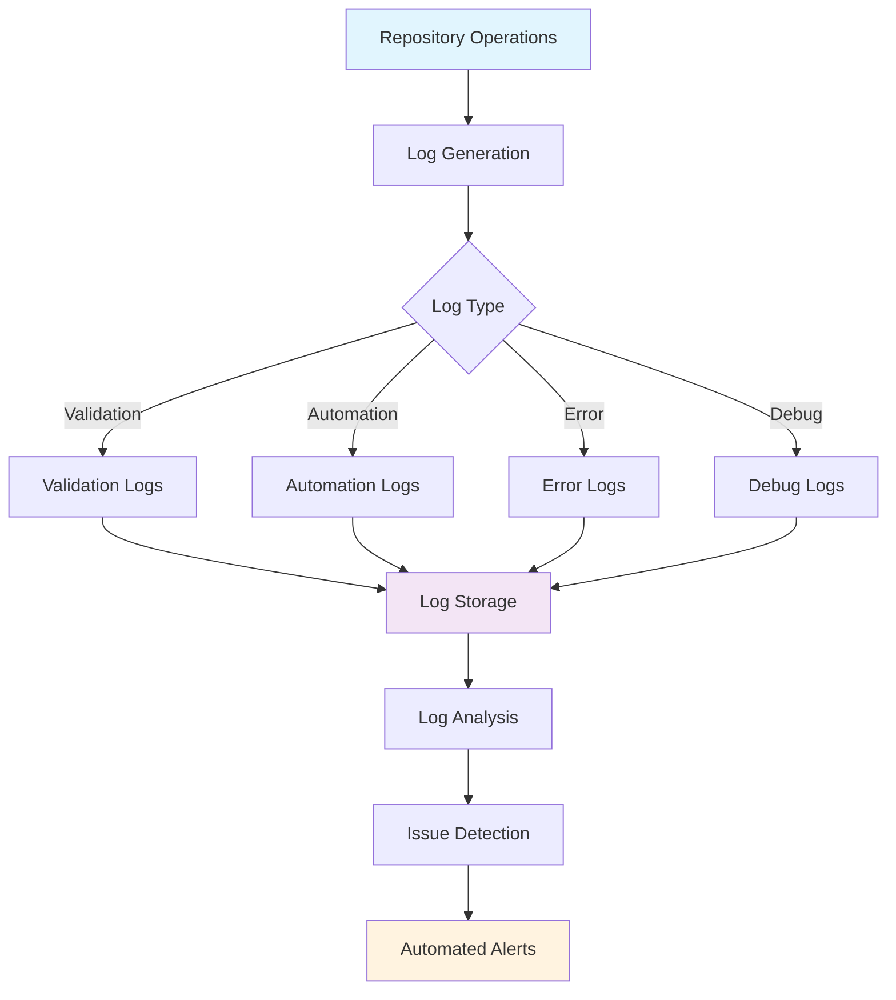
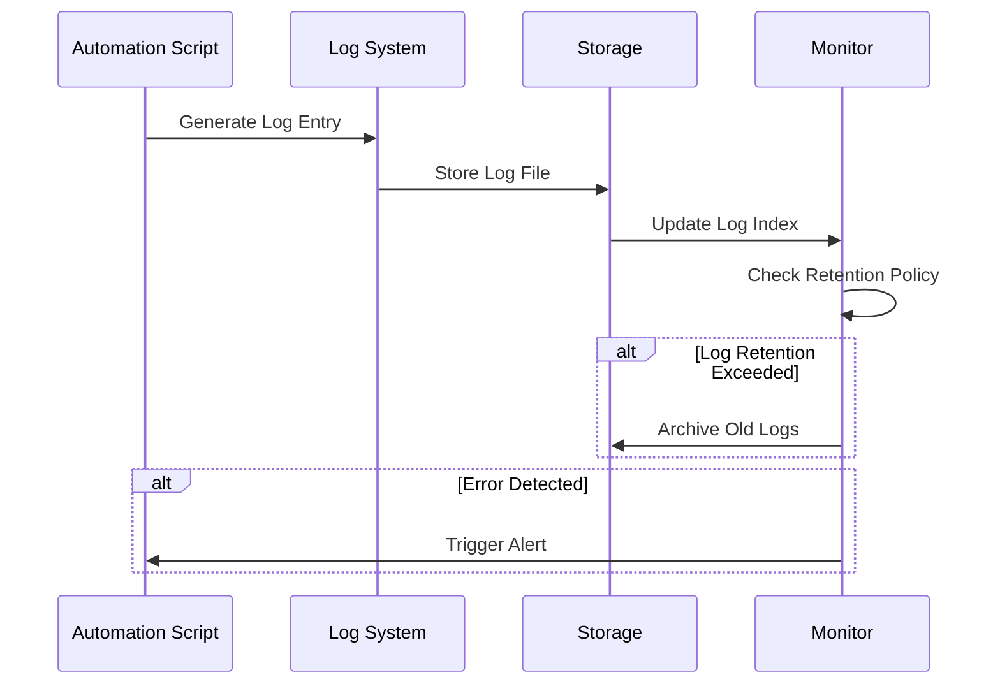

# Logs Directory


Centralized repository for automation logs, validation outputs, and debugging information from LightSpeedWP GitHub repository operations.

## 📊 Logs Architecture



## 🗂️ Current Log Files

| File | Purpose | Generated By | Retention |
|------|---------|--------------|-----------|
| `validate-coderabbit-yml.log` | CodeRabbit configuration validation | Automation scripts | 30 days |

## 🔄 Log Management Workflow



## 📁 Log Categories

### Validation Logs

- **Purpose**: Configuration file validation, schema compliance
- **Format**: Structured text with timestamps and error codes
- **Examples**: CodeRabbit YAML validation, JSON schema validation

### Automation Logs

- **Purpose**: Workflow execution, script runs, CI/CD operations
- **Format**: Timestamped entries with success/failure status
- **Examples**: Badge updates, README generation, label automation

### Error Logs

- **Purpose**: Exception tracking, failure analysis, debugging
- **Format**: Stack traces, error messages, context information
- **Examples**: Script failures, API errors, validation failures

### Debug Logs

- **Purpose**: Development debugging, process tracing, performance monitoring
- **Format**: Verbose output with detailed execution information
- **Examples**: Development workflow debugging, performance profiling

## 🛠️ Log Management

### Generating Logs

Most logs are generated automatically by:

- GitHub Actions workflows
- Automation scripts in `/scripts/`
- Validation processes
- Testing frameworks

### Viewing Logs

```bash
# View recent validation logs
tail -f logs/validate-*.log

# Search for specific errors
grep -r "ERROR" logs/

# Monitor log directory
watch ls -la logs/
```

### Log Retention Policy

| Log Type | Retention Period | Archive Location |
|----------|------------------|------------------|
| Validation | 30 days | Local cleanup |
| Error | 90 days | Archive to `.archive/` |
| Debug | 7 days | Automatic cleanup |
| Automation | 60 days | Local cleanup |

## 🔍 Troubleshooting

### Common Issues

1. **Log File Permissions**

   ```bash
   chmod 644 logs/*.log
   ```

2. **Disk Space Management**

   ```bash
   # Check log directory size
   du -sh logs/
   
   # Clean old logs manually
   find logs/ -name "*.log" -mtime +30 -delete
   ```

3. **Log Analysis**

   ```bash
   # Extract error patterns
   grep -E "(ERROR|FAIL|EXCEPTION)" logs/*.log
   
   # Count log entries by type
   grep -c "INFO\|WARN\|ERROR" logs/*.log
   ```

### Debugging Steps

1. Check recent log entries for errors
2. Verify file permissions and disk space
3. Review automation script configurations
4. Check GitHub Actions workflow logs
5. Validate configuration files mentioned in logs

## 🔗 Integration Points

| Component | Integration | Purpose |
|-----------|-------------|---------|
| **GitHub Actions** | Workflow logs | CI/CD operation tracking |
| **CodeRabbit** | Validation logs | Configuration compliance |
| **Scripts** | Execution logs | Automation monitoring |
| **Tests** | Test logs | Quality assurance tracking |

## 📈 Monitoring & Alerts

### Log Monitoring

- **Automated**: GitHub Actions check for critical errors
- **Manual**: Regular review of error patterns and trends
- **Alerting**: Email notifications for repeated failures

### Performance Metrics

- Log generation frequency
- Storage usage trends  
- Error rate tracking
- Cleanup efficiency

---

## 🤝 Contributing

When adding new logging functionality:

1. **Follow Naming Convention**: `{component}-{type}-{date}.log`
2. **Include Timestamps**: Use ISO 8601 format for all entries
3. **Structure Messages**: Include severity level, component, and clear description
4. **Update Documentation**: Add new log types to this README

## 🆘 Support

- **Documentation**: [Repository README](../README.md)
- **Scripts**: [Scripts Directory](../scripts/README.md)
- **Issues**: [GitHub Issues](../../issues)
- **Discussions**: [GitHub Discussions](../../discussions)

---

<!-- RANDOM FOOTER: 📋 Structured logs lead to faster debugging! -->
