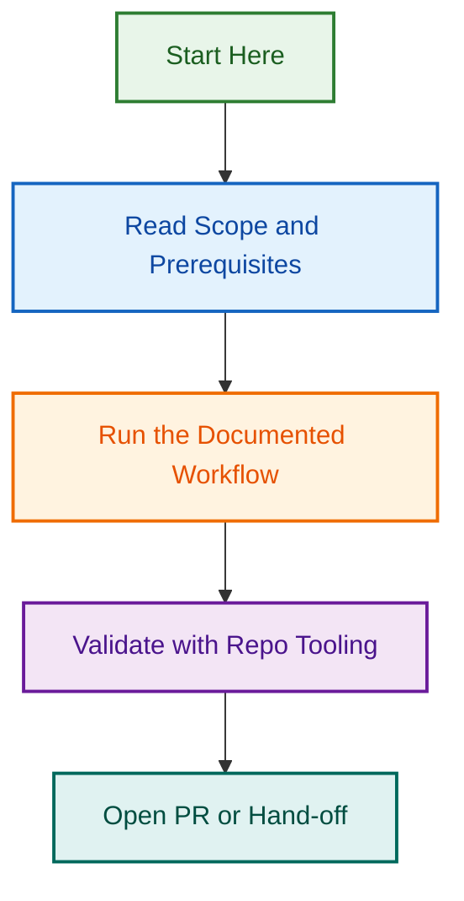

# lightspeed-github-ops

Pilot plugin for reusable governance operations in LightSpeed repositories.

## Contents

- `agents/` packaged governance agent specs.
- `skills/` packaged P0 governance skills.
- `hooks/` optional plugin-local guardrails.
- `.codex-plugin/plugin.json` Codex manifest.
- `.claude-plugin/plugin.json` Claude Code manifest.
- `copilot-plugin.json` Copilot metadata manifest.

## Scope

This pilot excludes block theme and block plugin guidance.

## Visual Workflow

