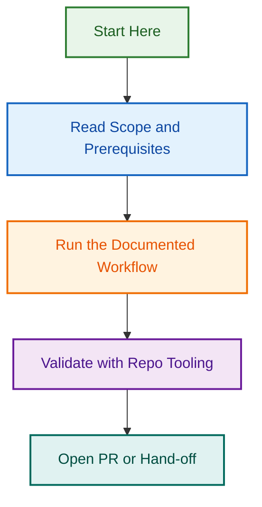

# LightSpeed Playwright Testing Plugin

Packages the **Playwright Testing Agent** for multi-provider use across Claude,
GitHub Copilot, and OpenAI Codex. It turns PRDs and acceptance criteria into
review-ready human-readable test cases first, then maintainable
`@playwright/test` specs for WordPress and WooCommerce sites — with requirement
traceability and a review-before-code gate.

## Provider support

| Provider | Manifest | Config |
| --- | --- | --- |
| Claude | `.claude-plugin/plugin.json` | [agent](../../agents/playwright-testing-agent/claude/agent.md) |
| GitHub Copilot | `copilot-plugin.json` | [agent](../../agents/playwright-testing-agent/copilot/agent.md) |
| OpenAI Codex | `.codex-plugin/plugin.json` | [agent](../../agents/playwright-testing-agent/openai/agent.md) |
| Gemini | `.gemini-plugin/plugin.json` | planned parity |

## Agents included

### Playwright Testing Agent

Requirement extraction → human-readable test cases → traceability → review gate →
Playwright spec generation → CI execution → failure triage.

- Packaged entry: [`agents/playwright-testing.agent.md`](./agents/playwright-testing.agent.md)
- Canonical spec: [`agents/playwright-testing-agent/AGENT.md`](../../agents/playwright-testing-agent/AGENT.md)

## Capabilities

- Requirement extraction and classification (grounded, traceable)
- Review-ready, field-based human-readable test cases
- Requirement → evidence → test-case → coverage traceability
- `@playwright/test` spec generation with accessible locators and fixtures
- Cross-browser (Chromium, Firefox, WebKit), accessibility, and WooCommerce
  stateful coverage
- Failure triage and approval-gated BugHerd failure packages

## Quick start

```bash
npm install -D @playwright/test
npx playwright install
npx playwright test
```

## Installation

See [INSTALL.md](./INSTALL.md) for per-provider steps.

## Hooks

Recommended validation hooks are documented in [hooks/README.md](./hooks/README.md).

## Support

[contact@lightspeedwp.agency](mailto:contact@lightspeedwp.agency)

---

*Built by 🧱 LightSpeedWP with ☕, 🚀, and open-source spirit!*

[🔗 Website](https://lightspeedwp.agency) · [📧 Contact](https://lightspeedwp.agency/contact) · [👥 Contributors](https://github.com/lightspeedwp/.github/graphs/contributors)

## Visual Workflow


