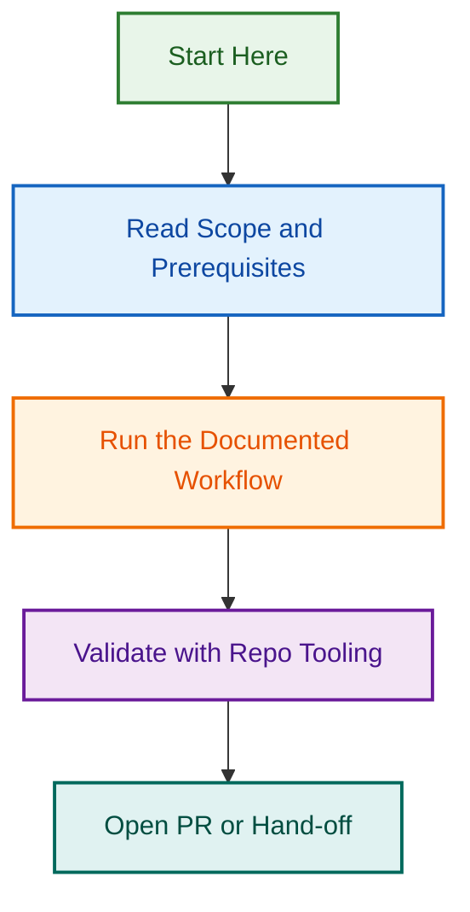

# Plugin Hooks — lightspeed-playwright-testing

This plugin relies on the org-wide portable hooks registered in
[`hooks/hook-registry.json`](../../../hooks/hook-registry.json). No plugin-local
hook implementations are required.

## Recommended hooks

| Hook | Purpose |
| --- | --- |
| `agent-spec-validator` | Validate the agent's `AGENT.md` frontmatter |
| `multi-provider-consistency-checker` | Ensure claude/copilot/openai configs stay in parity |
| `plugin-integrity-checker` | Validate this plugin's manifests and structure |
| `agent-security-auditor` | Scan agent files for hardcoded secrets |
| `secrets-scanner` | Org-wide secret detection |

See the [hooks registry](../../../hooks/hook-registry.json) for status and triggers.

---

*Built by 🧱 LightSpeedWP with ☕, 🚀, and open-source spirit!*

[🔗 Website](https://lightspeedwp.agency) · [📧 Contact](https://lightspeedwp.agency/contact) · [👥 Contributors](https://github.com/lightspeedwp/.github/graphs/contributors)

## Visual Workflow

