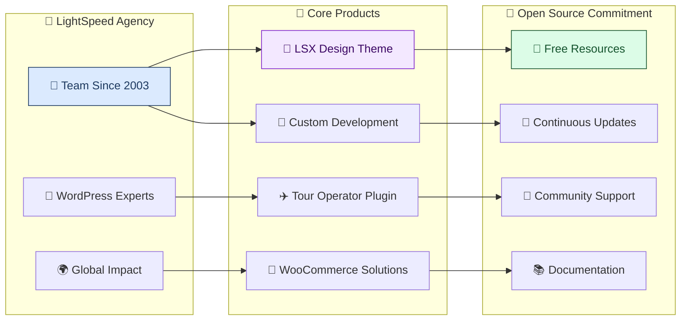
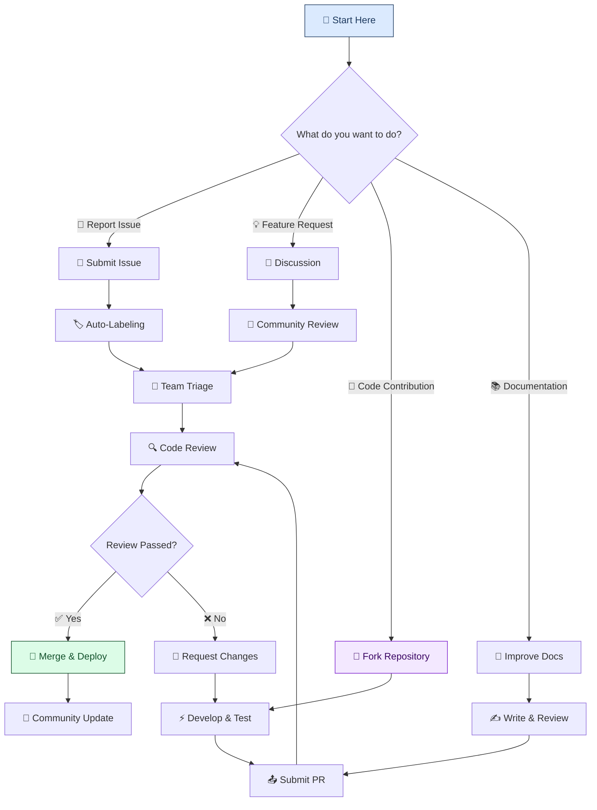
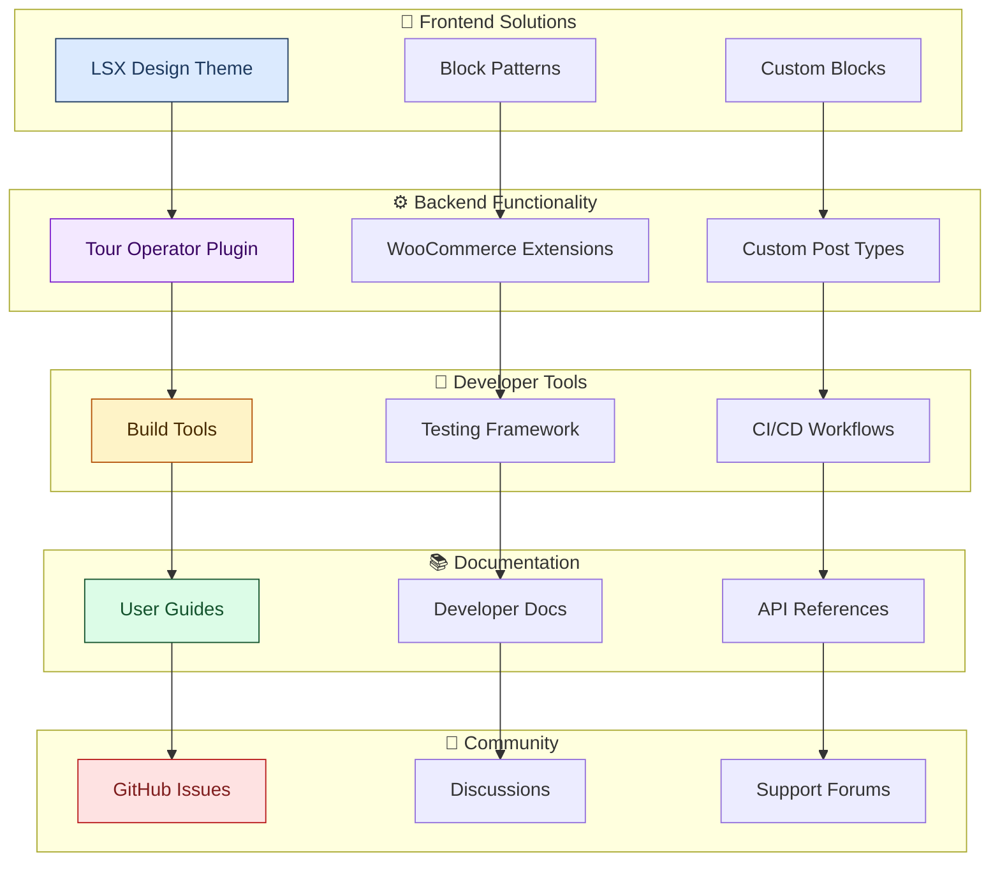
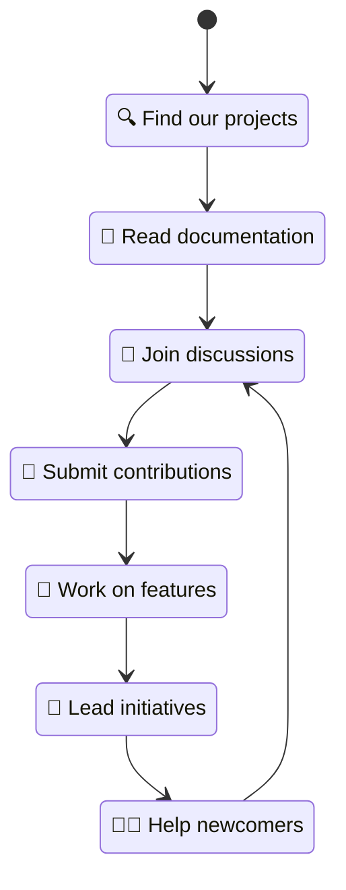

# 🚀 LightSpeed WordPress Development Agency

## 👋 Welcome to LightSpeed's GitHub Organization

We're a **WordPress design and development agency** with a focus on creating powerful, open-source solutions for the WordPress ecosystem. Since 2003, we've been empowering businesses and developers with high-quality themes, plugins, and custom solutions.

### 🏛️ Organization Overview

## About Us

Since 2003, LightSpeed has been helping businesses build, scale, and grow their online presence. With a passion for WordPress, we specialize in crafting custom themes, plugins, and integrations that empower users and developers alike.

## 🙋‍♀️ What We're All About

At LightSpeed, we're passionate about delivering high-quality WordPress themes, plugins, and custom solutions. We focus on performance, accessibility, and user experience. Whether you're building a simple site or a complex e-commerce platform, we’ve got you covered.

### Highlights of Our Work

- **LSX Design Theme**: A powerful block-based theme that gives you complete control over your site’s design without needing a page builder.
- **LSX Tour Operator Plugin**: Tailor-made for travel companies, this plugin makes managing tours and bookings a breeze.
- **WooCommerce Integrations**: Advanced custom solutions for WooCommerce-based websites.

Visit our website to learn more about our services and case studies: [lightspeedwp.agency](https://lightspeedwp.agency). Explore our services, case studies, and learn more about how we can help your business thrive in the digital space.

## 🌈 Community Contribution Workflow

We believe in the power of community and open-source collaboration! If you're passionate about WordPress, there are many ways to get involved.

### 🔄 Contribution Process Flow

### 🤝 Ways to Contribute

1. **🐛 Submit an Issue**: Found a bug or have a feature request? Let us know!
2. **🍴 Fork and Contribute**: Help us improve our plugins and themes by submitting pull requests.
3. **💬 Join Discussions**: We love hearing from the community. Jump into conversations in our repositories.
4. **📚 Improve Documentation**: Help make our documentation clearer and more comprehensive.
5. **🧪 Test Beta Features**: Try out new features and provide feedback.

Check out our [Contributing Guidelines](../CONTRIBUTING.md) for detailed information.

## 🌟 Our Open-Source Ecosystem

At LightSpeed, we believe in the power of open-source software. We contribute to the WordPress community by developing high-quality, free, and open-source plugins and themes.

### 🏗️ Project Architecture & Integration

### [LSX Design](https://lsx.design)

Our flagship block-based WordPress theme, **LSX Design**, offers a flexible and fully customizable experience for building your WordPress site with no page builders required. Designed for performance, accessibility, and simplicity, LSX Design is perfect for users of all levels.

- **Features**: Full block editor integration, responsive layouts, WooCommerce-ready, and SEO-friendly.
- **Get Started**: [Download LSX Design](https://wordpress.org/themes/lsx-design/)

### Tour Operator Plugin

The **Tour Operator** plugin is a powerful extension built for travel agencies and tour companies, enabling them to manage bookings, destinations, itineraries, and more — all within the WordPress dashboard.

- **Features**: Custom tour post types, itinerary management, destination pages, and seamless WooCommerce integration.
- **Get Started**: [Download LSX Tour Operator Plugin](https://wordpress.org/plugins/tour-operator/)

## Contributing

We welcome contributions from the community! If you're interested in collaborating, feel free to open an issue or submit a pull request. Check out our contributing guidelines in each project repository for more details.

### 🤝 Community Engagement Lifecycle

**Whether you're a developer, designer, or just a WordPress enthusiast, we'd love to collaborate with you!**

- **🔍 Discover**: Browse our repositories and explore our projects
- **📖 Learn**: Read our documentation and get familiar with our standards
- **💬 Engage**: Join discussions and share your ideas
- **🔧 Contribute**: Submit issues, pull requests, and improvements
- **🚀 Lead**: Take ownership of features and help guide project direction
- **👨‍🏫 Mentor**: Help onboard new contributors and share your knowledge

## License

All LightSpeed open-source projects are licensed under the GNU General Public License v3.0. This ensures our software remains free and open for everyone to use, modify, and distribute.

---

## 📊 Quick Stats

- 🎂 **Since**: 2003 (20+ years of WordPress expertise)
- 🚀 **Active Projects**: 10+ open-source repositories
- 🌍 **Global Reach**: Used by thousands of WordPress sites worldwide
- 🤝 **Community**: Growing developer and user base
- 📈 **Downloads**: Hundreds of thousands across all projects

---

## 🔗 Connect with Us

### 🌐 Official Links

- **🏠 Website**: [lightspeedwp.agency](https://lightspeedwp.agency) - Our main agency website
- **🎨 LSX Design**: [lsx.design](https://lsx.design) - Our flagship theme hub
- **📖 Documentation**: [GitHub Pages](https://lightspeedwp.github.io/) - Comprehensive docs
- **💬 Discussions**: [GitHub Discussions](https://github.com/orgs/lightspeedwp/discussions) - Community forum

### 📱 Social Media

- **🐦 Twitter**: [@lightspeedwp](https://twitter.com/lightspeedwp) - Latest updates and news
- **💼 LinkedIn**: [LightSpeed WP](https://www.linkedin.com/company/lightspeed-wp/) - Professional network
- **📧 Email**: [hello@lightspeedwp.agency](mailto:hello@lightspeedwp.agency) - Direct contact

### 🆘 Support Resources

- **📋 Issues**: Report bugs and request features in individual repositories
- **💭 Discussions**: Ask questions and share ideas in our community forum
- **📚 Documentation**: Comprehensive guides and API references
- **🤝 Contributing**: See our [Contributing Guidelines](../CONTRIBUTING.md)

---

**🚀 Together, let's build better WordPress experiences and empower the open-source community!**

---

---

*🧭 Your compass through the documentation landscape*
