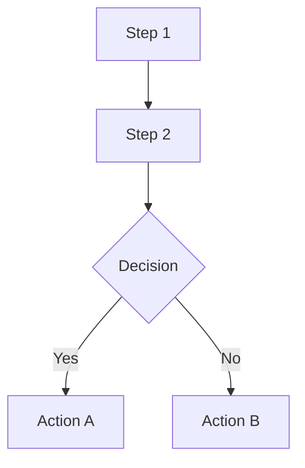
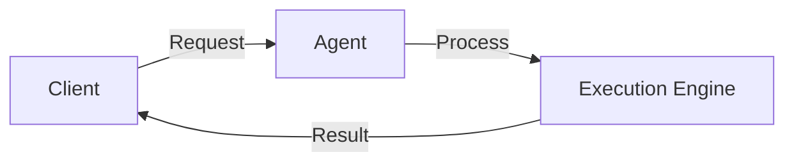

# Prompt: Create or Update README.md Files with Mermaid Diagrams

## PROMPT: Create or update existing README files with proper frontmatter, sections, and Mermaid diagrams

This prompt creates comprehensive README.md files with consistent structure, YAML frontmatter, and optional Mermaid diagrams for visual documentation.

### Context

README files are the entry point for understanding a folder's purpose. A good README:

- **Has frontmatter** (YAML metadata: title, description, owners, tags)
- **Follows folder-specific patterns** (agents, skills, workflows, scripts, etc. have different structures)
- **Includes diagrams** (Mermaid) for complex structures, workflows, or relationships
- **Is accessible** (alt text for diagrams, plain language, semantic HTML)
- **Provides examples** (how to use, how to run, validation steps)

---

## STEP 1: Identify Target Folder

Determine which folder needs a README:

```bash
# Option 1: Create for top-level folder
# Target: agents/
# Target: skills/
# Target: workflows/
# Target: instructions/
# Target: scripts/

# Option 2: Create for sub-folder
# Target: agents/chat-closure-agent/
# Target: skills/skill-creator/

# Verify folder exists
ls -la {target-folder}

# Check if README.md already exists
ls {target-folder}/README.md
# If exists: Update existing (STEP 2b)
# If missing: Create new (STEP 2a)
```

---

## STEP 2: Review Standards & Existing Patterns

Before creating, check existing documentation:

### 2a: For New READMEs

```bash
# Review README standards
cat .github/instructions/readme.instructions.md

# Review file organisation rules
cat .github/instructions/file-organisation.instructions.md

# Look for similar README examples in:
# - agents/*/README.md (existing agent README)
# - skills/*/README.md (existing skill README)
# - workflows/*/README.md (if exists)
# - scripts/README.md (if exists)
```

### 2b: For Updating Existing READMEs

```bash
# Read current README
cat {target-folder}/README.md

# Identify what needs updating:
# - Frontmatter missing or outdated?
# - Sections incomplete or wrong order?
# - Diagrams needed or outdated?
# - Examples missing or incorrect?
# - Links broken or stale?
```

---

## STEP 3: Create YAML Frontmatter

Every README must start with frontmatter:

```yaml
---
title: "{Folder Name} — {Purpose}"
description: "{1-2 sentence description of folder contents}"
folder: "{folder-path}"
file_type: "documentation"
tags: ["tag1", "tag2", "tag3"]
owners: ["owner-email@example.com"]
status: "active"
last_updated: "{YYYY-MM-DD}"
---
```

**Example for `agents/`:**

```yaml
---
title: "Agents — Portable AI Agent Specifications"
description: "Self-contained, production-ready AI agent specifications for common development workflows, portable across repositories and teams."
folder: "agents/"
file_type: "documentation"
tags: ["ai", "agents", "automation", "portable"]
owners: ["ashley@lightspeedwp.agency"]
status: "active"
last_updated: "2026-09-04"
---
```

**Example for `agents/chat-closure-agent/`:**

```yaml
---
title: "Chat Closure Agent"
description: "AI agent that automates session closure, branch cleanup, documentation updates, and final commit/push workflow."
folder: "agents/chat-closure-agent"
file_type: "documentation"
tags: ["agent", "workflow", "cleanup", "automation"]
owners: ["ashley@lightspeedwp.agency"]
status: "active"
last_updated: "2026-09-04"
---
```

---

## STEP 4: Structure Sections (Folder-Specific Patterns)

### Pattern A: Top-Level Folder (e.g., `agents/`, `skills/`)

```markdown
# {Title}

## Overview

{1-2 paragraph description of folder purpose and contents}

## Folder Structure

```
agents/
├── README.md (this file)
├── AGENT.md (agent specification template)
├── agent-name-1/
│   ├── README.md
│   ├── AGENT.md
│   └── claude/
│       └── prompt.md
├── agent-name-2/
│   └── {structure similar}
```

Each agent is self-contained with:
- AGENT.md (specification)
- claude/ folder (Claude-specific prompts)
- README.md (agent documentation)
```

### 4.1 Add Diagram (if complex structure)

For complex folder ecosystems (agents with sub-folders, dependencies):

```markdown
## Architecture Diagram

\`\`\`mermaid
graph TB
    Root["agents/"]
    Spec["AGENT.md spec"]
    Agent1["agent-name-1/"]
    Agent2["agent-name-2/"]
    Prompt["claude/prompt.md"]
    
    Root --> Spec
    Root --> Agent1
    Root --> Agent2
    Agent1 --> Prompt
    Agent2 --> Prompt
\`\`\`

**Diagram Legend:**
- Top level: agents/ root folder
- Files: AGENT.md specifications
- Sub-folders: Individual agent implementations
- Sub-files: Claude-specific configurations
```

### Pattern B: Sub-Folder (e.g., `agents/agent-name/`)

```markdown
# {Agent Name}

## Overview

{Clear description of what this agent does}

## Purpose & Use Cases

- Use case 1: {description}
- Use case 2: {description}
- Use case 3: {description}

## Features

- Feature 1: {description}
- Feature 2: {description}

## Files in This Folder

| File | Purpose |
|------|---------|
| README.md | This file — agent documentation |
| AGENT.md | Agent specification and configuration |
| claude/prompt.md | Claude-specific system prompt |

## How to Use

1. Read AGENT.md for specification
2. Review claude/prompt.md for implementation
3. Follow examples below

## Example

[Provide concrete usage example]

## Validation

[How to verify agent works correctly]

## References

[Links to related documentation]
```

### Pattern C: Script Folder (`scripts/`)

```markdown
# Scripts — Utility Tools and Automation

## Overview

Portable scripts for automation, build processes, and repository maintenance.

## Available Scripts

| Script | Purpose | Usage |
|--------|---------|-------|
| cleanup-branches.js | Clean up old/merged branches | `node scripts/cleanup-branches.js` |
| generate-changelog.js | Generate changelog from commits | `node scripts/generate-changelog.js` |

## Workflow Diagram

\`\`\`mermaid
graph LR
    User["User runs script"] --> Parse["Parse arguments"]
    Parse --> Process["Process files"]
    Process --> Output["Generate output"]
    Output --> Log["Log results"]
\`\`\`

## Adding New Scripts

1. Create file: scripts/{script-name}.js
2. Add usage section to this README
3. Test thoroughly
4. Add to package.json if it's a common task

## References

[Links to related files]
```

---

## STEP 5: Add Optional Mermaid Diagrams

**When to include diagrams:**

| Diagram Type | When to Use | Example |
|--------------|------------|---------|
| Architecture | Complex folder structure, 5+ components | Agent ecosystem, workflow pipeline |
| Flowchart | Process or decision flow | Script execution flow |
| Class diagram | Relationships between entities | Agent → prompt → result |
| Sequence | Step-by-step process | Agent initialization → execution → completion |

**When NOT to include:**

- Single-file content (diagram doesn't add value)
- Simple lists (table is better)
- Rapidly changing content (diagrams get outdated)

**Accessibility for Diagrams:**

```markdown
## Example Diagram with Alt Text

\`\`\`mermaid
graph TB
    Input["Input: User request"]
    Agent["Agent processor"]
    Output["Output: Result"]
    
    Input --> Agent
    Agent --> Output
\`\`\`

**Diagram Description (for accessibility):**
Flowchart showing three steps: 1) User input arrives, 2) Agent processes input, 3) Result returned to user.
```

---

## STEP 6: Add Examples & Usage

Provide concrete examples:

```markdown
## Usage Examples

### Example 1: Basic Usage

\`\`\`bash
# Run agent
node agents/my-agent/claude/prompt.md

# Output
Agent initialized with 5 tasks
\`\`\`

### Example 2: With Arguments

\`\`\`bash
# Run with specific configuration
MY_CONFIG=production node agents/my-agent/claude/prompt.md

# Output shows production-specific behavior
\`\`\`

### Example 3: Expected Output

When run correctly, you should see:
- [ ] Agent initializes
- [ ] Tasks load correctly
- [ ] Results generate
- [ ] Summary printed
```

---

## STEP 7: Add Validation & Testing Section

```markdown
## Validation

How to verify your README is correct:

```bash
# Lint markdown
npm run lint:md -- README.md

# Validate frontmatter
npm run validate:frontmatter -- README.md

# Check links (if using link checker)
npm run validate:links -- README.md

# Verify diagrams render
# (Open file in GitHub or Claude Code)
\`\`\`

Checklist:
- [x] All links are valid
- [x] Diagrams render without errors
- [x] Frontmatter is complete
- [x] Code examples are correct
- [x] No formatting issues
- [x] Accessibility standards met
```

---

## STEP 8: Add Governance Links

Link to relevant standards & guidelines:

```markdown
## Governance & Standards

- **README Standards:** `.github/instructions/readme.instructions.md`
- **File Organisation:** `.github/instructions/file-organisation.instructions.md`
- **Mermaid Guidance:** `.github/instructions/mermaid.instructions.md`
- **Accessibility:** WCAG 2.2 AA compliance required
- **Markdown Linting:** `npm run lint:md`

---

## References

[Links to related documentation, tools, standards]
```

---

## STEP 9: Create/Update the README File

```bash
# Create new README
cat > {target-folder}/README.md << 'EOF'
---
title: "{Title}"
description: "{Description}"
...
---

# {Title}

[... content from STEPS 3-8 ...]

---
Created: {date}
Last Updated: {date}
EOF

# Or update existing:
# 1. Open {target-folder}/README.md
# 2. Update frontmatter (dates, owners, status)
# 3. Update sections as needed
# 4. Add/refresh diagrams
# 5. Test links
```

---

## STEP 10: Validate & Lint

```bash
# Lint markdown
npm run lint:md -- {target-folder}/README.md

# Fix formatting issues
npm run format -- {target-folder}/README.md

# Validate frontmatter
npm run validate:frontmatter -- {target-folder}/README.md

# Check for broken links (if available)
npm run validate:links -- {target-folder}/README.md

# Verify diagrams render
# Open in GitHub web UI or Claude Code to confirm Mermaid renders
```

---

## STEP 11: Commit Changes

```bash
# Stage README
git add {target-folder}/README.md

# Commit with message
git commit -m "docs: Create/update README for {folder-name}

- Add YAML frontmatter
- Document folder purpose and contents
- Include Mermaid diagrams (if applicable)
- Add usage examples and validation steps
- Link to governance standards

Co-Authored-By: Claude Haiku 4.5 <noreply@anthropic.com>"

# Push to develop
git push origin develop
```

---

## Bulk README Generation

If updating multiple README files:

```bash
# Script template
for folder in agents skills workflows scripts; do
  echo "Processing $folder/"
  # Generate README for each
  # Test and validate
  # Commit
done

# Use existing prompts if available:
# - create-readme.prompt.md
# - readme-blueprint.prompt.md
# - update-readmes.prompt.md
```

---

## Mermaid Tips

**Example Diagrams:**





---

## References

- **README Instructions:** `.github/instructions/readme.instructions.md`
- **Mermaid Guide:** `.github/instructions/mermaid.instructions.md`
- **File Organisation:** `.github/instructions/file-organisation.instructions.md`
- **Existing READMEs:** `agents/*/README.md` (as examples)
- **Prompt: Create README:** `prompts/create-readme.prompt.md`
- **Prompt: README Blueprint:** `prompts/readme-blueprint.prompt.md`

---

**Effort:** 1–2 hours per README  
**Use When:** Need to create/update README for agents/, skills/, workflows/, instructions/, scripts/, or sub-folders  
**Output:** Well-structured README with frontmatter, sections, optional Mermaid diagrams  
**Dependencies:** Markdown knowledge, Mermaid (for diagrams), npm (for linting)
