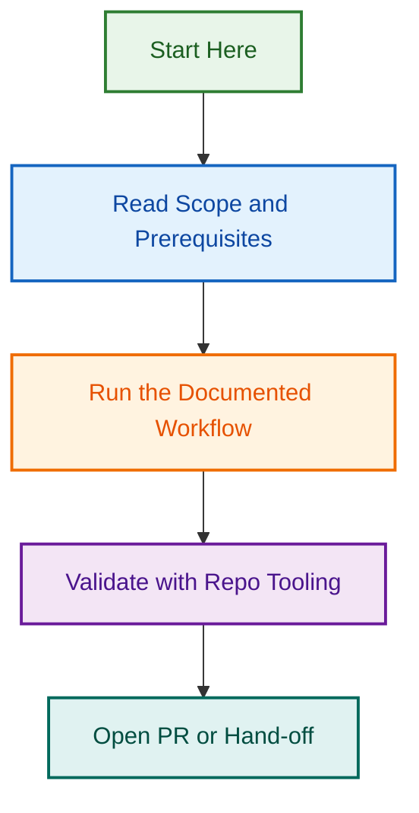

# Standardised Prompts

This directory contains reusable prompt templates for agents and AI scenarios across LightSpeed projects. Use these prompts as starting points for common tasks—customise as needed for your specific context.

## Canonical Boundary

- `prompts/` is the canonical location for organisation-wide reusable prompts.
- `.github/prompts/` is reserved for `.github` control-plane and repository-governance prompts.
- Migration authority: `.github/projects/active/refactor-migrate-prompts/artifacts/migration-matrix.md`.

## Migration Status

- `38` prompts have been migrated/refactored from `.github/prompts/` to root `prompts/`.
- `8` legacy prompts in `.github/prompts/` are merge/deprecate candidates and now include successor guidance.
- Legacy `.github/prompts/` moved files contain deprecation notices with canonical target paths.

## Prompt Templates

- **[agent-setup.prompt](./agent-setup.prompt)** — Initial agent context, instructions, and configuration
- **[code-generation.prompt](./code-generation.prompt)** — Code implementation, scaffolding, and generation
- **[code-review.prompt](./code-review.prompt)** — Code review, quality feedback, and standards enforcement
- **[debugging.prompt](./debugging.prompt)** — Problem diagnosis, root cause analysis, and resolution
- **[documentation.prompt](./documentation.prompt)** — Documentation creation, updates, and refinement
- **[update-frontmatter.prompt](./update-frontmatter.prompt)** — Front matter migration, schema alignment, and validation updates
- **[testing.prompt](./testing.prompt)** — Test suite creation, debugging, and coverage improvements
- **[refactoring.prompt](./refactoring.prompt)** — Code refactoring, optimisation, and modernisation

## Usage

Each prompt is designed to be:

- **Customisable:** Adapt sections to your project context
- **Focused:** Addresses a specific task or workflow stage

### Example: Code Generation

```bash
# Copy the template
cp prompts/code-generation.prompt my-task.prompt

# Edit for your context
# Add project-specific details, file paths, acceptance criteria

# Use with your agent or AI tool
claude --load-prompt my-task.prompt
```

## Prompt Structure

All prompts follow a consistent structure:

1. **Context** — Project, scope, and relevant background
2. **Task** — Clear, specific objective
3. **Constraints** — Limitations, standards, or requirements
4. **Acceptance Criteria** — Definition of done
5. **References** — Links to relevant docs, files, or examples

## Contributing

To add or improve prompts:

1. Follow the standard structure above
2. Use UK English and clear, concise language
3. Include real examples where helpful
4. Document any dependencies or prerequisites
5. Create a PR with rationale for the new prompt

---

---

---

*🎼 Orchestrated automation — where intelligence meets operations*
## Visual Workflow


