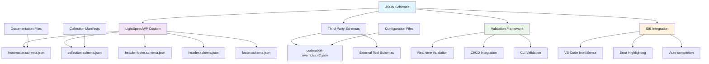
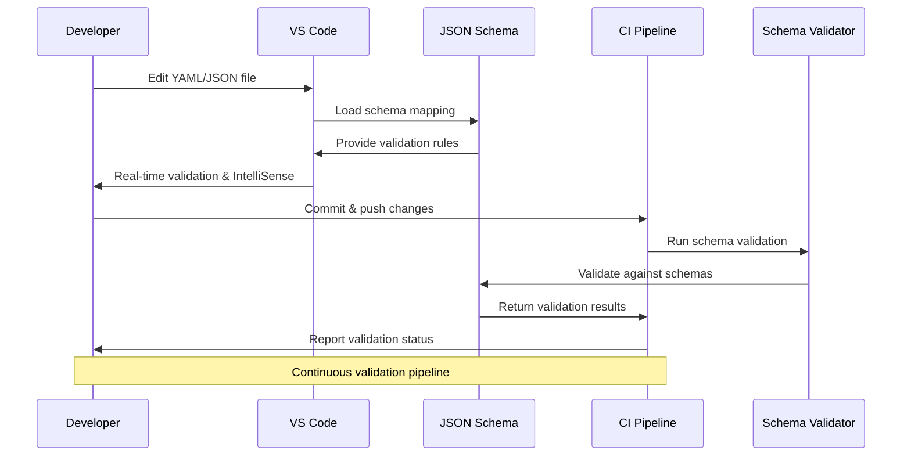
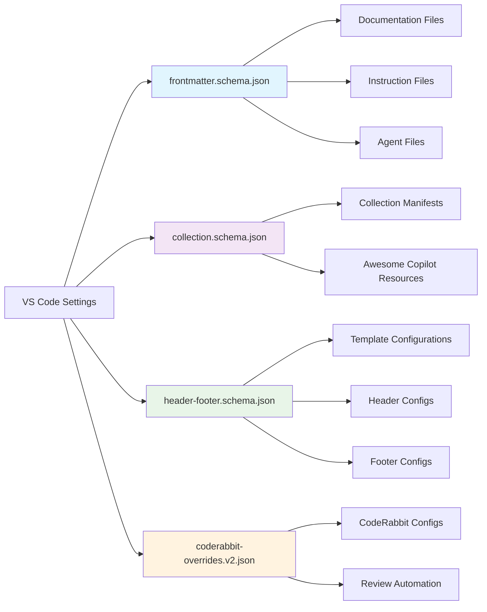

## 📋 LightSpeedWP JSON Schemas Collection


This folder contains JSON Schema files used for validation, documentation, and tooling support across the LightSpeedWP organization.

## 📊 Schema Architecture



---

## Schema Categories

### LightSpeedWP Custom Schemas

These schemas have been developed specifically for LightSpeedWP projects and governance:

- **frontmatter.schema.json**  
  Standardized frontmatter schema for governance, documentation, and configuration files. Defines required fields for agents, instructions, prompts, chatmodes, and other organizational documentation.

- **collection.schema.json**  
  Schema for awesome-copilot collection manifest files, defining the structure for organizing and cataloging Copilot resources.

- **header.schema.json**  
  Schema for header configuration and templating across LightSpeedWP projects.

- **footer.schema.json**  
  Schema for footer configuration and templating across LightSpeedWP projects.

- **header-footer.schema.json**  
  Combined schema for header and footer configuration management.

### Third-Party Schemas

These schemas are downloaded and maintained for specific software integrations:

- **coderabbit-overrides.v2.json**  
  Schema for CodeRabbit AI code review tool configuration overrides, defining review settings, path filters, and automation preferences.

---

## Usage

### VS Code Integration

These schemas are automatically mapped in VS Code workspace settings (`.vscode/settings.json`) to provide:

- IntelliSense and autocompletion for configuration files
- Real-time validation and error highlighting
- Documentation tooltips for schema properties

### File Validation

Schemas are used to validate:

- YAML frontmatter in documentation files
- Configuration files for tools and automation
- Manifest files for collections and resources
- Template configurations for headers and footers

### CI/CD Integration

Some schemas may be used in GitHub Actions workflows for:

- Automated validation of configuration changes
- Ensuring documentation standards compliance
- Validating collection manifests and metadata

---

## Schema Development

### Creating New Schemas

When adding new schemas:

1. Follow JSON Schema Draft 7 specification
2. Include comprehensive `title` and `description` fields
3. Use clear property names and descriptions
4. Add examples where helpful
5. Update VS Code workspace settings to map file patterns

### Updating Existing Schemas

- Maintain backward compatibility when possible
- Update version numbers for breaking changes
- Document changes in commit messages
- Test validation against existing files

### Third-Party Schema Updates

- Check for updates periodically from upstream sources
- Document the source and version when updating
- Test compatibility with existing configurations

---

## File Mapping

Current schema-to-file mappings (see `.vscode/settings.json`):

```json
"yaml.schemas": {
  "./schemas/frontmatter.schema.json": [
    "AGENTS.md",
    ".github/agents/*.agent.md",
    ".github/instructions/*.instructions.md",
    ".github/prompts/*.prompt.md",
    ".github/chatmodes/*.chatmode.md"
  ]
}
```

---

## Validation Tools

- **VS Code**: Automatic validation with YAML/JSON extensions
- **CLI**: Use tools like `ajv-cli` for command-line validation
- **CI**: Automated validation in GitHub Actions workflows

---

## 🔄 Schema Validation Workflow



## 🎯 Schema Relationship Map



---

## 📚 References

### 🔗 Documentation Links

- [JSON Schema Specification](https://json-schema.org/specification.html)
- [VS Code JSON Schema Integration](https://code.visualstudio.com/docs/languages/json#_json-schemas-and-settings)
- [LightSpeedWP Frontmatter Conventions](../.github/instructions/frontmatter.instructions.md)
- [Schema Validation Scripts](../scripts/json-validation/)

### 🛠️ Development Resources

- [AJV JSON Schema Validator](https://ajv.js.org/)
- [JSON Schema Lint](https://jsonschemalint.com/)
- [Schema Store](https://schemastore.org/json/)
- [VS Code Workspace Settings](../.vscode/settings.json)

### 🎯 AI & Automation

- [Custom Instructions](../.github/custom-instructions.md)
- [Validation Workflows](../.github/workflows/)
- [JSON Validation Scripts](../scripts/json-validation/)
- [Schema Testing Guidelines](../.github/instructions/tests.instructions.md)

---

_📋 Ensuring data integrity through comprehensive schema validation and automated compliance._
