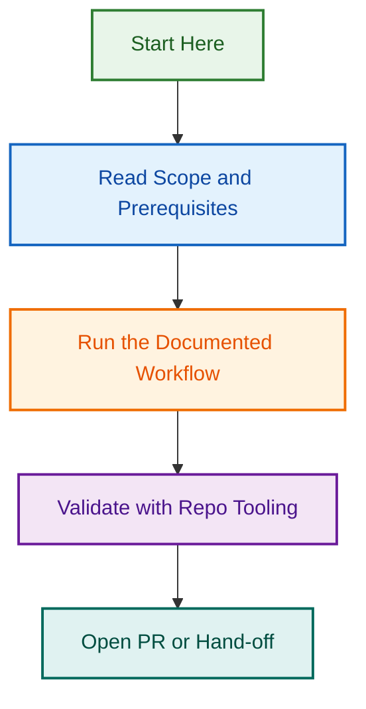

# Schema Definitions

This directory is the canonical location for JSON schemas used across LightSpeedWP repositories.

## Scope

Schemas in this folder validate:

- Frontmatter and documentation metadata.
- Agent and provider configuration.
- Plugin manifests and capability bindings.
- Project field and workflow configuration.
- Changelog and release-related metadata.

## Key Schemas

- `frontmatter.schema.json`
- `multi-provider-agent.schema.json`
- `provider-config.schema.json`
- `agent-capability-manifest.schema.json`
- `plugin-manifest.schema.json`
- `project-fields.schema.json`
- `changelog.schema.json`

## Compatibility Note

A hidden `.schemas/` directory may exist for backward compatibility, but new references should target `schemas/`.

## Validation

Use repository scripts and CI workflows to validate files against these schemas. When adding a new schema:

1. Add the schema file in `schemas/`.
2. Add examples when helpful.
3. Update relevant documentation and validation scripts.
## Visual Workflow

