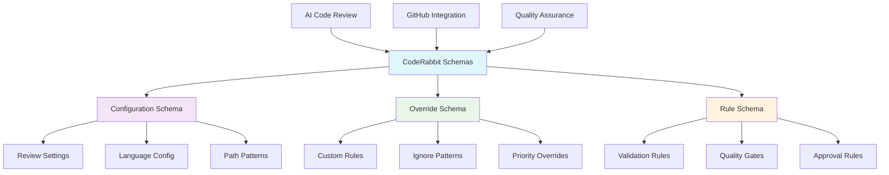
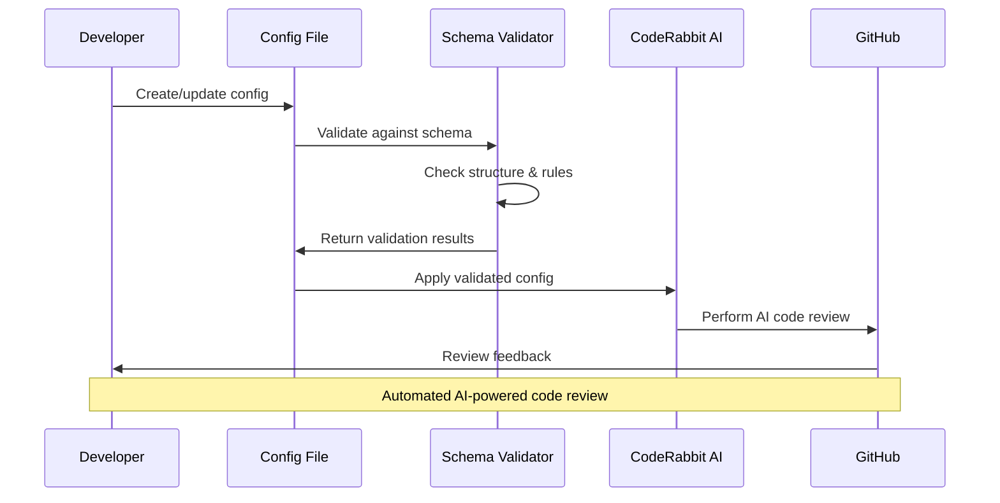

# 🤖 CodeRabbit Configuration Schemas


This directory contains JSON schema files for validating CodeRabbit AI code review configurations and override settings.

## 📊 Schema Architecture



## 📁 Future Schema Structure

Once populated, this directory will contain:

- **`config.schema.json`** — Main configuration schema
- **`overrides.schema.json`** — Override rules schema  
- **`review-rules.schema.json`** — Code review rules schema
- **`language-settings.schema.json`** — Language-specific settings
- **`path-patterns.schema.json`** — File path pattern definitions

## 🔄 Schema Validation Flow



## 🎯 Configuration Categories

### Core Configuration

- Review automation settings
- Quality thresholds and gates
- Language-specific rules
- File pattern matching

### Override Management

- Custom rule definitions
- Repository-specific settings
- Path-based exceptions
- Priority configurations

### Integration Settings

- GitHub workflow integration
- CI/CD pipeline configuration
- Notification preferences
- Report generation

## 📚 Usage Examples

### Schema Validation

```bash
# Validate CodeRabbit configuration
ajv validate -s config.schema.json -d ../coderabbit-overrides.v2.json

# Validate with custom schema
npx ajv-cli validate --schema overrides.schema.json --data config.json
```

### Integration Testing

```javascript
const Ajv = require('ajv');
const schema = require('./config.schema.json');
const config = require('../coderabbit-overrides.v2.json');

const ajv = new Ajv();
const validate = ajv.compile(schema);
const valid = validate(config);

if (!valid) {
  console.error('Validation errors:', validate.errors);
}
```

## 🛠️ Development Guidelines

### Schema Design Principles

- Follow JSON Schema Draft 7 specification
- Use clear, descriptive property names
- Include comprehensive examples
- Provide detailed error messages
- Support extensibility for future features

### Validation Standards

- All schemas must be valid JSON Schema
- Include unit tests for schema validation
- Document all properties and constraints
- Provide usage examples for each schema
- Maintain backward compatibility

## 🔗 Related Resources

### Configuration Files

- [`../coderabbit-overrides.v2.json`](../coderabbit-overrides.v2.json) — Main override configuration
- [`../../.github/coderabbit.yaml`](../../.github/coderabbit.yaml) — GitHub integration config

### Documentation

- [CodeRabbit Documentation](https://docs.coderabbit.ai/)
- [JSON Schema Specification](https://json-schema.org/)
- [Schema Validation Best Practices](../../docs/SCHEMA-VALIDATION.md)

### Tools & Utilities

- [AJV Schema Validator](https://ajv.js.org/)
- [JSON Schema Lint](https://jsonschemalint.com/)
- [Schema Store](https://schemastore.org/)

---

_🤖 Empowering AI-driven code review through structured configuration validation._

<!-- RANDOM FOOTER: 🤖 Docs signed by Copilot for LightSpeedWP -->
