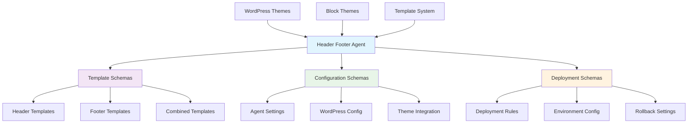
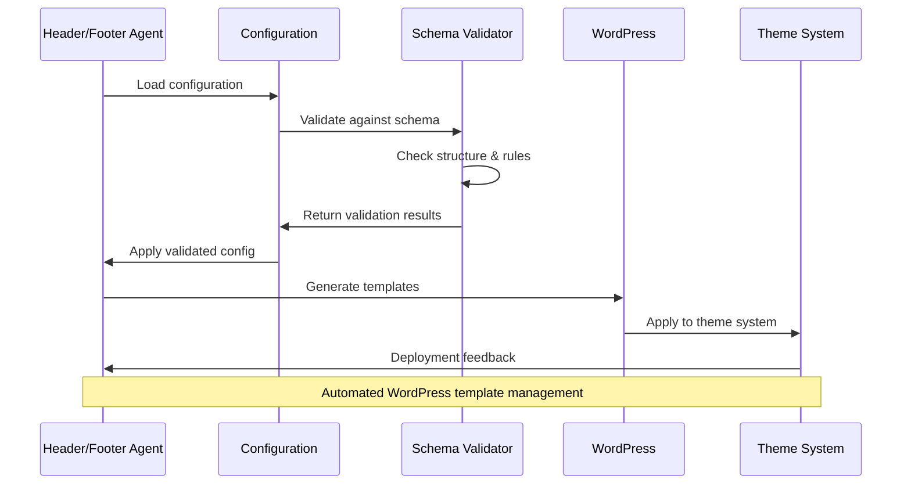

# 🎨 Header Footer Agent Schemas


This directory contains JSON schema files for validating WordPress header/footer automation agent configurations, templates, and deployment settings.

## 📊 Schema Architecture



## 📁 Future Schema Structure

Once populated, this directory will contain:

- **`agent-config.schema.json`** — Main agent configuration schema
- **`template-config.schema.json`** — Template configuration schema
- **`deployment-config.schema.json`** — Deployment settings schema
- **`wordpress-integration.schema.json`** — WordPress-specific integration schema
- **`theme-compatibility.schema.json`** — Theme compatibility definitions

## 🔄 Agent Workflow Schema



## 🎯 Schema Categories

### Template Configuration

- Header template definitions
- Footer template structures
- Dynamic content rules
- Responsive design settings

### Agent Settings

- Automation triggers
- Update frequency
- Rollback configurations
- Error handling rules

### WordPress Integration

- Theme compatibility checks
- Plugin dependency validation
- Database schema requirements
- Performance optimization settings

## 📚 Usage Examples

### Schema Validation

```bash
# Validate agent configuration
ajv validate -s agent-config.schema.json -d config.json

# Validate template structure
npx ajv-cli validate --schema template-config.schema.json --data template.json
```

### WordPress Integration

```php
<?php
// Validate configuration in WordPress
function validate_header_footer_config($config) {
    $schema = file_get_contents('agent-config.schema.json');
    $validator = new JsonSchema\Validator();
    $validator->validate($config, json_decode($schema));

    return $validator->isValid();
}
```

### JavaScript Agent

```javascript
const Ajv = require("ajv");
const schema = require("./agent-config.schema.json");
const config = require("./config.json");

const ajv = new Ajv();
const validate = ajv.compile(schema);

if (validate(config)) {
  console.log("Configuration is valid");
} else {
  console.error("Validation errors:", validate.errors);
}
```

## 🛠️ Development Guidelines

### Schema Design Principles

- Follow WordPress coding standards
- Support Block Theme architecture
- Include accessibility requirements
- Provide performance constraints
- Enable responsive design validation

### Template Standards

- Use semantic HTML structure
- Include proper WordPress hooks
- Support internationalization (i18n)
- Follow theme.json specifications
- Maintain backward compatibility

## 🎨 Template Features

### Header Components

- Site navigation menus
- Logo and branding elements
- Search functionality
- User authentication areas
- Responsive breakpoints

### Footer Components

- Copyright information
- Social media links
- Widget areas
- Legal page links
- Contact information

### Dynamic Elements

- Conditional content blocks
- User role-based display
- Device-specific layouts
- Performance-optimized loading
- SEO-friendly structure

## 🔗 Related Resources

### Schema Files

- [`../header-footer.schema.json`](../header-footer.schema.json) — Combined header/footer schema
- [`../header.schema.json`](../header.schema.json) — Header-specific schema
- [`../footer.schema.json`](../footer.schema.json) — Footer-specific schema

### Documentation

- [WordPress Block Themes](../../docs/wordpress/)
- [Theme Development Guide](../../docs/wordpress/gutenberg/)
- [Schema Validation Standards](../../docs/SCHEMA-VALIDATION.md)

### Tools & Utilities

- [WordPress Theme Check](https://wordpress.org/plugins/theme-check/)
- [Block Theme Validator](https://github.com/WordPress/theme-review-action)
- [JSON Schema Validator](https://ajv.js.org/)

---

*🎨 Streamlining WordPress theme development through intelligent automation.*

<!-- RANDOM FOOTER: 🎨 Docs signed by Copilot for LightSpeedWP -->
