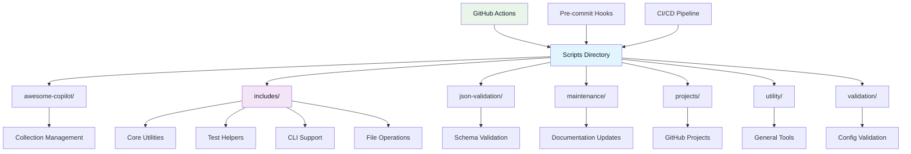
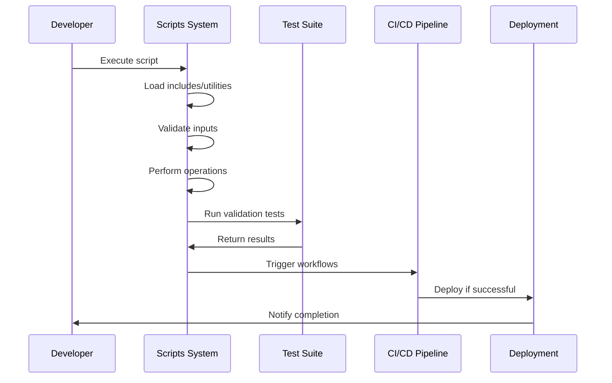
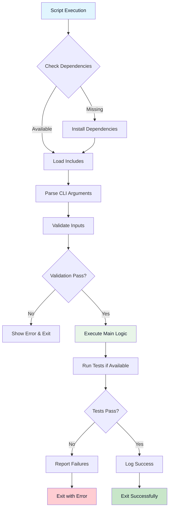

---

# LightSpeedWP Scripts & Automation


This directory contains all automation, utility, and maintenance scripts for the LightSpeedWP project. Scripts are grouped by function for modularity, maintainability, and testability.

## Scripts Architecture



## Automation Workflow



## Directory Structure

- **awesome-copilot/** — Utilities for prompt/collection management and validation.  
  *See:* `awesome-copilot/README.md`
- **includes/** — Shared Bash helpers and test utilities.  
  *See:* `includes/README.md`
- **json-validation/** — Node.js/YAML validation scripts and tests.  
  *See:* `json-validation/README.md`
- **logs/** — Log output for script runs.
- **maintenance/** — Scripts for repo maintenance, documentation, and label automation.  
  *See:* `maintenance/README.md`
- **projects/** — GitHub Projects management and automation scripts.  
  *See:* `projects/README.md`
- **utility/** — General-purpose shell and Node.js utilities for label management, logging, and validation.  
  *See:* `utility/README.md`

## Core Components

## Shared Infrastructure (`includes/`)

The `includes/` directory provides reusable components used across all scripts:

- **Core Utilities**: `logging.sh`, `validation.sh`, `colors.sh`, `common-functions.sh`
- **CLI Support**: `cli-utils.sh` for standardized argument parsing and help
- **File Operations**: `file-operations.sh` for safe file system interactions
- **Test Helpers**: `enhanced-test-helpers.bash`, `agent-test-helpers.bash`
- **Network Functions**: `git-functions.sh` for Git operations

## Script Categories

## Awesome Copilot (`awesome-copilot/`)

Manages prompt collections and Copilot-related functionality:

- Collection creation, validation, and maintenance
- YAML frontmatter processing
- Cross-platform line ending normalization
- README generation for collections

## Maintenance (`maintenance/`)

Repository maintenance and automation:

- Documentation generation and updates
- GitHub label synchronization
- Badge management for workflows
- Changelog validation
- Issue type management

## Utility (`utility/`)

General-purpose tools and libraries:

- Label management and reporting
- Release validation
- Shell script linting
- Version synchronization
- Status enforcement

## JSON/YAML Validation (`json-validation/`)

Configuration file validation:

- CodeRabbit configuration validation
- Schema-based YAML validation
- Automated schema updates

## Projects (`projects/`)

GitHub Projects management:

- Project creation and updates
- Field management
- Access control configuration
- Project type templates

## Integration Points

## Test Structure

Each script directory has a corresponding `__tests__/` subdirectory:

- `awesome-copilot/__tests__/` — Tests for Copilot utilities
- `includes/__tests__/` — Tests for shared helpers
- `json-validation/__tests__/` — Tests for validation scripts
- `maintenance/__tests__/` — Tests for maintenance scripts
- `utility/__tests__/` — Tests for utility functions

## Workflow Integration

Scripts integrate with GitHub Actions workflows:

- Pre-commit validation
- Automated documentation updates
- Label synchronization
- Release validation
- Test execution

## Configuration Dependencies

Scripts work with various configuration files:

- `.coderabbit.yml` — CodeRabbit configuration
- `../.schemas/` — JSON/YAML validation schemas
- `.github/workflows/` — GitHub Actions definitions
- `fixtures/` — Test data and templates

## Usage & Quickstart

## Running Individual Scripts

```bash
# Validate collections
scripts/awesome-copilot/validate-collections.js

# Update documentation
scripts/maintenance/update-readme-and-changelog.sh

# Synchronize labels
scripts/utility/label-sync.js --dry-run

# Validate configuration
node scripts/validation/validate-coderabbit-yml.cjs
```

## Running Test Suites

```bash
# Run all tests
./run-all-tests.sh

# Run category-specific tests
scripts/maintenance/run-maintenance-tests.sh
scripts/utility/run-utility-tests.sh

# Run individual test files
bats scripts/includes/__tests__/test-logging.bats
```

## Using Includes in Scripts

```bash
#!/bin/bash
# Source shared utilities
source "$(dirname "$0")/../includes/core/logging.sh"
source "$(dirname "$0")/../includes/core/validation.sh"
source "$(dirname "$0")/../includes/cli/cli-utils.sh"

# Use standardized functions
parse_common_args "$@"
log_info "Starting script execution"
validate_required_command "git"
```

## Validation & Testing

Validation tooling applied to scripts:

| Area        | Tool             | Purpose                                 |
| ----------- | ---------------- | --------------------------------------- |
| Shell       | ShellCheck       | Static analysis for Bash scripts        |
| Bash tests  | Bats             | Behaviour validation of shell utilities |
| JS/TS       | ESLint           | Linting and code quality checks         |
| Collections | Custom validator | Ensures collection schema compliance    |
| Frontmatter | Schema validator | Validates metadata blocks               |
| Markdown    | Markdownlint     | Documentation formatting consistency    |

Example aggregate run (placeholder):

```bash
./run-all-tests.sh            # Executes all test suites
npm run lint                  # Lints JS/TS sources
shellcheck scripts/**/*.sh    # Shell linting
markdownlint scripts/**/*.md  # README / docs lint
```

## Change Log / History

Version: 2.5 (increment when public script interfaces or includes contracts change).  
Refer to `../CHANGELOG.md` for release context and automation evolution.

## FAQ / Troubleshooting

**Collection validation failed?** Ensure `collection.schema.json` is up to date and YAML frontmatter paths are correct.  
**Scripts sourcing wrong path?** Use `$(dirname "$0")` patterns and avoid relative assumptions.  
**Permission denied running script?** Add executable bit: `chmod +x <script>`.  
**Bats tests not found?** Verify test file naming pattern `test-*.bats` and correct path in run script.

## Limitations & Notes

- Some legacy scripts may not yet use standardized logging wrappers.
- JSON validation tooling scheduled for consolidation into a single CLI.
- Multi-platform (macOS/Linux) parity tests are partial; Windows support not prioritized.

## Environment & Dependencies

| Dependency | Minimum | Purpose                   |
| ---------- | ------- | ------------------------- |
| Node.js    | 18+     | Run JS/validation scripts |
| Bash       | 5.x     | Execute shell automation  |
| Bats       | Latest  | Shell test framework      |
| ShellCheck | Latest  | Shell static analysis     |
| jq         | Latest  | JSON manipulation         |

## Related Documentation

## Internal References

- [Coding Standards](../instructions/coding-standards.instructions.md)
- [Quality Assurance](../instructions/quality-assurance.instructions.md)
- [Contributing Guidelines](../CONTRIBUTING.md)
- [Schema Definitions](../.schemas/)

## External Dependencies

- **GitHub CLI** — For GitHub API interactions
- **Node.js** — For JavaScript validation scripts
- **Bats** — For Bash script testing
- **ShellCheck** — For shell script linting
- **jq** — For JSON processing

## Development Workflow

1. **Script Development**: Follow coding standards and include proper headers
2. **Testing**: Add comprehensive tests in appropriate `__tests__/` directory
3. **Documentation**: Update README files and inline documentation
4. **Validation**: Run linting and validation tools
5. **Integration**: Ensure compatibility with existing workflows

## Maintenance

## Regular Tasks

- Update dependencies and schemas
- Validate all configuration files
- Run comprehensive test suites
- Update documentation and badges
- Synchronize labels and issue types

## Monitoring

- Check log files in `logs/` directory
- Monitor GitHub Actions workflow results
- Validate script execution in CI/CD pipelines
- Review test coverage and failures

## Script Execution Flow



## Contributing

When contributing new scripts or modifications:

1. Follow the established directory structure
2. Use shared utilities from `includes/`
3. Add comprehensive tests
4. Update relevant README files
5. Ensure all validation passes
6. Document dependencies and usage

---

## References

## Documentation Links

- [LightSpeedWP Main Repository](https://github.com/lightspeedwp/.github)
- [Coding Standards Instructions](../instructions/coding-standards.instructions.md)
- [Quality Assurance](../instructions/quality-assurance.instructions.md)
- [WordPress Development Standards](https://developer.wordpress.org/coding-standards/)

## Development Resources

- [GitHub Actions Workflows](../.github/workflows/)
- [Schema Definitions](../.schemas/)
- [Test Coverage Reports](../tests/TEST_COVERAGE_SUMMARY.md)
- [Contributing Guidelines](../CONTRIBUTING.md)

## AI & Automation References

- [Custom Instructions](../.github/custom-instructions.md)
- [Agents Documentation](../agents/agent.md)
- [Prompts Library](../.github/prompts/prompts.md)
- [Automation Governance](../docs/AUTOMATION_GOVERNANCE.md)

---

*⚡ Empowering WordPress development through intelligent automation and shared utilities.*

<!-- RANDOM FOOTER: ⚡ Magic Automation Unicorns at work! -->

*Built by 🧱 LightSpeedWP with ☕, 🚀, and open-source spirit!*
[Contributors](https://github.com/lightspeedwp/lsx-demo-theme/graphs/contributors)
